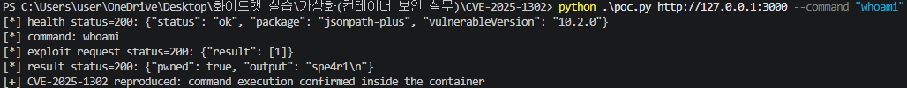

# JSONPath-Plus RCE 취약점 (CVE-2025-1302)
**Contributors**
-   [배진석(@spe4r1)](https://github.com/spe4r1)

<br/>

### 요약
-   jsonpath-plus는 Node.js 환경에서 JSON 데이터를 JSONPath 표현식으로 조회할 수 있게 해주는 라이브러리임.
-   CVE-2025-1302는 jsonpath-plus에서 발견된 원격 코드 실행 취약점으로, 공격자는 조작된 JSONPath 표현식을 통해 서버에서 임의 JavaScript 코드를 실행할 수 있음.
-   이 취약점은 서버가 사용자가 입력한 JSONPath 값을 검증 없이 `JSONPath()`에 전달하고, jsonpath-plus 10.3.0 미만 버전을 사용할 때 악용 가능함.

<br/>

### 환경 구성 및 실행
-   `docker compose up -d`를 실행하여 테스트 환경(jsonpath-plus 10.2.0)을 실행함.

```bash
docker compose up -d --build
```

-   실행할 명령어를 직접 지정하려면 `--command` 옵션을 사용함.

```bash
python3 poc.py http://127.0.0.1:3000 --command "whoami"
```

-   취약 서버는 위 요청의 `path` 값을 검증 없이 `JSONPath({ path, json: message })`에 전달함.
-   PoC 스크립트(`poc.py`)는 이 동작을 이용하여 컨테이너 내부 명령 실행을 확인하고, 결과를 `/result` 엔드포인트로 조회함.

<br/>

### 결과
PoC 실행에 성공하면 다음과 같이 `pwned` 값이 `true`로 표시되고, 컨테이너 내부 명령 실행 결과가 출력됨.




<br/>

### 정리
-   이 취약점은 사용자가 제어하는 JSONPath 표현식이 서버에서 안전하게 검증되지 않을 때, 서버 측 코드 실행으로 이어질 수 있는 위험을 갖고 있음.
-   jsonpath-plus를 10.3.0 이상으로 업데이트하고, 사용자 입력을 JSONPath 표현식으로 직접 사용하지 않도록 제한해야 함.
-   필요한 조회 패턴만 allowlist로 제공하고, 컨테이너 권한 축소 및 불필요한 capability 제거 같은 방어 조치를 함께 적용하는 것이 좋음.

<br/>

### 참고 자료
https://github.com/EQSTLab/CVE-2025-1302
