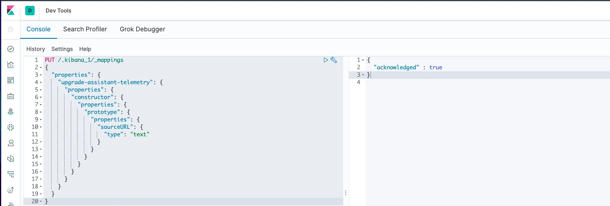
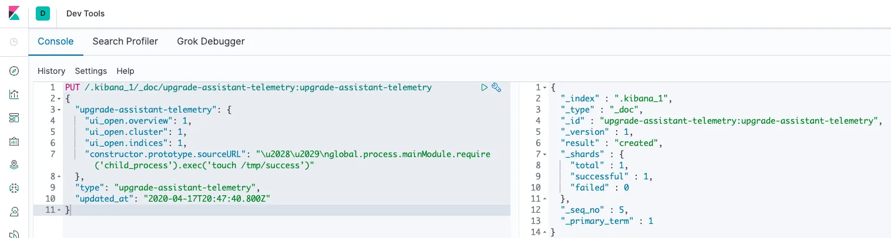
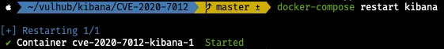
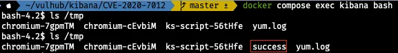

# CVE-2020-7012

---

> WHS 3기 - 어영민([GitHub](https://github.com/eoadkw))

## 요약

- CVE-2020-7012는 kibana 6.7.0 ~ 7.6.2 버전에 존재하는 RCE 취약점.
- kibana는 elasticsearch에 저장된 객체를 읽을 때 `constructor.prototype.sourceURL` 필드를 잘못 처리.
- 이 필드를 통해 Node.js 환경에서 ‘child_process.exec()’ 코드 실행 유도 가능.
- 공격자는 kibana의 Dev tools를 통해 악성 데이터를 삽입.
- 이로 인해 공격자가 kibana 서버 권한으로 명령어를 실행할 수 있으며, 시스템 장악 가능.

## 환경 구성

- `git clone --depth 1 https://github.com/vulhub/vulhub.git`
- `docker-copose up -d`

## 실행

### Mapping

→ `.kibana_1` 인덱스에 `constructor.prototype.sourceURL` 필드를 허용하도록 매핑을 추가.

### 악성 문서 삽입

→ Kibana가 내부적으로 로드하는 설정 문서 구조를 악용해, Node.js 환경에서 시스템 명령어를 실행하도록 설계된 악성 JSON 데이터.

### kibana 재시작

## 결과

→ `/tmp/succes` 파일이 생성 된 것을 확인 가능. 공격자가 명렁어 실행에 성공.

## 정리

- 해당 취약점을 통해 공격자는 kibana 서버 내부에서 명령어를 실행할 수 있으며, 이를 통해 시스템 권한 또는 민감 정보에 대한 접근이 가능해진다.
- 이런 상황을 방지하려면 kibana및 elasticsearch 인스턴스를 외부에서 직접 접근할 수 없도록 네트워크 접근 제어를 설정해야 된다. 그리고 신뢰되지 않은 데이터가 kibana에 저장되지 않도록 데이터 입력 경로를 제한하여야 한다.