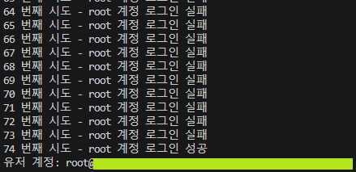

# CVE-2012-2122

> [배소정 (@baethwjd2)](https://github.com/baethwjd2)

<br/>

### 요약

-   CVE-2012-2122는 MySQL과 MariaDB의 특정 버전에서 발견된 **인증 우회** 취약점
-   특정 버전의 MySQL은 비밀번호의 해시값을 memcmp 함수로 캐스팅하여 인증
-   memcmp 함수는 -128 ~ 127 사이의 값을 반환하므로, 잘못된 비밀번호를 입력하더라도 1/256의 확률로 로그인에 성공
-   따라서 임의의 비밀번호로 로그인을 반복함으로써, 악의적인 공격자가 DB의 root 계정을 쉽게 획득 가능

<br/>

### 환경 구성 및 실행

-   `docker compose up -d` 커맨드를 입력해 테스트 환경을 실행 (취약점이 보고된 MySQL 5.5.22의 컨테이너 이미지 사용)
-   `pip install pymysql` 커맨드로 poc.py 실행을 위한 pymysql 패키지 설치
-   `python3 poc.py` 를 실행해 DB의 **root 계정**을 탈취할 수 있음. 유저 정보를 출력하여 root 계정으로 로그인이 됐는지 확인

<br/>

### poc.py

1/256의 확률로 로그인에 성공할 수 있으므로, 충분한 횟수만큼 로그인을 반복 시행한다.

```
for i in range(1, 10001):
    password = str(i)
    conn = pymysql.connect(user=user, password=password, host=host, port=port, charset='utf8')
```

유저 정보를 확인하여 root 계정 로그인에 성공했음을 확인한다.

```
cursor.execute("SELECT user()")
```

<br/>

### 결과



<br/>

### 정리

해당 취약점을 통해 공격자는 root를 포함한 특정 사용자 계정에 로그인하여, 인가되지 않은 권한을 획득할 수 있다.

이러한 상황을 방지하기 위해, 가장 먼저 관리자는 DB 서버의 네트워크가 노출되지 않도록 노력해야 한다. 즉, 인가되지 않은 액세스를 차단할 수 있도록 미리 서버를 설정해야 한다. 그리고 주기적으로 서비스 취약점을 모니터링하고 패치해야 한다.
