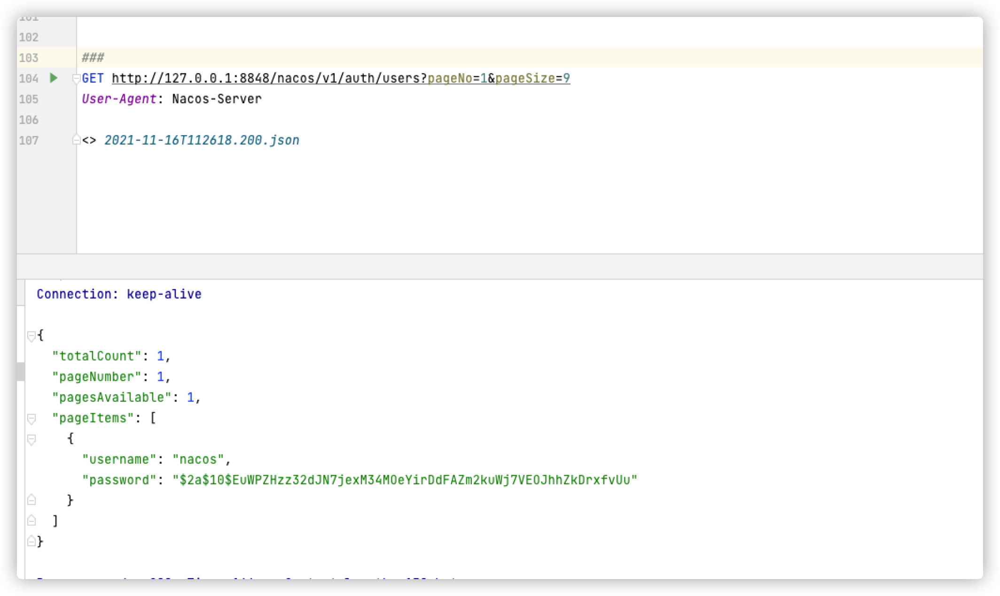

# Nacos 인증 우회(CVE-2021-29441)


Nacos는 알리바바에서 출시한 새로운 오픈 소스 프로젝트입니다. 이는 클라우드 네이티브 애플리케이션을 구축하기를 더 쉽게 만드는 동적 서비스 검색, 구성 관리 및 서비스 관리 플랫폼입니다. 마이크로서비스의 발견, 구성 및 관리를 돕는 데 헌신하고 있습니다. Nacos는 신속한 동적 서비스 검색, 서비스 구성, 서비스 메타데이터 및 트래픽 관리를 실현할 수 있는 간단하고 사용하기 쉬운 기능 들을 제공합니다.

이 취약점은 인증 및 권한 부여 작업을 수행할 때 Nacos가 요청된 사용자 에이전트가 "Nacos-Server"인지 여부를 판단할 때 발생합니다. 그리고 "Nacos-Server"일 경우 인증을 수행하지 않습니다. 개발자의 원래 의도는 서버 간 요청을 처리하는 것이었지만 구성이 너무 간단하며 협상된 사용자 에이전트가 코드에 직접 하드 코딩되어 있어 취약점이 발생했습니다. 이 권한 없는 취약점을 통해 공격자는 사용자 이름 및 암호와 같은 민감한 정보를 획득할 수 있습니다.

참조 링크:
https://github.com/advisories/GHSA-36hp-jr8h-556f

## 취약한 환경


취약한 환경에서 실행 중:
```
docker compose up -d
```

환경이 실행된 후 3306, 8848, 9848 및 9555 포트가 열립니다. 이 취약점을 실행할 때 8848 포트만 사용해야 합니다. 이는 웹 액세스 포트입니다. 취약성 확인 프로세스를 실행할 때, 먼저 포트 8848을 방문하여 열렸는지 확인해 보시길 바랍니다.plz...
경우에 따라 nacos 서비스가 시작하지 못할 수 있습니다(데이터베이스에 연결하지 못한 경우). 이 경우 nacos 서비스를 다시 시작하거나 모든 서비스를 다시 시작해 보시길 바랍니다.

```
docker compose restart nacos
```

## 익스플로잇 스크립트


```
python poc.py http://target:8848
```


## 익스플로잇


익스플로잇 과정은 다음과 같습니다.

1. 요청 패키지의 User-Agent 값을 Nacos-Server로 변경합니다.
2. http://target:8848/nacos/v1/auth/users?pageNo=1&pageSize=9에 방문하여 상태 코드가 200이며 내용에 pageItems가 포함되는지 확인합니다.
3. POST 메서드를 사용하여 새 사용자를 추가하기 위해 http://target:8848/nacos/v1/auth/users?username=vulhub&password=vulhub에 방문합니다.
4. 기존 사용자 목록을 확인하기 위해 http://target:8848/nacos/v1/auth/users?pageNo=1&pageSize=9에 방문합니다.
5. http://target:8848/nacos/로 이동하여 새로 추가된 사용자(vulhub/vulhub)로 로그인합니다.


### 취약점 확인



Header 헤더를 추가한 후 http://target:8848/nacos/v1/auth/users?pageNo=1&pageSize=9에 방문하여 반환 값이 200이고 내용에 pageItems가 포함되는지 확인합니다.


### 새 사용자 추가


Header 헤더를 추가한 후 POST를 사용하여 http://target:8848/nacos/v1/auth/users?username=vulhub&password=vulhub에 요청하여 vulhub의 계정과 암호로 새 사용자를 추가합니다.


### 새로 만든 계정을 사용하여 로그인


취약점 추가 후 헤더 헤더를 추가하고 새로 만든 계정으로 로그인합니다(vulhub/vulhub).
