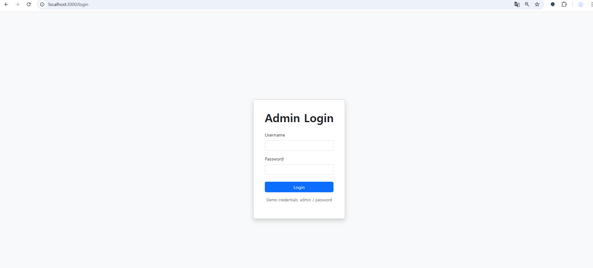
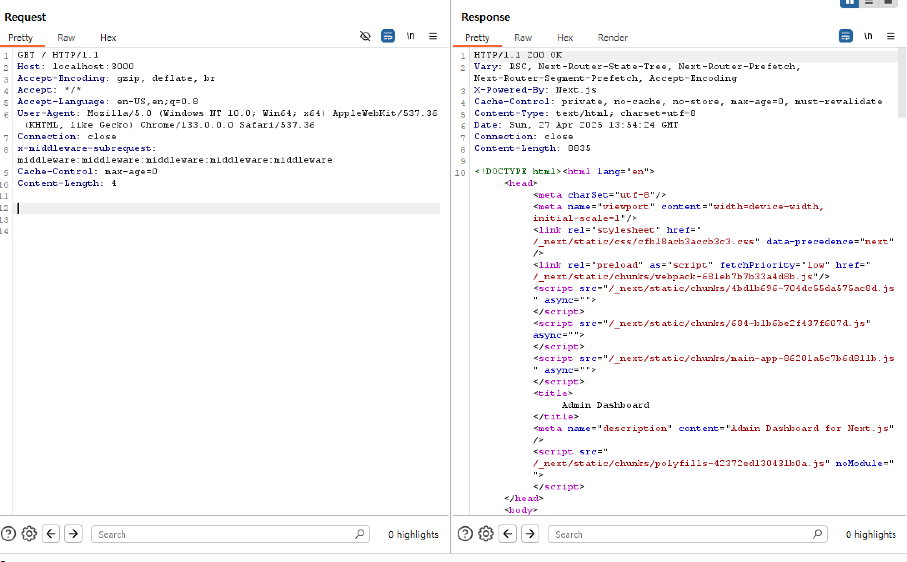
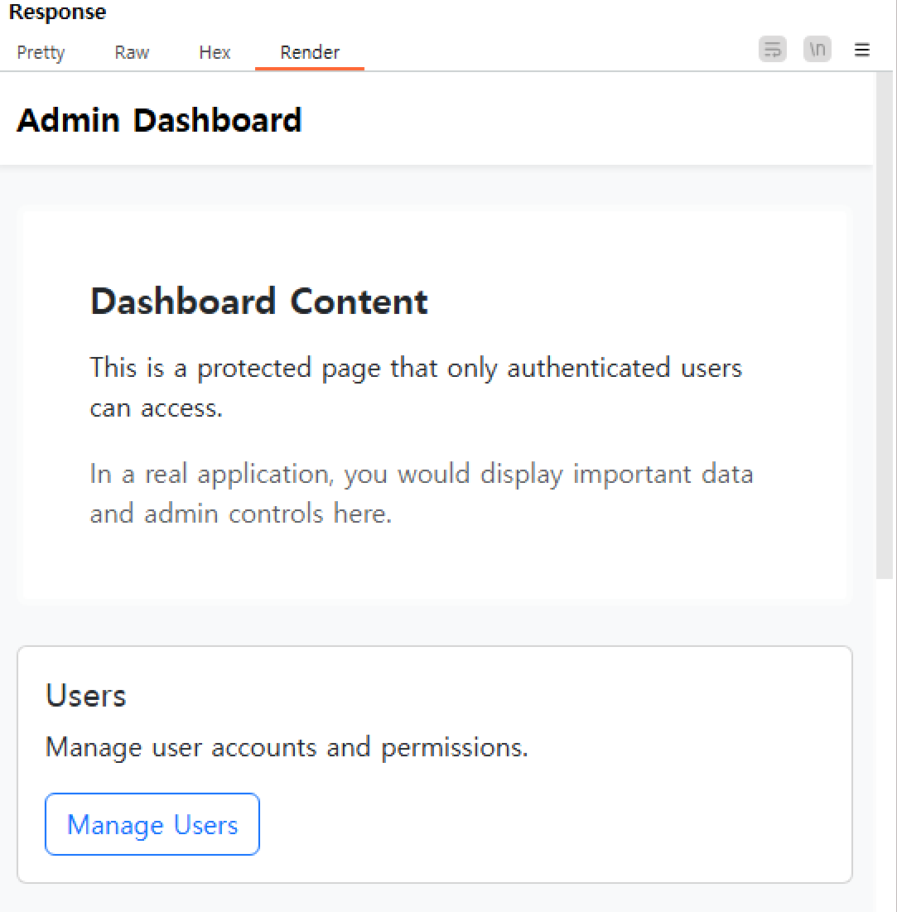

# **Next.js 미들웨어 인증 우회 (CVE-2025-29927)**

화이트햇3기 14반 김경택 [@bernice777](https://github.com/bernice777)

**Next.js**는 서버 사이드 렌더링, 정적 사이트 생성, 통합 라우팅 시스템 등의 기능을 제공하는 인기 있는 React 기반 웹 애플리케이션 프레임워크입니다. 인증 및 인가 목적으로 미들웨어를 사용하도록 설정된 14.2.25 이전 및 15.2.3 이전 버전은 **인증 우회** 취약점이 존재합니다.

이 취약점은 공격자가 **x-middleware-subrequest** 헤더를 조작하여 미들웨어 기반의 보안 제어를 우회할 수 있게 해 주며, 이를 통해 보호된 리소스와 민감한 데이터에 무단으로 접근할 수 있습니다.

---

### 참고 링크:

- [GHSA-f82v-jwr5-mffw](https://github.com/advisories/GHSA-f82v-jwr5-mffw)
- [Next.js와 변조된 미들웨어](https://zhero-web-sec.github.io/research-and-things/nextjs-and-the-corrupt-middleware)
- [NVD CVE-2025-29927](https://nvd.nist.gov/vuln/detail/CVE-2025-29927)

---

### 환경 설정

다음 명령어를 실행하여 **Next.js 15.2.2** 기반의 취약한 애플리케이션을 실행합니다:

```bash
docker compose up -d
```

애플리케이션이 시작되면, **http://your-ip:3000**에 접속하면 로그인 페이지로 리디렉션됩니다. 기본 자격 증명인 `admin:password`로 로그인하여 대시보드에 접근할 수 있습니다.



---

### 취약점 재현

정당한 자격 증명이 없이 대시보드에 접근하려고 하면 로그인 페이지로 리디렉션됩니다
그러나 x-middleware-subrequest 헤더에 middleware:middleware:middleware:middleware:middleware 값을 추가하여 요청을 보냅니다. 이렇게 하면 Next.js 미들웨어가 이 헤더를 잘못 처리하고 인증 체크를 우회하게 됩니다:



결과



