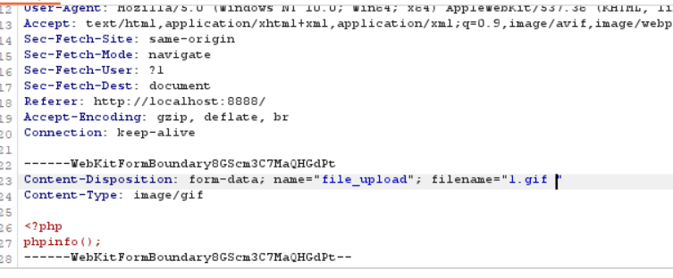
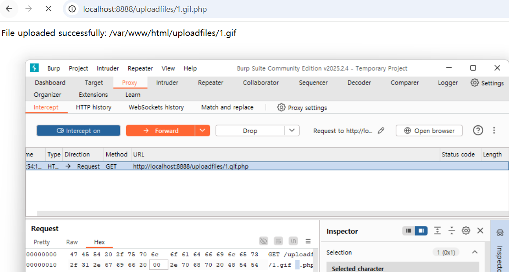
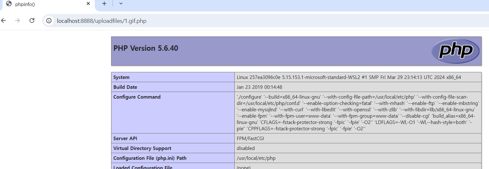

# **Nginx 파일 이름 논리 취약점(CVE-2013-4547)**

CVE-2013-4547은 Nginx의 파일 이름 처리 로직(File Name Resolution Logic)에 존재하는 취약점으로, 특수 문자(특히 공백 문자 및 널 바이트)를 포함한 URI를 이용해 우회(Privilege Bypass)가 가능하게 되는 이슈입니다.

### 요약

- **영향받는 버전**: Nginx 0.8.41 ~ 1.4.3, 1.5.x < 1.5.7
- **취약점 핵심**: URI에 포함된 공백 문자(`0x20`)와 널 바이트(`0x00`)를 제대로 이스케이프 처리하지 않아,
    - **FastCGI 설정을 우회**하거나
    - **접근 제어 우회를 통해 민감한 리소스에 접근**할 수 있음
- **공격 결과**:
    - 우회한 파일이 PHP로 실행됨 → 코드 실행 가능
    - 특정 디렉토리 접근이 가능해짐 → 인증 우회

### ⚠️ 문제의 원인

Nginx가 URI를 처리할 때 공백(`0x20`)이나 널 바이트(`0x00`)가 포함된 경로를 **정상적으로 처리하지 못하고**,

**`SCRIPT_FILENAME` 등의 fastcgi 변수에 잘못된 값**을 전달하면서 발생.

### 예시 1: php 처리 우회 (FastCGI)

Nginx 설정:

```
location ~ \.php$ {
    include        fastcgi_params;
    fastcgi_pass   127.0.0.1:9000;
    fastcgi_param  SCRIPT_FILENAME  /var/www/html$fastcgi_script_name;
    fastcgi_param  DOCUMENT_ROOT /var/www/html;
}
```

### 정상적인 상황:

- `/index.php` 요청 → `.php` 매치 → FastCGI로 전달됨
- `SCRIPT_FILENAME = /var/www/html/index.php`

### 공격 시:

- `1.gif[공백][널].php` → `.php`로 끝나므로 이 블록에 매치됨
- `SCRIPT_FILENAME = /var/www/html/1.gif[공백]` ← 실질적으로 실행될 파일
- 이 파일은 `.gif`로 보이지만 실제론 PHP 코드 → **PHP 실행됨**

### 예시 2: 접근제어 우회

```
location /admin/ {
    allow 127.0.0.1;
    deny all;
}
```

### 공격:

- 요청: `/test[공백]/../admin/index.php`
- 이 경로는 `/admin/`과 매치되지 않음 (Nginx는 URI 기준으로 Location을 매칭)
- 하지만 실제 경로는 `/admin/index.php` → 우회 성공
- 조건: `test`  디렉토리가 존재해야 함 (공백 포함된 디렉토리, Linux에서 가능)

## 환경 구성 및 실행

- `docker compose up` 을 실행하여 테스트 환경을 실행.
- `http://your-ip:8888/`에 접속하여 Nginx 기본 페이지를 확인.
- `1.gif` 파일을 만들어서 파일 업로드를 시도.
    - 여기서 Burp Suite 사용하여서 `filename = "1.gif "`  끝에 공백을 넣음.
    - `<?php phpinfo();` 명령어 삽입하여 php 수행 내역을 확인.
    - 
- GET할때 f(66)와 .(2e)사이에 20 00바이트 삽입
    - 


### 결과

- 아까 삽입했던 phpinfo() 가 실행되면서 php 구문이 동작함을 확인할수 있었다.
- 
