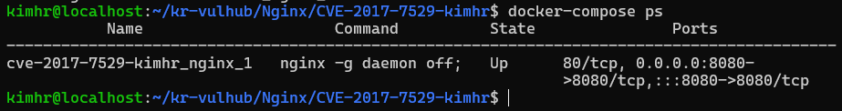
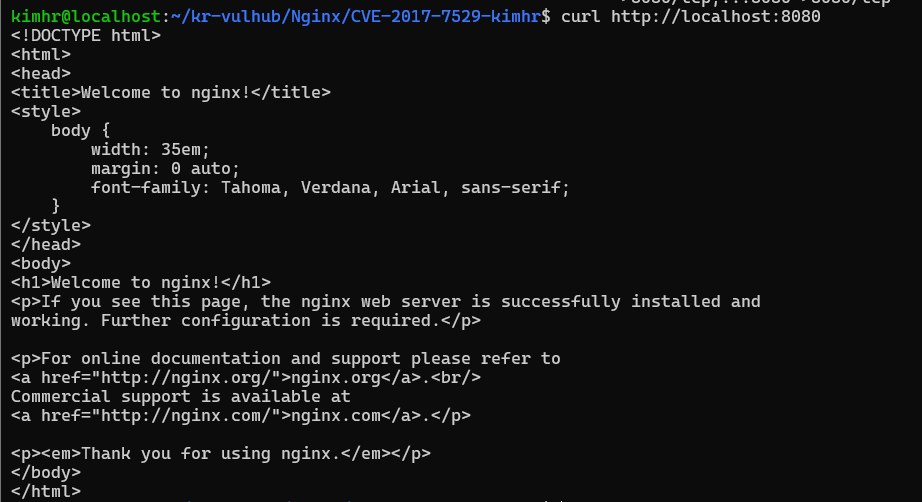
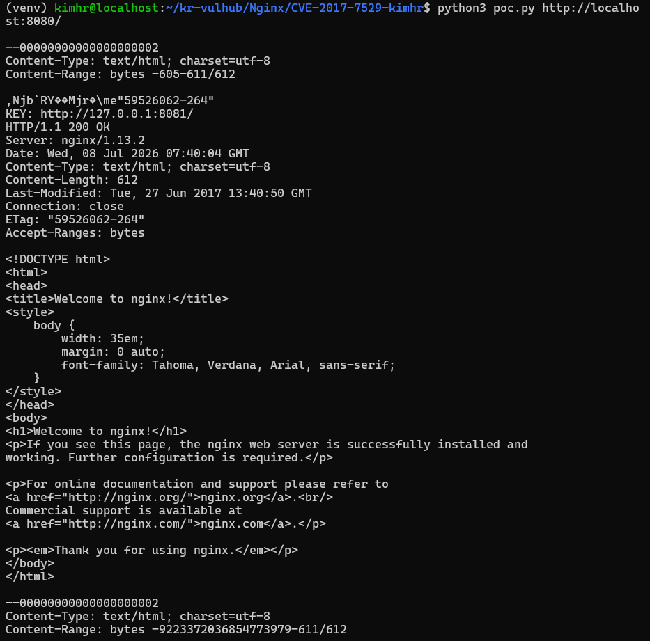

# CVE-2017-7529

> Docker를 이용하여 Nginx Integer Overflow Information Disclosure(CVE-2017-7529) 취약점을 재현한 환경

---

# 취약점 요약

CVE-2017-7529는 Nginx의 캐시(Cache) 처리 과정에서 발생하는 Integer Overflow 기반 정보 유출 취약점이다.

공격자가 조작된 HTTP `Range` 헤더를 전송하면 캐시 파일 내부의 데이터를 읽을 수 있으며, 캐시에 저장된 HTTP 응답 헤더, 메타데이터 등의 민감한 정보가 외부로 노출될 수 있다.

- **CVE** : CVE-2017-7529
- **취약 대상** : Nginx 0.5.6 ~ 1.13.2
- **취약점 유형** : Information Disclosure
- **CVSS v3** : 7.5 (High)
- **재현 환경 버전** : Nginx 1.13.2

---

# 환경 구성

## 디렉터리 구조

```
CVE-2017-7529-kimhr
├── Dockerfile
├── docker-compose.yml
├── default.conf
├── poc.py
├── README.md
├── 1.png
├── 2.png
└── 3.png
```

## Dockerfile

```dockerfile
FROM nginx:1.13.2

COPY default.conf /etc/nginx/conf.d/default.conf
```

## docker-compose.yml

```yaml
version: "3"

services:
  nginx:
    build: .
    ports:
      - "8080:8080"
```

## Nginx 구성

이 환경은 하나의 Nginx 컨테이너 안에서 다음과 같이 구성된다.

- `8080` : 외부에서 접속하는 프록시 서버
- `8081` : 컨테이너 내부 upstream 서버
- `8080` 서버에서 proxy cache를 활성화하여 `8081` 응답을 캐시

따라서 사용자는 `http://localhost:8080/`으로 접속하지만, PoC 결과의 캐시 메타데이터에는 내부 upstream 주소인 `http://127.0.0.1:8081/`가 `KEY` 값으로 출력될 수 있다.

---

# 취약 조건

다음 조건에서 취약점이 발생한다.

- Nginx 1.13.2 이하 사용
- Cache 기능 활성화
- 공격자가 HTTP Range Header를 조작할 수 있는 환경

---

# 재현 절차

## 1. 실습 디렉터리 이동

```bash
cd Nginx/CVE-2017-7529-kimhr
```

---

## 2. Docker 환경 실행

```bash
docker-compose up -d --build
```

실행 확인

```bash
docker-compose ps
```

예상 결과

```
cve-2017-7529-kimhr_nginx_1    Up    0.0.0.0:8080->8080/tcp
```



---

## 3. 웹 서버 확인

```bash
curl http://localhost:8080
```

또는 브라우저에서

```
http://localhost:8080
```

접속하면 기본 Nginx 페이지가 출력된다.



---

# PoC 재현

Python 가상환경 생성 및 활성화

```bash
python3 -m venv venv
source venv/bin/activate
```

필요 라이브러리 설치

```bash
pip install requests
```

PoC 실행

```bash
python3 poc.py http://localhost:8080/
```

실습이 끝난 뒤 컨테이너를 종료하려면 다음 명령을 실행한다.

```bash
docker-compose down
```

---

# 실행 결과

PoC 실행 결과 일부

```
--00000000000000000002
Content-Type: text/html; charset=utf-8
Content-Range: bytes -605-611/612

KEY: http://127.0.0.1:8081/

HTTP/1.1 200 OK
Server: nginx/1.13.2
Content-Type: text/html; charset=utf-8
Content-Length: 612
ETag: "59526062-264"
Accept-Ranges: bytes
```

실행 결과 일반 HTML 응답뿐 아니라 다음과 같은 정보가 함께 출력되는 것을 확인하였다.

- HTTP Response Header
- Cache Metadata
- KEY 정보
- Server Version

이는 원래 사용자에게 노출되지 않아야 하는 캐시 내부 정보가 외부로 유출될 수 있음을 의미하며, CVE-2017-7529 취약점이 정상적으로 재현되었음을 확인하였다.



---

# 대응 방안

- 최신 버전의 Nginx로 업데이트
- 취약한 버전 사용 금지
- Cache 기능 최소화
- WAF를 이용한 비정상적인 Range Header 요청 차단
- 서버 로그 모니터링을 통한 이상 요청 탐지
- 운영 환경에서는 불필요한 캐시 기능을 비활성화하거나 적절한 접근 제어를 적용

Nginx 1.13.3 이상에서는 해당 취약점이 패치되었으므로, 운영 환경에서는 취약 버전을 사용하지 않아야 한다.

---

# 참고 자료

- https://nvd.nist.gov/vuln/detail/CVE-2017-7529
- https://github.com/gunh0/kr-vulhub
