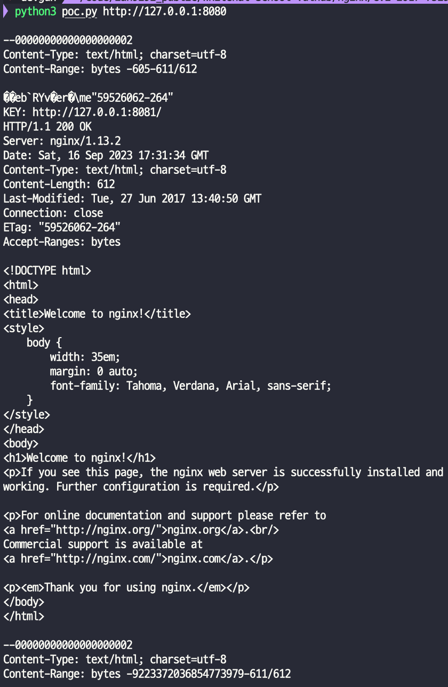

# CVE-2017-7529

> [박건호 (@c0dep1ayer)](https://github.com/c0dep1ayer)

 

### 요약

- Nginx는 리버스 프록시 사이트에서 일부 파일을 캐싱, 특히 정적 파일을 캐싱
  - 이 캐시의 일부는 파일에 저장되며, 각 캐시 파일에는 "파일 헤더", "HTTP 응답 헤더", "HTTP 응답 본문"이 포함
- 요청에 Range 헤더가 포함되면 Nginx는 지정된 시작 및 종료 위치에 따라 지정된 길이의 내용을 반환
  - 두 개의 음수 위치를 구성하면, 예를 들어 (-600, -9223372036854774591), 음수 위치의 데이터를 읽을 수 있음
- 이 요청이 캐시 파일에 일치하면 캐시 파일 내의 "HTTP 응답 본문" 앞에 있는 "파일 헤더", "HTTP 응답 헤더" 등의 내용을 읽을 수 있음

 

### 환경 구성 및 실행

- `docker compose up -d`를 실행하여 테스트 환경을 실행
- `http://your-ip:8080/`에 접속하여 Nginx 기본 페이지를 확인
  - 이 페이지는 실제로 8081 포트의 내용을 리버스 프록시로 전달
- `pip install requests`를 통해 필요한 라이브러리 설치
- `python3 poc.py http://your-ip:8080/`를 호출하여 반환 결과를 읽음
  - 결과에서 "HTTP 응답 본문" 앞에 있는 "파일 헤더", "HTTP 응답 헤더" 등의 내용을 읽을 수 있음

 

### 결과

 

### 정리

  이 취약점은 공격자가 Nginx 서버의 캐시 파일에서 예상치 못한 데이터를 읽을 수 있게 만들어, 정보 유출의 위험이 있다. 안전한 웹 서비스 운영을 위해서는 이러한 취약점을 주기적으로 확인하고 패치하는 것이 중요하다.
