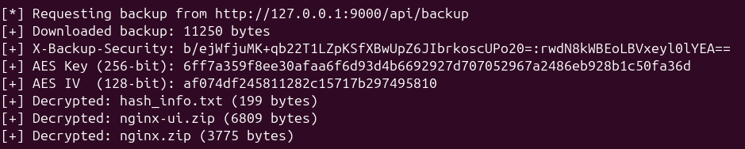
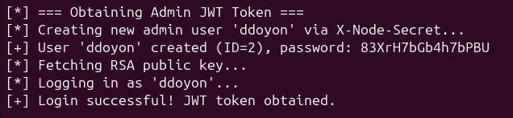
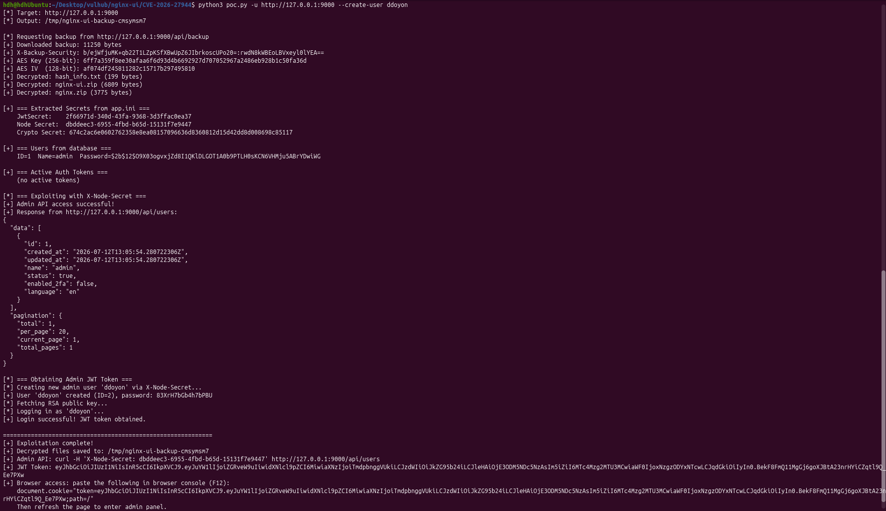
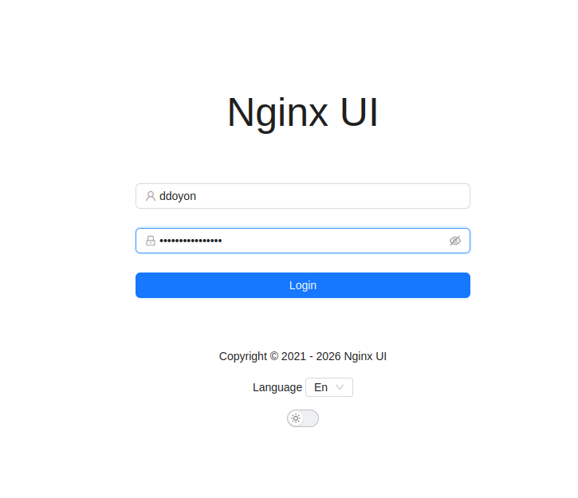
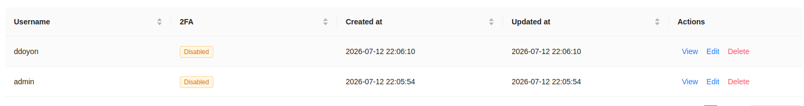

# Nginx UI 인증되지 않은 백업 다운로드 및 암호화 키 노출 취약점 | CVE-2026-27944

## Contributor

> [28반]황동현\_1908 ([@ddoyon7](https://github.com/ddoyon7))

<br>
<br>

## 1. 취약점 개요

CVE-2026-27944는 Nginx UI의 `/api/backup` 엔드포인트에 인증 검사가 누락되어 비로그인 사용자도 전체 백업 파일을 다운로드할 수 있는 취약점이다. 또한 백업 복호화에 필요한 AES 키와 IV가 `X-Backup-Security` 응답 헤더에 함께 노출된다. 공격자는 이를 이용해 백업을 복호화하고 `app.ini`에서 Node Secret 등 내부 비밀정보를 획득할 수 있다. 이후 관리자 인증을 우회하고 신규 관리자 계정을 생성하여 Nginx UI의 관리자 권한을 획득할 수 있다.

## 2. 취약 조건 및 발생 원인

### 2.1 취약 조건

다음 조건을 만족하는 경우 CVE-2026-27944 취약점이 발생할 수 있다.

- 취약한 버전의 Nginx UI를 사용하고 있어야 한다.
- 공격자가 Nginx UI 웹 서비스에 네트워크로 접근할 수 있어야 한다.
- `/api/backup` 엔드포인트에 별도의 인증 절차 없이 접근할 수 있어야 한다.
- 백업 응답의 `X-Backup-Security` 헤더에 AES 키와 IV가 포함되어 있어야 한다.

본 실습에서는 Vulhub에서 제공하는 Nginx UI 2.3.2 환경을 사용하였으며, 공격자는 별도의 계정이나 로그인 과정 없이 `/api/backup` 엔드포인트에 접근할 수 있었다.

### 2.2 발생 원인

첫 번째 원인은 백업 파일을 생성하고 다운로드하는 `/api/backup` 엔드포인트에 인증 절차가 적용되지 않은 것이다. 백업 파일에는 애플리케이션 설정, 사용자 데이터베이스 및 서버 설정 등 중요 정보가 포함되어 있으므로 관리자만 접근할 수 있어야 하지만, 취약한 버전에서는 로그인 여부를 확인하지 않고 요청을 처리한다.

두 번째 원인은 백업 파일을 AES-256 방식으로 암호화하면서도, 복호화에 필요한 AES 키와 IV를 동일한 HTTP 응답의 `X-Backup-Security` 헤더로 제공한 것이다.

```text
X-Backup-Security: Base64(AES_KEY):Base64(IV)
```

## 3. 환경 구성

다음 명령어를 실행하여 취약한 Nginx UI 2.3.2 환경을 실행한다.

```bash
docker compose up -d
```

컨테이너 실행 후 브라우저에서 다음 주소로 접속한다.

```text
http://127.0.0.1:9000/
```

실습 환경에는 다음 관리자 계정이 미리 설정되어 있으므로 별도의 초기 설정은 필요하지 않다.

```text
Username: admin
Password: admin
```

취약점 재현은 관리자 계정으로 로그인하지 않은 상태에서 진행한다.

> 참고: PoC 실행에 필요한 `cryptography` 라이브러리가 설치되어 있지 않은 경우 다음 명령어를 실행한다.

```bash
pip install cryptography
```

## 4. 취약점 재현

### 4.1 전체 재현 과정

본 실습에서는 로그인하지 않은 상태에서 Nginx UI의 `/api/backup` 엔드포인트에 접근하여 암호화된 백업 파일을 다운로드한다. 이때 동일한 HTTP 응답의 `X-Backup-Security` 헤더에서 백업 복호화에 필요한 AES 키와 IV를 획득할 수 있다.

획득한 키와 IV를 이용하여 백업 파일을 복호화한 뒤, 내부의 `app.ini` 파일에서 관리자 API 인증에 사용되는 Node Secret을 추출한다. 이후 Node Secret을 `X-Node-Secret` 요청 헤더에 삽입하여 일반적인 JWT 인증 절차 없이 관리자 전용 API에 접근한다.

마지막으로 관리자 API를 통해 `ddoyon`이라는 신규 사용자를 생성하고, 해당 계정으로 로그인하여 관리자 페이지와 사용자 관리 기능에 접근할 수 있는지 확인한다.

위 과정은 `poc.py`에 구현되어 있으며, 본 실습에서는 해당 PoC를 실행하여 전체 익스플로잇 과정을 재현하였다.

전체 재현 과정은 다음과 같다.

```text
인증 없이 /api/backup 요청
        ↓
암호화된 백업 파일 다운로드
        ↓
X-Backup-Security 헤더에서 AES 키와 IV 획득
        ↓
AES-256-CBC 방식으로 백업 복호화
        ↓
app.ini에서 Node Secret 등 비밀 정보 추출
        ↓
X-Node-Secret 헤더를 이용한 관리자 인증 우회
        ↓
신규 관리자 계정 생성
        ↓
생성된 계정으로 로그인하여 관리자 권한 확인
```

### 4.2 PoC 실행

다음 명령어를 사용하여 PoC를 실행하였다.

```bash
python3 poc.py -u http://127.0.0.1:9000 --create-user ddoyon
```

각 옵션의 의미는 다음과 같다.

- `-u http://127.0.0.1:9000`: 취약한 Nginx UI 서버의 주소를 지정한다.
- `--create-user ddoyon`: 유출된 Node Secret을 이용하여 `ddoyon`이라는 신규 관리자 계정을 생성한다.

실행 결과 인증 없이 백업 파일을 다운로드하였으며, 응답 헤더에서 AES 키와 IV를 획득하여 백업 내부 파일을 복호화하였다.



이후 복호화된 설정 파일에서 추출한 Node Secret을 이용하여 관리자 API에 접근하였다. 이를 통해 `ddoyon` 계정을 생성하고, 해당 계정으로 로그인하여 JWT 토큰을 발급받는 데 성공하였다.



## 5. 실행 결과 및 분석

PoC 실행 결과, 인증 정보 없이 `/api/backup` 엔드포인트에 접근하여 Nginx UI의 전체 백업 파일을 다운로드할 수 있었다.

서버는 백업 파일을 AES-256 방식으로 암호화하여 제공하였지만, 동일한 HTTP 응답의 `X-Backup-Security` 헤더에 복호화에 필요한 AES 키와 IV를 함께 포함하고 있었다. PoC는 해당 값을 Base64
디코딩한 후 백업 내부의 `nginx-ui.zip`, `nginx.zip`, `hash_info.txt` 파일을 복호화하였다.

복호화된 Nginx UI 설정 파일인 `app.ini`에서 관리자 API 인증에 사용되는 Node Secret을 확인하였다.

PoC는 Node Secret을 `X-Node-Secret` 요청 헤더에 포함하여 관리자 API인 `/api/users`에 접근하였다. 정상적인 사용자 로그인이나 JWT 인증 없이도 관리자 사용자 목록이 반환되었으며, 이를 통해 Node Secret을 이용한 관리자 인증 우회가 가능함을 확인하였다.

이후 PoC는 관리자 API를 이용하여 `ddoyon`이라는 신규 계정을 생성하고, 해당 계정으로 로그인하여 유효한 JWT 토큰을 발급받았다.

최종적으로 PoC를 통해 생성된 `ddoyon` 계정으로 Nginx UI에 로그인한 뒤 사용자 관리 페이지에 접근하였다. 사용자 목록에서 기존 admin 계정과 새로 생성된 `ddoyon` 계정이 함께 표시되는 것을 확인하였다.

이를 통해 CVE-2026-27944 취약점이 단순한 백업 파일 유출에 그치지 않고, 관리자 인증 우회 및 신규 관리자 계정 생성을 통한 시스템 관리 권한 획득으로 이어질 수 있음을 확인하였다.

전체적인 실행 결과는 아래와 같다.





## 6. 대응 방안

CVE-2026-27944 취약점으로 인한 백업 파일 노출과 관리자 권한 탈취를 방지하기 위해 다음과 같은 대응 방안을 고려할 수 있다.

- Nginx UI를 취약점이 수정된 2.3.3 이상 버전으로 업데이트한다.
- `/api/backup` 엔드포인트에 관리자 인증과 권한 검사를 적용한다.
- AES 암호화 키를 백업 파일과 같은 응답으로 전송하지 않고 별도로 관리한다.
- `/api/backup` 접근 기록과 관리자 계정 생성 기록을 점검한다.

## 7. 참고 자료

본 실습은 Vulhub에서 제공하는 Docker 환경과 PoC 코드를 기반으로 진행하였다.

- [Vulhub CVE-2026-27944](https://github.com/vulhub/vulhub/tree/master/nginx-ui/CVE-2026-27944)
